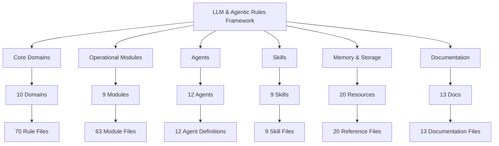
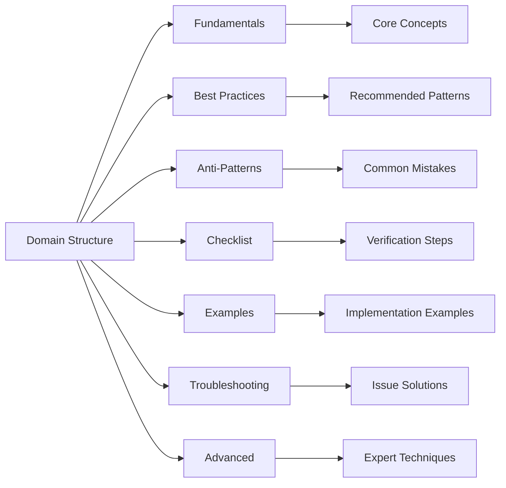
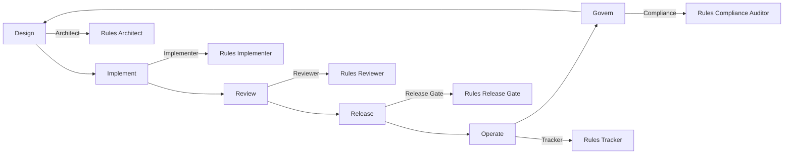
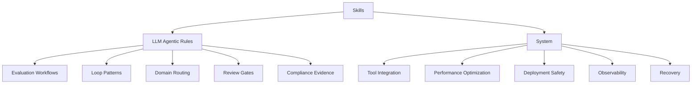
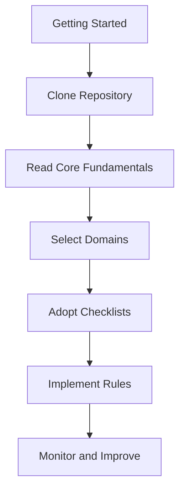
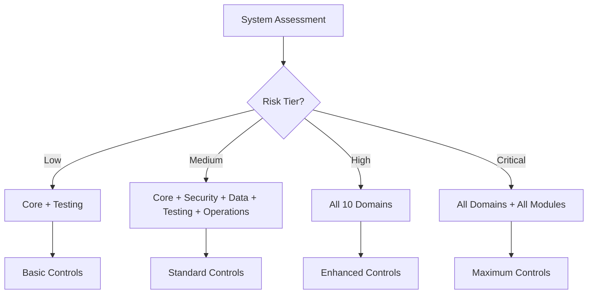
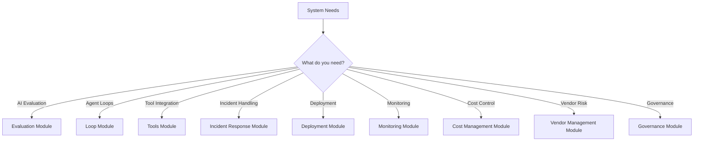
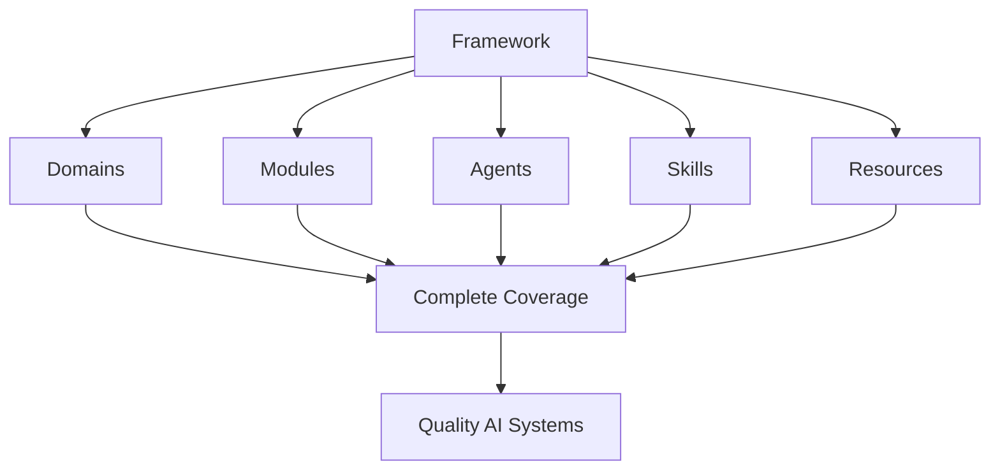

# LLM & Agentic Rules Framework - Complete Guide

## Overview

This document provides a comprehensive guide to the LLM & Agentic Rules Framework, covering all aspects of the framework.

## Framework Architecture

## Core Domains

### Domain Structure

### Domain List

| # | Domain | Focus | Key Topics |
|---|--------|-------|------------|
| 01 | Core | Architecture, context, tools, state | System design, prompt engineering, tool integration |
| 02 | Security | Threat prevention, data protection | Prompt injection, access control, encryption |
| 03 | Development | Code quality, maintainability | Standards, reviews, testing |
| 04 | Data | Privacy, governance, pipelines | Classification, retention, quality |
| 05 | Integration | APIs, webhooks, tools | API design, tool contracts, MCP |
| 06 | Operations | CI/CD, observability, scaling | Deployment, monitoring, incident response |
| 07 | Testing | Quality assurance, evaluation | Unit, integration, E2E, regression |
| 08 | Documentation | Knowledge sharing, runbooks | API docs, guides, registers |
| 09 | Performance | Optimization, cost | Latency, throughput, caching |
| 10 | Compliance | Governance, audit readiness | Regulations, evidence, training |

## Operational Modules

### Module Structure

### Module List

| Module | Focus | Key Topics |
|--------|-------|------------|
| Evaluation | AI system evaluation | Safety, quality, performance, regression |
| Loop | Agent loop implementation | Simple, retry, adaptive, multi-goal |
| Tools | Tool integration patterns | Direct, chain, parallel, conditional |
| Incident Response | Incident handling | Detection, triage, containment, remediation |
| Deployment | CI/CD, release management | Blue-green, canary, rolling |
| Monitoring | Observability, alerting | Metrics, logs, traces, dashboards |
| Cost Management | Budget, optimization | Tracking, forecasting, FinOps |
| Vendor Management | Third-party risk | Assessment, DPA, monitoring |
| Governance | Policy, audit readiness | Policies, exceptions, compliance |

## Agents

### Agent Lifecycle

### Agent List

| Agent | Phase | Role |
|-------|-------|------|
| Rules Architect | Design | System design and architecture |
| Rules Implementer | Implementation | System implementation |
| Rules Reviewer | Review | Code and artifact review |
| Rules Release Gate | Release | Release decisions |
| Rules Eval | Evaluation | Evaluation execution |
| Rules Compliance Auditor | Compliance | Compliance evidence |
| Rules Data Steward | Data | Data governance |
| Rules Enforcer | Enforcement | Policy enforcement |
| Rules Documentation | Documentation | Documentation standards |
| Rules Tracker | Operations | Metrics and monitoring |
| Rules Orchestrator | Coordination | Multi-agent coordination |
| Rules Security | Security | Security controls |

## Skills

### Skill Categories

### Skill List

| Category | Skill | Purpose |
|----------|-------|---------|
| LLM Agentic Rules | Evaluation Workflows | Evaluation process guidance |
| LLM Agentic Rules | Loop Patterns | Agent loop implementation |
| LLM Agentic Rules | Domain Routing | Domain selection guidance |
| LLM Agentic Rules | Review Gates | Review process criteria |
| LLM Agentic Rules | Compliance Evidence | Evidence collection standards |
| System | Tool Integration | Tool implementation patterns |
| System | Performance Optimization | Performance improvement |
| System | Deployment Safety | Safe deployment practices |
| System | Observability | Monitoring and alerting |
| System | Recovery | Incident recovery procedures |

## Memory & Storage

### Memory Resources

| File | Purpose |
|------|---------|
| framework-context.md | Project structure and standards |
| agent-catalog.md | Agent roles and workflows |
| domain-reference.md | Domain selection and controls |
| integration-patterns.md | Integration workflows |
| decision-matrix.md | Decision support matrices |
| core-rules-summary.md | Core domain rules |
| security-rules-summary.md | Security domain rules |
| data-rules-summary.md | Data domain rules |
| testing-rules-summary.md | Testing domain rules |
| compliance-rules-summary.md | Compliance domain rules |

### Storage Resources

| File | Purpose |
|------|---------|
| rule-templates.md | Rule file templates |
| checklist-templates.md | Checklist templates |
| evaluation-templates.md | Evaluation templates |
| incident-templates.md | Incident templates |
| architecture-templates.md | Architecture templates |
| core-domain-rules.md | Core domain rules |
| security-domain-rules.md | Security domain rules |
| data-domain-rules.md | Data domain rules |
| testing-domain-rules.md | Testing domain rules |
| compliance-domain-rules.md | Compliance domain rules |

## Usage Guide

### Getting Started

### Domain Selection

### Module Selection

## Framework Metrics

### Coverage Metrics

| Category | Count | Percentage |
|----------|-------|------------|
| Domains | 10 | 100% |
| Modules | 9 | 100% |
| Agents | 12 | 100% |
| Skills | 9 | 100% |
| Memory Files | 10 | 100% |
| Storage Files | 10 | 100% |
| Documentation | 13 | 100% |

### File Count Summary

| Category | Files |
|----------|-------|
| Domain Files | 70 |
| Module Files | 63 |
| Agent Files | 12 |
| Skill Files | 9 |
| Memory Files | 10 |
| Storage Files | 10 |
| Documentation | 13 |
| **Total** | **187** |

## Conclusion

The LLM & Agentic Rules Framework provides comprehensive guidance for building robust, secure, maintainable, and auditable AI systems through 10 domains, 9 modules, 12 agents, 9 skills, and extensive documentation.

