# LLM & Agentic Rules Framework

[](./LICENSE)
[](#roadmap)
[](#framework-architecture)
[](#rule-categories)
[](#agents)
[](./CONTRIBUTING.md)

> A production-grade rules framework for building, deploying, and using robust, secure, and auditable AI systems.

## What Is This?

The **LLM & Agentic Rules Framework** is a structured collection of rules, practices, examples, and checklists for **builders and users** of LLM chatbots, agentic systems, and AI-powered applications. It covers **16 domains** with **194 files** providing guidance from fundamentals through advanced production concerns.

Whether you are **building** AI systems, **deploying** them to production, **operating** them at scale, **evaluating** their performance, or **using** them in your workflows — this framework gives you the standards and practices to do it right.

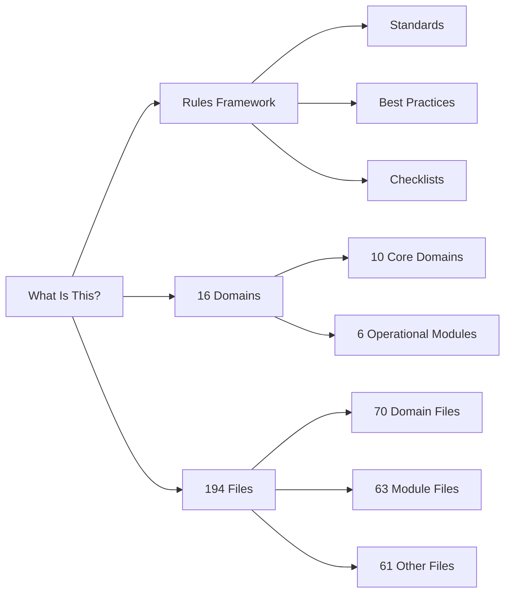

## Who Is This For?

| Audience | How They Use The Framework |
|----------|---------------------------|
| **AI/ML Engineers** | Building LLM-powered applications with production standards |
| **Software Developers** | Integrating AI capabilities into existing products |
| **DevOps/Platform Engineers** | Deploying and operating AI infrastructure |
| **Security Professionals** | Reviewing prompt, data, and tool risk |
| **Technical Leads** | Setting team standards and governance |
| **Compliance Teams** | Evaluating AI system regulatory risk |
| **Researchers** | Translating agentic patterns into practical systems |
| **AI Users** | Understanding how AI systems work and how to use them safely |
| **Product Managers** | Defining AI product requirements and guardrails |
| **Data Scientists** | Building and evaluating ML models and pipelines |

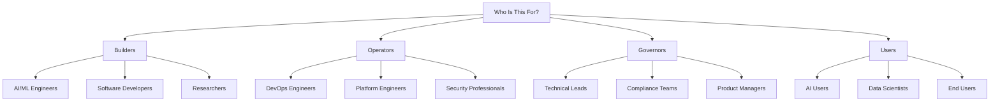

## Why This Framework?

| Problem | Solution | Benefit |
|---------|----------|---------|
| Inconsistent AI development practices | Standardized rules across 16 domains | Predictable quality |
| Security vulnerabilities in AI systems | Security-first design with threat modeling | Reduced risk |
| Compliance gaps and audit failures | Regulatory mapping and evidence templates | Audit readiness |
| Production incidents and outages | Incident response and monitoring guidance | Higher reliability |
| Knowledge silos across teams | Shared best practices and examples | Team collaboration |
| Unclear AI usage guidelines | User-facing guidance and safety practices | Safer AI adoption |

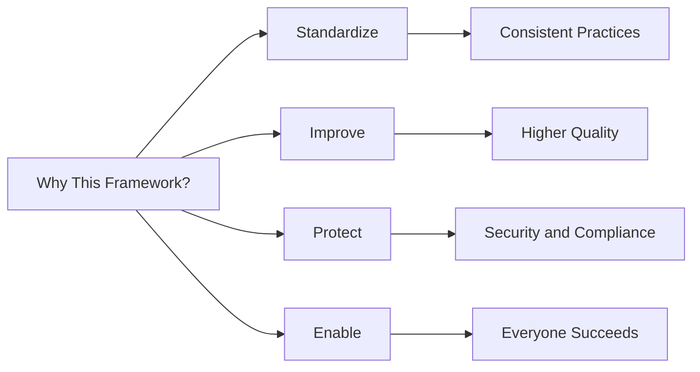

## Framework at a Glance

| Component | Count | Description |
|-----------|-------|-------------|
| Core Domains | 10 | Fundamental rules for AI systems |
| Operational Modules | 9 | Production guidance for operations |
| Agents | 12 | Specialized lifecycle roles |
| Skills | 9 | Implementation patterns |
| Memory Files | 10 | Framework context and references |
| Storage Files | 10 | Templates and rule collections |
| Documentation | 13 | Guides and references |
| **Total Files** | **194** | **Complete framework** |

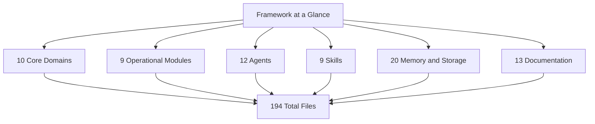

## Table of Contents

- [What Is This?](#what-is-this)
- [Who Is This For?](#who-is-this-for)
- [Why This Framework?](#why-this-framework)
- [Framework at a Glance](#framework-at-a-glance)
- [Framework Architecture](#framework-architecture)
- [Goal](#goal)
- [Purpose](#purpose)
- [Brain](#brain)
- [Domains](#domains)
- [Modules](#modules)
- [Agents](#agents)
- [Skills](#skills)
- [Quick Start](#quick-start)
- [Rule Categories](#rule-categories)
- [Repository Structure](#repository-structure)
- [Contributing](#contributing)
- [License](#license)
- [FAQ](#faq)

## Goal

The framework aims to **standardize AI development**, **improve system quality**, and **reduce risk** while enabling team collaboration and supporting compliance.

**Success Criteria**:
- 100% of new AI projects use framework standards
- Production incidents reduced by 50%
- Zero critical security incidents
- 100% compliance with regulations

See [goal.md](./goal.md) for complete goals, objectives, and success metrics.

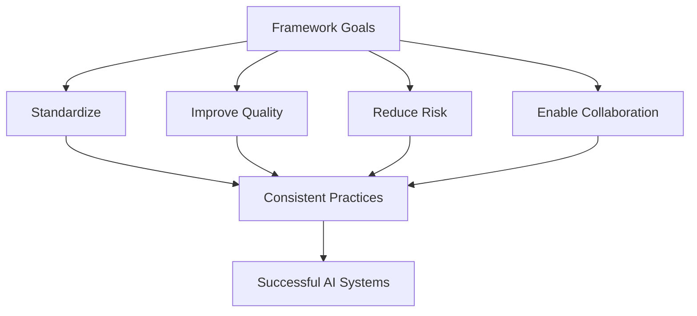

## Purpose

**Mission**: To provide a comprehensive, production-grade rules framework that enables teams to build robust, secure, maintainable, and auditable AI systems with confidence.

**Core Values**: Quality, Security, Compliance, Collaboration, Transparency, Continuous Improvement

See [purpose.md](./purpose.md) for complete mission, value proposition, and core values.

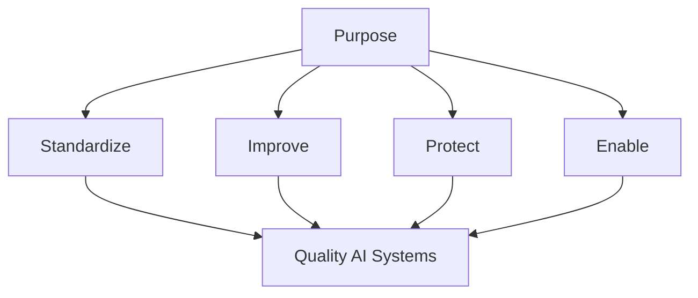

## Brain

The framework's **intellectual architecture** includes knowledge base, decision engine, learning system, and adaptation layer for continuous improvement.

**Key Capabilities**:
- Cross-domain intelligence and dependency mapping
- Automated rule validation and compliance checking
- Feedback-driven knowledge evolution
- Technology and regulation adaptation

See [brain.md](./brain.md) for complete intellectual architecture and decision framework.

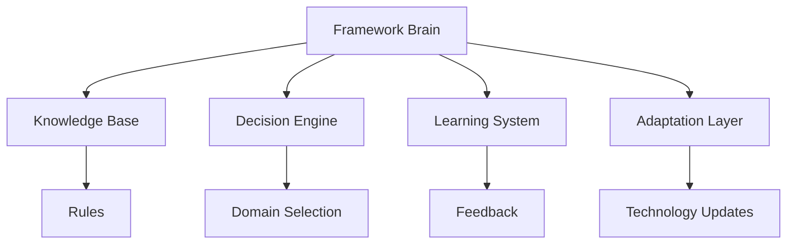

## Framework Architecture

```mermaid
flowchart TD
    A[LLM and Agentic Rules Framework] --> B[Core Domains]
    A --> C[Operational Modules]
    A --> D[Agents]
    A --> E[Skills]
    A --> F[Memory and Storage]
    
    B --> B1[01-Core]
    B --> B2[02-Security]
    B --> B3[03-Development]
    B --> B4[04-Data]
    B --> B5[05-Integration]
    B --> B6[06-Operations]
    B --> B7[07-Testing]
    B --> B8[08-Documentation]
    B --> B9[09-Performance]
    B --> B10[10-Compliance]
    
    C --> C1[Evaluation]
    C --> C2[Loop]
    C --> C3[Tools]
    C --> C4[Incident Response]
    C --> C5[Deployment]
    C --> C6[Monitoring]
    C --> C7[Cost Management]
    C --> C8[Vendor Management]
    C --> C9[Governance]
    
    D --> D1[Rules Architect]
    D --> D2[Rules Implementer]
    D --> D3[Rules Reviewer]
    D --> D4[Rules Release Gate]
    D --> D5[Rules Eval]
    D --> D6[Rules Compliance Auditor]
    D --> D7[Rules Data Steward]
    D --> D8[Rules Enforcer]
    D --> D9[Rules Documentation]
    D --> D10[Rules Tracker]
    D --> D11[Rules Orchestrator]
    D --> D12[Rules Security]
    
    E --> E1[LLM Agentic Rules Skills]
    E --> E2[System Skills]
    
    F --> F1[Memory]
    F --> F2[Storage]
```

## Domains

### Core Domains (10)

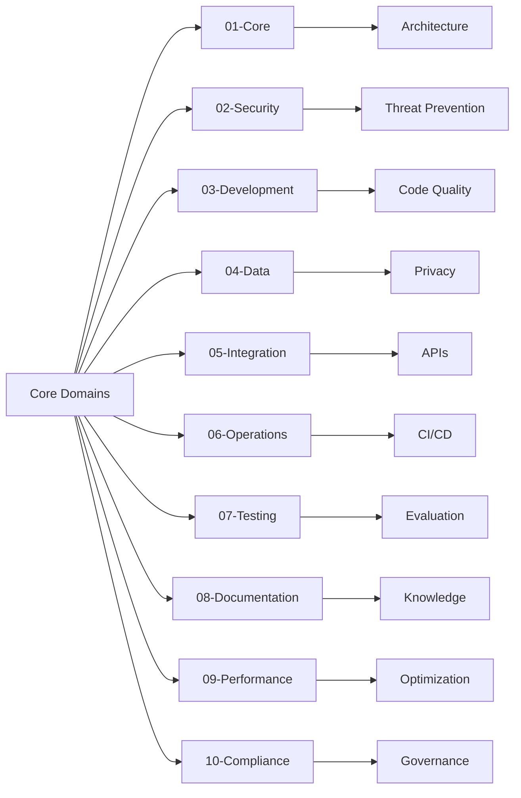

| # | Domain | Description | Primary Focus |
|---|--------|-------------|---------------|
| 01 | [Core](./domains/01-core/) | Fundamental rules for all LLM and agentic systems | Architecture, context, tools, state |
| 02 | [Security](./domains/02-security/) | Security-first development and threat prevention | Prompt injection, data protection, access control |
| 03 | [Development](./domains/03-development/) | Software engineering standards for AI systems | Code quality, maintainability, reviews |
| 04 | [Data](./domains/04-data/) | Data handling, retrieval, storage, and governance | Privacy, governance, pipelines |
| 05 | [Integration](./domains/05-integration/) | External services, APIs, tools, and protocols | APIs, webhooks, tool contracts |
| 06 | [Operations](./domains/06-operations/) | Deployment, monitoring, incident response, and reliability | CI/CD, observability, scaling |
| 07 | [Testing](./domains/07-testing/) | Quality assurance and evaluation strategies | Unit, integration, E2E, regression |
| 08 | [Documentation](./domains/08-documentation/) | Documentation standards and knowledge sharing | API docs, runbooks, guides |
| 09 | [Performance](./domains/09-performance/) | Performance, cost, and resource optimization | Latency, throughput, caching |
| 10 | [Compliance](./domains/10-compliance/) | Legal, regulatory, ethical, and audit readiness | Governance, risk controls, review evidence |

### Domain File Structure

Each domain contains the same seven rule files:

```text
domain-name/
|-- fundamentals.md
|-- best-practices.md
|-- anti-patterns.md
|-- checklist.md
|-- examples.md
|-- troubleshooting.md
`-- advanced.md
```

| File | Purpose | When To Use |
|------|---------|-------------|
| `fundamentals.md` | Core concepts every practitioner should know | Onboarding and early design |
| `best-practices.md` | Recommended patterns and standards | Design, implementation, review |
| `anti-patterns.md` | Mistakes to avoid and safer alternatives | Risk review and debugging |
| `checklist.md` | Actionable verification steps | PRs, releases, audits |
| `examples.md` | Practical snippets and templates | Implementation and prototyping |
| `troubleshooting.md` | Symptoms, root causes, fixes | Incidents and support |
| `advanced.md` | Complex scenarios and tradeoffs | Scaling and expert review |

## Modules

### Operational Modules (9)

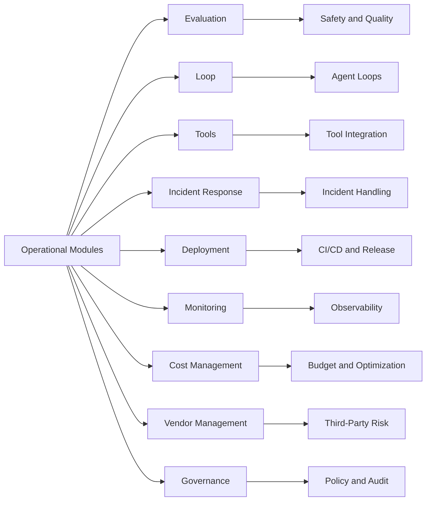

| Module | Description | Files |
|--------|-------------|-------|
| [Evaluation](./evaluation/) | AI system evaluation across safety, quality, performance | 7 files |
| [Loop](./loop/) | Agent loop implementation patterns | 7 files |
| [Tools](./tools/) | Tool integration patterns | 7 files |
| [Incident Response](./incident-response/) | Production incident handling | 7 files |
| [Deployment](./deployment/) | CI/CD, release management, rollback | 7 files |
| [Monitoring](./monitoring/) | Observability, alerting, dashboards | 7 files |
| [Cost Management](./cost-management/) | Budget tracking, optimization | 7 files |
| [Vendor Management](./vendor-management/) | Third-party assessment, DPA | 7 files |
| [Governance](./governance/) | Policy management, exception handling | 7 files |

### Module File Structure

Each module follows the same 7-file structure as domains:

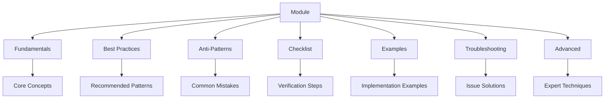

## Agents

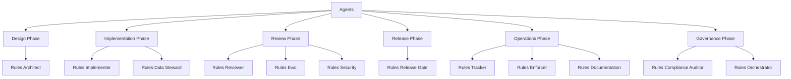

| Agent | Phase | Role |
|-------|-------|------|
| [Rules Architect](./agents/rules-architect.md) | Design | System design and architecture |
| [Rules Implementer](./agents/rules-implementer.md) | Implementation | System implementation |
| [Rules Reviewer](./agents/rules-reviewer.md) | Review | Code and artifact review |
| [Rules Release Gate](./agents/rules-release-gate.md) | Release | Release decisions |
| [Rules Eval](./agents/rules-eval.md) | Evaluation | Evaluation execution |
| [Rules Compliance Auditor](./agents/rules-compliance-auditor.md) | Compliance | Compliance evidence |
| [Rules Data Steward](./agents/rules-data-steward.md) | Data | Data governance |
| [Rules Enforcer](./agents/rules-enforcer.md) | Enforcement | Policy enforcement |
| [Rules Documentation](./agents/rules-documentation.md) | Documentation | Documentation standards |
| [Rules Tracker](./agents/rules-tracker.md) | Operations | Metrics and monitoring |
| [Rules Orchestrator](./agents/rules-orchestrator.md) | Coordination | Multi-agent coordination |
| [Rules Security](./agents/rules-security.md) | Security | Security controls |

### Agent Interaction Flow

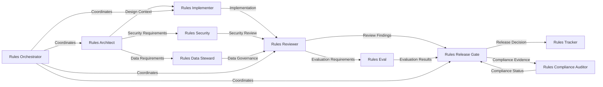

## Skills

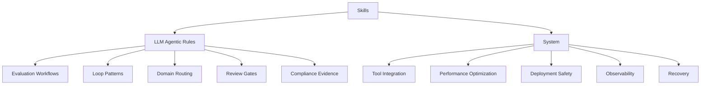

| Folder | Skills |
|--------|--------|
| [llm-agentic-rules/](./skills/llm-agentic-rules/) | Evaluation workflows, Loop patterns, Domain routing, Review gates, Compliance evidence |
| [system/](./skills/system/) | Tool integration, Performance optimization, Deployment safety, Observability, Recovery |

## Quick Start

### New Projects

1. Clone the repository.

   ```bash
   git clone https://github.com/Lifejiggy/llm-agentic-rules-framework.git
   cd llm-agentic-rules-framework
   ```

2. Read the core guidance first.

   ```bash
   less domains/01-core/fundamentals.md
   less domains/01-core/checklist.md
   ```

3. Add domains based on your system risk.

   - Production user-facing assistant: core, security, data, testing, operations, compliance.
   - Internal agent automation: core, development, integration, operations, testing.
   - High-volume AI API: core, integration, performance, operations, testing.

4. Copy relevant checklists into your project review process.

### Existing Projects

1. Audit your current implementation against `domains/*/checklist.md`.
2. Start with P0 and P1 security, data, testing, and operations gaps.
3. Use examples and templates to standardize controls.
4. Track exceptions and accepted risks explicitly.

## Rule Categories

| Priority | Meaning | Expected Handling |
|----------|---------|-------------------|
| P0 Critical | Security, safety, compliance, or data-loss risk | Required before production |
| P1 High | Reliability, quality, or maintainability risk | Required unless explicitly accepted |
| P2 Medium | Meaningful quality improvement | Adopt when practical |
| P3 Low | Helpful refinement | Backlog or opportunistic improvement |

## Usage Examples

### CI Structure Check

```yaml
name: Validate Framework
on: [push, pull_request]

jobs:
  validate:
    runs-on: ubuntu-latest
    steps:
      - uses: actions/checkout@v4
      - shell: pwsh
        run: ./scripts/validate-framework.ps1
      - run: python scripts/check_rules.py --summary
```

### Project Documentation Reference

```markdown
This project follows the LLM & Agentic Rules Framework:

- Core architecture: domains/01-core/fundamentals.md
- Security controls: domains/02-security/checklist.md
- Evaluation strategy: evaluation/evaluation-best-practices.md
- Incident response: incident-response/incident-response-fundamentals.md
- Deployment: deployment/deployment-best-practices.md
- Compliance register: assets/templates/ai-system-register.yml
```

### New Team Member Reading Path

```markdown
- [ ] Core fundamentals
- [ ] Security fundamentals
- [ ] Testing checklist
- [ ] Operations troubleshooting
- [ ] Compliance fundamentals
- [ ] Evaluation workflows
- [ ] Incident response basics
```

## Integration Guide

1. **Assess current state**: identify model, prompt, data, tool, and deployment risks.
2. **Map domains to system scope**: choose the domains that apply to the product.
3. **Adopt checklists gradually**: start with P0 and P1 items.
4. **Add evidence**: keep decisions, evaluations, approvals, and incidents in durable records.
5. **Automate what can be checked**: run repository validation and rule summaries in CI.
6. **Review regularly**: update rules after incidents, model changes, and compliance changes.

## Repository Structure

```text
llm-agentic-rules/
├── .github/                    # GitHub workflows and templates
├── adapters/                   # Agent adapters and manifests
├── agents/                     # 12 specialized agent definitions
├── assets/templates/           # Reusable templates
├── commands/                   # CLI commands
├── cost-management/            # Cost management module (7 files)
├── deployment/                 # Deployment module (7 files)
├── docs/                       # Documentation
├── domains/                    # 10 core domains (70 files)
├── evaluation/                 # Evaluation module (7 files)
├── examples/                   # Production examples
├── governance/                 # Governance module (7 files)
├── incident-response/          # Incident response module (7 files)
├── loop/                       # Loop module (7 files)
├── memory/                     # Framework context and references
├── monitoring/                 # Monitoring module (7 files)
├── scripts/                    # Validation and tooling scripts
├── skills/                     # Specialized skills
│   ├── llm-agentic-rules/      # Domain-specific skills
│   └── system/                 # System-level skills
├── storage/                    # Templates and reference materials
├── tools/                      # Tools module (7 files)
├── vendor-management/          # Vendor management module (7 files)
├── CHANGELOG.md
├── CONTRIBUTING.md
├── LICENSE
├── README.md
└── ROADMAP.md
```

### File Count Summary

| Category | Folders | Files | Description |
|----------|---------|-------|-------------|
| Domains | 10 | 70 | Core rule files |
| Modules | 9 | 63 | Operational guidance |
| Agents | 1 | 12 | Agent definitions |
| Skills | 2 | 9 | Skill patterns |
| Memory | 1 | 10 | Framework context |
| Storage | 1 | 10 | Templates and rules |
| Docs | 1 | 13 | Documentation |
| **Total** | **26** | **187** | **Complete framework** |

## Contributing

Read [CONTRIBUTING.md](./CONTRIBUTING.md) before submitting changes.

Useful contribution types:

- new rules for existing domains;
- stronger real-world examples;
- corrections to inaccurate guidance;
- templates for reviews, evaluations, audits, and operations;
- tooling that makes the framework easier to adopt.

## License

This project is licensed under the [MIT License](./LICENSE).

## FAQ

**Q: Which domains should I start with?**  
A: Start with Core. For production systems, add Security, Data, Testing, Operations, and Compliance.

**Q: Can I use only part of the framework?**  
A: Yes. Each domain and module is designed to be independently useful.

**Q: Are the rules meant to replace engineering judgment?**  
A: No. They create a baseline. Teams should adapt them to system risk, regulation, and business context.

**Q: How should model or prompt changes be handled?**  
A: Treat them as behavior-changing releases. Re-run evaluations, review high-risk workflows, and record the change.

**Q: What's the difference between domains and modules?**  
A: Domains are the original 10 rule areas. Modules are the 9 operational areas added for production coverage.

**Q: How do agents work with the framework?**  
A: Agents are specialized roles that implement specific parts of the framework lifecycle, from design through operations.
