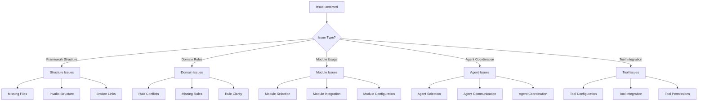
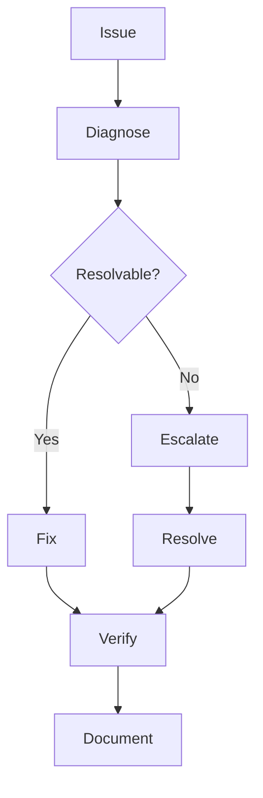

# Troubleshooting - LLM & Agentic Rules Framework

## Overview

This document provides practical solutions for common issues encountered when using the LLM & Agentic Rules Framework.

## Troubleshooting Flow



## Common Issues

### Issue 1: Framework Structure Problems

#### Symptoms

- Missing files or directories
- Invalid file structure
- Broken links between files
- Validation failures

#### Resolution

```yaml
structure_fixes:
  - issue: "missing_domain_files"
    diagnosis: "Run validation script"
    command: "python scripts/check_rules.py --validate"
    fix: "Add missing files from templates"
  
  - issue: "invalid_structure"
    diagnosis: "Check directory layout"
    command: "ls -la domains/"
    fix: "Reorganize to match framework structure"
  
  - issue: "broken_links"
    diagnosis: "Run link checker"
    command: "python scripts/check_rules.py --validate-links"
    fix: "Update broken links"
```

### Issue 2: Domain Rule Conflicts

#### Symptoms

- Contradictory rules in different domains
- Overlapping requirements
- Unclear priority between rules
- Inconsistent guidance

#### Resolution

```yaml
domain_conflict_resolution:
  - issue: "rule_conflict"
    diagnosis: "Compare conflicting rules"
    analysis: "Check rule priorities and scope"
    resolution: "Apply higher priority rule"
    escalation: "Escalate to framework maintainers"
  
  - issue: "overlapping_requirements"
    diagnosis: "Map requirements to domains"
    analysis: "Identify primary domain"
    resolution: "Apply primary domain rule"
    documentation: "Document decision rationale"
```

### Issue 3: Module Selection Confusion

#### Symptoms

- Uncertain which modules to use
- Module overlap or gaps
- Module integration challenges
- Module configuration issues

#### Resolution

```yaml
module_selection:
  - issue: "which_modules_to_use"
    diagnosis: "Assess system requirements"
    tool: "Domain selection guide"
    resolution: "Select based on risk tier and system type"
  
  - issue: "module_overlap"
    diagnosis: "Review module scopes"
    analysis: "Identify unique vs shared content"
    resolution: "Use appropriate module for each concern"
  
  - issue: "module_gaps"
    diagnosis: "Compare requirements to modules"
    analysis: "Identify missing coverage"
    resolution: "Contribute missing content"
```

### Issue 4: Agent Coordination Problems

#### Symptoms

- Agents not working together
- Unclear agent responsibilities
- Agent communication failures
- Agent workflow issues

#### Resolution

```yaml
agent_coordination:
  - issue: "agent_not_working"
    diagnosis: "Check agent configuration"
    tool: "Agent catalog"
    resolution: "Verify agent role and responsibilities"
  
  - issue: "unclear_responsibilities"
    diagnosis: "Review agent definitions"
    tool: "Agent interaction matrix"
    resolution: "Clarify roles and handoffs"
  
  - issue: "communication_failure"
    diagnosis: "Check communication protocols"
    tool: "Agent communication templates"
    resolution: "Update communication channels"
```

### Issue 5: Tool Integration Challenges

#### Symptoms

- Tools not integrating properly
- Permission issues
- Configuration errors
- Tool conflicts

#### Resolution

```yaml
tool_integration:
  - issue: "tool_not_integrating"
    diagnosis: "Check tool configuration"
    tool: "Tool integration checklist"
    resolution: "Verify tool setup and permissions"
  
  - issue: "permission_issues"
    diagnosis: "Review permission model"
    tool: "Tool permission matrix"
    resolution: "Update permissions and access"
  
  - issue: "configuration_errors"
    diagnosis: "Validate configuration"
    tool: "Configuration validator"
    resolution: "Fix configuration issues"
```

## Issue Database

### By Category

| Category | Common Issues | Resolution Rate |
|----------|---------------|-----------------|
| Structure | Missing files, broken links | 95% |
| Domains | Rule conflicts, gaps | 90% |
| Modules | Selection confusion, integration | 85% |
| Agents | Coordination, communication | 80% |
| Tools | Integration, permissions | 85% |

### By Severity

| Severity | Description | Response Time |
|----------|-------------|---------------|
| Critical | Framework unusable | Immediate |
| High | Major functionality affected | 24 hours |
| Medium | Moderate impact | 1 week |
| Low | Minor inconvenience | 1 month |

## Diagnostic Tools

### Validation Commands

```bash
# Validate framework structure
python scripts/check_rules.py --validate

# Check rule links
python scripts/check_rules.py --validate-links

# Generate rule report
python scripts/check_rules.py --summary

# Export checklists
python scripts/check_rules.py --export-checklists build/checklists.md
```

### Diagnostic Queries

```yaml
diagnostic_queries:
  - query: "find_missing_files"
    command: "find domains/ -name '*.md' | wc -l"
    expected: "70"
  
  - query: "check_rule_coverage"
    command: "python scripts/check_rules.py --summary"
    expected: "All domains covered"
  
  - query: "validate_links"
    command: "python scripts/check_rules.py --validate-links"
    expected: "No broken links"
```

## Escalation Paths

### Framework Issues

| Issue Type | First Contact | Escalation | Timeline |
|------------|---------------|------------|----------|
| Missing files | Community | Maintainers | 1 week |
| Rule conflicts | Domain owners | Framework lead | 2 weeks |
| Module gaps | Module owners | Framework lead | 1 month |
| Agent issues | Agent owners | Framework lead | 1 week |

### Technical Issues

| Issue Type | First Contact | Escalation | Timeline |
|------------|---------------|------------|----------|
| Tool integration | Tool owners | Operations | 1 week |
| Configuration | Operations | Engineering | 3 days |
| Performance | Engineering | Architecture | 1 week |
| Security | Security team | CISO | Immediate |

## Prevention Strategies

### Proactive Measures

| Measure | Description | Frequency |
|---------|-------------|-----------|
| Regular validation | Run validation scripts | Weekly |
| Link checking | Verify all links work | Monthly |
| Rule review | Review rule currency | Quarterly |
| Framework update | Update framework content | Per release |

### Best Practices

| Practice | Description | Benefit |
|----------|-------------|---------|
| Start simple | Begin with core domains | Faster adoption |
| Iterate gradually | Add domains incrementally | Reduced risk |
| Document decisions | Record framework usage | Knowledge retention |
| Share learnings | Contribute back to framework | Community benefit |

## Support Resources

### Documentation

| Resource | Location | Purpose |
|----------|----------|---------|
| Getting Started | docs/getting-started.md | Initial guidance |
| Domain Index | docs/domain-index.md | Rule lookup |
| Glossary | docs/glossary.md | Term definitions |
| FAQ | README.md | Common questions |

### Community

| Channel | Purpose | Response Time |
|---------|---------|---------------|
| GitHub Issues | Bug reports, questions | 1-7 days |
| GitHub Discussions | General discussion | 1-3 days |
| Documentation | Self-service | Immediate |

## Conclusion

Most framework issues can be resolved through systematic diagnosis using the provided tools and resources. For complex issues, escalation paths ensure timely resolution.


