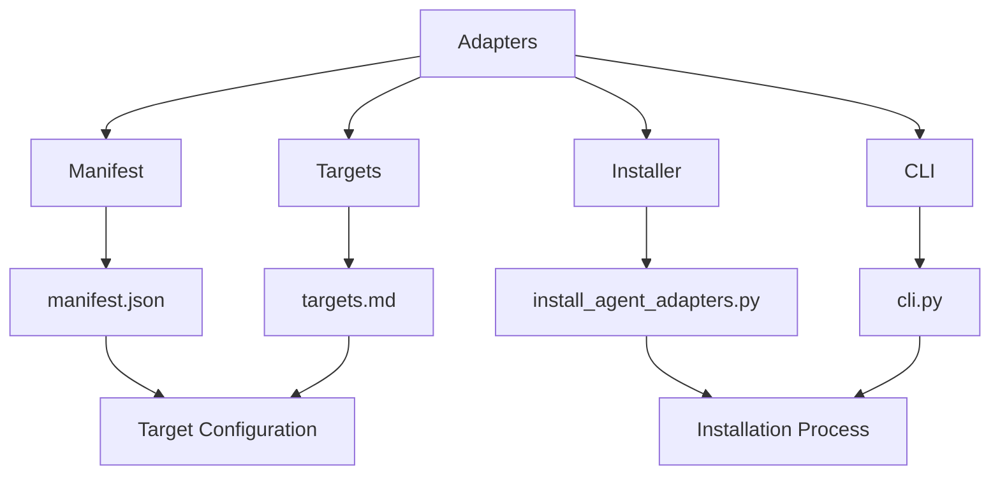
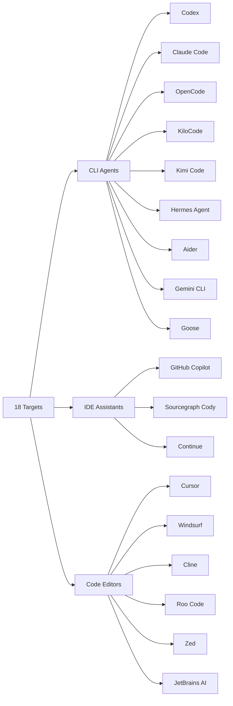
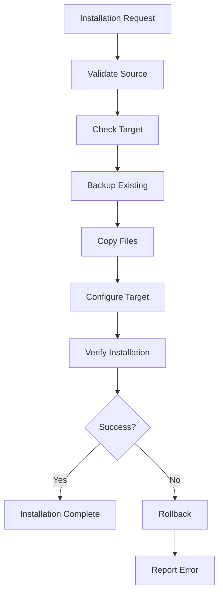

# Adapters

## Overview

The adapters directory contains configuration and installation tools for integrating the LLM & Agentic Rules Framework with various coding agents and IDE assistants.

## Architecture



## Components

| Component | File | Purpose |
|-----------|------|---------|
| Manifest | `manifest.json` | Framework metadata and target configuration |
| Targets | `targets.md` | Target list and configuration guide |
| Installer | `install_agent_adapters.py` | Automated installation script |
| CLI | `cli.py` | Command-line interface for framework operations |

## Supported Targets

The framework supports 18 coding-agent and IDE assistant environments:



## Quick Start

### List Available Targets

```bash
python scripts/cli.py list
```

### Preview Installation

```bash
python scripts/cli.py install --target claude-code --dry-run
```

### Install for Target

```bash
python scripts/cli.py install --target claude-code --apply
```

### Install All Targets

```bash
python scripts/cli.py install --target all --apply
```

## Installation Process



## Target Configuration

Each target has specific configuration requirements:

| Target | Config File | Skill Path | Agent Path |
|--------|-------------|------------|------------|
| Codex | `.codex-plugin/plugin.json` | `skills/` | `agents/` |
| Claude Code | `.claude/settings.json` | `skills/` | `agents/` |
| Cursor | `.cursorrules` | `skills/` | N/A |
| Windsurf | `.windsurfrules` | `skills/` | N/A |
| GitHub Copilot | `.github/copilot-instructions.md` | `skills/` | N/A |

## CLI Commands

| Command | Description | Example |
|---------|-------------|---------|
| `check` | Check system requirements | `python scripts/cli.py check` |
| `validate` | Validate framework structure | `python scripts/cli.py validate --verbose` |
| `report` | Generate framework report | `python scripts/cli.py report --format markdown` |
| `export` | Export checklists | `python scripts/cli.py export --output checklists.md` |
| `install` | Install adapter for target | `python scripts/cli.py install --target claude-code` |
| `list` | List available targets | `python scripts/cli.py list` |

## Troubleshooting

### Common Issues

| Issue | Solution |
|-------|----------|
| Target not found | Run `python scripts/cli.py list` to see available targets |
| Permission denied | Run with appropriate permissions or use `--dry-run` first |
| Config file exists | Backup existing config before installation |
| Installation failed | Check error message and retry with `--verbose` |

### Getting Help

```bash
python scripts/cli.py --help
python scripts/cli.py install --help
```
