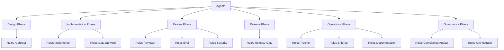
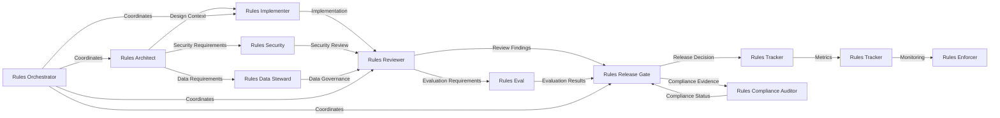

# Agents Domain

## Overview

The Agents domain contains specialized agents for implementing the LLM & Agentic Rules Framework.

## Architecture

## Agent Interactions

## Files

| File | Purpose |
|------|---------|
| rules-architect.md | System design and architecture |
| rules-implementer.md | System implementation |
| rules-reviewer.md | Code and artifact review |
| rules-release-gate.md | Release decisions |
| rules-eval.md | Evaluation execution |
| rules-compliance-auditor.md | Compliance evidence |
| rules-data-steward.md | Data governance |
| rules-enforcer.md | Policy enforcement |
| rules-documentation.md | Documentation standards |
| rules-tracker.md | Metrics and monitoring |
| rules-orchestrator.md | Multi-agent coordination |
| rules-security.md | Security controls |

## Quick Start

1. Start with `rules-architect.md` for system design
2. Use `rules-implementer.md` for implementation
3. Reference `rules-reviewer.md` for review process
4. Use `rules-release-gate.md` for release decisions
