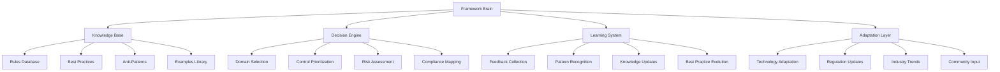
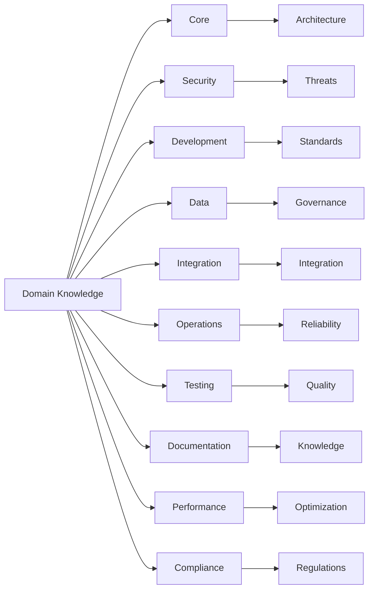
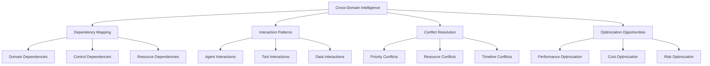
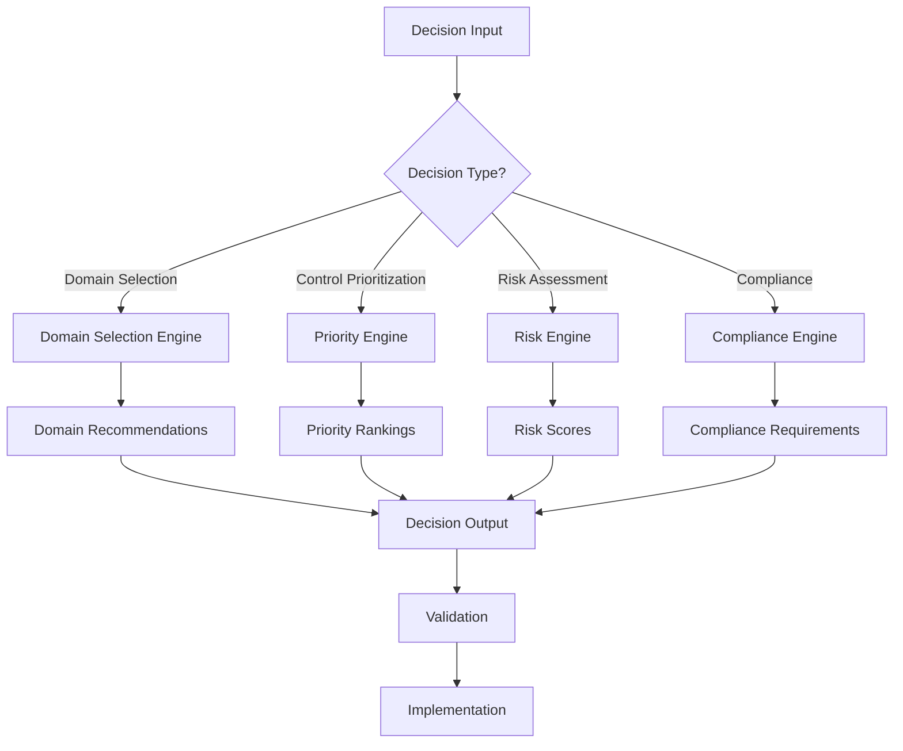
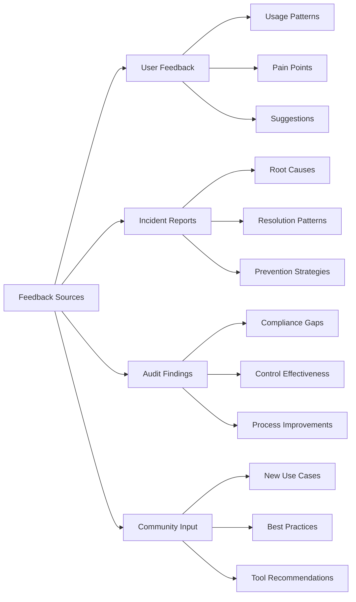
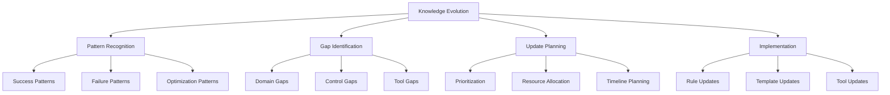
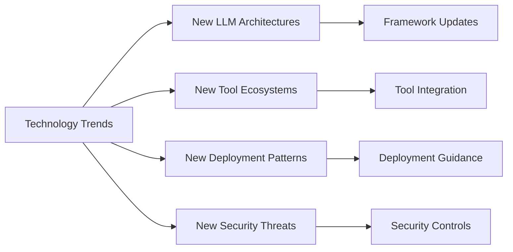
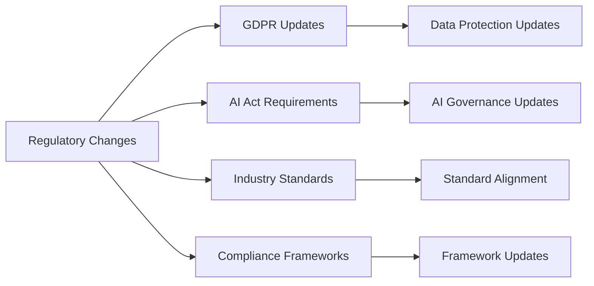
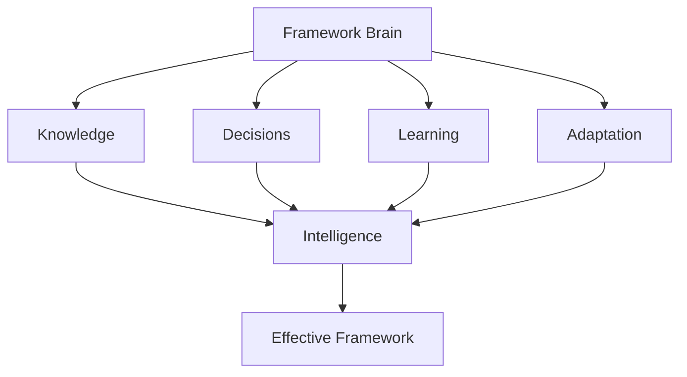

# Brain - LLM & Agentic Rules Framework

## Overview

This document describes the intellectual architecture and decision-making framework for the LLM & Agentic Rules Framework.

## Framework Intelligence

## Knowledge Architecture

### Domain Knowledge

### Cross-Domain Intelligence

## Decision Framework

### Decision Process

### Decision Rules

| Decision Type | Primary Criteria | Secondary Criteria | Validation |
|---------------|------------------|-------------------|------------|
| Domain Selection | System risk tier | Regulatory requirements | Expert review |
| Control Priority | P0/P1/P2/P3 classification | Implementation effort | Compliance check |
| Risk Assessment | Impact and likelihood | Mitigation effectiveness | Stakeholder review |
| Compliance | Regulatory requirements | Business context | Legal review |

## Learning System

### Feedback Collection

### Knowledge Evolution

## Adaptation Layer

### Technology Adaptation

### Regulation Adaptation

## Intelligence Metrics

### Knowledge Quality

| Metric | Target | Measurement |
|--------|--------|-------------|
| Rule completeness | > 95% | Coverage analysis |
| Rule accuracy | > 98% | Validation testing |
| Rule currency | > 90% | Update frequency |
| Rule relevance | > 85% | User feedback |

### Decision Quality

| Metric | Target | Measurement |
|--------|--------|-------------|
| Decision accuracy | > 90% | Outcome tracking |
| Decision speed | < 1 day | Time measurement |
| Decision consistency | > 95% | Cross-reference |
| Decision acceptance | > 85% | User satisfaction |

### Learning Effectiveness

| Metric | Target | Measurement |
|--------|--------|-------------|
| Feedback incorporation | > 80% | Implementation rate |
| Knowledge update frequency | Monthly | Release tracking |
| Pattern recognition accuracy | > 85% | Validation |
| Adaptation speed | < 1 week | Time to update |

## Conclusion

The Framework Brain provides intelligent decision-making, continuous learning, and adaptive evolution to keep the framework current, relevant, and effective.

