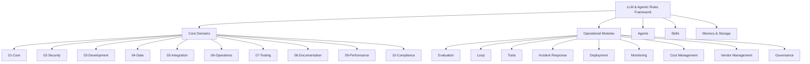
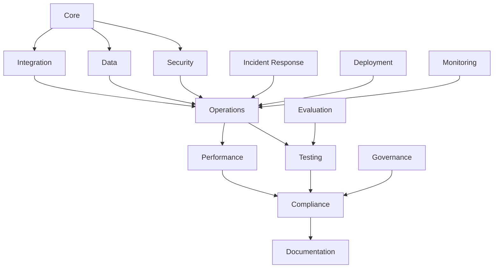
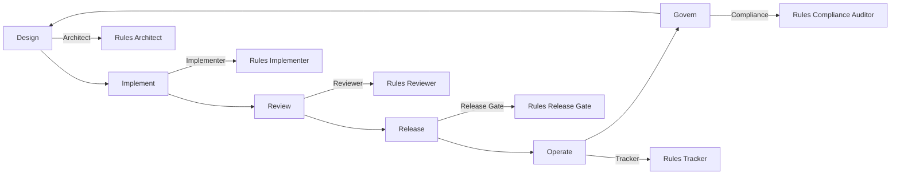
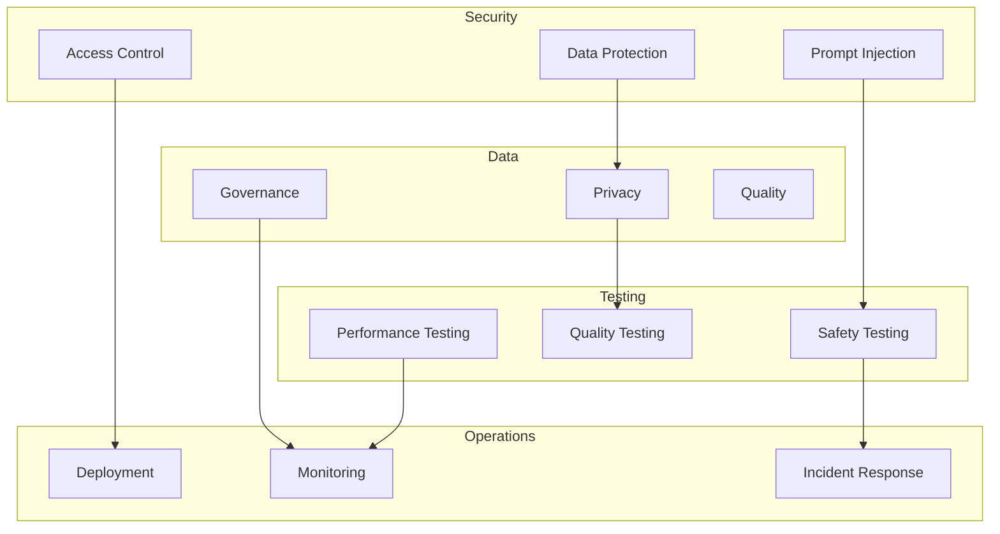
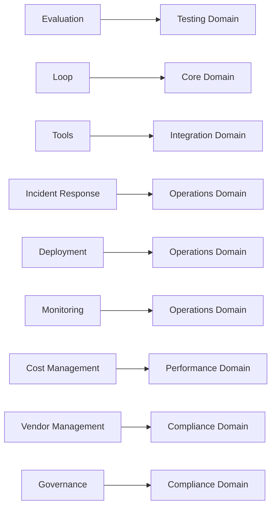
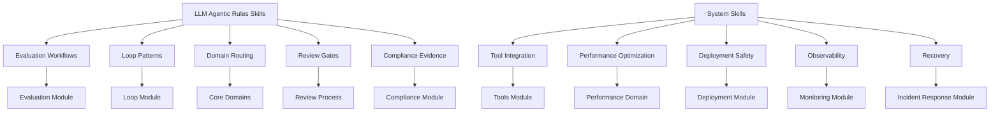
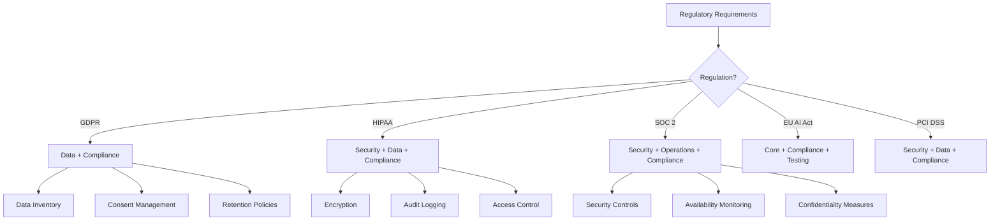

# Domain Knowledge Map

## Overview

This document provides a visual map of how all framework components connect.

## Framework Overview



## Domain Dependencies



## Agent Lifecycle



## Cross-Domain Connections



## Module Integration



## Skill Integration



## Risk Assessment Flow

```mermaid
flowchart TD
    A[System Assessment] --> B{Risk Tier?}
    B -->|Low| C[Basic Controls]
    B -->|Medium| D[Standard Controls]
    B -->|High| E[Enhanced Controls]
    B -->|Critical| F[Maximum Controls]
    
    C --> G[Core + Testing]
    D --> G + H[Security + Data + Operations]
    E --> G + H + I[All Domains]
    F --> G + H + I + J[All Domains + Governance]
```

## Compliance Mapping


