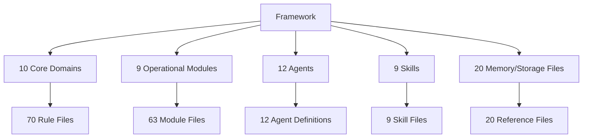
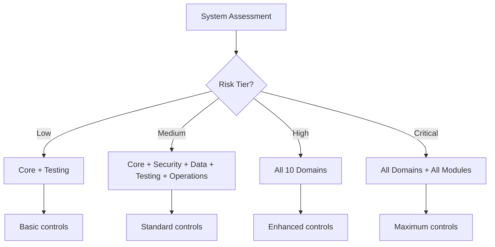
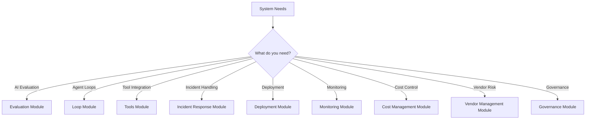
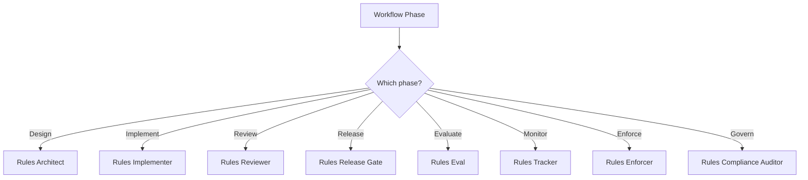

# Getting Started

## Overview

This guide helps you get started with the LLM & Agentic Rules Framework.

## Quick Start

### Step 1: Clone the Repository

```bash
git clone https://github.com/Lifejiggy/llm-agentic-rules-framework.git
cd llm-agentic-rules-framework
```

### Step 2: Read Core Fundamentals

```bash
less domains/01-core/fundamentals.md
less domains/01-core/checklist.md
```

### Step 3: Select Domains Based on Risk

| System Type | Required Domains | Recommended Domains |
|-------------|-----------------|---------------------|
| Production user-facing assistant | Core, Security, Data, Testing, Operations, Compliance | Documentation, Performance |
| Internal agent automation | Core, Development, Integration, Operations, Testing | Documentation |
| High-volume AI API | Core, Integration, Performance, Operations, Testing | Security, Compliance |
| Healthcare AI system | All 10 domains | - |
| Financial AI system | All 10 domains | - |

### Step 4: Copy Checklists

Copy relevant checklists into your project review process.

## Framework Architecture



## Domain Selection



## Module Selection



## Agent Selection



## Reading Paths

### Quick Start (1 hour)

1. Core fundamentals
2. Evaluation fundamentals
3. Incident response fundamentals

### Comprehensive (1 day)

1. All core domain fundamentals
2. All module fundamentals
3. Agent overview

### Expert (1 week)

1. All domain files
2. All module files
3. All agent files
4. All skill files

## Next Steps

1. Read the [Domain Index](./domain-index.md) for specific guidance
2. Review the [Domain Knowledge Map](./domain-knowledge-map.md) for visual overview
3. Explore the [Adoption Playbook](./adoption-playbook.md) for implementation steps
4. Check the [Glossary](./glossary.md) for key terms
