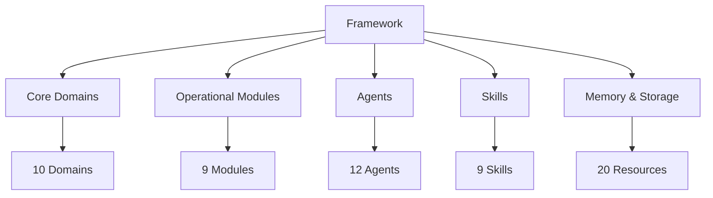
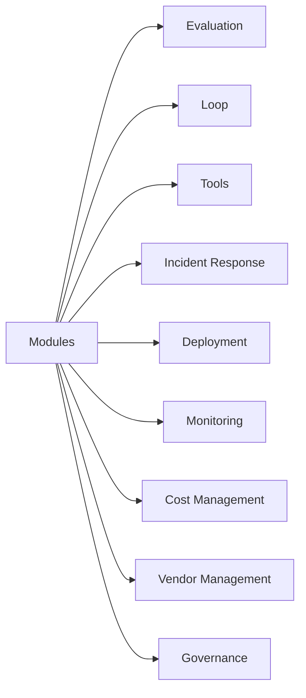
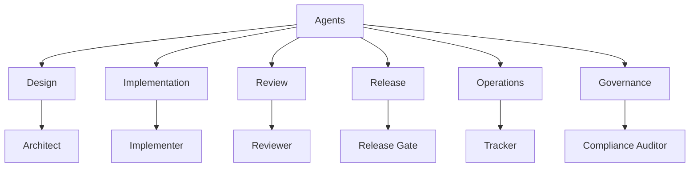

# Documentation Index

## Overview

This documentation site provides comprehensive guidance for the LLM & Agentic Rules Framework.

## Framework Architecture

## Start Here

- [Getting Started](./getting-started.md) - Quick start guide for new users
- [Domain Index](./domain-index.md) - Find the right rule file for your task
- [Domain Knowledge Map](./domain-knowledge-map.md) - Visual map of all domains
- [Glossary](./glossary.md) - Key terms and definitions
- [Risk Tiering](./risk-tiering.md) - Risk assessment framework
- [Adoption Playbook](./adoption-playbook.md) - Step-by-step adoption guide

## Core Domains

| # | Domain | Fundamentals | Best Practices | Checklist |
|---|--------|--------------|----------------|-----------|
| 01 | Core | [Fundamentals](../domains/01-core/fundamentals.md) | [Best Practices](../domains/01-core/best-practices.md) | [Checklist](../domains/01-core/checklist.md) |
| 02 | Security | [Fundamentals](../domains/02-security/fundamentals.md) | [Best Practices](../domains/02-security/best-practices.md) | [Checklist](../domains/02-security/checklist.md) |
| 03 | Development | [Fundamentals](../domains/03-development/fundamentals.md) | [Best Practices](../domains/03-development/best-practices.md) | [Checklist](../domains/03-development/checklist.md) |
| 04 | Data | [Fundamentals](../domains/04-data/fundamentals.md) | [Best Practices](../domains/04-data/best-practices.md) | [Checklist](../domains/04-data/checklist.md) |
| 05 | Integration | [Fundamentals](../domains/05-integration/fundamentals.md) | [Best Practices](../domains/05-integration/best-practices.md) | [Checklist](../domains/05-integration/checklist.md) |
| 06 | Operations | [Fundamentals](../domains/06-operations/fundamentals.md) | [Best Practices](../domains/06-operations/best-practices.md) | [Checklist](../domains/06-operations/checklist.md) |
| 07 | Testing | [Fundamentals](../domains/07-testing/fundamentals.md) | [Best Practices](../domains/07-testing/best-practices.md) | [Checklist](../domains/07-testing/checklist.md) |
| 08 | Documentation | [Fundamentals](../domains/08-documentation/fundamentals.md) | [Best Practices](../domains/08-documentation/best-practices.md) | [Checklist](../domains/08-documentation/checklist.md) |
| 09 | Performance | [Fundamentals](../domains/09-performance/fundamentals.md) | [Best Practices](../domains/09-performance/best-practices.md) | [Checklist](../domains/09-performance/checklist.md) |
| 10 | Compliance | [Fundamentals](../domains/10-compliance/fundamentals.md) | [Best Practices](../domains/10-compliance/best-practices.md) | [Checklist](../domains/10-compliance/checklist.md) |

## Operational Modules

| Module | Fundamentals | Best Practices | Checklist |
|--------|--------------|----------------|-----------|
| Evaluation | [Fundamentals](../evaluation/evaluation-fundamentals.md) | [Best Practices](../evaluation/evaluation-best-practices.md) | [Checklist](../evaluation/evaluation-checklist.md) |
| Loop | [Fundamentals](../loop/loop-fundamentals.md) | [Best Practices](../loop/loop-best-practices.md) | [Checklist](../loop/loop-checklist.md) |
| Tools | [Fundamentals](../tools/tools-fundamentals.md) | [Best Practices](../tools/tools-best-practices.md) | [Checklist](../tools/tools-checklist.md) |
| Incident Response | [Fundamentals](../incident-response/incident-response-fundamentals.md) | [Best Practices](../incident-response/incident-response-best-practices.md) | [Checklist](../incident-response/incident-response-checklist.md) |
| Deployment | [Fundamentals](../deployment/deployment-fundamentals.md) | [Best Practices](../deployment/deployment-best-practices.md) | [Checklist](../deployment/deployment-checklist.md) |
| Monitoring | [Fundamentals](../monitoring/monitoring-fundamentals.md) | [Best Practices](../monitoring/monitoring-best-practices.md) | [Checklist](../monitoring/monitoring-checklist.md) |
| Cost Management | [Fundamentals](../cost-management/cost-management-fundamentals.md) | [Best Practices](../cost-management/cost-management-best-practices.md) | [Checklist](../cost-management/cost-management-checklist.md) |
| Vendor Management | [Fundamentals](../vendor-management/vendor-management-fundamentals.md) | [Best Practices](../vendor-management/vendor-management-best-practices.md) | [Checklist](../vendor-management/vendor-management-checklist.md) |
| Governance | [Fundamentals](../governance/governance-fundamentals.md) | [Best Practices](../governance/governance-best-practices.md) | [Checklist](../governance/governance-checklist.md) |

## Agents

| Agent | File | Role |
|-------|------|------|
| Rules Architect | [rules-architect.md](../agents/rules-architect.md) | System design |
| Rules Implementer | [rules-implementer.md](../agents/rules-implementer.md) | Implementation |
| Rules Reviewer | [rules-reviewer.md](../agents/rules-reviewer.md) | Code review |
| Rules Release Gate | [rules-release-gate.md](../agents/rules-release-gate.md) | Release decisions |
| Rules Eval | [rules-eval.md](../agents/rules-eval.md) | Evaluation |
| Rules Compliance Auditor | [rules-compliance-auditor.md](../agents/rules-compliance-auditor.md) | Compliance |
| Rules Data Steward | [rules-data-steward.md](../agents/rules-data-steward.md) | Data governance |
| Rules Enforcer | [rules-enforcer.md](../agents/rules-enforcer.md) | Policy enforcement |
| Rules Documentation | [rules-documentation.md](../agents/rules-documentation.md) | Documentation |
| Rules Tracker | [rules-tracker.md](../agents/rules-tracker.md) | Metrics |
| Rules Orchestrator | [rules-orchestrator.md](../agents/rules-orchestrator.md) | Coordination |
| Rules Security | [rules-security.md](../agents/rules-security.md) | Security |

## Advanced Guides

- [Advanced Usage](./advanced-usage.md) - Advanced framework usage
- [Migration Guide](./migration-guide.md) - Migration from other frameworks
- [Checklist Packs](./checklist-packs.md) - Pre-built checklist collections
- [Framework Quality Standard](./framework-quality-standard.md) - Quality requirements
- [Evolution Process](./evolution-process.md) - Framework evolution process
- [Agentic CLI Plugin Guide](./agentic-cli-plugin-guide.md) - CLI plugin integration

## Repository References

- [README](../README.md) - Project overview
- [Roadmap](../ROADMAP.md) - Development roadmap
- [Contributing](../CONTRIBUTING.md) - Contribution guidelines
- [Changelog](../CHANGELOG.md) - Version history

## Examples

- [Production Assistant](../examples/production-assistant/README.md) - Production assistant example
- [Agentic Automation](../examples/agentic-automation/README.md) - Agentic automation example
