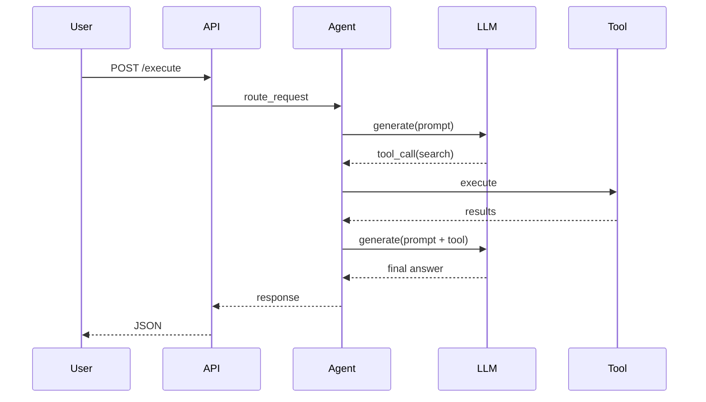
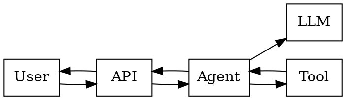
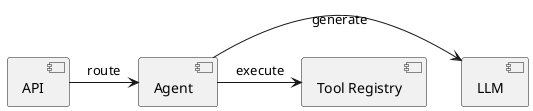

# Documentation Domain - Advanced Concepts

## Overview

This document covers advanced documentation concepts, automation, interactive documentation, versioned docs, and documentation architecture for LLM/agentic systems.

---

## Table of Contents

1. [Automated Documentation](#1-automated-documentation)
2. [Interactive Documentation](#2-interactive-documentation)
3. [Versioned Documentation](#3-versioned-documentation)
4. [Documentation as Code](#4-documentation-as-code)
5. [Knowledge Graphs](#5-knowledge-graphs)
6. [Release Note Generation](#6-release-note-generation)
7. [Prompt and Decision Records](#7-prompt-and-decision-records)
8. [Observability Docs & SLOs](#8-observability-docs--slos)
9. [Compliance Documentation](#9-compliance-documentation)
10. [Self-Healing Documentation](#10-self-healing-documentation)
11. [Multi-Tenant Documentation](#11-multi-tenant-documentation)
12. [Example-Driven Documentation](#12-example-driven-documentation)
13. [Internationalization and Localization](#13-internationalization-and-localization)
14. [Training and Education Documentation](#14-training-and-education-documentation)
15. [AI-Assisted Documentation](#15-ai-assisted-documentation)
16. [Documentation Testing](#16-documentation-testing)
17. [Change Log Patterns](#17-change-log-patterns)
18. [Documentation Governance](#18-documentation-governance)
19. [Cross-Reference and Linking](#19-cross-reference-and-linking)
20. [Appendices](#20-appendices)

---

## 1. Automated Documentation

### API Documentation with OpenAPI

```yaml
openapi: 3.0.0
info:
  title: Agent API
  version: 1.0.0
  description: |
    Core API for agent execution, streaming, and management.
    Supports async execution and webhooks.
paths:
  /agent/execute:
    post:
      summary: Execute agent task
      operationId: executeAgent
      tags:
        - agent
      requestBody:
        required: true
        content:
          application/json:
            schema:
              $ref: '#/components/schemas/AgentRequest'
      responses:
        '200':
          description: Success
          content:
            application/json:
              schema:
                $ref: '#/components/schemas/AgentResponse'
        '400':
          $ref: '#/components/responses/BadRequest'
        '401':
          $ref: '#/components/responses/Unauthorized'
        '429':
          $ref: '#/components/responses/RateLimited'
components:
  schemas:
    AgentRequest:
      type: object
      required:
        - task
        - session_id
      properties:
        task:
          type: string
          minLength: 1
          maxLength: 50000
        session_id:
          type: string
        context:
          type: object
          additionalProperties: true
    AgentResponse:
      type: object
      properties:
        response:
          type: string
        tools_used:
          type: array
          items:
            type: string
        tokens:
          type: integer
  responses:
    BadRequest:
      description: Invalid request body
      content:
        application/json:
          schema:
            type: object
            properties:
              error:
                type: string
    Unauthorized:
      description: Authentication required
    RateLimited:
      description: Too many requests
```

### Swagger UI Integration

```python
from flask import Flask
from flask_swagger_ui import get_swaggerui_blueprint

app = Flask(__name__)

swagger_ui = get_swaggerui_blueprint(
    "/swagger",
    "/static/openapi.yaml",
    config={"app_name": "Agent API"}
)
app.register_blueprint(swagger_ui)
```

### Redoc with OpenAPI

```python
from apispec import APISpec
from apispec.ext.marshmallow import MarshmallowPlugin

spec = APISpec(
    title="Agent API",
    version="1.0.0",
    openapi_version="3.0.0",
    plugins=[MarshmallowPlugin()]
)
```

### Markdown Generation from Source

```python
import ast
import inspect
from pathlib import Path

class APIDocGenerator:
    def __init__(self, module_path: str):
        self.module_path = Path(module_path)
        self.docs = []
    
    def generate(self) -> str:
        for py_file in self.module_path.rglob("*.py"):
            tree = ast.parse(py_file.read_text())
            for node in ast.walk(tree):
                if isinstance(node, (ast.FunctionDef, ast.AsyncFunctionDef)):
                    doc = self._doc_function(py_file, node)
                    self.docs.append(doc)
        return "\n\n".join(self.docs)
    
    def _doc_function(self, file: Path, node: ast.FunctionDef) -> str:
        signature = self._format_signature(node)
        docstring = ast.get_docstring(node) or "No description"
        return f"## {node.name}\n\n`{signature}`\n\n{docstring}"
    
    def _format_signature(self, node: ast.FunctionDef) -> str:
        args = [a.arg for a in node.args.args]
        return f"{node.name}({', '.join(args)})"
```

### Schema-Driven Docs

```python
from pydantic import BaseModel
from typing import get_type_hints

def generate_schema_docs(model: BaseModel) -> str:
    schema = model.model_json_schema()
    doc = f"## {model.__name__}\n\n"
    
    if "description" in schema:
        doc += schema["description"] + "\n\n"
    
    if "properties" in schema:
        doc += "### Fields\n\n"
        for field, info in schema["properties"].items():
            required = field in schema.get("required", [])
            type_ = info.get("type", info.get("$ref", "any"))
            doc += f"- `{field}` ({type_})"
            if required:
                doc += " **required**"
            if "description" in info:
                doc += f": {info['description']}"
            doc += "\n"
    
    return doc
```

### Documentation Tests

```python
import doctest

class DocTestRunner:
    def __init__(self, module):
        self.module = module
    
    def run(self) -> dict:
        results = doctest.testmod(self.module, verbose=False)
        return {
            "attempted": results.attempted,
            "failed": results.failed,
            "passed": results.attempted - results.failed
        }
```

### Mermaid Diagrams in Markdown

````markdown

````

---

## 2. Interactive Documentation

### Try-It-Console

```yaml
# openapi.yaml with x-codeSamples
paths:
  /agent/execute:
    post:
      x-code-samples:
      - lang: curl
        source: |
          curl -X POST https://api.example.com/agent/execute \
            -H "Authorization: Bearer $API_KEY" \
            -H "Content-Type: application/json" \
            -d '{"task":"Hello"}'
      - lang: python
        source: |
          import requests
          requests.post("https://api.example.com/agent/execute", json={"task":"Hello"})
```

### Swagger UI Authentication Flow

```javascript
// Pre-configure OAuth2 in swagger
const ui = SwaggerUIBundle({
  url: "/openapi.yaml",
  dom_id: "#swagger-ui",
  presets: [SwaggerUIBundle.presets.apis],
  authAction: {
    OpenIdConnect: {
      usePkceWithAuthorizationCodeGrant: true
    }
  }
})
```

### Embedded API Playground

```python
from flask import Flask, request, jsonify

@app.route("/playground")
def playground():
    return """
    <!DOCTYPE html>
    <html>
    <head><title>Agent API Playground</title></head>
    <body>
      <h1>Try Agent API</h1>
      <textarea id="prompt" rows="4" cols="50"></textarea><br>
      <button onclick="callAPI()">Execute</button>
      <pre id="result"></pre>
      <script>
        async function callAPI() {
          const prompt = document.getElementById('prompt').value;
          const res = await fetch('/agent/execute', {
            method: 'POST',
            headers: {'Content-Type': 'application/json'},
            body: JSON.stringify({task: prompt})
          });
          const data = await res.json();
          document.getElementById('result').textContent = JSON.stringify(data, null, 2);
        }
      </script>
    </body>
    </html>
    """
```

### GraphiQL Explorer

```python
from flask import Flask
from flask_graphql import GraphQLView

app.add_url_rule(
    "/graphql",
    view_func=GraphQLView.as_view(
        "graphql",
        schema=schema,
        graphiql=True,
        graphql_version="16"
    )
)
```

### Postman Collection Documentation

```json
{
  "info": {
    "name": "Agent API",
    "schema": "https://schema.getpostman.com/json/collection/v2.1.0/collection.json"
  },
  "item": [
    {
      "name": "Execute Agent",
      "request": {
        "method": "POST",
        "url": "{{baseUrl}}/agent/execute",
        "body": {
          "mode": "raw",
          "raw": "{\"task\":\"Hello\"}"
        }
      }
    }
  ]
}
```

---

## 3. Versioned Documentation

### Docs Versioning Strategy

```yaml
# Example versioned docs structure
docs/
├── v1.0/
│   ├── api.md
│   ├── migration.md
│   └── deprecation.md
├── v2.0/
│   ├── api.md
│   ├── migration-v1-to-v2.md
│   └── breaking-changes.md
└── latest -> v2.0/
```

### Semantic Versioning for Documentation

```python
class DocVersion:
    def __init__(self, major: int, minor: int, patch: int):
        self.major = major
        self.minor = minor
        self.patch = patch
    
    def is_compatible_with(self, api_version: str) -> bool:
        api_major = int(api_version.split(".")[0])
        return self.major == api_major
    
    def __str__(self):
        return f"{self.major}.{self.minor}.{self.patch}"
```

### Migration Guides Template

```markdown
# Migration Guide: v1 to v2

## Breaking Changes

### `POST /agent/execute`

**Before (v1):**
```json
{"prompt": "Hello"}
```

**After (v2):**
```json
{"task": "Hello", "session_id": "uuid"}
```

## Step-by-Step Migration

1. Update request body to include `session_id`.
2. Replace `prompt` field with `task`.
3. Handle new response schema:
```json
{"response": "...", "usage": {"prompt_tokens": 10}}
```

## Testing

Use the v2 sandbox endpoint to test: `/v2/sandbox`
```

### Deprecation Notices

```markdown
> **Deprecation Notice:** This endpoint is deprecated and will be removed on 2024-12-31. Please migrate to `/v2/agent/execute`.

```http
Deprecation: true
Sunset: Sat, 31 Dec 2024 23:59:59 GMT
Link: <https://api.example.com/docs/v2/agent/execute>; rel="successor-version"
```
```

---

## 4. Documentation as Code

### Docs Pipeline (CI/CD)

```yaml
name: Docs Pipeline
on:
  push:
    branches: [main]
    paths: ["docs/**", "src/**"]

jobs:
  generate:
    runs-on: ubuntu-latest
    steps:
      - uses: actions/checkout@v4
      - uses: actions/setup-python@v5
      - run: pip install mkdocs-material mike
      - run: mkdocs build --strict
      - run: |
          git config user.name docs-bot
          git config user.email docs-bot@example.com
          mike deploy --push --update-aliases $(git describe --tags --abbrev=0) latest
```

### Version Bumping

```python
class DocVersionBumper:
    def __init__(self, docs_dir: str):
        self.docs_dir = Path(docs_dir)
    
    def bump(self, version: str, alias: str = "latest"):
        version_dir = self.docs_dir / version
        version_dir.mkdir(exist_ok=True)
        for md in self.docs_dir.glob("*.md"):
            target = version_dir / md.name
            target.write_text(md.read_text())
        
        self._update_alias(version, alias)
        self._update_nav(version)
```

### Docusaurus Configure

```javascript
// docusaurus.config.js
module.exports = {
  title: "Agent Docs",
  url: "https://docs.example.com",
  baseUrl: "/",
  onBrokenLinks: "throw",
  presets: [[
    "@docusaurus/preset-classic",
    {
      docs: {
        sidebarPath: require.resolve("./sidebars.js"),
        editUrl: "https://github.com/org/repo/tree/main/docs/"
      }
    }
  ]]
}
```

### MkDocs

```yaml
site_name: Agent Docs
nav:
  - Home: index.md
  - API: api.md
  - Guides: guides/index.md
theme:
  name: material
  palette:
    - media: "(prefers-color-scheme: light)"
      scheme: default
    - media: "(prefers-color-scheme: dark)"
      scheme: slate
plugins:
  - search
  - mkdocstrings
  - mike:
      version_selector: true
```

### Sphinx

```rst
.. agent documentation master file

API Reference
=============

.. automodule:: agent.api
   :members:

CLI Reference
=============

.. autoprogram:: agent.cli:parser
```

### Docs from Docstrings

```python
"""Agent orchestration module."""

class Agent:
    """Core agent class.
    
    This class coordinates LLM calls, tool execution, and memory.
    
    Attributes:
        model: Language model instance.
        tools: Registry of available tools.
    
    Example:
        >>> agent = Agent(model="gpt-4")
        >>> agent.run("Hello")
        'Hi!'
    """
    
    def run(self, prompt: str) -> str:
        """Execute agent with a prompt.
        
        Args:
            prompt: User input text.
        
        Returns:
            Agent response text.
        """
```

---

## 5. Knowledge Graphs

### Concept Map

```yaml
topics:
  - id: agent-basics
    title: Agent Basics
    children:
      - id: llm-calls
        title: LLM Calls
      - id: tool-use
        title: Tool Use
      - id: memory
        title: Memory
  - id: advanced
    title: Advanced Topics
    children:
      - id: streaming
        title: Streaming
      - id: multi-agent
        title: Multi-Agent
```

### Graphviz



### PlantUML Component Diagram



### C4 Model

```plantuml
@startuml
!include https://raw.githubusercontent.com/plantuml-stdlib/C4-PlantUML/master/C4_Container.puml

Person(customer, "Customer")
System(agent_system, "Agent System")
System_Ext(llm_provider, "LLM Provider")
System_Ext(tool_service, "Tool Service")

Rel(customer, agent_system, "uses", "HTTPS")
Rel(agent_system, llm_provider, "calls", "API")
Rel(agent_system, tool_service, "invokes", "RPC")
@enduml
```

### Dependency Graph

```yaml
dependencies:
  agent:
    - llm
    - memory
    - tools
  tools:
    - retriever
    - database
  memory:
    - database
    - vector_store
```

### Documentation Index

```markdown
# Documentation Index

## Getting Started

1. [Installation](./setup/install.md)
2. [First Agent](./getting-started/first-agent.md)
3. [Configuration](./getting-started/configuration.md)

## Core Concepts

- [LLM Integration](./concepts/llm.md)
- [Tool Use](./concepts/tools.md)
- [Memory](./concepts/memory.md)
- [Streaming](./concepts/streaming.md)

## Guides

- [Building Agents](./guides/building-agents.md)
- [Deployment](./guides/deployment.md)
- [Monitoring](./guides/monitoring.md)
```

---

## 6. Release Note Generation

### Automated CHANGELOG

```yaml
# .github/workflows/changelog.yml
name: Changelog
on:
  push:
    tags: ["v*"]

jobs:
  changelog:
    runs-on: ubuntu-latest
    steps:
      - uses: actions/checkout@v4
        with:
          fetch-depth: 0
      - uses: release-drafter/release-drafter@v6
        with:
          config: .github/release-drafter.yml
        env:
          GITHUB_TOKEN: ${{ secrets.GITHUB_TOKEN }}
```

```yaml
# .github/release-drafter.yml
name-template: 'v$NEXT_PATCH_VERSION'
template: |
  ## What's Changed

  $CHANGES

  **Full Changelog**: https://github.com/org/repo/compare/$PREVIOUS_TAG...v$NEXT_PATCH_VERSION
categories:
  - title: Features
    labels: [feature]
  - title: Bug Fixes
    labels: [bug]
  - title: Documentation
    labels: [docs]
  - title: Performance
    labels: [performance]
  - title: Maintenance
    labels: [chore]
```

### SemanticRelease

```python
# .python-semantic-release/config.toml
[tool.semantic_release]
version_toml = ["pyproject.toml:tool.poetry.version"]
branch = "main"
changelog_file = "CHANGELOG.md"
commit_message = "chore(release): {version} [skip ci]"
```

```bash
semantic-release version
semantic-release changelog
semantic-release publish
```

### Release Note Template

```markdown
# [1.2.0] - 2024-01-15

## Added
- New tool execution framework with retries
- Support for OpenAI function calling

## Changed
- Improved streaming performance (30% faster)
- Updated model endpoint configuration

## Fixed
- Memory leak in long-running sessions
- Incorrect token counting in streaming mode

## Security
- Rotated API key signing secret

## Migration Guide
See [MIGRATION.md](./MIGRATION.md) for step-by-step upgrade.
```

### Release Note Automation in Notebook

```python
from dataclasses import dataclass
from datetime import datetime
from typing import List

@dataclass
class ReleaseEntry:
    version: str
    date: datetime
    changes: List[str]

class ReleaseNoteGenerator:
    def __init__(self, changelog_path: str):
        self.changelog_path = Path(changelog_path)
    
    def generate(self, since: str = None) -> str:
        entries = self._parse_changelog(since)
        lines = ["# Release Notes", ""]
        for entry in entries:
            lines.append(f"## [{entry.version}] - {entry.date.date()}")
            for change in entry.changes:
                lines.append(f"- {change}")
            lines.append("")
        return "\n".join(lines)
```

---

## 7. Prompt and Decision Records

### Prompt Documentation Template

```markdown
# Prompt: Customer Service Agent

## Metadata

| Field | Value |
|-------|-------|
| Version | 2.1.0 |
| Author | @name |
| Created | 2024-01-01 |
| Updated | 2024-01-15 |
| Status | active |
| Model | gpt-4-turbo |
| Temperature | 0.3 |

## Purpose

Handle incoming customer inquiries and route to appropriate tools or departments.

## System Prompt

```
You are a helpful customer service agent for ProductX.
Always be polite and accurate.
If unsure, escalate to human support.
```

## Examples

### Example 1: Product Question

**User:** Do you offer free shipping?

**Agent:** Yes, we offer free shipping on all orders over $50.

## Constraints

- Do not discuss pricing competitors
- Do not provide account credentials

## Evaluation

- Accuracy: 95%
- User satisfaction: 4.5/5
- Escalation rate: 3%
```

### Decision Record (ADR)

```markdown
# ADR 001: Use PostgreSQL with pgvector

## Status

Accepted

## Context

Agent memory requires vector similarity search.
Considered options:
- Pinecone (managed, expensive)
- Weaviate (self-hosted, complex)
- PostgreSQL with pgvector (familiar, cheap)

## Decision

Use PostgreSQL 16 with pgvector extension hosted on AWS RDS.

## Consequences

- Gains: Team already knows PostgreSQL;
  cheaper than managed vector DB.
- Risks: RDS scaling limits at very high QPS.
- Mitigations: Add read replicas and connection pooling.
```

### Changelog Entry Format

```markdown
## [1.2.0] - 2024-01-15

### Added

- New webhook retry logic (3 attempts, 2s backoff)
- Support for OpenAI `gpt-4-turbo`

### Changed

- Updated health endpoint to include LLM probe
- Improved prompt validation error messages

### Deprecated

- `POST /v1/execute` (removed 2024-06-01)

### Removed

- Legacy webhook delivery mode

### Fixed

- Memory leak in streaming response
- Incorrect session cleanup after timeout

### Security

- Rotated signing secret
- Enforced TLS 1.3 minimum
```

### Prompt Change Log

```markdown
# Prompt Change Log

| Version | Date | Author | Change |
|---------|------|--------|--------|
| 2.1.0 | 2024-01-15 | @jane | Added product return handling |
| 2.0.0 | 2024-01-01 | @john | Migrated to GPT-4 prompts |
| 1.5.0 | 2023-12-01 | @jane | Added multi-language support |
```

---

## 8. Observability Docs & SLOs

### SLO Documentation

```markdown
# Agent API SLO

## Availability

- Target: 99.9% over 30 days
- Error budget: 43.2 minutes

## Latency

- p50: < 1 second
- p95: < 3 seconds
- p99: < 5 seconds

## Error Rate

- Target: < 0.1%
- Measured at: `/metrics` endpoint
```

### Grafana Dashboard JSON

```json
{
  "dashboard": {
    "title": "Agent API",
    "panels": [
      {
        "type": "graph",
        "title": "Request Rate",
        "targets": [
          {
            "expr": "sum(rate(agent_requests_total[5m]))",
            "legendFormat": "{{endpoint}}"
          }
        ]
      },
      {
        "type": "stat",
        "title": "Error Budget Remaining",
        "targets": [
          {
            "expr": "1 - (sum(rate(agent_requests_total{status=~\"5..\"}[30d])) / sum(rate(agent_requests_total[30d])))"
          }
        ]
      }
    ]
  }
}
```

### On-Call Runbook Template

```markdown
# Runbook: High Error Rate

## Detection

- Alert: `AgentHighErrorRate`
- Dashboard: https://grafana.example.com/d/agent
- Page: PagerDuty service `agent-platform`

## Diagnosis

1. Check `/health` endpoint.
2. Check recent deployments.
3. Check model provider status.
4. Check database connectivity.

## Remediation Steps

1. If model cause: switch to backup model via env var `MODEL_FALLBACK=true`.
2. If infra cause: scale via `kubectl scale deployment/agent --replicas=10`.
3. If DB cause: failover to read replica.

## Escalation

- After 15 minutes: escalate to engineering manager.
- If data loss: notify security and compliance.
```

### Troubleshooting Runbook Template

```markdown
# Troubleshooting: Tool Execution Failures

## Symptoms

- Agent cannot complete tool calls
- Error message: `ToolExecutionError`
- High token usage without completion

## Check

1. Verify tool service is running: `curl https://tools.example.com/health`.
2. Check tool schema compatibility.
3. Review agent logs for stack traces.
4. Validate tool credentials.

## Fix

1. Rotate tool credentials if expired.
2. Update tool schema if changed.
3. Restart tool service if unresponsive.
```

---

## 9. Compliance Documentation

### GDPR Privacy Notice

```markdown
# Privacy Notice for Agent Interactions

## Data We Collect

- Session identifiers and conversation history
- User IP address and user agent
- Tool call parameters and results

## How We Use Data

- To provide agent responses
- To improve model quality (aggregated)

## Your Rights

- Access your data
- Request deletion
- Data portability

## Contact

dpo@example.com
```

### Data Processing Agreement

```markdown
# Data Processing Agreement

## 1. Definitions

- **Controller**: The entity determining data processing purposes.
- **Processor**: The entity processing data on behalf of the controller.

## 2. Scope

This DPA applies to all personal data processed through the Agent API.

## 3. Security Measures

- Encryption at rest (AES-256)
- TLS 1.3 for data in transit
- Audit logging for all access
- Quarterly penetration testing

## 4. Subprocessors

- OpenAI (LLM provider)
- AWS (infrastructure)
```

### Compliance Audit Checklist

```markdown
# Compliance Documentation Audit

## SOC 2 Type II

- [ ] Security controls documented
- [ ] Availability controls documented
- [ ] Processing integrity controls documented
- [ ] Confidentiality controls documented
- [ ] Privacy controls documented

## HIPAA (if applicable)

- [ ] BAA signed with all vendors
- [ ] PHI handling procedures documented
- [ ] Access controls for ePHI
- [ ] Audit trail for ePHI access

## PCI-DSS (if applicable)

- [ ] Cardholder data not logged
- [ ] Network segmentation documented
- [ ] Vulnerability scans current
```

---

## 10. Self-Healing Documentation

### Link Checking

```python
import requests
from pathlib import Path
import re

class LinkChecker:
    def __init__(self, docs_dir: str, base_url: str):
        self.docs_dir = Path(docs_dir)
        self.base_url = base_url
        self.broken_links = []
    
    def check_all(self):
        for md_file in self.docs_dir.rglob("*.md"):
            content = md_file.read_text()
            for match in re.finditer(r"\[.*?\]\((.*?)\)", content):
                url = match.group(1)
                if url.startswith("http"):
                    self._check_url(url, md_file)
                else:
                    self._check_local(url, md_file)
    
    def _check_url(self, url: str, file: Path):
        try:
            resp = requests.head(url, timeout=10, allow_redirects=True)
            if resp.status_code >= 400:
                self.broken_links.append((file, url, resp.status_code))
        except Exception as e:
            self.broken_links.append((file, url, str(e)))
    
    def _check_local(self, path: str, file: Path):
        target = (file.parent / path).resolve()
        if not target.exists():
            self.broken_links.append((file, path, "not found"))
    
    def report(self) -> str:
        lines = ["# Link Check Report", ""]
        for file, url, issue in self.broken_links:
            lines.append(f"- {file}: {url} ({issue})")
        return "\n".join(lines)
```

### Documentation Freshness Checks

```python
from datetime import datetime, timedelta

class DocFreshnessChecker:
    def __init__(self, docs_dir: str):
        self.docs_dir = Path(docs_dir)
        self.stale_threshold = timedelta(days=90)
    
    def check(self) -> dict:
        results = {"stale": [], "fresh": []}
        for md_file in self.docs_dir.rglob("*.md"):
            mtime = datetime.fromtimestamp(md_file.stat().st_mtime)
            age = datetime.now() - mtime
            
            if "Last Verified" in md_file.read_text():
                verified = self._extract_verified_date(md_file)
                if verified and datetime.now() - verified > self.stale_threshold:
                    results["stale"].append(str(md_file))
                    continue
            
            if age > self.stale_threshold:
                results["stale"].append(str(md_file))
            else:
                results["fresh"].append(str(md_file))
        
        return results
    
    def _extract_verified_date(self, file: Path) -> datetime | None:
        content = file.read_text()
        match = re.search(r"Last Verified: (\d{4}-\d{2}-\d{2})", content)
        if match:
            return datetime.strptime(match.group(1), "%Y-%m-%d")
        return None
```

### Automated Doc Updates from Code

```python
from jinja2 import Template

class AutoDocUpdater:
    def __init__(self, template_path: str):
        self.template = Template(Path(template_path).read_text())
    
    def render(self, **kwargs) -> str:
        return self.template.render(**kwargs)
    
    def update_file(self, output_path: str, **kwargs):
        content = self.render(**kwargs)
        Path(output_path).write_text(content)
```

```jinja2
{# templates/api_endpoint.md.j2 #}
# {{ endpoint.name }}

{{ endpoint.summary }}


## Description

{{ endpoint.description }}


## Request

```json
{{ endpoint.request_example | tojson(indent=2) }}
```

## Response

```json
{{ endpoint.response_example | tojson(indent=2) }}
```
```

---

## 11. Multi-Tenant Documentation

### Tenant-Specific Documentation

```python
class TenantDocRenderer:
    def __init__(self, docs_root: str):
        self.docs_root = Path(docs_root)
    
    def render(self, tenant_id: str, doc_name: str) -> str:
        tenant_path = self.docs_root / "tenants" / tenant_id
        fallback_path = self.docs_root / "shared"
        
        # Check tenant-specific first
        tenant_doc = tenant_path / doc_name
        if tenant_doc.exists():
            return self._render(tenant_doc)
        
        # Fall back to shared
        shared_doc = fallback_path / doc_name
        if shared_doc.exists():
            return self._render(shared_doc)
        
        return "# Documentation not available"
    
    def _render(self, path: Path) -> str:
        return path.read_text()
```

### Organization-Specific API Docs

```yaml
orgs:
  ExampleCorp:
    base_url: "https://api.examplecorp.com"
    auth: oauth2
    rate_limits:
      - tier: standard
        rpm: 100
      - tier: enterprise
        rpm: 1000
  AcmeInc:
    base_url: "https://api.acme.com"
    auth: api_key
    rate_limits:
      - tier: standard
        rpm: 50
```

### Customized Troubleshooting Guides

```markdown
# Troubleshooting: Error 429

## Organization-Specific Rate Limits

| Organization | Standard RPM | Enterprise RPM |
|--------------|--------------|----------------|
| ExampleCorp  | 100          | 1000           |
| AcmeInc      | 50           | 200            |

## Common Causes

1. Burst traffic from scheduled jobs.
2. Missing token bucket refill configuration.

## Resolution

1. Contact your account manager for limit increase.
2. Implement client-side token bucket.
```

---

## 12. Example-Driven Documentation

### Runnable Examples with Testbook

```python
"""
Run these examples to verify documentation accuracy.
"""
import pytest

class TestDocumentationExamples:
    """Verify that all code examples in documentation are up to date."""
    
    def test_example_1_basic_api_call(self):
        result = agent.execute(task="Hello")
        assert result["response"] is not None
    
    def test_example_2_streaming(self):
        chunks = []
        for chunk in agent.stream(task="Hello"):
            chunks.append(chunk)
        assert len(chunks) > 0
```

### Code Snippet Testing

```python
import re
from pathlib import Path

class SnippetTester:
    def __init__(self, docs_dir: str):
        self.docs_dir = Path(docs_dir)
        self.snippets = []
    
    def collect_snippets(self):
        for md_file in self.docs_dir.rglob("*.md"):
            content = md_file.read_text()
            blocks = re.finditer(r"```python\n(.*?)\n```", content, re.DOTALL)
            for i, block in enumerate(blocks, 1):
                self.snippets.append({
                    "file": str(md_file),
                    "snippet": block.group(1),
                    "id": i
                })
    
    def test_all(self):
        results = []
        for snippet in self.snippets:
            try:
                compile(snippet["snippet"], f"snippet_{snippet['id']}", "exec")
                results.append({"id": snippet["id"], "status": "pass"})
            except SyntaxError as e:
                results.append({"id": snippet["id"], "status": "fail", "error": str(e)})
        return results
```

### Documentation Coverage Report

```python
class DocCoverageReport:
    def __init__(self, source_dir: str, docs_dir: str):
        self.source_dir = Path(source_dir)
        self.docs_dir = Path(docs_dir)
    
    def generate(self) -> dict:
        source_functions = self._collect_source_functions()
        documented = self._collect_documented()
        
        coverage = {}
        for module, funcs in source_functions.items():
            covered = sum(1 for f in funcs if f in documented)
            coverage[module] = {
                "total": len(funcs),
                "documented": covered,
                "coverage": covered / len(funcs) * 100 if funcs else 0
            }
        
        overall = sum(c["documented"] for c in coverage.values())
        total = sum(c["total"] for c in coverage.values())
        
        return {
            "by_module": coverage,
            "overall_coverage": overall / total * 100 if total else 0
        }
```

---

## 13. Internationalization and Localization

### i18n in Documentation

```python
import gettext
from pathlib import Path

class LocalizedDocManager:
    def __init__(self, docs_dir: str, locale: str = "en"):
        self.docs_dir = Path(docs_dir)
        self.locale = locale
        self.translations = {}
    
    def load(self):
        locale_dir = self.docs_dir / self.locale
        for md_file in locale_dir.rglob("*.md"):
            self.translations[md_file.stem] = md_file.read_text()
    
    def get(self, key: str, default: str = None) -> str:
        return self.translations.get(key, default or f"[{key}]")
```

### Translation File

```po
# translations/agent-docs/locale/es/LC_MESSAGES/messages.po
msgid "Getting Started"
msgstr "Primeros Pasos"

msgid "API Reference"
msgstr "Referencia de API"
```

### Locale-Aware Routing

```python
@app.route("/docs/<locale>/")
def docs(locale: str):
    if locale not in ["en", "es", "fr", "ja"]:
        abort(404)
    return render(f"docs/{locale}/index.md")
```

### RTL Support

```css
[dir="rtl"] {
  direction: rtl;
  text-align: right;
}
```

---

## 14. Training and Education Documentation

### Onboarding Tutorial

```markdown
# Agent Development Onboarding

## Objectives

1. Understand agent architecture
2. Write your first agent
3. Deploy to staging

## Prerequisites

- Python 3.11+
- Docker
- Kubernetes access

## Step 1: Setup

Clone the repository:

```bash
git clone https://github.com/org/agent.git
cd agent
```

## Step 2: Run Locally

```bash
docker compose up
```

## Step 3: Create an Agent

```python
from agent import Agent
agent = Agent(name="my-agent")
response = agent.run("Hello world")
print(response)
```
```

### Glossary

```markdown
# Glossary

**Agent**: Autonomous program that uses LLMs to reason and act.

**Tool**: External function the agent can call.

**Memory**: Storage of conversation history and context.

**Vector Store**: Database for similarity search.

**Streaming**: Sending responses incrementally as they are generated.

**Prompt**: Input text given to the LLM.
```

### Cheat Sheet

```markdown
# Agent Cheat Sheet

## Common Commands

| Command | Purpose |
|---------|---------|
| `agent run` | Execute agent |
| `agent test` | Run tests |
| `agent deploy` | Deploy to staging |

## Configuration Quick Reference

| Env Var | Default | Description |
|---------|---------|-------------|
| MODEL_NAME | gpt-4 | LLM to use |
| MAX_TOKENS | 4096 | Token limit |
| TEMPERATURE | 0.7 | Randomness |
```

### Hands-On Labs

```markdown
# Lab 1: Build a Simple Agent

## Goal

Create an agent that searches a knowledge base and answers questions.

## Steps

1. Define tools: `search(query)`
2. Create system prompt guiding the agent.
3. Run the agent against test questions.
4. Evaluate response accuracy.

## Test Questions

1. What is the refund policy?
2. How do I change my password?
3. Where can I find my order history?
```

### Video Script Template

```markdown
# Video: Introduction to Agents

## Intro (0:00-0:30)

"Welcome to agent development. In this video, we will build an agent."

## Part 1: Setup (0:30-2:00)

"First, let's set up..."

## Part 2: Code (2:00-10:00)

"Now the agent class..."

## Summary (10:00-10:30)

"Let's recap..."
```

---

## 15. AI-Assisted Documentation

### Docstring Generation

```python
class DocstringGenerator:
    def __init__(self, llm_client):
        self.client = llm_client
    
    def generate(self, function_source: str) -> str:
        prompt = f"""
        Generate a docstring for this Python function:
        ```
        {function_source}
        ```
        Include:
        - Short description
        - Args section
        - Returns section
        - Example section
        """
        response = self.client.complete(prompt)
        return response
```

### README Generation

```python
class ReadmeGenerator:
    def __init__(self, project_path: str, llm_client):
        self.project = Path(project_path)
        self.client = llm_client
    
    def generate(self) -> str:
        summary = self._summarize_project()
        return f"""
# {summary['name']}

{summary['description']}

## Installation

{summary['installation']}

## Usage

{summary['usage']}
"""
```

### Changelog from Git History

```python
class GitChangelogGenerator:
    def __init__(self, repo_path: str):
        self.repo = Path(repo_path)
    
    def since_last_tag(self) -> str:
        last_tag = self._get_last_tag()
        commits = self._get_commits_since(last_tag)
        categories = self._categorize(commits)
        
        lines = [f"## [Unreleased]\n"]
        for category, items in categories.items():
            lines.append(f"### {category}\n")
            for item in items:
                lines.append(f"- {item}")
            lines.append("")
        return "\n".join(lines)
    
    def _categorize(self, commits: list) -> dict:
        categories = {"Added": [], "Changed": [], "Fixed": []}
        for commit in commits:
            msg = commit.message.lower()
            if "add" in msg or "new" in msg:
                categories["Added"].append(commit.message)
            elif "fix" in msg or "bug" in msg:
                categories["Fixed"].append(commit.message)
            else:
                categories["Changed"].append(commit.message)
        return categories
```

### Prompt Library Generation

```python
class PromptLibraryGenerator:
    def __init__(self, session_store, llm_client):
        self.sessions = session_store
        self.llm = llm_client
    
    def generate_library(self, min_usage: int = 10) -> str:
        popular_prompts = self._get_popular(min_usage)
        library = "# Prompt Library\n\n"
        for prompt in popular_prompts:
            library += f"## {prompt['name']}\n\n```\n{prompt['system']}\n```\n"
        return library
```

---

## 16. Documentation Testing

### Docstring Tests with Doctest

```python
def calculate_total(items: list[float]) -> float:
    """Sum a list of items.
    
    >>> calculate_total([1.0, 2.0, 3.0])
    6.0
    >>> calculate_total([])
    0.0
    """
    return sum(items)
```

### Example Testing

```python
class ExampleValidator:
    def __init__(self, client):
        self.client = client
    
    def validate_example(self, example: str):
        """Run example and verify expected output."""
        # Execute example code
        exec(example, globals())
```

### Documentation Coverage

```python
class DocCoverageChecker:
    def __init__(self, source_dir: str, docs_dir: str):
        self.source = Path(source_dir)
        self.docs = Path(docs_dir)
    
    def check(self) -> dict:
        undocumented = []
        for py_file in self.source.rglob("*.py"):
            tree = ast.parse(py_file.read_text())
            for node in ast.walk(tree):
                if isinstance(node, ast.FunctionDef):
                    if not ast.get_docstring(node):
                        undocumented.append({
                            "file": str(py_file),
                            "function": node.name,
                            "line": node.lineno
                        })
        return {
            "undocumented_functions": undocumented,
            "percentage": self._coverage(undocumented)
        }
```

---

## 17. Change Log Patterns

### Standard Changelog Structure

```markdown
# Changelog

All notable changes to this project will be documented in this file.
The format is based on [Keep a Changelog](https://keepachangelog.com/en/1.0.0/).

## [Unreleased]

### Added
- Async tool execution

### Changed
- Improved prompt validation

### Fixed
- Memory leak in streaming

## [1.2.0] - 2024-01-15

### Added
- Webhook integration

### Fixed
- Token counting bug

### Security
- Rotated signing key
```

### Migration Guide Template

```markdown
# Migration Guide: v1 to v2

## Summary

| Aspect | v1 | v2 |
|--------|----|----|
| Auth | API key | OAuth2 |
| Streaming | SSE | WebSocket |
| Batch | N/A | Supported |

## Step-by-Step

1. Update client credentials.
2. Replace SSE listener with WebSocket.
3. Migrate batch jobs.

## Rollback

Use v1 endpoint `/v1/legacy` until migration is complete.
```

### Decision Log

```markdown
# Decision Log

| Decision | Status | Date | Rationale |
|----------|--------|------|-----------|
| ADR-001: Vector DB | Accepted | 2024-01-01 | pgvector with Postgres |
| ADR-002: Auth | Accepted | 2024-01-10 | OAuth2 with PKCE |
| ADR-003: Streaming | Proposed | 2024-02-01 | WebSocket for multi-modal |
```

### Deprecation Timeline

```markdown
# Deprecation Timeline

| Feature | Deprecated | Removed | Replacement |
|---------|-----------|---------|-------------|
| /v1/execute | 2024-06-01 | 2024-12-01 | /v2/execute |
| Legacy auth | 2024-03-01 | 2024-09-01 | OAuth2 |
```

---

## 18. Documentation Governance

### Documentation Ownership

```python
class DocOwnerManager:
    def __init__(self):
        self.owners = {}
    
    def assign(self, doc_path: str, owner: str):
        self.owners[doc_path] = owner
    
    def get_owner(self, doc_path: str) -> str:
        return self.owners.get(doc_path, "unassigned")
    
    def review_due(self, doc_path: str, interval_days: int = 90) -> bool:
        last_review = self._get_last_review(doc_path)
        if not last_review:
            return True
        return (datetime.now() - last_review).days >= interval_days
```

### Documentation Review Process

```markdown
# Documentation Review Process

## Roles

- **Doc Author**: Writes/maintains docs.
- **Reviewer**: Technical reviewer (peer).
- **Approver**: Engineering manager.

## Steps

1. Author opens doc change PR.
2. Automated checks run (links, lint).
3. Reviewer comments/approves.
4. Approver merges.

## Frequency

- Major docs (architecture, API): reviewed every quarter.
- Minor docs (runbooks): reviewed per change.
```

### Style Guide Enforcement

```python
class StyleEnforcer:
    def __init__(self):
        self.rules = [
            ("headers_underlined", r"^#+.*\n[-=]+$"),
            ("no_trailing_whitespace", r"\s+\n"),
            ("max_line_length", 120)
        ]
    
    def check(self, content: str) -> list:
        violations = []
        for rule, pattern in self.rules:
            if rule == "max_line_length":
                for i, line in enumerate(content.split("\n"), 1):
                    if len(line) > pattern:
                        violations.append({
                            "rule": rule,
                            "line": i,
                            "message": f"Line exceeds {pattern} characters"
                        })
        return violations
```

### Accessibility Checker

```python
class AccessibilityChecker:
    def __init__(self):
        self.rules = [
            self._check_alt_text,
            self._check_heading_hierarchy,
            self._check_contrast_ratio
        ]
    
    def check(self, html: str) -> list:
        violations = []
        for rule in self.rules:
            violations.extend(rule(html))
        return violations
    
    def _check_alt_text(self, html: str):
        missing = re.findall(r"]*alt=)", html)
        return [{"rule": "alt_text", "count": len(missing)}]
    
    def _check_heading_hierarchy(self, html: str):
        headings = re.findall(r"<h([1-6])", html)
        issues = []
        for i in range(1, len(headings)):
            if int(headings[i]) - int(headings[i-1]) > 1:
                issues.append({"rule": "heading_hierarchy", "line": i+1})
        return issues
```

---

## 19. Cross-Reference and Linking

### Link Integrity Checking

```python
class LinkChecker:
    def __init__(self, base_dir: str):
        self.base_dir = Path(base_dir)
    
    def check(self) -> list:
        broken = []
        for md in self.base_dir.rglob("*.md"):
            for link in self._extract_links(md):
                if not self._link_valid(link, md):
                    broken.append((str(md), link))
        return broken
```

### Sitemap Generation

```python
class SitemapGenerator:
    def __init__(self, docs_dir: str, base_url: str):
        self.docs_dir = Path(docs_dir)
        self.base_url = base_url
    
    def generate(self) -> str:
        urls = []
        for md in self.docs_dir.rglob("*.md"):
            if md.name == "404.md":
                continue
            relative = md.relative_to(self.docs_dir).with_suffix("")
            url = f"{self.base_url}/{relative}.html"
            urls.append(f"<url><loc>{url}</loc><changefreq>weekly</changefreq></url>")
        
        return f"""<?xml version="1.0" encoding="UTF-8"?>
<urlset xmlns="http://www.sitemaps.org/schemas/sitemap/0.9">
{chr(10).join(urls)}
</urlset>"""
```

### Related Content Generation

```python
class RelatedContentFinder:
    def __init__(self, index_path: str):
        self.index = self._load_index(index_path)
    
    def find_related(self, doc_id: str, limit: int = 5) -> list:
        related = []
        for other_id, score in self.index.get(doc_id, {}).items():
            related.append((other_id, score))
        return sorted(related, key=lambda x: x[1], reverse=True)[:limit]
```

---

## 20. Appendices

### Documentation Templates Index

- `README.md.template`
- `CHANGELOG.md.template`
- `ADR.md.template`
- `Runbook.md.template`
- `API-Reference.md.template`
- `Onboarding.md.template`

### Recommended Tools

| Category | Tool |
|----------|------|
| Static Site | MkDocs, Docusaurus, Sphinx |
| Diagrams | Mermaid, PlantUML, Graphviz |
| API Docs | OpenAPI/Swagger, Redoc, Stoplight |
| Hosting | GitHub Pages, Vercel, Netlify, ReadTheDocs |
| Testing | linkchecker, Vale, markdownlint |
| i18n | Crowdin, Transifex, Weblate |
| AI-Assist | GitHub Copilot, Mintlify, Archbee |

### Documentation Maturity Model

- **Level 1**: Ad hoc, incomplete.
- **Level 2**: Required docs exist, but inconsistent.
- **Level 3**: Auto-generated, regularly reviewed.
- **Level 4**: AI-assisted, linked to code, continuously updated.
- **Level 5**: Self-optimizing, minimal drift, high discoverability.

### Documentation KPIs

| KPI | Target |
|-----|--------|
| Freshness score (>30 days old) | < 20% |
| Link error rate | < 1% |
| User satisfaction (survey) | > 4.0 |
| Time-to-first-success (docs) | < 5 min |
| Search success rate | > 80% |

---

## Related Files

- [Fundamentals](./fundamentals.md)
- [Best Practices](./best-practices.md)
- [Examples](./examples.md)
- [Anti-Patterns](./anti-patterns.md)
- [Checklist](./checklist.md)
- [Troubleshooting](./troubleshooting.md)