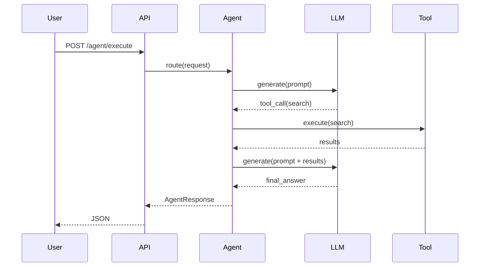

# Documentation Domain - Anti-Patterns

## Overview

This document outlines documentation anti-patterns to avoid in LLM/agentic systems. Each anti-pattern includes a bad example, a good example, an explanation of why it is harmful, and remediation steps.

---

## Table of Contents

1. [Outdated Documentation](#1-outdated-documentation)
2. [No Prompt Documentation](#2-no-prompt-documentation)
3. [Missing Examples](#3-missing-examples)
4. [Incomplete API Documentation](#4-incomplete-api-documentation)
5. [No Versioning](#5-no-versioning)
6. [Monolithic Documentation](#6-monolithic-documentation)
7. [No Runbooks](#7-no-runbooks)
8. [Ignoring Documentation Debt](#8-ignoring-documentation-debt)
9. [User-Blame Documentation](#9-user-blame-documentation)
10. [No Audience Segmentation](#10-no-audience-segmentation)
11. [Missing Schema Validation Docs](#11-missing-schema-validation-docs)
12. [No Diagrams](#12-no-diagrams)
13. [No Troubleshooting Section](#13-no-troubleshooting-section)
14. [Missing Limitations](#14-missing-limitations)
15. [Inconsistent Terminology](#15-inconsistent-terminology)
16. [No Security Documentation](#16-no-security-documentation)
17. [Poor Error Message Documentation](#17-poor-error-message-documentation)
18. [No Index or Search](#18-no-index-or-search)
19. [Documentation Without Code Sync](#19-documentation-without-code-sync)
20. [No Feedback Mechanism](#20-no-feedback-mechanism)
21. [No Maintenance Schedule](#21-no-maintenance-schedule)
22. [Undocumented Assumptions](#22-undocumented-assumptions)
23. [No Quick-Start Guide](#23-no-quick-start-guide)
24. [No Troubleshooting Section](#24-no-troubleshooting-section)
25. [No Change Log](#25-no-change-log)
26. [No Ownership](#26-no-ownership)
27. [No Accessibility Consideration](#27-no-accessibility-consideration)
28. [Unreadable Dense Text](#28-unreadable-dense-text)
29. [Inconsistent Style](#29-inconsistent-style)
30. [Missing Prerequisites](#30-missing-prerequisites)
31. [Placeholder Content](#31-placeholder-content)
32. [Outdated Screenshots](#32-outdated-screenshots)
33. [Copy-Paste Without Context](#33-copy-paste-without-context)
34. [Over-Promising Capabilities](#34-over-promising-capabilities)
35. [Ignoring International Users](#35-ignoring-international-users)
36. [Over-Complicating Simple Tasks](#36-over-complicating-simple-tasks)
37. [Missing Contact Information](#37-missing-contact-information)
38. [No deprecation notices](#38-no-deprecation-notices)
39. [Mixing Concerns](#39-mixing-concerns)
40. [No Code of Conduct](#40-no-code-of-conduct)

---

## 1. Outdated Documentation

### Why It Matters

Documentation that does not match current implementation causes:
- Wasted developer time debugging non-existent issues.
- Incorrect integrations.
- Loss of trust in documentation.

### Bad Example

```markdown
# Bad - Documentation drifts from implementation

## Description
Returns user profile

## Parameters
- user_id (required)

# But the code now requires user_id AND session_id
```

```python
# Bad: Code changed without updating docs
# Endpoint now requires session_id but docs still say only user_id
@app.post("/user/profile")
def get_user(user_id: str, session_id: str):  # Added session_id
    ...
```

### Good Example

```markdown
# Good - Keep in sync

## Description
Returns user profile for a given session.

## Parameters
- user_id (required): Unique user identifier.
- session_id (required): Active session token or UUID.

## Last Verified
2024-01-15 by @username
```

```python
# Good: Docstring matches implementation
@app.post("/user/profile")
def get_user(user_id: str, session_id: str):
    """
    Get user profile for session.

    Args:
        user_id: Unique user identifier.
        session_id: Active session token or UUID.

    Returns:
        User profile as JSON.
    """
```

### Remediation

1. Automate doc generation from code where possible.
2. Add CI check that compares OpenAPI spec to docs.
3. Set "Last Verified" date and review schedule.
4. Include doc updates in every code change PR checklist.

---

## 2. No Prompt Documentation

### Why It Matters

Prompts are critical to agent behavior. Undocumented prompts mean:
- No way to audit or reproduce behavior.
- Unknown failure modes.
- Difficult A/B testing.
- Compliance gaps.

### Bad Example

```python
# Bad - Undocumented prompts
def get_prompt():
    return "You are helpful. Answer questions."

def get_support_prompt():
    return "You are a customer service agent."

# No version, no model info, no examples, no constraints
```

### Good Example

```python
# Good - Document prompts with prompt cards
def get_support_prompt():
    """
    Customer support prompt.

    Version: 2.1.0
    Model: gpt-4-turbo
    Temperature: 0.3
    Max tokens: 2048

    Purpose: Answer product questions using the search tool.
    Limitations:
    - Pre-2024 data only
    - US locations only
    - Cannot process refunds

    Tools: search(query), lookup_order(id), escalate(reason)

    Examples:
    User: Do you have Widget X?
    Agent: Let me check. [tool: search("Widget X")] Yes, we have 42 in stock.
    """
    return """You are a helpful customer service agent for Acme Corp.
Use the search tool for product questions.
If unsure, say "Let me look that up."
Never discuss competitor pricing.
"""
```

### Remediation

1. Create prompt card template.
2. Store prompts in version control with metadata.
3. Require prompt card updates in same PR as prompt changes.
4. Include prompt cards in architecture docs.

---

## 3. Missing Examples

### Why It Matters

Examples bridge the gap between theory and practice. Without them:
- Developers guess at API usage.
- Integration time increases.
- Higher chance of incorrect usage.

### Bad Example

```markdown
# Bad
# Agent API Reference

## POST /agent/execute

Execute a task.
```

### Good Example

```markdown
# Good
# Agent API Reference

## POST /agent/execute

Execute a task through the agent orchestrator.

### Example Request

```json
{
  "task": "Summarize this text",
  "session_id": "abc123",
  "max_tokens": 500
}
```

### Example Response

```json
{
  "response": "Summary text...",
  "tools_used": ["search"],
  "tokens_used": 42,
  "metadata": {
    "model": "gpt-4-turbo",
    "latency_ms": 1234
  }
}
```

### Error Response

```json
{
  "error": "E002",
  "details": "Rate limit exceeded",
  "request_id": "req-abc123"
}
```
```

### Remediation

1. Require at least one example per endpoint in PR checklist.
2. Test examples as part of CI.
3. Use example-driven development (write example before implementation).

```python
class ExampleEnforcer:
    def validate(self, doc_path: Path) -> bool:
        content = doc_path.read_text()
        endpoints = re.findall(r'## (POST|GET|PUT|DELETE) (\S+)', content)
        for method, path in endpoints:
            if not re.search(r'```json', content):
                return False
        return True
```

---

## 4. Incomplete API Documentation

### Why It Matters

Missing API details lead to:
- Incorrect integrations.
- Difficulty debugging.
- Support burden.

### Bad Example

```python
# Bad - Missing fields
class AgentRequest(BaseModel):
    prompt: str
    session_id: str

# No descriptions, no context, no parameters
```

### Good Example

```python
# Good - Full schema
class AgentRequest(BaseModel):
    """
    Request to execute an agent task.

    Attributes:
        task: User input or task description (max 50000 chars).
        session_id: Unique session identifier (UUID format).
        context: Optional runtime context (department, user tier).
        parameters: Optional model overrides (temperature, max_tokens).

    Raises:
        ValidationError: If required fields missing or invalid.
    """
    task: str = Field(..., description="User prompt text", min_length=1, max_length=50000)
    session_id: str = Field(..., description="Session ID", format="uuid")
    context: dict = Field(default_factory=dict, description="Runtime context")
    parameters: dict = Field(default_factory=dict, description="Model parameters")
```

### Remediation

1. Use Pydantic or similar with field descriptions.
2. Generate OpenAPI spec from models.
3. Review all schemas during API design.

---

## 5. No Versioning

### Why It Matters

Without versioning:
- Cannot reproduce past behavior.
- No way to track prompt or API changes.
- Migration is guesswork.
- Audits fail.

### Bad Example

```markdown
# Bad - No version tracking
Prompt v1: "You are helpful."
Prompt v2: "You are helpful. Use tools when needed."
Prompt v3: "You are helpful. Use tools. Don't mention competitors."

# Which version is in production right now?
```

### Good Example

```markdown
# Good - Version all prompts
## Customer Service Prompt

**Version:** 2.1.0
**Released:** 2024-01-15
**Deprecated:** None
**Replacement:** None
**Model:** gpt-4-turbo
**Temperature:** 0.3

```
You are a helpful customer service agent...
```

## Changelog

- 2024-01-15: Added `escalate` tool instructions (v2.1.0)
- 2024-01-01: Migrated to GPT-4 (v2.0.0)
- 2023-12-01: Added multi-language (v1.5.0)
```

### Remediation

1. Use semantic versioning for prompts.
2. Maintain changelog per prompt family.
3. Include version in prompt metadata and response headers.

---

## 6. Monolithic Documentation

### Why It Matters

Single large files become:
- Hard to navigate.
- Hard to maintain.
- Merge conflicts.
- Discouraging to read.

### Bad Example

```markdown
# Bad
# All Documentation (5000 lines)

## API Reference
## Deployment Guide
## Troubleshooting
## Training Materials
## Compliance
...

# No structure, no logical grouping
```

### Good Example

```
docs/
├── README.md
├── api/
│   ├── agents.md
│   ├── tools.md
│   └── openapi.yaml
├── guides/
│   ├── getting-started.md
│   ├── deployment.md
│   └── troubleshooting.md
├── operations/
│   ├── runbooks/
│   │   ├── high-error-rate.md
│   │   └── model-failure.md
│   └── slo.md
├── prompts/
│   └── customer-support.md
└── compliance/
    └── gdpr.md
```

### Remediation

1. Split docs by audience and topic.
2. Use consistent directory naming.
3. Maintain `README.md` at each level with index.

---

## 7. No Runbooks

### Why It Matters

Without runbooks:
- Incident response is ad-hoc.
- Each incident is re-investigated from scratch.
- Higher MTTR (Mean Time To Recovery).
- Higher stress on on-call engineers.

### Bad Example

```python
# Bad - No operational docs
def deploy():
    # How do we deploy again?
    # What are the steps?
    # Who to call if it fails?
    run_commands()
```

### Good Example

```markdown
# Good - Documented procedure
# Runbook: Agent Deployment

## Pre-Deployment
- [ ] Tests pass
- [ ] Docs updated
- [ ] Prompt changes reviewed

## Steps
1. Build Docker image
2. Push to registry
3. Update deployment
4. Verify health checks
5. Monitor for 15 minutes

## Rollback
kubectl rollout undo deployment/agent

## Escalation
After 15 minutes: @engineering-manager
```

### Remediation

1. Create runbook for every P1/P2 alert.
2. Link runbooks from alert descriptions.
3. Test runbooks quarterly in game days.

---

## 8. Ignoring Documentation Debt

### Why It Matters

Accumulating doc debt leads to:
- Complete documentation becoming useless.
- Team members unable to onboard.
- Support burden increasing.

### Bad Example

```python
# Bad
# TODO: Document this later
def complex_algorithm():
    ...

# TODO: Add examples
# TODO: Update for v2
```

### Good Example

```python
# Good
# Track documentation debt explicitly
class DocDebtTracker:
    def __init__(self):
        self.items = []

    def register(self, doc_path: str, reason: str, ticket: str):
        self.items.append({
            "doc": doc_path,
            "reason": reason,
            "ticket": ticket,
            "priority": self._assess_priority(reason),
            "created": datetime.utcnow().isoformat()
        })

    def _assess_priority(self, reason: str) -> str:
        if "security" in reason.lower():
            return "P0"
        elif "breaking" in reason.lower():
            return "P1"
        return "P2"

# Also track in docs/doku debt.md
```

### Remediation

1. Track doc debt in issue tracker.
2. Include doc debt check in sprint planning.
3. Allocate time each sprint for debt repayment.

---

## 9. User-Blame Documentation

### Why It Matters

User-blame documentation:
- Destroys user trust.
- Increases support burden.
- Reflects poorly on the team.
- Prevents root cause analysis.

### Bad Example

```markdown
# Bad
## Common Errors

User enters wrong password -> account locked.
User tries to use old API -> gets 404.
User doesn't read README -> wastes support time.
```

### Good Example

```markdown
# Good
## Common Issues

### Account Lockout

If you see "Account locked":
1. Wait 15 minutes for automatic unlock, OR
2. Use the self-service unlock link: https://...
3. Check that Caps Lock is off during password entry.
4. Use the password reset flow if needed.

**Why this happens:** Account locks after 5 failed attempts to prevent brute force attacks.

### API 404 Errors

If you receive a 404:
1. Verify the endpoint URL matches the current API version.
2. Check that you are using `POST /v1/agent/execute` not the deprecated `POST /execute`.
3. See [Migration Guide](./migration.md) for version changes.
```

### Remediation

1. Rewrite docs from user's perspective.
2. Avoid phrases like "user error" or "you should have".
3. Always answer "what can I do?" not "what did you do wrong?"

---

## 10. No Audience Segmentation

### Why It Matters

Different users need different information:
- Developers need precise API reference.
- Operators need runbooks and metrics.
- End users need plain-language guides.
- Compliance needs audit evidence.

### Bad Example

```markdown
# Bad
# Agent Documentation

(One giant page for everyone)

## API Reference
## Deployment
## Troubleshooting
## FAQ
## Compliance
...

# Overwhelming for everyone
```

### Good Example

```markdown
# Good
# Agent Documentation

## For End Users
- [Using the Agent](./end-users/using.md)
- [FAQ](./end-users/faq.md)
- [Limitations](./end-users/limitations.md)

## For Developers
- [API Reference](./developers/api.md)
- [SDK Guide](./developers/sdk.md)
- [Architecture](./developers/architecture.md)

## For Operators
- [Deployment](./operators/deploy.md)
- [Monitoring](./operators/monitoring.md)
- [Runbooks](./operators/runbooks.md)

## For Compliance
- [Data Processing](./compliance/dpa.md)
- [Audit Evidence](./compliance/soc2.md)
```

### Remediation

1. Create separate documentation paths per audience.
2. Add "For [X]" labels to each section.
3. Provide dashboard/landing page for each audience.

---

## 11. Missing Schema Validation Docs

### Why It Matters

Without documented validation rules:
- Users send invalid data repeatedly.
- Integration errors are confusing.
- Debugging takes longer.
- Support tickets increase.

### Bad Example

```python
# Bad - No documented validation
def validate_input(data):
    if "field" not in data:
        raise ValueError()

# What is "field"?
# What format does it expect?
# What is the error message?
```

### Good Example

```python
# Good - Full schema documentation
INPUT_SCHEMA = {
    "type": "object",
    "required": ["user_id", "query"],
    "properties": {
        "user_id": {
            "type": "string",
            "format": "uuid",
            "description": "UUID of the authenticated user.",
            "minLength": 36,
            "maxLength": 36
        },
        "query": {
            "type": "string",
            "minLength": 1,
            "maxLength": 5000,
            "description": "Natural language query to process.",
            "pattern": "^[a-zA-Z0-9 .,!?'-]+$"
        },
        "context": {
            "type": "object",
            "description": "Optional additional context.",
            "additionalProperties": True
        }
    },
    "additionalProperties": False
}

class InputValidator:
    """Validate input against JSON schema.

    Raises:
        ValidationError: If input does not match schema.
    """

    @classmethod
    def validate(cls, data: dict) -> dict:
        try:
            jsonschema.validate(instance=data, schema=INPUT_SCHEMA)
            return data
        except jsonschema.ValidationError as e:
            raise ValidationError(f"Invalid input: {e.message}")
```

### Remediation

1. Define schemas in JSON Schema or equivalent.
2. Document schema in API reference.
3. Return validation errors from API with field-level details.

---

## 12. No Diagrams

### Why It Matters

Complex systems are hard to understand without visual representation:
- Data flows are invisible.
- Component relationships unclear.
- Onboarding takes longer.
- More support requests.

### Bad Example

```markdown
# Bad - Text only
Agent calls LLM, which returns tool call to search,
then agent calls search tool, gets results,
then LLM generates final answer.
```

### Good Example



### Remediation

1. Add diagrams to docs site rendering (Mermaid, PlantUML).
2. Include one diagram per major section.
3. Store diagram source in version control.

---

## 13. No Troubleshooting Section

### Why It Matters

Every step can fail. Without troubleshooting:
- Users are stuck when things go wrong.
- Support burden increases.
- On-call engineers face avoidable escalations.

### Bad Example

```markdown
# Bad
Deploy the agent using kubectl apply.
Install dependencies with pip install.
```

### Good Example

```markdown
# Good
## Deployment

Deploy the agent:

```bash
kubectl apply -f deployment.yaml
```

## Verification

Verify the deployment:

```bash
kubectl get pods -l app=agent
kubectl rollout status deployment/agent
```

## Troubleshooting

### Pod not starting

**Symptoms:** `CrashLoopBackOff`

**Diagnosis:**

```bash
kubectl logs <pod-name> --previous
kubectl describe pod <pod-name>
```

**Common causes:**
- Image pull failure: check registry credentials.
- Crash in application: check logs for stack trace.
- Resource limits too low: increase memory/CPU.

### Health check failing

**Symptoms:** Readiness probe failed

**Fix:**

1. Verify `/health` endpoint returns 200:
```bash
kubectl exec <pod-name> -- curl -f http://localhost:8000/health
```

2. Check dependency connectivity:
```bash
kubectl exec <pod-name> -- curl -f http://database:5432
```
```

### Remediation

1. Add troubleshooting section to every operational guide.
2. Include diagnostic commands.
3. Test troubleshooting steps during game days.

---

## 14. Missing Limitations

### Why It Matters

Overstating capabilities leads to:
- User frustration.
- Support burden.
- Compliance issues.
- Reputational damage.

### Bad Example

```markdown
# Bad
# Weather Agent

Answers weather questions for any location worldwide.
```

### Good Example

```markdown
# Good
# Weather Agent

## Capabilities

Answers weather questions using the OpenWeatherMap API.

## Limitations

- **Geographic coverage:** United States only.
- **Data freshness:** 1-3 hours delayed.
- **Rate limits:** 100 requests/day per user.
- **Data source:** OpenWeatherMap (may have its own limitations).
- **No extreme weather alerts:** For critical decisions, use official sources.
```

### Remediation

1. Add Limitations section to every product/feature page.
2. Include data cutoffs, geographic restrictions, rate limits.
3. Review limitations during design, not after launch.

---

## 15. Inconsistent Terminology

### Why It Matters

Inconsistent terminology:
- Confuses users.
- Makes search difficult.
- Breaks cross-references.
- Undermines credibility.

### Bad Example

```markdown
# Bad - Same concept, different names
# In agents.md
agent.execute_task()

# In tools.md
agent.run()

# In deployment.md
agent.invoke()
```

### Good Example

```markdown
# Good - Consistent terminology
# All docs use the same naming

## execute_task
Execute an agent task with the given prompt.

See [API Reference](../api/agent.md#execute_task)
```

```python
# Enforce via linting
TERMINOLOGY = {
    "execute_task": ["run", "invoke", "process", "execute"],
    "tool": ["function", "action", "capability"]
}

def check_terminology(content: str) -> list:
    violations = []
    for canonical, aliases in TERMINOLOGY.items():
        for alias in aliases:
            if f"agent.{alias}" in content:
                violations.append(f"Use agent.{canonical} instead of agent.{alias}")
    return violations
```

### Remediation

1. Create and enforce a glossary.
2. Use linter to flag non-canonical terms.
3. Use code review to ensure consistency.

---

## 16. No Security Documentation

### Why It Matters

Missing security documentation:
- Leaves users vulnerable to attacks.
- Creates compliance gaps.
- Results in security incidents.

### Bad Example

```markdown
# Bad
# Agent API

Authenticate with API key.
```

### Good Example

```markdown
# Good
# Agent API - Security

## Authentication

All requests require a Bearer token:

```
Authorization: Bearer <token>
```

Tokens expire after 1 hour. Refresh via `POST /auth/refresh`.

## Authorization

- Standard tier: Read access to own sessions.
- Enterprise tier: Read access to team sessions.
- Admin tier: Full access.

## Rate Limiting

- Standard: 100 RPM
- Enterprise: 1000 RPM
- Admin: Unlimited

## Security Considerations

- Never expose API keys in client-side code.
- Use HTTPS only (no HTTP).
- Rotate tokens every 90 days.
- Store secrets in environment variables or secrets manager.

## Reporting Vulnerabilities

Email security@example.com. Do not open public issues.
```

### Remediation

1. Add security section to every API doc.
2. Define security classification.
3. Link to security policy and runbook.

---

## 17. Poor Error Message Documentation

### Why It Matters

Without clear error messages:
- Users cannot self-serve.
- Support burden increases.
- Debugging takes longer.

### Bad Example

```python
# Bad - Generic error messages
errors = {
    "E001": "Error",
    "E002": "Error",
    "E003": "Something went wrong"
}
```

### Good Example

```python
# Good - Specific, actionable error messages
ERROR_CODES = {
    "E001": {
        "http_status": 400,
        "message": "Invalid request body",
        "resolution": "Check request schema and ensure required fields are present."
    },
    "E002": {
        "http_status": 429,
        "message": "Rate limit exceeded",
        "resolution": "Implement exponential backoff and retry after Retry-After seconds."
    },
    "E003": {
        "http_status": 500,
        "message": "LLM provider unavailable",
        "resolution": "Enable fallback model via MODEL_FALLBACK=true or retry later."
    }
}
```

```markdown
# Error Reference

| Code | HTTP | Meaning | Resolution |
|------|------|---------|------------|
| E001 | 400 | Invalid request body | Check request schema |
| E002 | 429 | Rate limit exceeded | Backoff and retry |
| E003 | 500 | LLM provider unavailable | Use fallback model |
```

### Remediation

1. Maintain error code registry.
2. Include error reference in API docs.
3. Return error details from API responses.

---

## 18. No Index or Search

### Why It Matters

Without navigation:
- Users cannot find information.
- Documentation is not discoverable.
- Time-to-success is high.
- Support burden increases.

### Bad Example

```markdown
# Bad - Large docs without navigation
# Agent System Documentation

[1000 lines of content with no table of contents]

...

# The end. No links, no index.
```

### Good Example

```markdown
# Good - With index
# Documentation Index

## Getting Started
- [Installation](./setup/install.md)
- [First Agent](./getting-started/first-agent.md)
- [Configuration](./getting-started/configuration.md)

## Core Concepts
- [LLM Integration](./concepts/llm.md)
- [Tool Use](./concepts/tools.md)
- [Memory](./concepts/memory.md)

## Guides
- [Building Agents](./guides/building.md)
- [Deployment](./guides/deployment.md)
- [Monitoring](./guides/monitoring.md)
```

### Remediation

1. Add index/README to every documentation section.
2. Implement full-text search.
3. Add related content links to each page.

---

## 19. Documentation Without Code Sync

### Why It Matters

Documentation that does not reflect code:
- Misleads users.
- Creates integration failures.
- Erodes trust in documentation.

### Bad Example

```python
# Bad - Code and docs are separate
# docs/api.md says: POST /agent/process
# code has: POST /agent/execute
@app.post("/agent/execute", methods=["POST"])
def execute_agent():
    pass
```

### Good Example

```python
# Good - Generate docs from code
@app.post("/agent/execute", methods=["POST"])
def execute_agent():
    """
    Execute an agent task.

    Auto-generated from source.
    See: https://docs.example.com/api/agent/execute
    """
    pass
```

```yaml
# Good - OpenAPI spec generates docs
paths:
  /agent/execute:
    post:
      summary: Execute agent task
      # This is the source of truth
```

### Remediation

1. Generate API docs from code or OpenAPI spec.
2. Add doc examples that test against actual API.
3. Use doc-driven development (write docs/spec first).

---

## 20. No Feedback Mechanism

### Why It Matters

Without feedback:
- Authors do not know if docs are helpful.
- Bad docs persist indefinitely.
- User pain points are invisible.

### Bad Example

```markdown
# Bad
# Documentation

[Long document with no feedback mechanism]
```

### Good Example

```markdown
# Good
# Documentation

## Feedback

Was this page helpful?

- [Yes] [No]
- [Report an issue](https://github.com/org/docs/issues/new)
- Chat: #docs-feedback on Slack

Your feedback helps us improve.
```

### Remediation

1. Add feedback widget to every page.
2. Review feedback weekly.
3. Acknowledge and act on feedback.

---

## 21. No Maintenance Schedule

### Why It Matters

Documentation written once and never updated becomes:
- Completely wrong.
- A liability.
- Dangerous during incidents.

### Bad Example

```markdown
# Bad - No review schedule
# Last updated: never

## API Reference
[Written 2 years ago, API has changed significantly]
```

### Good Example

```markdown
# Good - With review schedule
# API Reference

## Maintenance
- Owner: @team-api
- Review cycle: Every release
- Last verified: 2024-01-15
- Next review: 2024-02-01

## Review Process
See [Governance Policy](../governance.md)
```

```python
class DocMaintenanceSchedule:
    def __init__(self):
        self.schedule = {
            "api_reference": timedelta(days=30),
            "runbooks": timedelta(days=90),
            "architecture": timedelta(days=180),
            "getting_started": timedelta(days=365),
            "compliance": timedelta(days=365)
        }

    def get_next_review(self, doc_type: str) -> datetime:
        interval = self.schedule.get(doc_type, timedelta(days=90))
        last = self._get_last_review(doc_type)
        if not last:
            return datetime.now()
        return last + interval

    def is_due(self, doc_type: str) -> bool:
        return datetime.now() >= self.get_next_review(doc_type)
```

### Remediation

1. Assign ownership to every document.
2. Set review intervals by doc type.
3. Automate stale doc alerts.

---

## 22. Undocumented Assumptions

### Why It Matters

Hidden assumptions lead to:
- Surprises for users.
- Integration failures.
- Inability to generalize.
- Compliance issues.

### Bad Example

```python
# Bad - Assumptions hidden in code
def calculate_cost(tokens: int) -> float:
    # Assumes GPT-4 pricing
    return tokens * 0.00003

# Assumes:
# - GPT-4 model
# - US dollars
# - Average 50/50 input/output split
# - No discount tiers
```

### Good Example

```python
# Good - Assumptions documented
def calculate_cost(
    tokens: int,
    model: str = "gpt-4",
    input_ratio: float = 0.5
) -> float:
    """Calculate LLM cost based on token usage.

    Pricing (per 1K tokens):
    - gpt-4: $0.03 input / $0.06 output
    - gpt-3.5-turbo: $0.0015 input / $0.002 output
    - claude-3: $0.015 input / $0.075 output

    Assumptions:
    - Assumes average input/output split unless specified.
    - Does not include batch discount tiers.
    - Does not include cost of tool calls.

    Args:
        tokens: Total token count.
        model: Model identifier.
        input_ratio: Fraction of tokens that are input (0.0 to 1.0).

    Returns:
        Estimated cost in US dollars.
    """
    prices = {
        "gpt-4": {"input": 0.00003, "output": 0.00006},
        "gpt-3.5-turbo": {"input": 0.0000015, "output": 0.000002},
        "claude-3": {"input": 0.000015, "output": 0.000075},
    }
    price = prices.get(model, prices["gpt-4"])
    input_cost = tokens * input_ratio * price["input"]
    output_cost = tokens * (1 - input_ratio) * price["output"]
    return input_cost + output_cost
```

### Remediation

1. Add Assumptions section to docs template.
2. Document environment, locale, model dependencies.
3. Review assumptions with cross-functional team.

---

## 23. No Quick-Start Guide

### Why It Matters

Without a quick start:
- New users face steep learning curve.
- Adoption slows.
- Users abandon before trying.

### Bad Example

```markdown
# Bad - No quick start
# Agent Framework

This framework provides agent orchestration.

## Installation
pip install agent-framework

## Architecture
[Long section on architecture]

## Configuration
[Long section on configuration]

# User must read 20 pages before writing one line of code
```

### Good Example

```markdown
# Good
# Agent Framework

## Quick Start

Get an agent running in 5 minutes:

```bash
pip install agent-framework
export OPENAI_API_KEY=sk-...
python -c "from agent import Agent; print(Agent().run('Hello'))"
```

For detailed docs, see [Full Documentation](./full.md).

## Features
- LLM orchestration
- Tool use
- Memory management
- Streaming responses
```

### Remediation

1. Lead every README with a 5-minute quick start.
2. Show working code in first example.
3. Link to detailed docs, don't inline everything.

---

## 24. No Troubleshooting Section

### Why It Matters

Every operation can fail. Without troubleshooting:
- Users are stuck.
- Support burden increases.
- On-call stress increases.

### Bad Example

```markdown
# Bad
Deploy the agent using kubectl apply.
Configure the API key in .env.
Run the agent with agent run.
```

### Good Example

```markdown
# Good
## Deployment

Deploy the agent:

```bash
kubectl apply -f deployment.yaml
```

## Verification

Verify the deployment:

```bash
kubectl get pods -l app=agent
```

## Troubleshooting

### Pod CrashLoopBackOff

**Check logs:**

```bash
kubectl logs <pod-name> --previous
```

**Common causes:**
- Image pull failure: check registry credentials.
- Application crash: check stack trace in logs.
- Resource limits: increase memory/CPU.

### Health check failing

**Verify health endpoint:**

```bash
kubectl exec <pod-name> -- curl -f http://localhost:8000/health
```

**Check logs for startup errors:**
```bash
kubectl logs <pod-name> | grep ERROR
```
```

### Remediation

1. Add troubleshooting to every operational doc.
2. Include diagnostic commands.
3. Include common causes and fixes.

---

## 25. No Change Log

### Why It Matters

Without changelog:
- Users cannot track changes.
- Breaking changes cause silent failures.
- Rollback decisions are guesswork.

### Bad Example

```markdown
# Bad
# Agent Documentation
Version 2.0 (current)

# No history, no changelog, no details
```

### Good Example

```markdown
# Good
# Agent Documentation

## Version History

| Version | Date | Changes |
|---------|------|---------|
| 2.0 | 2024-01-15 | Added streaming, changed auth |
| 1.0 | 2023-06-01 | Initial release |

## Changelog

### [2.0.0] - 2024-01-15

#### Added
- Streaming responses (WebSocket)
- Batch execution support
- New runbooks for model failure

#### Changed
- Renamed `/execute` to `/agent/execute`
- Updated Python SDK to use `httpx`

#### Removed
- Legacy `X-API-Key` authentication

## Migration Guide

See [MIGRATION.md](./MIGRATION.md)
```

### Remediation

1. Start a CHANGELOG.md following Keep a Changelog format.
2. Add changelog entry for every PR.
3. Automate changelog generation from git history.

---

## 26. No Ownership

### Why It Matters

Without ownership:
- No one is accountable for accuracy.
- Docs rot.
- Updates are delayed.

### Bad Example

```markdown
# Bad
# Documentation owned by everyone = owned by no one
```

### Good Example

```markdown
# Good
# Documentation Ownership

| Document | Owner | Review Date |
|----------|-------|-------------|
| API Reference | @team-api | 2024-04-15 |
| Runbooks | @team-ops | 2024-04-15 |
| Architecture | @team-arch | 2024-07-15 |
| Getting Started | @team-docs | 2025-01-15 |
```

```python
class DocOwnershipRegistry:
    def __init__(self):
        self.registry = {}

    def register(self, path: str, owner: str, review_days: int = 90):
        self.registry[path] = {
            "owner": owner,
            "review_days": review_days,
            "last_reviewed": datetime.utcnow().isoformat()
        }

    def get_owner(self, path: str) -> str:
        return self.registry.get(path, {}).get("owner", "unassigned")

    def get_stale(self, threshold_days: int = 90) -> list:
        stale = []
        cutoff = datetime.utcnow() - timedelta(days=threshold_days)
        for path, meta in self.registry.items():
            last = datetime.fromisoformat(meta["last_reviewed"])
            if last < cutoff:
                stale.append(path)
        return stale
```

### Remediation

1. Assign owner to every document.
2. Include ownership in doc metadata.
3. Set up automated reminders for reviews.

---

## 27. No Accessibility Consideration

### Why It Matters

Inaccessible documentation:
- Excludes users with disabilities.
- Fails legal requirements (WCAG, ADA).
- Reduces audience reach.

### Bad Example

```html
<!-- Bad - No alt text -->


<!-- Bad - Poor contrast -->
<body style="color: #999; background: #fff;">
```

### Good Example

```html
<!-- Good -->


<!-- Good - WCAG AA contrast -->
<body style="color: #1a1a1a; background: #ffffff;">
```

### Remediation

1. Add alt text to all images.
2. Ensure 4.5:1 contrast ratio.
3. Use semantic HTML.
4. Test with screen reader.

---

## 28. Unreadable Dense Text

### Why It Matters

Dense walls of text:
- Reduce information absorption.
- Increase time-to-find.
- Discourage reading.

### Bad Example

```markdown
# Bad
The agent orchestrator component is responsible for managing the lifecycle
of agent execution requests which involves loading session memory from the
configured data store constructing the LLM prompt by combining the user task
with retrieved context and available tool definitions then invoking the LLM
with the constructed prompt handling any tool calls returned by the LLM by
executing them through the tool registry and collecting results then generating
a final response based on the tool results before returning to the user.
```

### Good Example

```markdown
# Good
# Agent Orchestrator

The agent orchestrator manages agent execution lifecycle:

1. **Load session memory** from the data store.
2. **Build prompt** by combining user task with context and tool definitions.
3. **Call LLM** with the constructed prompt.
4. **Execute tools** if LLM requests tool calls.
5. **Generate response** from tool results.
6. **Return** final response to user.
```

### Remediation

1. Use short paragraphs (3-4 sentences).
2. Use lists for sequences.
3. Add diagrams for complex flows.

---

## 29. Inconsistent Style

### Why It Matters

Inconsistent style:
- Looks unprofessional.
- Reduces readability.
- Confuses users about system state.

### Bad Example

```markdown
# Bad - Mixed styles

## Step 1: Setup
setup environment

Step 2: Configuration
Edit config.yaml

1. Run the agent
-> agent.run()
```

### Good Example - Style Guide Compliant

```markdown
# Good

## Setup

Configure your environment variables:

```bash
export OPENAI_API_KEY=sk-...
export MODEL_NAME=gpt-4-turbo
```

## Configuration

Edit `config.yaml` to set your preferred model:

```yaml
model:
  name: gpt-4-turbo
  temperature: 0.3
```

## Execution

Run the agent:

```python
agent.run("Hello")
```
```

### Remediation

1. Create and enforce a style guide.
2. Use `markdownlint` and `vale` for enforcement.
3. Define heading styles, list formats, code conventions.

---

## 30. Missing Prerequisites

### Why It Matters

Without prerequisites:
- Users waste time discovering requirements.
- Support burden increases.
- Users face avoidable errors.

### Bad Example

```markdown
# Bad
## Deploy to Production

```bash
kubectl apply -f deployment.yaml
```

# No mention of required tools, credentials, access, or environment
```

### Good Example

```markdown
# Good
## Deploy to Production

### Prerequisites

- `kubectl` configured for production cluster
- Docker Hub access with push permissions
- AWS credentials configured
- Terraform 1.5+ installed
- Admin access to GitHub repository

### Steps

1. Build and push image:
```bash
docker build -t agent:v2.1.0 ./src
docker push registry.example.com/agent:v2.1.0
```

2. Apply Kubernetes manifests:
```bash
kubectl set image deployment/agent agent=registry.example.com/agent:v2.1.0
kubectl rollout status deployment/agent
```

3. Verify deployment:
```bash
kubectl get pods -l app=agent
curl -f https://api.example.com/health
```
```

### Remediation

1. Always include Prerequisites section.
2. List tools, credentials, access levels.
3. Provide setup links for prerequisites.

---

## 31. Placeholder Content

### Why It Matters

Placeholders cause:
- User confusion.
- Perceived lack of professionalism.
- Missing content being missed.

### Bad Example

```markdown
# Bad
## Authentication

TODO: Add auth docs

## Rate Limits

TBD

## Examples

Lorem ipsum dolor sit amet...

## Contact

INSERT CONTACT HERE
```

## Good Example

```markdown
# Good
## Authentication

All requests require a Bearer token:
[Complete auth docs here]

## Rate Limits

Rate limits vary by tier:
- Standard: 100 RPM
- Enterprise: 1000 RPM

## Examples

See [Examples Gallery](./examples.md)

## Contact

- Support: support@example.com
- Slack: #agent-platform
- GitHub: https://github.com/org/agent/issues
```

### Remediation

1. Prohibit placeholder text in PRs.
2. Add CI check for placeholder patterns.
3. Use "Coming soon" with explicit timeline instead of empty sections.

```python
class PlaceholderChecker:
    PLACEHOLDERS = ["TODO", "FIXME", "TBD", "LINKME", "INSERT", "PLACEHOLDER",
                    "Lorem ipsum", "your text here", "your code here"]

    def check(self, content: str) -> list:
        violations = []
        for placeholder in self.PLACEHOLDERS:
            if placeholder.lower() in content.lower():
                violations.append(f"Found placeholder: {placeholder}")
        return violations
```

---

## 32. Outdated Screenshots

### Why It Matters

Outdated screenshots:
- Confuse users (UI doesn't match).
- Misrepresent current state.
- Reduce trust in documentation.

### Bad Example

```markdown
# Bad
![Login screen showing username/password fields]
![Old UI from 2 years ago]
# Actual UI now uses SSO
```

### Good Example

```markdown
# Good

*Figure: Login screen as of 2024-01-15. Use SSO if available.*

# Process for keeping screenshots current:
1. Take new screenshot when UI changes.
2. Name with version: `login-v2.png`, `dashboard-v3.png`.
3. Update in same PR as UI change.
4. Delete old screenshots.
```

### Remediation

1. Version screenshots with UI versions.
2. Include screenshot update in UI change checklist.
3. Automate screenshot testing if possible.

---

## 33. Copy-Paste Without Context

### Why It Matters

Copied content without context:
- Misleads users about applicability.
- Creates broken workflows.
- Hides the "why".

### Bad Example

```markdown
# Bad - Copied from different system
## Deploy to GCP

```bash
gcloud app deploy
```

# This is for GCP App Engine. Our system uses Kubernetes on AWS.
```

### Good Example

```markdown
# Good
## Deploy to Production (AWS EKS)

Deploy the agent to the Kubernetes cluster on AWS.

### Prerequisites

- kubectl configured for EKS cluster
- Docker image pushed to registry

### Steps

```bash
kubectl apply -f deployment.yaml
kubectl rollout status deployment/agent
```

## Verification

```bash
kubectl get pods -l app=agent
```
```

### Remediation

1. Use context-specific templates.
2. Review copied content for applicability.
3. Test all examples in the target environment.

---

## 34. Over-Promising Capabilities

### Why It Matters

Over-promising:
- Sets unrealistic expectations.
- Leads to disappointment.
- Creates support burden.
- Damages reputation.

### Bad Example

```markdown
# Bad
# SuperAgent

Our agent can:
- Answer any question accurately
- Process any file type
- Work without internet
- Handle unlimited concurrent users
```

### Good Example

```markdown
# Good
# Agent

## Capabilities

- Answer questions based on training data and integrated tools.
- Process text, PDF, and CSV files up to 10MB.
- Use tools for real-time data (requires internet for tool calls).
- Handle 100+ concurrent users on standard tier.

## Limitations

- Knowledge cutoff: 2024-04-01
- Maximum file size: 10MB
- Requires internet for tool calls
- Accuracy varies by domain (see benchmarks)
- Cannot guarantee 100% accuracy on all questions
```

### Remediation

1. Review claims against actual capabilities.
2. Add Limitations section.
3. Include accuracy benchmarks.

---

## 35. Ignoring International Users

### Why It Matters

Ignoring international users:
- Limits market reach.
- Creates poor experience for non-English speakers.
- Fails legal requirements in some regions.

### Bad Example

```markdown
# Bad
# Pricing

$0.03 per 1K tokens.
Contact us at (555) 123-4567.
Visit our office at 123 Main St, New York, NY.
```

### Good Example

```markdown
# Good
# Pricing

| Tier | Cost (USD) | Cost (EUR) |
|------|------------|------------|
| Standard | $0.03/1K tokens | €0.028/1K tokens |
| Enterprise | Contact sales | Contact sales |

### Contact

- Email: support@example.com
- Phone: +1-555-123-4567 (US) or +44-20-7946-0958 (UK)

### Office Locations

- New York, NY (US)
- London, UK

### International Support

Available in English, Spanish, and French during business hours.
```

### Remediation

1. Use ISO date/time formats.
2. Provide international contact info.
3. Support multiple locales for key docs.
4. Use locale-agnostic number formats.

---

## 36. Over-Complicating Simple Tasks

### Why It Matters

Over-complicated docs:
- Discourage use.
- Increase time-to-success.
- Lose users to simpler alternatives.

### Bad Example

```markdown
# Bad
## Execute Agent Task

To execute an agent task, you must first instantiate the Agent
orchestrator with the appropriate model configuration, then construct
an AgentRequest object with the task parameter and session identifier,
then submit the request via the execute method which returns an
AgentResponse object containing the response text and metadata...
```

### Good Example

```markdown
# Good
## Execute Agent Task

```python
from agent import Agent

agent = Agent()
response = agent.run("What is 2+2?")
print(response)
```

That's it. See [API Reference](./api.md) for advanced options.
```

### Remediation

1. Lead with the simplest working example.
2. Move advanced details to later sections.
3. Use progressive disclosure.

---

## 37. Missing Contact Information

### Why It Matters

Users need help. Without contact info:
- Support burden increases.
- Users feel abandoned.
- Issues go unreported.

### Bad Example

```markdown
# Bad
# Documentation

[Long docs with no contact info]
```

### Good Example

```markdown
# Good
# Documentation

## Support

- **Documentation Issues:** Use the feedback form at the bottom of each page.
- **Bug Reports:** https://github.com/org/agent/issues
- **Security Issues:** security@example.com
- **General Questions:** support@example.com
- **Slack:** #agent-platform (team members only)
- **Office Hours:** Thursdays, 2-4pm EST
```

### Remediation

1. Add support section to every README.
2. Include contact info in footer of docs site.
3. Make support channels visible.

---

## 38. No Deprecation Notices

### Why It Matters

Without deprecation notices:
- Users continue using deprecated features.
- Breaking changes cause silent failures.
- No time to migrate.

### Bad Example

```markdown
# Bad
# API Reference

## POST /v1/execute

Execute a task.

# This endpoint is deprecated and will be removed next month.
# No notice in docs. No header in response.
```

### Good Example

```markdown
# Good
# API Reference

## POST /v1/execute (Deprecated)

Execute a task.

**Deprecation Notice:** This endpoint is deprecated.
Use `POST /v2/execute` instead.
Removal date: 2024-06-01.

### Migration

See [Migration Guide: v1 to v2](./migration-v1-v2.md)

Response headers:
```
Deprecation: true
Sunset: Sat, 01 Jun 2024 23:59:59 GMT
Link: <https://docs.example.com/v2/agent/execute>; rel="successor-version"
```
```

### Remediation

1. Add deprecation banner to docs.
2. Include sunset date and replacement.
3. Send deprecation notices via email/blog.
4. Add response headers.

---

## 39. Mixing Concerns

### Why It Matters

Mixing content types:
- Confuses readers.
- Makes maintenance harder.
- Breaks navigation.

### Bad Example

```markdown
# Bad
# Agent Documentation

## API Reference
## Team Meeting Notes - Jan 15
## Deployment Guide
## Sprint Retro Notes
## Runbooks
## Product Roadmap
```

### Good Example

```
# Good
docs/
├── README.md              # Project documentation
├── api/                   # API references
├── guides/                # How-to guides
├── operations/            # Runbooks, monitoring
├── architecture/          # Design docs, ADRs
├── compliance/            # Legal and audit
├── product/               # Roadmaps (internal only)
└── team/                  # Retro notes, meeting notes (internal only)
```

### Remediation

1. Separate docs by type and audience.
2. Use access control for sensitive docs.
3. Keep public and internal docs separate.

---

## 40. No Code of Conduct

### Why It Matters

Without a code of conduct:
- Harassment can go unchecked.
- Community trust erodes.
- Contributions decrease.

### Bad Example

```markdown
# Bad
# Contributing

Send PRs. Follow code style.
```

### Good Example

```markdown
# Good
# Contributing

## Code of Conduct

This project follows the [Contributor Covenant](https://contributor-covenant.org).
By participating, you agree to uphold a welcoming and inclusive environment.

## Our Standards

- Use welcoming and inclusive language.
- Be respectful of differing viewpoints.
- Accept constructive criticism gracefully.
- Focus on what is best for the community.

## Reporting Issues

Report violations to conduct@example.com.
All reports will be reviewed and investigated promptly.
```

### Remediation

1. Add CODE_OF_CONDUCT.md to every repo.
2. Reference in CONTRIBUTING.md.
3. Enforce consistently.

---

## Appendix: Quick Anti-Pattern Reference

| # | Anti-Pattern | Impact | Priority |
|---|-------------|--------|----------|
| 1 | Outdated Documentation | High trust loss | P0 |
| 2 | No Prompt Documentation | Compliance, reproducibility | P0 |
| 3 | Missing Examples | Developer confusion | P0 |
| 4 | Incomplete API Docs | Integration failures | P0 |
| 5 | No Versioning | Audit failures | P0 |
| 6 | Monolithic Doc Structure | Maintainability | P1 |
| 7 | No Runbooks | Higher MTTR | P0 |
| 8 | Documentation Debt | Long-term doc rot | P1 |
| 9 | User-Blame Documentation | Trust, support burden | P1 |
| 10 | No Audience Segmentation | Low user satisfaction | P1 |
| 11 | Missing Schema Validation | Integration errors | P1 |
| 12 | No Diagrams | Slower onboarding | P2 |
| 13 | No Troubleshooting | Higher support burden | P0 |
| 14 | Missing Limitations | User frustration | P1 |
| 15 | Inconsistent Terminology | Confusion | P1 |
| 16 | No Security Documentation | Security incidents | P0 |
| 17 | Poor Error Code Docs | Self-service failure | P1 |
| 18 | No Index or Search | Low discoverability | P1 |
| 19 | Docs/Code Out of Sync | Trust loss | P0 |
| 20 | No Feedback Mechanism | Unknown quality | P2 |
| 21 | No Maintenance Schedule | Doc rot | P1 |
| 22 | Undocumented Assumptions | Surprise failures | P1 |
| 23 | No Quick-Start Guide | Low adoption | P0 |
| 24 | No Troubleshooting Section | Higher MTTR | P0 |
| 25 | No Change Log | Version confusion | P1 |
| 26 | No Ownership | Doc rot | P1 |
| 27 | No Accessibility | Excludes users, legal risk | P2 |
| 28 | Unreadable Dense Text | Low engagement | P2 |
| 29 | Inconsistent Style | Unprofessional | P2 |
| 30 | Missing Prerequisites | Avoidable errors | P1 |
| 31 | Placeholder Content | Confusion, unprofessional | P1 |
| 32 | Outdated Screenshots | Misleading | P2 |
| 33 | Copy-Paste Without Context | Incorrect application | P1 |
| 34 | Over-Promising Capabilities | Trust loss | P1 |
| 35 | Ignoring International Users | Limited reach | P2 |
| 36 | Over-Complicating Simple Tasks | Low adoption | P1 |
| 37 | Missing Contact Information | Poor support | P1 |
| 38 | No Deprecation Notices | Breaking changes | P1 |
| 39 | Mixing Concerns | Hard to maintain | P2 |
| 40 | No Code of Conduct | Community risk | P1 |

## Appendix: Anti-Pattern Detection Checklist

Run this checklist before merging documentation:

- [ ] All examples are runnable and produce expected output.
- [ ] No placeholder text remains (TODO, TBD, FIXME).
- [ ] All links are valid (internal and external).
- [ ] All diagrams render correctly.
- [ ] Screenshots are current.
- [ ] Prerequisites are listed for all procedures.
- [ ] Troubleshooting sections exist for all operational docs.
- [ ] Limitations are documented for all features.
- [ ] Prompts are versioned and have prompt cards.
- [ ] Error codes are documented with resolutions.
- [ ] Contact information is present.
- [ ] Deprecated features have migration guides.
- [ ] Security considerations are documented.
- [ ] Terminology is consistent with glossary.
- [ ] Ownership is assigned.
- [ ] Last verified date is included.

---

## Related Files

- [Fundamentals](./fundamentals.md)
- [Best Practices](./best-practices.md)
- [Examples](./examples.md)
- [Advanced](./advanced.md)
- [Checklist](./checklist.md)
- [Troubleshooting](./troubleshooting.md)
