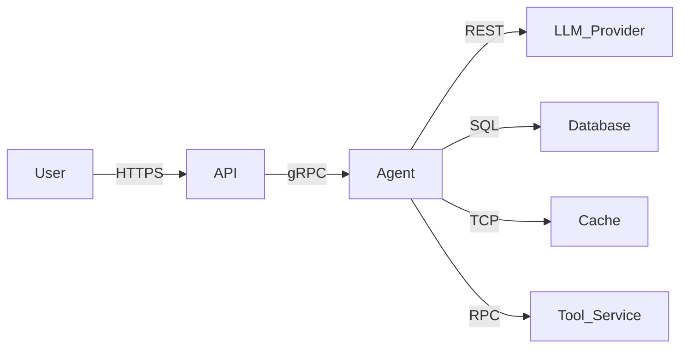
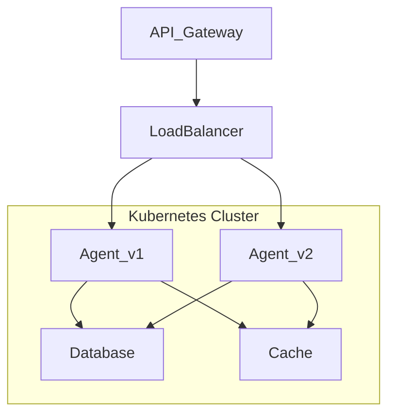
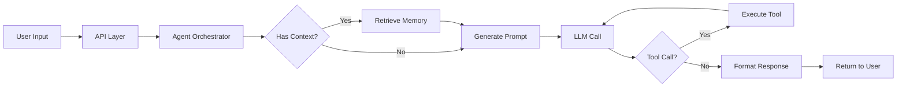
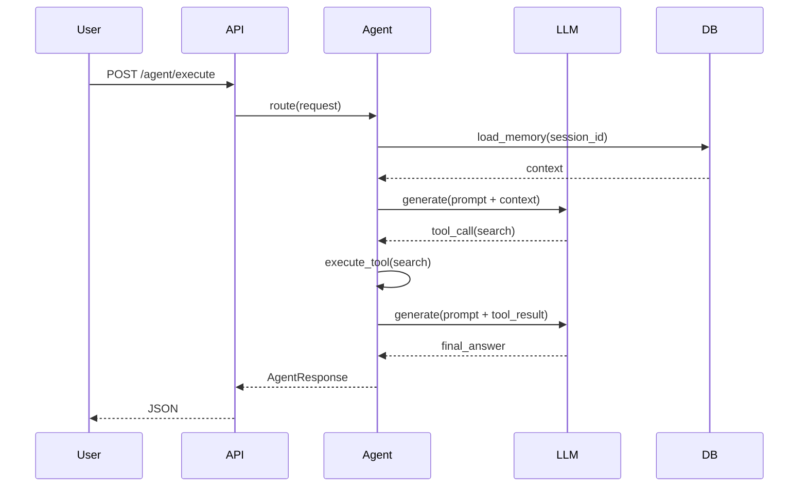

# Documentation Domain - Best Practices

## Overview

This document outlines comprehensive documentation best practices for LLM/agentic systems, covering API documentation, operational runbooks, prompt documentation, knowledge management, and governance.

---

## Table of Contents

1. [Documentation Strategy](#1-documentation-strategy)
2. [Audience Segmentation](#2-audience-segmentation)
3. [API Documentation](#3-api-documentation)
4. [Runbook and Operational Documentation](#4-runbook-and-operational-documentation)
5. [Architecture Documentation](#5-architecture-documentation)
6. [Prompt Documentation](#6-prompt-documentation)
7. [Code Documentation](#7-code-documentation)
8. [Documentation Automation](#8-documentation-automation)
9. [Versioning and Change Management](#9-versioning-and-change-management)
10. [Examples and Samples](#10-examples-and-samples)
11. [Accessibility and Inclusion](#11-accessibility-and-inclusion)
12. [Maintenance](#12-maintenance)
13. [Knowledge Management](#13-knowledge-management)
14. [Training and Onboarding](#14-training-and-onboarding)
15. [Compliance Documentation](#15-compliance-documentation)
16. [Feedback Loops](#16-feedback-loops)
17. [Metrics](#17-metrics)
18. [Governance](#18-governance)
19. [Developer Experience](#19-developer-experience)
20. [Appendices](#20-appendices)

---

## 1. Documentation Strategy

### Documentation Plan

```markdown
# Documentation Plan

## Goals

1. Onboard new engineers within 1 day.
2. Reduce production incidents by 20% via runbooks.
3. Improve user self-service rate.

## Audiences

- Developers: API docs, SDK guides, examples.
- Operators: Deployment, monitoring, troubleshooting.
- End Users: Getting started, FAQ.
- Compliance: Audit logs, security controls.

## Coverage

| Artifact | Owner | Review Cycle |
|----------|-------|--------------|
| API Reference | @team-api | Every release |
| Runbooks | @team-ops | Quarterly |
| Architecture | @team-arch | Semi-annual |
| Prompt Library | @team-ml | Per change |
```

### Documentation Maturity Model

```python
class DocMaturity:
    LEVELS = [
        "Ad Hoc",
        "Standardized",
        "Measured",
        "Optimized",
        "Self-Sustaining"
    ]
    
    def assess(self, doc_set: dict) -> str:
        score = 0
        if doc_set.get("has_readme"):
            score += 1
        if doc_set.get("has_api_docs"):
            score += 1
        if doc_set.get("has_runbooks"):
            score += 1
        if doc_set.get("automated_testing"):
            score += 1
        if doc_set.get("user_feedback_loop"):
            score += 1
        return self.LEVELS[min(score, 4)]
```

---

## 2. Audience Segmentation

### Developer Documentation

```markdown
# For Developers

## Quickstart

```python
from agent import Agent
agent = Agent(name="my-agent")
response = agent.run("Hello")
```

## API Reference

### `Agent.run(prompt, session_id, context)`

Execute agent with given prompt.

**Returns:** `AgentResponse`
```

### Operator Documentation

```markdown
# For Operators

## Deployment

Use Kubernetes manifests in `deploy/k8s/`.

## Monitoring

Grafana dashboard: https://grafana.example.com/d/agent

## Runbooks

- [High Error Rate](./runbooks/high-error-rate.md)
- [Latency Spike](./runbooks/latency-spike.md)
```

### End-User Documentation

```markdown
# Using the Agent

## How to Ask Questions

Type your question in the chat input and press Enter.

## Limitations

- Not available 24/7.
- Cannot access external data beyond training cutoff.
```

---

## 3. API Documentation

### OpenAPI Specification

```yaml
openapi: 3.0.3
info:
  title: Agent API
  version: 1.0.0
  description: |
    API for executing, streaming, and managing agent tasks.

servers:
  - url: https://api.example.com/v1
    description: Production

paths:
  /agent/execute:
    post:
      operationId: executeAgent
      tags:
        - agent
      summary: Execute agent task
      description: |
        Run a task through the agent system.
        Supports context, parameters, and callbacks.
      requestBody:
        required: true
        content:
          application/json:
            schema:
              $ref: '#/components/schemas/AgentRequest'
            examples:
              simple:
                value:
                  task: "Summarize this report"
                  session_id: "abc123"
      responses:
        '200':
          description: Successful execution
          content:
            application/json:
              schema:
                $ref: '#/components/schemas/AgentResponse'
        '400':
          $ref: '#/components/responses/BadRequest'
        '401':
          $ref: '#/components/responses/Unauthorized'
        '429':
          $ref: '#/components/responses/RateLimited'
        '500':
          $ref: '#/components/responses/ServerError'

components:
  schemas:
    AgentRequest:
      type: object
      required:
        - task
        - session_id
      properties:
        task:
          type: string
          minLength: 1
          maxLength: 50000
          description: Task description or user prompt.
        session_id:
          type: string
          format: uuid
          description: Unique session identifier.
        context:
          type: object
          additionalProperties: true
          description: Arbitrary runtime context.
        parameters:
          type: object
          description: Model parameters (temperature, max_tokens).
    AgentResponse:
      type: object
      properties:
        response:
          type: string
          description: Agent response text.
        tools_used:
          type: array
          items:
            type: string
          description: Tools invoked during execution.
        tokens_used:
          type: integer
          description: Total tokens consumed.
        metadata:
          type: object
          description: Additional response metadata.
  responses:
    BadRequest:
      description: Invalid request body
      content:
        application/json:
          schema:
            $ref: '#/components/schemas/Error'
    Unauthorized:
      description: Authentication required
    RateLimited:
      description: Too many requests
      headers:
        Retry-After:
          schema:
            type: integer
    ServerError:
      description: Internal server error
  schemas:
    Error:
      type: object
      properties:
        error:
          type: string
        details:
          type: string
```

### ReDoc Integration

```python
from fastapi import FastAPI
from fastapi.openapi.docs import get_redoc_html

app = FastAPI(
    title="Agent API",
    description="API for agent execution",
    version="1.0.0",
    docs_url="/docs",
    redoc_url="/redoc"
)

@app.get("/redoc", include_in_schema=False)
async def redoc():
    return get_redoc_html(openapi_url="/openapi.json", title="Agent API")
```

### Postman Collection Generator

```python
class PostmanCollectionGenerator:
    def __init__(self, openapi_spec: dict):
        self.spec = openapi_spec
    
    def generate(self) -> dict:
        collection = {
            "info": {
                "name": self.spec["info"]["title"],
                "schema": "https://schema.getpostman.com/json/collection/v2.1.0/collection.json"
            },
            "item": []
        }
        for path, methods in self.spec["paths"].items():
            for method, details in methods.items():
                item = {
                    "name": details.get("summary", path),
                    "request": {
                        "method": method.upper(),
                        "url": f"{{{{base_url}}}}{path}",
                        "body": self._build_body(details)
                    }
                }
                collection["item"].append(item)
        return collection
```

### Client SDK Generation

```python
class SDKGenerator:
    def __init__(self, openapi_spec: dict, language: str):
        self.spec = openapi_spec
        self.language = language
    
    def generate(self) -> str:
        if self.language == "python":
            return self._generate_python()
        elif self.language == "typescript":
            return self._generate_typescript()
        raise ValueError(f"Unsupported language: {self.language}")
    
    def _generate_python(self) -> str:
        lines = [
            "from dataclasses import dataclass",
            "from typing import Optional",
            "import httpx",
            "",
            "",
            "class AgentClient:",
            "    def __init__(self, base_url: str, api_key: str):",
            "        self.base_url = base_url",
            "        self.api_key = api_key",
            "",
            "    async def execute(self, task: str, session_id: str) -> dict:",
            '        async with httpx.AsyncClient() as client:',
            '            resp = await client.post(',
            '                f"{self.base_url}/agent/execute",',
            '                json={"task": task, "session_id": session_id},',
            '                headers={"Authorization": f"Bearer {self.api_key}"}',
            '            )',
            "            resp.raise_for_status()",
            "            return resp.json()",
        ]
        return "\n".join(lines)
```

---

## 4. Runbook and Operational Documentation

### Standard Runbook Template

```markdown
# Runbook: High Error Rate

## Description
This runbook covers investigation and remediation steps for elevated error rates.

## Detection

- Alert: `AgentHighErrorRate`
- Dashboard: https://monitoring.example.com/d/agent
- Threshold: Error rate > 5% over 5 minutes

## Severity

P1 - Major feature degraded

## Roles

- Incident Commander: @oncall-engineer
- Communications Lead: @oncall-communicator

## Diagnosis

1. Check recent deployments.
2. Review error logs in Datadog.
3. Check model provider status.
4. Check database latency.

## Remediation

### Step 1: Check Deployments

```bash
kubectl rollout history deployment/agent
kubectl rollout undo deployment/agent  # if needed
```

### Step 2: Switch Model

```bash
kubectl set env deployment/agent MODEL_FALLBACK=true
```

### Step 3: Scale Up

```bash
kubectl scale deployment/agent --replicas=10
```

## Escalation

- After 15 minutes: escalate to engineering manager.
- If data loss suspected: notify Security and Legal.

## Post-Incident

- File post-mortem within 24 hours.
- Update this runbook if steps changed.
```

### Service Catalog Entry

```markdown
# Agent Service

## Owner

Platform ML Team

## SLA

99.9% availability, measured monthly.

## On-Call

PagerDuty: agent-platform

## Dependencies

- OpenAI API
- PostgreSQL (pgvector)
- Redis Cache

## Runbooks

- [High Error Rate](./runbooks/high-error-rate.md)
- [Latency Spike](./runbooks/latency-spike.md)
- [Model Failure](./runbooks/model-failure.md)
```

---

## 5. Architecture Documentation

### System Context Diagram



### Component Diagram



### Data Flow Diagram



### Sequence Diagram



### C4 Model

```plantuml
@startuml
!include https://raw.githubusercontent.com/plantuml-stdlib/C4-PlantUML/master/C4_Context.puml

Person(user, "User", "Uses agent via web app or API")
System(agent_system, "Agent System", "Processes natural language, calls tools, manages memory")
System_Ext(llm, "LLM Provider", "OpenAI or Anthropic")
System_Ext(tools, "Tool Services", "Search, database, APIs")

Rel(user, agent_system, "sends queries to", "HTTPS")
Rel(agent_system, llm, "calls", "API")
Rel(agent_system, tools, "invokes", "RPC/gRPC")
@enduml
```

### Architecture Decision Record (ADR)

```markdown
# ADR-001: Use Redis for Session Cache

## Status

Accepted

## Context

Agent sessions require fast read/write access. Options considered:
- PostgreSQL (existing, but slower for hot data)
- Redis (fast, requires new infra)
- DynamoDB (managed, but higher cost)

## Decision

Use Redis 7 on Kubernetes for session caching.

## Consequences

- Gains: Sub-millisecond access for session data.
- Risks: Additional infrastructure to manage.
- Mitigations: Redis Sentinel for HA.
```

---

## 6. Prompt Documentation

### Prompt Card Template

```markdown
# Prompt Card: Customer Support Agent

## Purpose

Handle customer product inquiries via chat.

## Model

- Provider: OpenAI
- Model: gpt-4-turbo
- Temperature: 0.3
- Max tokens: 2048

## Prompt

```
You are a customer support agent for Acme Corp.
Your goal is to answer product questions using the provided catalog.
If unsure, say "Let me look that up" and call the search tool.
Never discuss pricing or competitor products.
```

## Tools Available

- `search(query)`: Search product catalog.
- `lookup_order(order_id)`: Retrieve order status.
- `escalate(reason)`: Transfer to human agent.

## Examples

### Example 1: Product Availability

**User:** Do you have the Acme Widget in stock?

**Agent:** Let me check our inventory.
[tool: search("Acme Widget")]
Yes, the Acme Widget is currently in stock.

### Example 2: Order Status

**User:** Where is my order #12345?

**Agent:** Let me look that up.
[tool: lookup_order("12345")]
Your order #12345 ships tomorrow.

## Constraints

- Do not provide personal account info.
- Do not process refunds directly.

## Performance

- Accuracy: 94%
- User satisfaction: 4.3/5
- Escalation rate: 2.3%

## Changelog

- 2024-01-15: Added `escalate` tool instructions.
- 2023-12-01: Initial version.
```

### Prompt Versioning

```python
class PromptVersionManager:
    def __init__(self, storage):
        self.storage = storage
    
    def save(self, name: str, prompt: str, version: str, metadata: dict):
        key = f"prompts/{name}/{version}"
        entry = {
            "prompt": prompt,
            "version": version,
            "metadata": metadata,
            "saved_at": datetime.utcnow().isoformat()
        }
        self.storage.set(key, entry)
    
    def get(self, name: str, version: str = "latest") -> dict:
        key = f"prompts/{name}/{version}"
        return self.storage.get(key)
    
    def list_versions(self, name: str) -> list:
        pattern = f"prompts/{name}/*"
        return self.storage.keys(pattern)
```

### Prompt Testing Documentation

```markdown
# Prompt Testing

## Test Suite

Run evaluations:

```bash
python -m agent.eval --prompt customer-support --dataset tests/eval/customer_support.jsonl
```

## Metrics

- Accuracy (correctness of answer): target >= 90%
- Tool call rate (did agent use tools): target >= 80%
- Escalation rate (human handoff): target <= 5%

## Adding Test Cases

Add to `tests/eval/customer_support.jsonl`:

```json
{"input": "Do you have Acme Widget in stock?", "expected_tools": ["search"], "expected_keywords": ["stock"]}
```
```

---

## 7. Code Documentation

### Google Style Docstrings

```python
def execute_task(task: str, session_id: str, context: dict = None) -> AgentResponse:
    """Execute an agent task.
    
    This method orchestrates the full agent pipeline:
    1. Load session memory.
    2. Build prompt with context.
    3. Call LLM with tools available.
    4. Execute any tool calls.
    5. Return final response.
    
    Args:
        task: The task description or user prompt.
        session_id: Unique session identifier.
        context: Optional runtime context dict.
    
    Returns:
        AgentResponse with response text and metadata.
    
    Raises:
        ValueError: If task is empty or session_id is missing.
        LLMError: If language model call fails.
        ToolError: If a required tool fails.
    
    Example:
        >>> response = execute_task("Hello", "session-abc")
        >>> print(response.response)
        'Hi! How can I help?'
    """
```

### Module Documentation

```python
"""Agent orchestration module.

This module provides the core Agent class and supporting utilities
for building LLM-powered agents with tool use, memory, and streaming.

Typical usage:

    from agent import Agent
    agent = Agent(model="gpt-4")
    result = agent.run("Hello")

Attributes:
    DEFAULT_MODEL (str): Default language model.
    MAX_RETRIES (int): Default retry count.
"""

DEFAULT_MODEL = "gpt-4"
MAX_RETRIES = 3

class Agent:
    """Core agent class for LLM orchestration.
    
    Coordinates prompt construction, LLM calls, tool execution,
    and memory management.
    """
```

### Inline Comments

```python
# Bad
# Check cache
if x in cache:
    return cache[x]

# Good
# Short-circuit hot path: if we already computed this task in this session,
# return cached result instead of calling the model again.
if session_id in task_cache and task_id in task_cache[session_id]:
    return task_cache[session_id][task_id]
```

---

## 8. Documentation Automation

### Docs-as-Code Pipeline

```yaml
name: Docs Pipeline
on:
  push:
    branches: [main]
    paths: ["docs/**", "src/**"]
  pull_request:
    branches: [main]

jobs:
  lint:
    runs-on: ubuntu-latest
    steps:
      - uses: actions/checkout@v4
      - uses: actions/setup-python@v5
        with:
          python-version: "3.11"
      - run: pip install markdownlint-cli
      - run: markdownlint docs/**/*.md
      - run: pip install vale
      - run: vale docs/

  test:
    runs-on: ubuntu-latest
    steps:
      - uses: actions/checkout@v4
      - uses: actions/setup-python@v5
      - run: pip install -e ".[dev]"
      - run: python -m doctest src/agent.py -v
      - run: python -m pytest tests/docs/

  deploy:
    needs: [lint, test]
    if: github.ref == 'refs/heads/main'
    runs-on: ubuntu-latest
    steps:
      - uses: actions/checkout@v4
      - uses: actions/setup-python@v5
      - run: pip install mkdocs-material mike
      - run: mkdocs build
      - run: |
          git config user.name docs-bot
          git config user.email docs-bot@example.com
          mike deploy --push --update-aliases latest main
```

### Source-to-Doc Generation

```python
class APIDocBuilder:
    def __init__(self, source_dir: str):
        self.source_dir = Path(source_dir)
    
    def build(self) -> str:
        sections = []
        sections.append("# API Reference\n")
        
        for module in sorted(self.source_dir.rglob("*.py")):
            section = self._document_module(module)
            if section:
                sections.append(section)
        
        sections.append("\n## Related\n")
        return "\n".join(sections)
    
    def _document_module(self, module: Path) -> str:
        tree = ast.parse(module.read_text())
        lines = [f"## Module: `{module.stem}`\n"]
        
        for node in ast.iter_child_nodes(tree):
            if isinstance(node, ast.ClassDef):
                lines.append(f"### Class `{node.name}`\n")
                doc = ast.get_docstring(node) or "No description."
                lines.append(f"{doc}\n")
                
                for item in node.body:
                    if isinstance(item, (ast.FunctionDef, ast.AsyncFunctionDef)):
                        lines.append(self._format_function(item))
        
        return "\n".join(lines)
    
    def _format_function(self, node) -> str:
        sig = f"{node.name}({', '.join(a.arg for a in node.args.args)})"
        doc = (ast.get_docstring(node) or "").strip()
        return f"#### `{sig}`\n\n{doc}\n"
```

### Docstring Linting

```bash
# .pre-commit-config.yaml
- repo: https://github.com/pycqa/pydocstyle
  rev: 6.3.0
  hooks:
    - id: pydocstyle
      additional_dependencies: [toml]
```

### Auto-Update Documentation from Config

```python
class ConfigDocsUpdater:
    def __init__(self, template_path: str, output_path: str, config: dict):
        self.template = Path(template_path).read_text()
        self.output = Path(output_path)
        self.config = config
    
    def render(self) -> str:
        lines = []
        for section, values in self.config.items():
            lines.append(f"## {section}\n")
            for key, value in values.items():
                lines.append(f"- `{key}`: `{value}`")
            lines.append("")
        return "\n".join(lines)
    
    def write(self):
        self.output.write_text(self.render())
```

### Deprecation Notices

```python
class DeprecationManager:
    def __init__(self):
        self.deprecations = {}
    
    def register(self, name: str, sunset_date: str, replacement: str = None):
        self.deprecations[name] = {
            "sunset": sunset_date,
            "replacement": replacement
        }
    
    def check(self, name: str) -> dict:
        dep = self.deprecations.get(name)
        if not dep:
            return {}
        return {
            "deprecated": True,
            "sunset": dep["sunset"],
            "replacement": dep.get("replacement")
        }
```

---

## 9. Versioning and Change Management

### Semantic Versioning

```markdown
# Versioning Policy

## Semantic Versioning: MAJOR.MINOR.PATCH

- **MAJOR**: Breaking changes to API or behavior.
- **MINOR**: New features, backwards compatible.
- **PATCH**: Bug fixes, backwards compatible.

## Changelog Format

Follow https://keepachangelog.com/.

## Deprecation Policy

- Minimum 90-day deprecation notice.
- Sunset date included in response headers.
- Migration guide provided.
```

### Release Notes Automation

```python
class ReleaseNotesGenerator:
    def __init__(self, changelog_path: str):
        self.changelog = Path(changelog_path)
    
    def generate(self, version: str) -> str:
        content = self.changelog.read_text()
        pattern = rf"## \[{re.escape(version)}\](.*?)(?=## \[|\Z)"
        match = re.search(pattern, content, re.DOTALL)
        if match:
            return match.group(0).strip()
        return f"Version {version} not found in changelog."
```

### Migration Guides

```markdown
# Migration Guide: v1 to v2

## Summary

| Aspect | v1 | v2 |
|--------|----|----|
| Auth | API key | OAuth2 with PKCE |
| Streaming | SSE | WebSocket |
| Batch | N/A | Supported |

## Step 1: Update Authentication

Replace API key with OAuth2:

```bash
curl -X POST https://api.example.com/oauth/token \
  -d "grant_type=client_credentials"
```

## Step 2: Update Streaming

```python
# v1 (SSE)
for event in sse_stream:
    print(event.data)

# v2 (WebSocket)
async with websockets.connect(url) as ws:
    async for msg in ws:
        print(msg)
```

## Step 3: Batch Processing

```python
# v2 only
result = await agent.execute_batch(tasks=["task1", "task2"])
```
```

---

## 10. Examples and Samples

### Runnable Examples

```python
"""
Example: Basic agent execution

Run with: python examples/basic_execution.py
"""
import asyncio
from agent import Agent

async def main():
    agent = Agent(name="demo-agent")
    response = await agent.execute(task="What is 2+2?")
    print(f"Response: {response}")

if __name__ == "__main__":
    asyncio.run(main())
```

### Interactive Notebooks

```python
# examples/quickstart.ipynb
{
 "cells": [
  {
   "cell_type": "markdown",
   "metadata": {},
   "source": ["# Quickstart\n", "Run the cells below to interact with the agent."]
  },
  {
   "cell_type": "code",
   "metadata": {},
   "source": [
    "from agent import Agent\n",
    "agent = Agent()\n",
    "response = agent.run('Hello, agent!')\n",
    "print(response)"
   ]
  }
 ]
}
```

### Sample Datasets

```
examples/
├── datasets/
│   ├── customer_support.jsonl
│   └── code_assistant.jsonl
├── scripts/
│   └── run_examples.py
└── README.md
```

### Example Gallery

```markdown
# Example Gallery

| Example | Description | Complexity |
|---------|-------------|------------|
| [Basic Execution](./basic.md) | Simple task execution | Beginner |
| [Streaming](./streaming.md) | Streaming responses | Intermediate |
| [Multi-Tool](./multi-tool.md) | Using multiple tools | Intermediate |
| [Multi-Agent](./multi-agent.md) | Agent orchestration | Advanced |
| [RAG Pipeline](./rag.md) | Retrieval augmented generation | Advanced |
```

---

## 11. Accessibility

### ARIA Labels

```html
<!-- Bad -->
<button onclick="submit()">Submit</button>

<!-- Good -->
<button aria-label="Submit agent task" onclick="submit()">Submit</button>
```

### Alt Text for Diagrams

```markdown

```

### Contrast and Readability

```css
/* Ensure sufficient contrast */
body {
  color: #1a1a1a;
  background: #ffffff;
}
a {
  color: #0056b3;
}
```

### Skip Links

```html
<a href="#main-content" class="skip-link">Skip to main content</a>
<main id="main-content">
  <!-- Content -->
</main>
```

---

## 12. Maintenance

### Documentation Review Calendar

```python
class DocReviewCalendar:
    def __init__(self):
        self.calendar = {
            "api_reference": timedelta(days=30),
            "runbooks": timedelta(days=90),
            "architecture": timedelta(days=180),
            "getting_started": timedelta(days=365)
        }
    
    def schedule_reviews(self) -> list:
        reviews = []
        now = datetime.utcnow()
        for doc_type, interval in self.calendar.items():
            next_review = now + interval
            reviews.append({
                "doc_type": doc_type,
                "next_review": next_review.isoformat(),
                "owner": self._get_owner(doc_type)
            })
        return reviews
```

### Freshness Monitoring

```python
class DocFreshnessMonitor:
    def __init__(self, docs_dir: str):
        self.docs_dir = Path(docs_dir)
        self.threshold = timedelta(days=90)
    
    def check(self) -> dict:
        stale, fresh = [], []
        for md in self.docs_dir.rglob("*.md"):
            mtime = datetime.fromtimestamp(md.stat().st_mtime)
            age = datetime.now() - mtime
            (stale if age > self.threshold else fresh).append(str(md))
        return {"stale": stale, "fresh": fresh, "stale_count": len(stale)}
```

### Ownership Model

```python
class DocOwnerRegistry:
    def __init__(self):
        self.registry = {}
    
    def register(self, path: str, team: str, owner: str, review_days: int = 90):
        self.registry[path] = {
            "team": team,
            "owner": owner,
            "review_days": review_days,
            "last_reviewed": datetime.utcnow().isoformat()
        }
    
    def get_owner(self, path: str) -> str:
        return self.registry.get(path, {}).get("owner", "unassigned")
    
    def get_stale(self, threshold_days: int = 90) -> list:
        stale = []
        cutoff = datetime.utcnow() - timedelta(days=threshold_days)
        for path, meta in self.registry.items():
            last = datetime.fromisoformat(meta["last_reviewed"])
            if last < cutoff:
                stale.append(path)
        return stale
```

---

## 13. Knowledge Management

### Search and Discovery

```python
class DocSearch:
    def __init__(self, index_path: str):
        self.index_path = Path(index_path)
        self.documents = self._load()
    
    def search(self, query: str, limit: int = 5) -> list:
        results = []
        for doc in self.documents:
            score = self._score(doc["content"], query)
            if score > 0:
                results.append((score, doc))
        results.sort(reverse=True)
        return [r[1] for r in results[:limit]]
```

### Internal Wiki Integration

```python
class WikiSync:
    def __init__(self, wiki_client, docs_dir: str):
        self.wiki = wiki_client
        self.docs_dir = Path(docs_dir)
    
    def publish(self, page_name: str):
        content = (self.docs_dir / f"{page_name}.md").read_text()
        self.wiki.create_or_update(page_name, content)
    
    def pull(self, page_name: str) -> str:
        return self.wiki.get(page_name)
```

### FAQ Management

```markdown
# Frequently Asked Questions

## How do I reset my API key?

Go to Settings > API Keys and click "Regenerate".

## What models are supported?

- GPT-4 Turbo
- GPT-3.5 Turbo
- Claude 3

## How do I report a bug?

Email support@example.com or open a GitHub issue.
```

---

## 14. Training and Onboarding

### Onboarding Paths

```markdown
# Onboarding: New Engineer

## Day 1

1. Read [Architecture Overview](./architecture/overview.md).
2. Set up local dev environment per [Setup](../getting-started/setup.md).
3. Run the example agent in [Quickstart](../getting-started/quickstart.md).

## Week 1

- Complete [API tutorial](./tutorials/api.md).
- Shadow on-call engineer.
- Submit first documentation PR.

## Month 1

- Own one runbook improvement.
- Present architecture overview to team.
```

### Labs and Exercises

```markdown
# Lab: Build a Search Agent

## Objective

Create an agent that answers questions using a built-in search tool.

## Steps

1. Initialize agent with search tool.
2. Write system prompt.
3. Test with 5 questions.
4. Measure accuracy.

## Evaluation Criteria

- Correct tool usage: 80%+
- Relevant answers: 90%+
- Response time < 3s
```

### Glossary

```markdown
# Glossary

**Agent**: Autonomous system that uses LLMs for reasoning and action.

**LLM**: Large Language Model (e.g., GPT-4, Claude).

**Tool**: External function callable by the agent.

**Memory**: Conversation history stored for context.

**Streaming**: Incremental response delivery.

**Prompt**: Input text provided to the language model.

**Context Window**: Maximum tokens the model can process.

**Token**: Sub-word unit of text processed by LLMs.

**Embedding**: Dense vector representation of text.
```

---

## 15. Compliance Documentation

### Audit Requirements

```markdown
# Audit Documentation Requirements

## SOC 2

- [ ] System description documented
- [ ] Control objectives listed
- [ ] Control activities described
- [ ] Evidence collection automated

## GDPR

- [ ] Data processing records (Art. 30)
- [ ] Data protection impact assessment
- [ ] Privacy notices for users
- [ ] Data retention policies

## HIPAA

- [ ] BAA with all PHI processors
- [ ] Access controls documented
- [ ] Audit trail for ePHI
```

### Data Flow Documentation

```markdown
# Data Flow: Agent API

1. User submits prompt via HTTPS.
2. API authenticates via OAuth2.
3. Session data retrieved from Redis.
4. Prompt sent to LLM provider.
5. Tool calls logged to database.
6. Response returned to user.

Data retention: 90 days for sessions, 30 days for logs.
Encryption: TLS 1.3 in transit, AES-256 at rest.
```

---

## 16. Feedback Loops

### Documentation Feedback Form

```python
class DocFeedback:
    def __init__(self, storage):
        self.storage = storage
    
    def submit(self, doc_path: str, rating: int, feedback: str, user_id: str):
        entry = {
            "doc_path": doc_path,
            "rating": rating,
            "feedback": feedback,
            "user_id": user_id,
            "timestamp": datetime.utcnow().isoformat()
        }
        self.storage.append("doc_feedback", entry)
    
    def get_summary(self, doc_path: str) -> dict:
        entries = self.storage.query("doc_feedback", {"doc_path": doc_path})
        if not entries:
            return {"count": 0, "avg_rating": 0}
        ratings = [e["rating"] for e in entries]
        return {
            "count": len(entries),
            "avg_rating": sum(ratings) / len(ratings)
        }
```

### Issue Template

```markdown
---
name: Documentation Issue
about: Report a documentation problem
title: "[docs] "
labels: documentation
assignees: ''

---

**Page:** [URL or path]

**Issue:**
- [ ] Broken link
- [ ] Incorrect information
- [ ] Missing example
- [ ] Unclear explanation

**Details:**
```

---

## 17. Metrics

### Documentation KPIs

| KPI | Target | Measurement |
|-----|--------|-------------|
| Freshness | <20% >90 days old | File mtime scan |
| Link health | <1% broken links | Automated checker |
| Coverage | >80% public API | Source-to-doc diff |
| Satisfaction | >4.0/5 | User survey |
| Time-to-success | <5 min | Analytics |
| Search success | >80% | Search analytics |

### Documentation Health Dashboard

```python
class DocHealthDashboard:
    def __init__(self, docs_dir: str):
        self.docs_dir = Path(docs_dir)
    
    def generate_report(self) -> dict:
        return {
            "total_files": len(list(self.docs_dir.rglob("*.md"))),
            "stale_files": self._count_stale(),
            "broken_links": self._count_broken_links(),
            "coverage": self._compute_coverage()
        }
    
    def _count_stale(self, threshold_days: int = 90) -> int:
        cutoff = datetime.now() - timedelta(days=threshold_days)
        count = 0
        for md in self.docs_dir.rglob("*.md"):
            if datetime.fromtimestamp(md.stat().st_mtime) < cutoff:
                count += 1
        return count
```

---

## 18. Governance

### Documentation Policy

```markdown
# Documentation Policy

## Scope

All public-facing and internal operational documentation.

## Requirements

- Every API endpoint must have OpenAPI spec.
- Every deployment must have a runbook.
- Every prompt change must be documented.
- Docs must be reviewed before merge.

## Review Cycle

- API docs: every release.
- Runbooks: quarterly.
- Architecture: semi-annually.
```

### Change Control

```python
class DocChangeControl:
    def __init__(self):
        self.required_reviewers = {
            "api/": ["@team-api", "@tech-writer"],
            "runbooks/": ["@team-ops"],
            "architecture/": ["@team-arch", "@engineering-manager"]
        }
    
    def get_reviewers(self, doc_path: str) -> list:
        for prefix, reviewers in self.required_reviewers.items():
            if doc_path.startswith(prefix):
                return reviewers
        return ["@team-owner"]
```

---

## 19. Developer Experience

### Interactive API Console

```python
@app.route("/console")
def api_console():
    return """
    <!DOCTYPE html>
    <html>
    <head><title>Agent API Console</title></head>
    <body>
      <h1>Agent API Console</h1>
      <input id="task" placeholder="Enter task..." size="50">
      <input id="session" placeholder="Session ID" size="36">
      <button onclick="execute()">Execute</button>
      <pre id="result"></pre>
      <script>
        async function execute() {
          const task = document.getElementById('task').value;
          const session = document.getElementById('session').value;
          const res = await fetch('/agent/execute', {
            method: 'POST',
            headers: {'Content-Type': 'application/json'},
            body: JSON.stringify({task, session_id: session})
          });
          const data = await res.json();
          document.getElementById('result').textContent = JSON.stringify(data, null, 2);
        }
      </script>
    </body>
    </html>
    """
```

### Local Documentation Server

```bash
# Start local docs server
mkdocs serve --watch-docs=docs --port 8000

# Or Docusaurus
npm run start -- --port 3000
```

### Search Integration

```python
class DocSearch:
    def __init__(self, docs_dir: str):
        self.docs_dir = Path(docs_dir)
        self.index = self._build_index()
    
    def _build_index(self) -> dict:
        index = {}
        for md in self.docs_dir.rglob("*.md"):
            content = md.read_text().lower()
            words = set(re.findall(r"\b\w+\b", content))
            for word in words:
                index.setdefault(word, set()).add(str(md))
        return index
    
    def search(self, query: str) -> list:
        words = set(re.findall(r"\b\w+\b", query.lower()))
        scores = {}
        for word in words:
            for doc in self.index.get(word, []):
                scores[doc] = scores.get(doc, 0) + 1
        return sorted(scores.items(), key=lambda x: x[1], reverse=True)
```

---

## 20. Appendices

### Documentation Templates

- `README.md.template`
- `CHANGELOG.md.template`
- `ADR.md.template`
- `Runbook.md.template`
- `API-Reference.md.template`
- `Onboarding.md.template`
- `Prompt-Card.md.template`
- `Incident-PostMortem.md.template`

### Style Guide

- Use active voice.
- Use present tense.
- Use simple language.
- Include examples for every concept.
- Use diagrams for complex flows.
- Keep sentences under 25 words.
- Use consistent terminology.

### Glossary

| Term | Definition |
|------|------------|
| Agent | LLM-powered autonomous system |
| Prompt | Input text to an LLM |
| Tool | External function callable by agent |
| Memory | Conversation history and context |
| Streaming | Incremental response delivery |
| Runbook | Operational procedure for incidents |
| ADR | Architecture Decision Record |
| SLO | Service Level Objective |

### Checklist

See [checklist.md](./checklist.md) for documentation verification.

---

## Related Files

- [Fundamentals](./fundamentals.md)
- [Anti-Patterns](./anti-patterns.md)
- [Examples](./examples.md)
- [Advanced](./advanced.md)
- [Checklist](./checklist.md)
- [Troubleshooting](./troubleshooting.md)