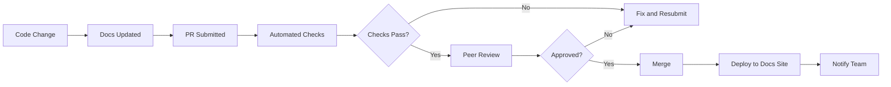

# Documentation Domain - Checklist

## Overview

This checklist verifies that system behavior, decisions, operations, APIs, and governance evidence are documented for the intended audience. Use this checklist before merging documentation changes and during quarterly audits.

---

## Table of Contents

1. [Priority Guide](#priority-guide)
2. [README and Overview](#readme-and-overview)
3. [API Documentation](#api-documentation)
4. [Code Documentation](#code-documentation)
5. [Architecture Documentation](#architecture-documentation)
6. [Prompt Documentation](#prompt-documentation)
7. [Runbooks and Operational Docs](#runbooks-and-operational-docs)
8. [Troubleshooting Guides](#troubleshooting-guides)
9. [Deployment Documentation](#deployment-documentation)
10. [Monitoring and Observability](#monitoring-and-observability)
11. [Security Documentation](#security-documentation)
12. [Example and Sample Documentation](#example-and-sample-documentation)
13. [Training and Onboarding](#training-and-onboarding)
14. [Compliance Documentation](#compliance-documentation)
15. [Change and Version History](#change-and-version-history)
16. [Multi-Tenant Documentation](#multi-tenant-documentation)
17. [Accessibility](#accessibility)
18. [Search and Discovery](#search-and-discovery)
19. [Link Integrity](#link-integrity)
20. [Maintenance and Governance](#maintenance-and-governance)
21. [Diagrams and Visuals](#diagrams-and-visuals)
22. [Writing Quality](#writing-quality)
23. [Scoring Guidance](#scoring-guidance)
24. [Appendices](#appendices)

---

## Priority Guide

- **P0**: Required for operational, safety, compliance, or user-impacting documentation.
- **P1**: Required for maintainability and team handoff unless explicitly accepted.
- **P2**: Recommended for knowledge sharing and onboarding.
- **P3**: Useful refinement for polish and discoverability.

---

## README and Overview

- [ ] **P0**: README exists with clear, concise project description.
- [ ] **P0**: Installation and setup instructions are accurate and tested.
- [ ] **P0**: Quickstart guide available (5-minute path to running code).
- [ ] **P0**: License documented (file or section).
- [ ] **P0**: Minimum supported version of Python/Node/Docker specified.
- [ ] **P1**: Project status and roadmap linked (e.g., Mailing list, milestones).
- [ ] **P1**: Support and contact information provided.
- [ ] **P1**: Contributing guide included.
- [ ] **P2**: Changelog linked or embedded.
- [ ] **P2**: Known limitations documented.
- [ ] **P2**: Roadmap or future plans mentioned (if public).
- [ ] **P2**: Screenshot or demo linked for UI components.
- [ ] **P2**: Badges for build status, coverage, version.
- [ ] **P3**: Sponsors or acknowledgments listed.

---

## API Documentation

- [ ] **P0**: OpenAPI/Swagger spec maintained and versioned.
- [ ] **P0**: All endpoints documented with request/response examples.
- [ ] **P0**: Error codes documented with HTTP status and resolution steps.
- [ ] **P0**: Authentication/authorization documented (OAuth2, API keys, etc.).
- [ ] **P0**: Required vs. optional parameters clearly marked.
- [ ] **P0**: Schema definitions complete (all fields, types, constraints).
- [ ] **P1**: Rate limits documented (RPM/TPM limits per tier).
- [ ] **P1**: SDK/CLI examples included for major use cases.
- [ ] **P1**: Interactive API console available (Swagger UI, ReDoc).
- [ ] **P1**: Pagination documented (cursor, offset, limit).
- [ ] **P1**: Webhook documentation includes signature verification.
- [ ] **P2**: Postman/Insomnia collection available.
- [ ] **P2**: Request/response validation rules documented.
- [ ] **P2**: Regional endpoint differences noted.
- [ ] **P2**: Deprecated endpoints clearly marked with sunset dates.

---

## Code Documentation

- [ ] **P0**: Public modules and classes have docstrings.
- [ ] **P0**: Functions/classes have parameter and return type documentation.
- [ ] **P0**: Exceptions/errors documented with descriptions.
- [ ] **P0**: Module-level docstrings describe purpose and usage.
- [ ] **P0**: All configuration options documented in config reference.
- [ ] **P1**: Private functions documented if complex or non-obvious.
- [ ] **P1**: Inline comments explain non-obvious logic.
- [ ] **P1**: Examples in docstrings where helpful.
- [ ] **P1**: Decorator behaviors documented.
- [ ] **P1**: Context manager behaviors documented.
- [ ] **P2**: Generated API reference from docstrings.
- [ ] **P2**: Async/await patterns documented.
- [ ] **P2**: Typing stubs documented for public API.
- [ ] **P2**: Thread-safety notes included where applicable.
- [ ] **P2**: Performance characteristics noted (complexity, memory).

---

## Architecture Documentation

- [ ] **P0**: System context diagram included (C4 or equivalent).
- [ ] **P0**: Component diagram showing major services/modules.
- [ ] **P0**: Data flow diagram included for key workflows.
- [ ] **P1**: Sequence diagrams for key flows (user request, error handling).
- [ ] **P1**: Architecture Decision Records (ADRs) maintained for significant decisions.
- [ ] **P1**: Infrastructure diagram included (cloud, networking, zones).
- [ ] **P1**: Deployment architecture documented (containers, orchestration).
- [ ] **P1**: Data storage architecture documented (schemas, sharding).
- [ ] **P1**: External dependency map included.
- [ ] **P2**: C4 model diagrams available (Context, Container, Component).
- [ ] **P2**: Network topology documented.
- [ ] **P2**: Disaster recovery architecture documented.
- [ ] **P2**: Scalability considerations documented.
- [ ] **P3**: Threat model documented.

---

## Prompt Documentation

- [ ] **P0**: All production prompts versioned and documented in prompt cards.
- [ ] **P0**: Prompt metadata included (model, temperature, max tokens).
- [ ] **P0**: Examples (input/output) for each prompt type.
- [ ] **P0**: System prompt content documented and versioned.
- [ ] **P0**: Safety constraints and guardrails documented.
- [ ] **P1**: Tool integration documented per prompt.
- [ ] **P1**: Prompt changelog maintained with version history.
- [ ] **P1**: Evaluation metrics documented (accuracy, tool call rate).
- [ ] **P1**: Few-shot examples documented and tested.
- [ ] **P1**: Prompt performance benchmarks recorded.
- [ ] **P2**: A/B test documentation for prompt variants.
- [ ] **P2**: Cost tracking per prompt (tokens, latency).
- [ ] **P2**: Failure modes documented (hallucinations, refusals).
- [ ] **P2**: User feedback loop for prompt improvements.
- [ ] **P2**: Prompt optimization experiments documented.

---

## Runbooks and Operational Docs

- [ ] **P0**: Runbooks exist for common failure modes (high error rate, latency spike, model failure).
- [ ] **P0**: Each runbook includes detection, diagnosis, remediation, escalation sections.
- [ ] **P0**: Runbooks linked from alert descriptions.
- [ ] **P0**: On-call runbook is accessible when offline.
- [ ] **P0**: Escalation contacts and paths documented.
- [ ] **P1**: Runbook accuracy verified quarterly.
- [ ] **P1**: Runbook ownership assigned.
- [ ] **P1**: Runbook versioning in place (linked to code versions).
- [ ] **P1**: Post-incident updates tracked in runbooks.
- [ ] **P1**: Deployment runbook exists with rollback procedure.
- [ ] **P1**: Disaster recovery runbook documented.
- [ ] **P2**: Runbook index maintained.
- [ ] **P2**: Runbook linted and validated (links, commands).
- [ ] **P2**: Runbook test coverage via chaos engineering.
- [ ] **P3**: Runbook sign-off process defined.

---

## Troubleshooting Guides

- [ ] **P0**: Common issues documented with symptoms and solutions.
- [ ] **P0**: Troubleshooting flowcharts for key services.
- [ ] **P0**: Diagnostic commands included and tested.
- [ ] **P0**: Error codes cross-referenced with runbooks.
- [ ] **P1**: Escalation paths documented.
- [ ] **P1**: Known issues registry maintained.
- [ ] **P1**: Common misconceptions addressed.
- [ ] **P2**: Troubleshooting guide organized by service.
- [ ] **P2**: Root cause analysis templates included.
- [ ] **P2**: Support ticket templates provided.
- [ ] **P3**: Video walkthroughs for complex issues.

---

## Deployment Documentation

- [ ] **P0**: Deployment runbook available and tested.
- [ ] **P0**: Environment variables documented with defaults.
- [ ] **P0**: Kubernetes manifests included or linked.
- [ ] **P0**: Docker images and tags documented.
- [ ] **P0**: Database migrations documented.
- [ ] **P1**: Rollback procedure documented with commands.
- [ ] **P1**: Canary deployment guide included.
- [ ] **P1**: Blue-green deployment strategy documented.
- [ ] **P1**: Feature flag configuration documented.
- [ ] **P1**: Infrastructure as Code (Terraform, Pulumi) documented.
- [ ] **P2**: GitOps workflow documented.
- [ ] **P2**: Environment-specific differences noted.
- [ ] **P2**: Secrets management procedure documented.
- [ ] **P2**: Pre-flight checks documented.
- [ ] **P3**: Deployment checklist created.

---

## Monitoring and Observability

- [ ] **P0**: SLOs defined and documented.
- [ ] **P0**: Dashboard links provided.
- [ ] **P0**: Alert descriptions include runbook links.
- [ ] **P0**: Key metrics defined with business meaning.
- [ ] **P1**: Metric definitions documented (units, aggregation).
- [ ] **P1**: Log format and fields documented.
- [ ] **P1**: Trace sampling strategy documented.
- [ ] **P1**: SLO burn rate alerts documented.
- [ ] **P1**: Error budget tracking documented.
- [ ] **P2**: Troubleshooting guide for common metrics anomalies.
- [ ] **P2**: Metrics-to-business-outcome mapping documented.
- [ ] **P2**: Grafana dashboard JSON in version control.
- [ ] **P2**: Runbook links from alerts verified working.
- [ ] **P3**: Metric naming conventions documented.

---

## Security Documentation

- [ ] **P0**: Authentication mechanism documented (OAuth2, API keys, mTLS).
- [ ] **P0**: Authorization model documented (RBAC, scopes).
- [ ] **P0**: Secret management procedures documented.
- [ ] **P0**: Security incident runbook available.
- [ ] **P0**: Principle of least privilege stated.
- [ ] **P1**: Threat model documented.
- [ ] **P1**: Penetration test reports archived.
- [ ] **P1**: Compliance requirements documented (SOC2, GDPR, HIPAA).
- [ ] **P1**: Data encryption standards documented (at rest, in transit).
- [ ] **P1**: Input validation and sanitization documented.
- [ ] **P1**: Rate limiting and DoS protection documented.
- [ ] **P2**: Audit logging requirements documented.
- [ ] **P2**: Vulnerability disclosure policy documented.
- [ ] **P2**: Security training resources linked.
- [ ] **P3**: Security audit schedule documented.

---

## Example and Sample Documentation

- [ ] **P0**: At least one runnable example per major use case.
- [ ] **P0**: Example code is tested and verified against current API.
- [ ] **P0**: Example inputs and outputs shown and verified.
- [ ] **P0**: Examples include prerequisites and setup instructions.
- [ ] **P1**: Interactive notebooks available (Jupyter, Observable).
- [ ] **P1**: Sample datasets provided for testing.
- [ ] **P1**: Example gallery with complexity ratings.
- [ ] **P1**: Example README with run instructions.
- [ ] **P2**: Examples cover edge cases and error scenarios.
- [ ] **P2**: Example coverage reported and tracked.
- [ ] **P2**: Example CI verification in pipeline.
- [ ] **P2**: Screenshots for UI-related examples.
- [ ] **P2**: Example data generation scripts included.
- [ ] **P3**: Video demo for complex examples.

---

## Training and Onboarding

- [ ] **P0**: Getting started guide for new team members.
- [ ] **P0**: Glossary of domain terms maintained.
- [ ] **P0**: README clear enough for first day.
- [ ] **P1**: Onboarding path documented (week-by-week).
- [ ] **P1**: Hands-on labs available.
- [ ] **P1**: Code review guidelines documented.
- [ ] **P1**: Definition of done includes documentation criteria.
- [ ] **P1**: Mentorship program documented.
- [ ] **P2**: Video tutorials for key workflows.
- [ ] **P2**: Sandbox/test environment access instructions.
- [ ] **P2**: Team communication channels listed.
- [ ] **P2**: Regular training sessions documented.
- [ ] **P2**: Knowledge sharing calendar maintained.
- [ ] **P3**: Certification paths defined.

---

## Compliance Documentation

- [ ] **P0**: Audit requirements documented (SOC2, GDPR, HIPAA).
- [ ] **P0**: Data flow diagrams for regulated data.
- [ ] **P0**: Data retention policies documented.
- [ ] **P0**: Privacy notices for end users.
- [ ] **P1**: Data Processing Agreements (DPA) referenced or linked.
- [ ] **P1**: Privacy impact assessments completed.
- [ ] **P1**: Cross-border data transfer documentation.
- [ ] **P1**: Incident response plan documented.
- [ ] **P1**: Business continuity plan documented.
- [ ] **P2**: Right-to-deletion procedures documented.
- [ ] **P2**: Data subject request process documented.
- [ ] **P2**: Audit evidence collection automated.
- [ ] **P2**: Compliance dashboard available.
- [ ] **P3**: Third-party compliance attestations archived.

---

## Change and Version History

- [ ] **P0**: Changelog maintained with semantic versioning.
- [ ] **P0**: Breaking changes clearly marked with migration guide.
- [ ] **P0**: Migration guides for major versions available.
- [ ] **P0**: Release notes published for every release.
- [ ] **P1**: Deprecation notices with sunset dates in response headers.
- [ ] **P1**: Release notes generated automatically from changelog.
- [ ] **P1**: Version selection UI in documentation site.
- [ ] **P1**: Old versions archived and accessible.
- [ ] **P2**: Git tags linked to release notes.
- [ ] **P2**: Dependency update notes included.
- [ ] **P2**: Feature flags documented and tracked.

---

## Multi-Tenant Documentation

- [ ] **P0**: Tenant-specific documentation separated and discoverable.
- [ ] **P0**: Access control for documentation defined (public, internal, restricted).
- [ ] **P0**: Rate limits per tenant documented.
- [ ] **P1**: Organization-specific API examples provided.
- [ ] **P1**: Multi-language support for key documentation pages.
- [ ] **P1**: Tenant-specific customization options documented.
- [ ] **P1**: Data residency requirements documented per tenant.
- [ ] **P2**: Localized screenshots and diagrams.
- [ ] **P2**: Tenant onboarding guide included.
- [ ] **P2**: Billing and usage documentation per tenant.
- [ ] **P3**: Custom branding documentation for white-label.

---

## Accessibility

- [ ] **P0**: Images include descriptive alt text.
- [ ] **P0**: Color contrast meets WCAG AA standards (4.5:1 for text).
- [ ] **P0**: Documents pass through screen readers.
- [ ] **P0**: Semantic HTML structure (headings, landmarks).
- [ ] **P1**: Keyboard navigation supported throughout.
- [ ] **P1**: Skip links included.
- [ ] **P1**: ARIA landmarks used.
- [ ] **P1**: Focus indicators visible.
- [ ] **P2**: Documents available in multiple formats (PDF, HTML, EPUB).
- [ ] **P2**: Font size adjustable without losing content.
- [ ] **P2**: No information conveyed by color alone.
- [ ] **P2**: Time-limited responses can be extended.
- [ ] **P2**: Captions and transcripts for video content.
- [ ] **P3**: Screen reader testing performed regularly.

---

## Search and Discovery

- [ ] **P0**: Full-text search working across all documentation.
- [ ] **P0**: Navigation hierarchy logical and consistent.
- [ ] **P0**: Homepage or index.md acts as orientation hub.
- [ ] **P1**: Related content suggestions enabled.
- [ ] **P1**: Sitemap generated and submitted to search engines.
- [ ] **P1**: Search analytics reviewed monthly.
- [ ] **P1**: Breadcrumbs present in deep pages.
- [ ] **P2**: AI-powered search available (semantic search).
- [ ] **P2**: Tag-based filtering supported.
- [ ] **P2**: Last-updated timestamps on pages.
- [ ] **P2**: Popular pages highlighted in navigation.
- [ ] **P2**: Feedback collection on search results.
- [ ] **P3**: Search synonyms configured.

---

## Link Integrity

- [ ] **P1**: Automated link checker in CI/CD pipeline.
- [ ] **P1**: Internal links verified on every build.
- [ ] **P1**: External links checked weekly.
- [ ] **P2**: Link checker fails build on broken links.
- [ ] **P2**: Sitemap links validated.
- [ ] **P2**: Redirects documented and minimized.
- [ ] **P2**: Legacy links maintained or redirected.
- [ ] **P2**: Deep linking tested for mobile documentation.
- [ ] **P3**: External link health monitores via uptime service.

---

## Maintenance and Governance

- [ ] **P0**: Every doc has an assigned owner.
- [ ] **P0**: Review schedule defined and followed.
- [ ] **P0**: Style guide enforced (linting).
- [ ] **P0**: Documentation changes require peer review.
- [ ] **P1**: Quality metrics tracked (freshness, link health, coverage).
- [ ] **P1**: Documentation debt tracked and prioritized.
- [ ] **P1**: Documentation contribution guidelines enforced.
- [ ] **P2**: Documentation team meetings held regularly.
- [ ] **P2**: Internal documentation audit held annually.
- [ ] **P2**: Documentation tooling maintained and updated.
- [ ] **P2**: Style guide reviewed annually.
- [ ] **P2**: Accessibility audits performed annually.
- [ ] **P3**: Documentation architecture reviewed periodically.

---

## Diagrams and Visuals

- [ ] **P1**: Diagrams used for complex concepts.
- [ ] **P1**: Diagram source files stored in version control (.mmd, .puml).
- [ ] **P1**: All diagrams have alt text in rendered format.
- [ ] **P1**: Diagram titles and captions included.
- [ ] **P1**: Diagrams updated when architecture changes.
- [ ] **P2**: Diagram conventions defined and enforced.
- [ ] **P2**: Diagram versioning linked to ADRs.
- [ ] **P2**: Diagrams rendered in CI/CD verification.
- [ ] **P3**: Diagram contribution guide provided.

---

## Writing Quality

- [ ] **P0**: Spelling and grammar checked.
- [ ] **P0**: Active voice used in procedural documentation.
- [ ] **P0**: Technical terms defined on first use.
- [ ] **P0**: No placeholder text remaining ("TODO", "FIXME", "Lorem ipsum").
- [ ] **P1**: Sentences are concise (under 25 words on average).
- [ ] **P1**: Consistent terminology throughout (see glossary).
- [ ] **P1**: Audience-appropriate tone maintained.
- [ ] **P1**: Units and dates formatted consistently.
- [ ] **P1**: Lists are parallel in structure.
- [ ] **P2**: Writing passes through style linter (Vale, write-good).
- [ ] **P2**: Flesch-Kincaid readability score appropriate for audience.
- [ ] **P2**: Inclusive language guidelines followed.
- [ ] **P3**: Professional copy edit performed on major docs.

---

## Appendix A: Quick Reference - High Priority P0 Items

- All prompts versioned and documented.
- All API endpoints have OpenAPI specs.
- All runbooks linked from alerts.
- All compliance artifacts present.
- All code has docstrings.
- All READMEs have setup instructions.
- All security policies documented.

## Appendix B: Documentation Review Schedule

| Document Type | Review Interval | Owner | Tools |
|---------------|-----------------|-------|-------|
| API Reference | Every release | @team-api | OpenAPI lint |
| Runbooks | Quarterly | @team-ops | Markdownlint |
| Architecture | Semi-annually | @team-arch | PlantUML render |
| Prompt Cards | Per change | @team-ml | Eval suite |
| Getting Started | Annually | @team-docs | Link checker |
| Compliance | Annually | @team-legal | Audit |
| README | Every release | @team-owner | Markdownlint |

## Appendix C: Common Documentation Debt Patterns

| Pattern | Remediation |
|---------|-------------|
| Outdated examples | Automated example testing |
| Broken links | CI link checker |
| Missing error docs | ADR for each error code |
| Orphaned docs | Quarterly doc audit |
| Unmaintained runbooks | Assign ownership |
| Inconsistent terminology | Enforce glossary |

## Appendix D: Metrics and Targets

| Metric | Target | Measurement Method |
|--------|--------|-------------------|
| Freshness | <20% >90 days old | File mtime scan |
| Link health | <1% broken | Automated link checker |
| API coverage | >80% | Source-to-doc diff |
| User satisfaction | >4.0/5 | Doc feedback form |
| Time-to-success | <5 min | Analytics events |
| Search success | >80% | Search analytics |
| Doc test pass rate | 100% | CI pipeline |
| Prompt card coverage | 100% | Prompt registry |
| Runbook coverage | One per P1 alert | Alert-to-doc diff |

## Appendix E: Tools and Commands

```bash
# Lint markdown
markdownlint docs/**/*.md

# Check links
python scripts/link_checker.py docs/

# Verify docstrings
pydocstyle src/

# Run doctests
python -m doctest src/ -v

# Build docs locally
mkdocs serve --port 8000

# Generate API reference
mkdocstrings

# Check accessibility
axe-cli https://docs.example.com

# Generate sitemap
python scripts/sitemap_generator.py docs/
```

## Appendix F: Document Template Checklist

Use this checklist when creating a new document:

- [ ] Title and metadata section filled.
- [ ] Purpose and audience stated.
- [ ] Prerequisites listed.
- [ ] Content structured with headings.
- [ ] All sections complete (no placeholders).
- [ ] Examples provided and verified.
- [ ] Diagrams included where helpful.
- [ ] Related documents linked.
- [ ] Reviewed by subject matter expert.
- [ ] Alphabetically sorted in table of contents.
- [ ] Last verified date included.
- [ ] Owner and review date assigned.

## Appendix G: Anti-Patterns Reference

For common documentation mistakes to avoid, see:
- [Anti-Patterns](../anti-patterns.md)

Key anti-patterns to watch for:
1. Documentation drifts from implementation.
2. No prompt documentation.
3. Missing examples.
4. Monolithic documentation.
5. No runbooks.
6. User-blame documentation.
7. No accessibility consideration.

---

## Appendix H: Documentation Automation Checklist

- [ ] P0: Documentation build runs in CI/CD
- [ ] P0: Linting and style checks run on markdown
- [ ] P1: Docstrings are validated by linter (e.g. pydocstyle)
- [ ] P1: Link checker runs on every PR/merge
- [ ] P1: Documentation coverage threshold enforced (>80%)
- [ ] P2: Automated screenshots for UI docs
- [ ] P2: Auto-generated API reference from OpenAPI
- [ ] P2: Changelog auto-generated from git commits

---

## Appendix I: Accessibility Checklist

- [ ] P0: All images include descriptive alt text
- [ ] P0: Color contrast meets WCAG AA standards
- [ ] P0: Documents pass through screen readers
- [ ] P1: Keyboard navigation supported
- [ ] P1: Skip links included
- [ ] P1: Tables include headers and scope attributes
- [ ] P1: Language attribute set on HTML exports
- [ ] P2: Documents available in multiple formats (PDF, HTML)
- [ ] P2: Font size and zoom tested up to 200%

---

## Appendix J: Prompt Documentation Checklist

- [ ] P0: Every prompt has a documented purpose
- [ ] P0: Prompt version tracked
- [ ] P0: Example input/output pairs provided
- [ ] P1: Model and parameters documented (name, temperature, max_tokens)
- [ ] P1: Available tools listed with descriptions
- [ ] P1: Edge cases and failure modes noted
- [ ] P1: Evaluation metrics recorded (accuracy, latency, token usage)
- [ ] P2: A/B test documentation for prompt variants
- [ ] P2: Prompt changelog maintained with author and date

---

## Appendix K: Runbook Testing Checklist

- [ ] P1: Runbook steps are tested on staging quarterly
- [ ] P1: Each remediation step has expected outcome defined
- [ ] P1: Escalation contacts verified quarterly
- [ ] P2: Runbook accuracy measured (time to resolution)
- [ ] P2: Runbook feedback captured after incidents

---

## Appendix L: Search Optimization Checklist

- [ ] P1: Page titles and headings include search keywords
- [ ] P1: No orphan pages (every page linked from somewhere)
- [ ] P1: Sitemap generated and submitted monthly
- [ ] P1: Search analytics reviewed monthly
- [ ] P2: AI-powered search enabled with re-ranking
- [ ] P2: Related content suggestions configured

---

## Appendix M: Multilingual Documentation Checklist

- [ ] P0: Primary language docs complete
- [ ] P1: Key documents translated to supported locales
- [ ] P1: Translation workflow documented
- [ ] P1: Locale-specific examples provided
- [ ] P1: RTL layout tested for Arabic/Hebrew
- [ ] P2: Machine translation reviewed by native speaker

---

## Appendix N: Diagram Standards Checklist

- [ ] P0: All diagrams include title and description
- [ ] P0: Diagram sources (Mermaid/PlantUML) committed to repo
- [ ] P1: Diagrams rendered in CI/CD and checked for syntax errors
- [ ] P1: Diagram versioning aligned with documentation version
- [ ] P2: Diagram style guide enforced (colors, fonts)
- [ ] P2: Diagrams tested for accessibility (alt text, contrast)

---

## Appendix O: Training Material Checklist

- [ ] P0: Getting started guide available
- [ ] P0: Glossary maintained
- [ ] P1: Onboarding path documented (week-by-week)
- [ ] P1: Hands-on labs provided with solutions
- [ ] P1: Code review guidelines documented
- [ ] P1: Video tutorials for key workflows
- [ ] P2: Certification exam or quiz available

---

## Appendix P: Compliance Documentation Checklist

- [ ] P0: Audit requirements documented (SOC2, GDPR, HIPAA)
- [ ] P0: Data flow diagrams for regulated data
- [ ] P0: Data retention policies documented
- [ ] P1: Data Processing Agreements (DPA) referenced
- [ ] P1: Privacy impact assessments completed
- [ ] P1: Cross-border data transfer documentation
- [ ] P2: Annual compliance training documented

---

## Appendix Q: Developer Experience Checklist

- [ ] P0: API reference with interactive console
- [ ] P0: Local setup guide (with Docker Compose)
- [ ] P0: Sample code for major use cases
- [ ] P1: Troubleshooting guide for common errors
- [ ] P1: Contribution guide with PR process
- [ ] P1: Issue templates for bug reports and feature requests
- [ ] P2: VS Code extension for development

---

## Appendix R: Metrics and Monitoring Checklist

- [ ] P0: Documentation health dashboard exists
- [ ] P0: Freshness score (>30 days old) tracked
- [ ] P0: Link error rate tracked
- [ ] P1: User satisfaction measured via survey
- [ ] P1: Time-to-first-success measured
- [ ] P2: Search success rate tracked

---

## Appendix S: Feedback Loop Checklist

- [ ] P1: Feedback form embedded in docs
- [ ] P1: Feedback reviewed weekly
- [ ] P1: Feedback incorporated into next doc revision
- [ ] P2: User interviews for docs usability

---

## Appendix T: Internationalization Checklist

- [ ] P0: All user-facing docs translated to supported languages
- [ ] P0: Locale selector visible on docs site
- [ ] P1: Translation workflow documented
- [ ] P1: Machine translation reviewed by native speakers
- [ ] P2: Date, time, currency, and number formats localized

---

## Appendix U: Security Documentation Checklist

- [ ] P0: Authentication and authorization documented
- [ ] P0: Secret management procedure documented
- [ ] P0: Security incident runbook available
- [ ] P1: Threat model documented
- [ ] P1: Pen test reports archived
- [ ] P1: Vulnerability disclosure process documented
- [ ] P2: Security training materials available

---

## Appendix V: Review Sign-Off Checklist

- [ ] P0: Technical reviewer assigned
- [ ] P0: Subject matter expert reviewed content
- [ ] P0: Links verified and working
- [ ] P0: Code examples tested
- [ ] P1: Grammar and spelling checked
- [ ] P1: Diagrams refreshed and accurate
- [ ] P1: Access control validated
- [ ] P2: Search keywords optimized

---

## Appendix W: Noise Reduction Checklist

- [ ] P1: Obsolete sections removed
- [ ] P1: Duplicate content merged
- [ ] P1: Placeholder text ("TODO", "TBD") resolved
- [ ] P2: Dangling references removed
- [ ] P2: Orphan files linked or archived

---

## Appendix X: Versioning Checklist

- [ ] P0: Documents tagged with semantic version
- [ ] P0: Changelog updated for every release
- [ ] P0: Deprecated pages show sunset date
- [ ] P1: Previous versions remain accessible
- [ ] P1: Migration guides included for breaking changes
- [ ] P2: Version selector UI configured

---

## Appendix Y: Governance Checklist

- [ ] P0: Documentation owner assigned per page
- [ ] P0: Review cadence defined and followed
- [ ] P0: Style guide enforced
- [ ] P1: Pull request required for changes
- [ ] P1: Metrics collected and reviewed
- [ ] P1: Tech debt items tracked and prioritized
- [ ] P2: Documentation health dashboard displayed

---

## Appendix Z: Documentation Capability Scorecard

```python
scoring_items = [
    ("README complete", True),
    ("API docs updated", True),
    ("Docstrings complete", True),
    ("Examples included", True),
    ("Guides available", True),
    ("Changelog maintained", True),
    ("Runbooks documented", True),
    ("Architecture diagrams", True),
    ("Prompt documentation", True),
    ("Onboarding guide", True),
    ("Review process defined", True),
    ("Metrics collected", True),
    ("User feedback loop", True),
    ("Link checks automated", True),
    ("Style guide enforced", True),
    ("Training materials available", True),
    ("Compliance docs complete", True),
    ("Accessibility considered", True),
]

total = len(scoring_items)
done = sum(1 for _, complete in scoring_items if complete)
score = (done / total) * 100 if total else 0

if score >= 90:
    classification = "production ready"
elif score >= 70:
    classification = "needs minor fixes"
elif score >= 50:
    classification = "needs significant work"
else:
    classification = "not production ready"

print(f"Documentation score: {score:.1f}% - {classification}")
```

Example result:

```text
Documentation score: 88.9% - needs minor fixes
```

---

## Appendix AA: Document Health Report Template

```json
{
  "generated_at": "2026-06-04",
  "total_documents": 124,
  "freshness": {
    "last_30_days": 87,
    "last_90_days": 102,
    "older_than_90_days": 37,
    "stale_percentage": 29.8
  },
  "links": {
    "total_checked": 1450,
    "broken": 12,
    "broken_percentage": 0.83
  },
  "coverage": {
    "documented_functions": 312,
    "total_functions": 389,
    "percentage": 80.2
  },
  "status": "pass"
}
```

---

## Appendix AB: Documentation Workflow Diagram



---

## Appendix AC: Document Metadata Template

Every documentation file should include this metadata block at the top:

```yaml
---
title: Page Title
description: Brief summary for SEO and previews.
audience: ["developers", "operators"]
last_updated: YYYY-MM-DD
owner: @team-handle
review_cycle: quarterly
status: active | draft | deprecated
related:
  - path/to/related-doc.md
  - path/to/another-doc.md
---
```

---

## Appendix AD: Example Document Header

```markdown
---
title: Agent API Reference
description: Complete reference for agent execution endpoints.
audience: ["developers", "operators"]
last_updated: 2026-06-04
owner: @platform-team
review_cycle: monthly
status: active
related:
  - best-practices.md
  - troubleshooting.md
---
```

## Appendix AE: Documentation Standards Table

| Standard | Requirement | Enforcement | Owner |
|----------|-------------|-------------|-------|
| Link check | <1% broken links | CI job | Docs team |
| Docstring coverage | >80% | CI job | Engineering |
| Freshness | <20% >90 days | Monthly report | Docs team |
| Accessibility | WCAG AA | Quarterly audit | Design team |

---

## Appendix AF: Common Document Types Cheat Sheet

| Document Type | Purpose | Audience | Update Frequency |
|---------------|---------|----------|------------------|
| README | Project overview | Everyone | Per release |
| API Reference | Endpoint details | Developers | Per release |
| Runbook | Incident response | Operators | Quarterly |
| ADR | Architecture decisions | Engineers | Per change |
| Prompt Card | Prompt documentation | ML team | Per change |
| Troubleshooting | Problem resolution | Operators | Per incident |
| Training Guide | Onboarding | New hires | Semi-annual |
| Compliance | Audit evidence | Auditors | Annual |

---

## Appendix AG: Documentation Maturity Questions

1. Can a new engineer onboard without asking questions?
2. Can an operator resolve an incident without escalation?
3. Can users self-serve using documentation?
4. Is documentation tested and verified?
5. Is documentation ownership clear?

If all answers are "Yes", documentation is at an advanced maturity level.

---

## Appendix AH: Documentation Debt Register Template

| Document | Debt Type | Risk | Owner | Ticket | Target Date |
|----------|-----------|------|-------|--------|-------------|
| API Reference v1 | Outdated examples | High | @api-team | DOC-123 | 2024-07-01 |
| Runbook: Latency | Missing steps | Medium | @ops-team | DOC-124 | 2024-08-15 |
| Architecture | No C4 model | Low | @arch-team | DOC-125 | 2024-09-01 |

---

## Appendix AI: Example Evaluation Rubric

| Dimension | Weight | Score (1-5) |
|-----------|--------|-------------|
| Completeness | 30% | |
| Accuracy | 25% | |
| Clarity | 20% | |
| Examples | 15% | |
| Accessibility | 10% | |
| **Weighted Total** | 100% | |

Interpretation:
- 4.5-5.0: Excellent
- 3.5-4.4: Good
- 2.5-3.4: Fair
- <2.5: Needs improvement

---

## Appendix AJ: Related Standards and References

- [Google Developer Documentation Style Guide](https://developers.google.com/style)
- [Microsoft Writing Style Guide](https://learn.microsoft.com/en-us/style-guide/)
- [Diataxis Documentation Framework](https://diataxis.fr/)
- [Write the Docs](https://www.writethedocs.org/)
- [Tooling: markdownlint](https://github.com/DavidAnson/markdownlint)
- [Tooling: Vale](https://vale.sh/)
- [Tooling: pydocstyle](https://www.pydocstyle.org/)

---

## Appendix AK: Document Creation Checklist

Use this checklist when creating a new document:

- [ ] Title and metadata section filled.
- [ ] Purpose and audience stated.
- [ ] Prerequisites listed.
- [ ] Content structured with headings.
- [ ] All sections complete (no placeholders).
- [ ] Examples provided and verified.
- [ ] Diagrams included where helpful.
- [ ] Related documents linked.
- [ ] Reviewed by subject matter expert.
- [ ] Alphabetically sorted in table of contents.
- [ ] Last verified date included.
- [ ] Owner and review date assigned.

## Appendix AL: Quality Gates Checklist

- [ ] P1: Documentation build succeeds
- [ ] P1: All links resolve
- [ ] P1: Spelling and grammar checks pass
- [ ] P1: Style guide compliance verified
- [ ] P2: Accessibility audit passed
- [ ] P2: Search indexing successful

---

## Related Files

- [Fundamentals](./fundamentals.md)
- [Best Practices](./best-practices.md)
- [Anti-Patterns](./anti-patterns.md)
- [Examples](./examples.md)
- [Advanced](./advanced.md)
- [Troubleshooting](./troubleshooting.md)
