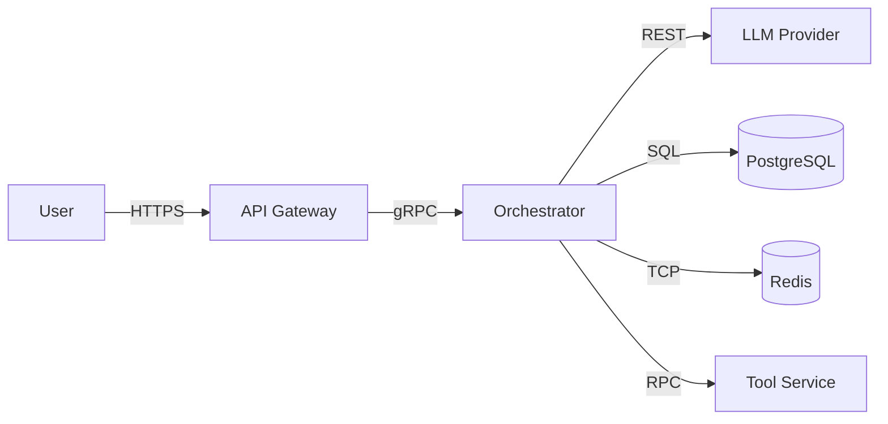
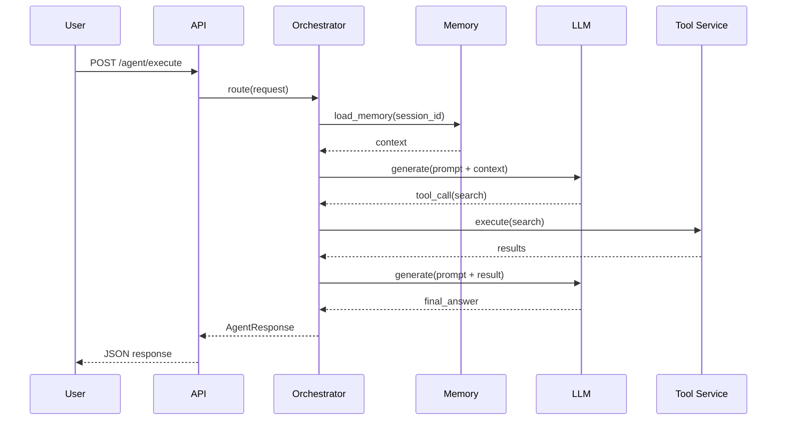
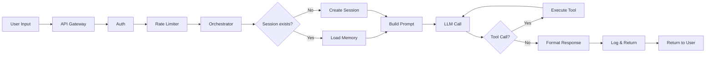
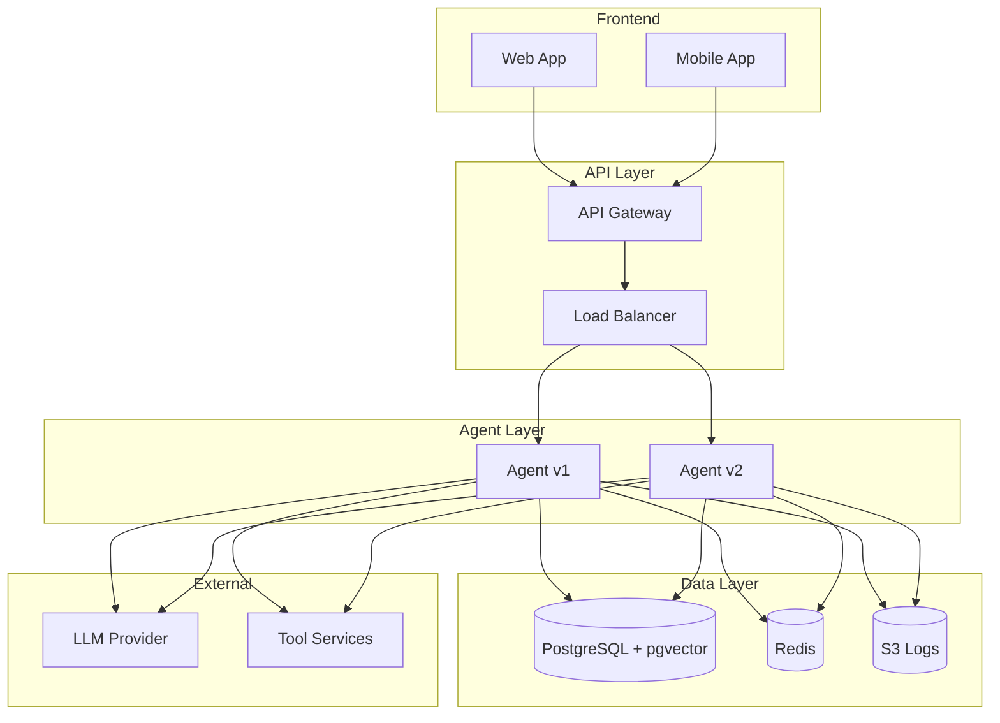
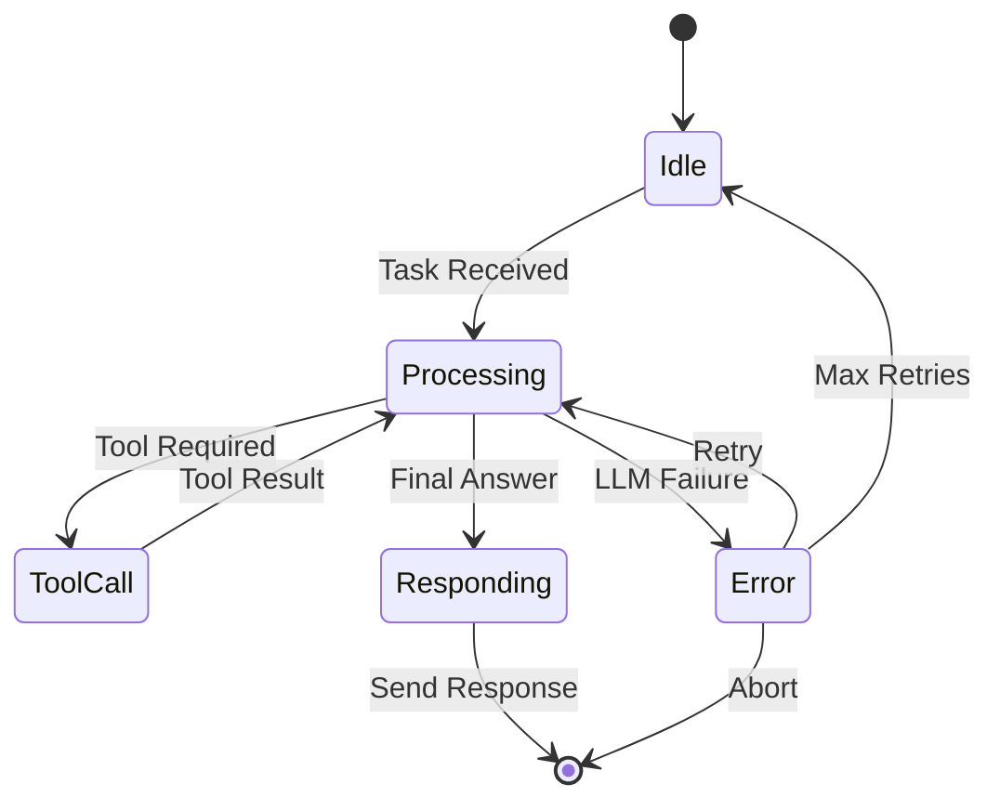
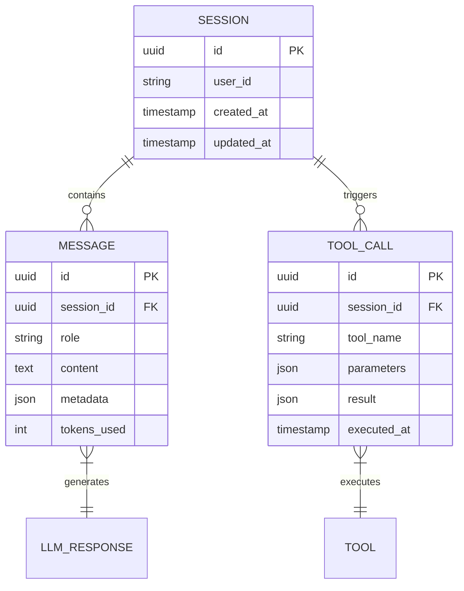
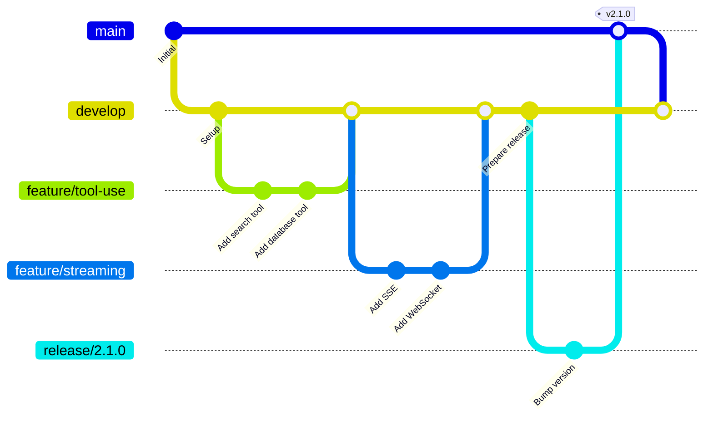

# Documentation Domain - Examples

## Overview

This document provides comprehensive documentation examples for LLM/agentic systems. Each example demonstrates a key documentation artifact with a complete, realistic template that can be adapted to your project.

---

## Table of Contents

1. [Example 1: API Documentation](#1-api-documentation)
2. [Example 2: Runbook](#2-runbook)
3. [Example 3: Quickstart](#3-quickstart)
4. [Example 4: Troubleshooting Guide](#4-troubleshooting-guide)
5. [Example 5: Prompt Card](#5-prompt-card)
6. [Example 6: Architecture Decision Record](#6-architecture-decision-record)
7. [Example 7: Migration Guide](#7-migration-guide)
8. [Example 8: Onboarding Guide](#8-getting-started-guide)
9. [Example 9: Security Policy](#9-security-policy)
10. [Example 10: Style Guide](#10-style-guide)
11. [Example 11: Glossary](#11-glossary)
12. [Example 12: Changelog](#12-changelog)
13. [Example 13: Deployment Guide](#13-deployment-guide)
14. [Example 14: Monitoring Guide](#14-monitoring-guide)
15. [Example 15: FAQ](#15-faq)
16. [Example 16: Release Notes](#16-release-notes)
17. [Example 17: Incident Post-Mortem](#17-incident-post-mortem)
18. [Example 18: Interactive API Console](#18-interactive-api-console)
19. [Example 19: Full OpenAPI Spec](#19-full-openapi-spec)
20. [Example 20: Diagram Examples](#20-diagram-examples)

---

## Example 1: API Documentation

```markdown
# Agent API

## Overview

This API allows you to execute agent tasks, stream responses,
and manage agent sessions.

## Base URL

- Production: https://api.example.com/v1
- Staging: https://api-staging.example.com/v1

## Authentication

All requests require a Bearer token:

```
Authorization: Bearer <your_api_key>
```

Tokens expire after 1 hour. Refresh via `POST /auth/refresh`.

---

## POST /agent/execute

Execute a task through the agent orchestrator.

### Request

```json
{
  "task": "What is the weather?",
  "session_id": "abc123",
  "MAX_TOKENS": 500
}
```

### Response

```json
{
  "response": "I don't have access to weather data.",
  "tools_used": [],
  "tokens": 42,
  "metadata": {
    "model": "gpt-4-turbo",
    "latency_ms": 1234
  }
}
```

### Error Codes

| Code | Meaning | Resolution |
|------|---------|------------|
| 400 | Invalid request | Check request body schema |
| 401 | Authentication required | Verify API key |
| 429 | Rate limit exceeded | Backoff and retry after Retry-After seconds |
| 500 | Internal error | Retry or contact support |
```

---

## Example 2: Runbook

```markdown
# Runbook: High Error Rate

## Description

This runbook covers investigation and remediation for elevated error rates in the Agent API.

## Detection

- Alert: `AgentHighErrorRate`
- Dashboard: https://monitoring.example.com/d/agent
- Threshold: Error rate > 5% over 5 minutes

## Severity

P1 - Major feature degraded

## Roles

- Incident Commander: @oncall-engineer
- Communications Lead: @oncall-communicator

## Diagnosis

1. Check recent deployments in the last 2 hours.
2. Review error logs in Datadog for AgentHighErrorRate.
3. Check model provider status page.
4. Check database latency metrics.
5. Verify tool service health endpoints.

## Remediation Steps

### Step 1: Check and Revert Deployment

```bash
kubectl rollout history deployment/agent
kubectl rollout undo deployment/agent  # if deployed in last 2 hours
kubectl rollout status deployment/agent
```

### Step 2: Switch to Fallback Model

```bash
kubectl set env deployment/agent MODEL_FALLBACK=true
kubectl rollout restart deployment/agent
```

### Step 3: Scale Up

```bash
kubectl scale deployment/agent --replicas=10
kubectl get pods -l app=agent
```

### Step 4: Validate Recovery

```bash
curl -X POST https://api.example.com/v1/agent/execute \
  -H "Authorization: Bearer $API_KEY" \
  -H "Content-Type: application/json" \
  -d '{"task":"Hello","session_id":"test"}'
```

## Escalation

- After 15 minutes without resolution: escalate to engineering manager.
- If data loss suspected: notify Security and Legal.

## Post-Incident

- File post-mortem within 24 hours.
- Update this runbook if steps changed.
- Schedule follow-up ticket for root cause fix.

## Related

- [Monitoring Guide](../guides/monitoring.md)
- [Architecture Overview](../architecture/overview.md)
```

---

## Example 3: Getting Started Guide

```markdown
# Getting Started with Agent Framework

## Prerequisites

- Python 3.11 or higher
- pip package manager
- OpenAI API key (or Anthropic API key)
- 2 GB available disk space

## Step 1: Install

```bash
pip install agent-framework
```

## Step 2: Configure

Create a `.env` file in your project root:

```bash
OPENAI_API_KEY=sk-...
MODEL_NAME=gpt-4-turbo
MAX_TOKENS=4096
TEMPERATURE=0.7
```

## Step 3: Create Your First Agent

```python
from agent import Agent

agent = Agent(
    name="my-first-agent",
    model="gpt-4-turbo",
    temperature=0.3
)

response = agent.run("What is 2+2? Answer concisely.")
print(response)
```

## Step 4: Add a Tool

```python
from agent import Agent, Tool

def search(query: str) -> str:
    """Search a knowledge base."""
    return f"Results for: {query}"

agent = Agent(
    name="search-agent",
    tools=[Tool(name="search", func=search)]
)
```

## Step 5: Run

```bash
python my_agent.py
```

## Expected Output

```
Calling LLM with prompt: "What is 2+2? Answer concisely."
Response: 4
Token usage: 12
```

## Next Steps

- See [API Reference](../api/overview.md) for all options.
- See [Tools Guide](../guides/tools.md) for advanced tool patterns.
- See [Deployment Guide](../guides/deployment.md) to deploy to production.

## Troubleshooting

If you see `ModuleNotFoundError`, ensure you installed in the correct Python environment:
```bash
python -m pip install agent-framework
```
```

---

## Example 4: Troubleshooting Guide

```markdown
# Troubleshooting: Agent Agentic Issues

## Issue: Agent Returns Empty Response

### Symptoms

- `agent.run()` returns empty string or None.
- No tool calls in logs.
- No error raised.

### Common Causes

1. **Context too large**: Prompt exceeds model context window.
2. **Temperature too high**: Output filtered by post-processing.
3. **Guardrail triggered**: Output blocked by content filter.
4. **Prompt template error**: Template variables not substituted correctly.

### Diagnosis

```bash
# Check prompt length in logs
grep "prompt_tokens" logs/agent.log

# Run with debug mode
DEBUG=true python my_agent.py
```

### Fix

1. Reduce context window by summarizing long histories.
2. Set temperature to 0.3.
3. Review guardrail rules in `config.yaml`.
4. Validate prompt template syntax.

---

## Issue: Tool Execution Timeout

### Symptoms

- `ToolExecutionError: Timeout after 30 seconds`
- Agent retries tool call multiple times.
- High latency for user request.

### Common Causes

1. External tool service is slow or unresponsive.
2. Network connectivity issue.
3. Tool implementation has bug (infinite loop).

### Diagnosis

```bash
# Check tool service health
curl https://tools.example.com/health

# Check network connectivity
ping tools.example.com

# Review tool logs
kubectl logs -l app=tool-service --tail=100
```

### Fix

1. Increase timeout in `config.yaml`:
```yaml
tools:
  timeout: 60
```
2. Restart tool service:
```bash
kubectl rollout restart deployment/tool-service
```
3. Add circuit breaker to prevent retry storms.

---

## Issue: Rate Limit Errors (429)

### Symptoms

- `HTTP 429 Too Many Requests`
- Retry-After header present in response.

### Common Causes

1. Exceeded RPM or TPM limits.
2. Burst traffic from scheduled jobs.
3. Multiple tenants sharing API key.

### Fix

1. Implement exponential backoff:
```python
import time
max_retries = 3
for attempt in range(max_retries):
    try:
        response = call_llm()
        break
    except RateLimitError:
        wait = 2 ** attempt
        time.sleep(wait)
```
2. Contact provider to increase limits.
3. Use multiple API keys across tenants.

---

## Issue: Memory Not Loading

### Symptoms

- Agent does not recall previous conversation.
- Each request starts with empty context.
- No errors logged.

### Common Causes

1. Session ID not passed correctly.
2. Memory store misconfigured.
3. Database connection failed.

### Fix

1. Verify session ID is consistent:
```python
agent = Agent(session_id="user-123")
agent.run("Hello")      # First message
agent.run("My name is...")  # Should recall "Hello"
```
2. Check memory configuration:
```python
print(agent.memory_store.config)
```
3. Verify database connectivity:
```bash
psql $DATABASE_URL -c "SELECT COUNT(*) FROM sessions;"
```
```

---

## Example 5: Prompt Card

```markdown
# Prompt Card: Customer Support Agent

## Metadata

| Field | Value |
|-------|-------|
| Version | 2.1.0 |
| Status | active |
| Author | @jane-doe |
| Created | 2024-01-01 |
| Updated | 2024-01-15 |
| Model | gpt-4-turbo |
| Temperature | 0.3 |
| Max Tokens | 2048 |
| Frequency Penalty | 0.0 |
| Presence Penalty | 0.0 |
| Top P | 1.0 |

## Purpose

Handle incoming customer product inquiries via chat interface.
Answer product questions, provide order status, escalate when appropriate.

## System Prompt

```
You are a helpful customer support agent for Acme Corp.
Your goal is to answer product questions using the provided tools.

Rules:
1. Always use the search tool for product availability.
2. Never discuss pricing or competitor products.
3. If unsure, say "Let me look that up" and call the search tool.
4. Be polite and concise.
5. For refund requests, use the escalate tool.
```

## Available Tools

- `search(query: str) -> str`: Search product catalog.
- `lookup_order(order_id: str) -> dict`: Retrieve order status.
- `escalate(reason: str) -> str`: Transfer to human agent.

## Few-Shot Examples

### Example 1: Product Availability

**User:** Do you have the Acme Widget in stock?

**Agent:** Let me check our inventory for you.
[tool: search("Acme Widget")]
Yes, the Acme Widget is currently in stock. We have 42 units available at $29.99 each.

### Example 2: Order Status

**User:** Where is my order #12345?

**Agent:** Let me look that up.
[tool: lookup_order("12345")]
Your order #12345 shipped yesterday via FedEx. Expected delivery: Jan 20.

### Example 3: Escalation

**User:** I want a refund for order #54321.

**Agent:** I understand you would like a refund.
[tool: escalate("Customer requesting refund for order #54321")]
I have escalated this to our refunds team. You will be contacted within 24 hours via email.

## Constraints

- Do not provide personal account information without authentication.
- Do not process refunds directly.
- Do not discuss competitor products or pricing.
- Do not guess if information is unavailable; use tools or escalate.

## Evaluation Metrics

| Metric | Target | Current (2024-01-15) |
|--------|--------|---------------------|
| Accuracy | >= 90% | 94% |
| Tool Call Rate | >= 80% | 87% |
| Escalation Rate | <= 5% | 2.3% |
| User Satisfaction | >= 4.0/5 | 4.3/5 |
| Avg Response Time | < 3s | 1.8s |

## Changelog

| Version | Date | Author | Change |
|---------|------|--------|--------|
| 2.1.0 | 2024-01-15 | @jane | Added `escalate` tool instructions |
| 2.0.0 | 2024-01-01 | @john | Migrated to GPT-4, updated system prompt |
| 1.5.0 | 2023-12-01 | @jane | Added multi-language support |
| 1.0.0 | 2023-10-01 | @john | Initial version |

## Related

- [Prompt Library](../prompts/index.md)
- [Evaluation Guide](../guides/evaluation.md)
- [Tool Schema Reference](../api/tools.md)
```

---

## Example 6: Architecture Decision Record

```markdown
# ADR-001: Use PostgreSQL with pgvector for Agent Memory

## Status

Accepted

## Date

2024-01-01

## Authors

@john-doe, @jane-doe

## Context

Agent memory requires vector similarity search for context retrieval.
Current implementation uses a simple key-value store that does not
support semantic search.

Options considered:
1. **Pinecone**: Managed vector database. Expensive at scale.
2. **Weaviate**: Self-hosted. Complex operations. Additional infra.
3. **PostgreSQL + pgvector**: Familiar to team. Cheap. Requires extension.

## Decision

Use PostgreSQL 16 with pgvector extension hosted on AWS RDS.

## Consequences

### Positive
- Team already knows PostgreSQL. No new operational expertise needed.
- 70-90% cheaper than Pinecone at our scale.
- Single database for sessions, logs, and vector search simplifies backups.

### Negative
- pgvector performance lags at very high QPS (100K+ queries/sec).
- Requires extension management on RDS.

### Risks and Mitigations

| Risk | Likelihood | Mitigation |
|------|-----------|-----------|
| RDS scaling limits | Medium | Add read replicas. Use connection pooling via PgBouncer. |
| Migration complexity | Low | AddressSpace migration script tested. |
| Extension compatibility | Low | Pin pgvector version in RDS parameter group. |

## Alternatives Considered

- **Redis with vector set**: No, Redis is ephemeral and not suitable for long-term memory.
- **ChromaDB**: No, self-hosted stateful service would add operational burden.

## Implementation Notes

- Memory table: `session_embeddings (session_id UUID, embedding vector(1536), created_at TIMESTAMPTZ)`
- Query pattern: `SELECT * FROM session_embeddings ORDER BY embedding <=> query_embedding LIMIT 5`

## References

- [PostgreSQL pgvector docs](https://github.com/pgvector/pgvector)
- [Infrastructure RFC](https://github.com/org/agent/pull/123)
```

---

## Example 7: Migration Guide

```markdown
# Migration Guide: v1 to v2

## Summary

This guide helps you migrate from API v1 to v2.

| Aspect | v1 | v2 |
|--------|----|----|
| Auth | API key in header | OAuth2 with PKCE |
| Streaming | SSE (Server-Sent Events) | WebSocket |
| Request Body | `{ "prompt": "..." }` | `{ "task": "...", "session_id": "..." }` |
| Response | `{ "response": "..." }` | `{ "response": "...", "metadata": {} }` |
| Batch | Not supported | `POST /agent/batch` |
| Rate Limit | 100 RPM | 500 RPM |

## Breaking Changes

### 1. Authentication

**v1:**
```bash
curl -H "X-API-Key: YOUR_KEY" ...
```

**v2:**
```bash
curl -H "Authorization: Bearer YOUR_ACCESS_TOKEN" ...
```

### 2. Request Body

**v1:**
```json
{"prompt": "Summarize this text"}
```

**v2:**
```json
{"task": "Summarize this text", "session_id": "uuid-here"}
```

### 3. Streaming

**v1 (SSE):**
```python
import requests
response = requests.get("/v1/agent/stream", stream=True)
for line in response.iter_lines():
    if line:
        print(line.decode())
```

**v2 (WebSocket):**
```python
import websockets
async with websockets.connect("wss://api.example.com/v1/agent/ws") as ws:
    await ws.send(json.dumps({"task": "Hello"}))
    async for msg in ws:
        print(msg)
```

## Step-by-Step Migration

### Step 1: Update Authentication

1. Create OAuth2 client credentials in developer portal.
2. Implement PKCE flow for client-side apps.
3. Replace `X-API-Key` header with `Authorization: Bearer`.

### Step 2: Update Request Body

1. Add `session_id` to all requests.
2. Replace `prompt` field with `task` in request body.

### Step 3: Update Response Handling

1. Update to read `metadata` field in response.
2. Handle new `tokens_used` field for cost tracking.

### Step 4: Update Streaming

1. Replace SSE client with WebSocket client.
2. Handle WebSocket connection lifecycle.

### Step 5: Test

Use the v2 sandbox endpoint:
```
POST /v2/sandbox
```

## Rollback

If you encounter issues, continue using the v1 endpoint:
```
POST /v1/agent/execute
```

v1 will be supported until June 1, 2025.

## Support

- Migration questions: support@example.com
- Slack: #api-migration
- Office hours: Thursdays 2pm-4pm EST
```

---

## Example 8: Getting Started Guide

```markdown
# Getting Started: Agent Development

## Overview

This guide walks you through building your first agent from scratch.

## Prerequisites

- Python 3.11 or higher
- pip package manager
- OpenAI or Anthropic API key
- Docker (optional, for containerized deployment)
- Git

## Quick Start (5 Minutes)

### 1. Install the SDK

```bash
pip install agent-framework
```

### 2. Create a Project

```bash
agent init my-first-agent
cd my-first-agent
```

### 3. Run the Example

```bash
agent run
```

You should see:
```
Agent initialized with model: gpt-4-turbo
Response: Hi! How can I help you today?
```

## Detailed Setup

### Python Environment

```bash
# Create virtual environment
python -m venv .venv
source .venv/bin/activate  # Linux/Mac
# or
.venv\Scripts\activate  # Windows

# Install dependencies
pip install -r requirements.txt
```

### Environment Configuration

Create a `.env` file:

```bash
# LLM Provider
OPENAI_API_KEY=sk-...

# Agent Settings
MODEL_NAME=gpt-4-turbo
MAX_TOKENS=4096
TEMPERATURE=0.7
LOG_LEVEL=INFO

# Database (optional)
DATABASE_URL=postgresql://localhost:5432/agent
```

### Project Structure

```
my-first-agent/
├── agents/
│   └── my_agent.py
├── tools/
│   └── custom_tools.py
├── prompts/
│   └── system.md
├── tests/
│   └── test_agent.py
├── .env
└── README.md
```

### Write Your Agent

```python
# agents/my_agent.py
from agent import Agent, Tool

def search(query: str) -> str:
    """Search the knowledge base."""
    return f"Results for: {query}"

agent = Agent(
    name="my-agent",
    model="gpt-4-turbo",
    temperature=0.3,
    tools=[Tool(name="search", func=search)]
)

if __name__ == "__main__":
    response = agent.run("What is the refund policy?")
    print(response)
```

### Test Your Agent

```bash
python agents/my_agent.py
```

### Debug Mode

```bash
DEBUG=true python agents/my_agent.py
```

This enables:
- Full prompt logging
- Tool call tracing
- Token usage reporting

## Next Steps

- [Building Custom Tools](../guides/tools.md)
- [Adding Memory](../guides/memory.md)
- [Deployment Guide](../guides/deployment.md)
```

---

## Example 9: Security Policy

```markdown
# Security Policy

## Reporting Security Vulnerabilities

Report security issues to security@example.com.
Do not open public issues for security vulnerabilities.

## Supported Versions

| Version | Supported |
|---------|-----------|
| 2.x | Yes |
| 1.x | Security fixes only |
| < 1.0 | No |

## Authentication

All API requests require authentication via OAuth2.

### API Keys

- Rotate API keys every 90 days.
- Store keys in secrets management (HashiCorp Vault, AWS Secrets Manager).
- Never commit keys to version control.

### Network Security

- Only HTTPS is allowed.
- TLS 1.3 minimum version.
- Certificate pinning for internal services.

## Input Validation

- All user input is validated against JSON Schema.
- Prompt injection defenses enabled by default.
- Rate limiting per client.

## Secrets Management

```python
# Use environment variables or secrets manager
import os

API_KEY = os.environ["OPENAI_API_KEY"]
DATABASE_URL = os.environ["DATABASE_URL"]
```

Never hardcode secrets:

```python
# BAD
API_KEY = "sk-1234567890abcdef"

# GOOD
API_KEY = os.environ["OPENAI_API_KEY"]
```

## Threat Model

| Threat | Mitigation |
|--------|-----------|
| Prompt Injection | Input validation, sandboxing, output filtering |
| Data Exfiltration | Allowlist tools, audit logging |
| Credential Theft | Short-lived tokens, key rotation |
| DoS | Rate limiting, circuit breakers, exponential backoff |
| Supply Chain | Dependency pinning, SBOM, vulnerability scanning |
```

---

## Example 10: Style Guide

```markdown
# Documentation Style Guide

## Purpose

This style guide ensures consistency across all project documentation.

## Language

- Use American English.
- Use active voice.
- Use present tense.
- Avoid jargon; define terms on first use.

## Grammar

- Oxford comma: "red, white, and blue"
- Serial commas in lists of 3+ items.
- Use contractions sparingly (it's, don't, won't).

## Tone

- **Developer docs**: Neutral, precise, technical.
- **End-user docs**: Friendly, encouraging, plain language.
- **Runbooks**: Directive, no ambiguity, terse.
- **Compliance docs**: Formal, precise, legally reviewed.

## Formatting

- Use `code` for code elements in prose.
- Use **bold** for emphasis.
- Use *italics* for new terms.
- Use ` > blockquotes` for callouts.

## Headings

- One H1 per page.
- H2 for major sections.
- H3 for subsections.
- Do not skip heading levels.
- Use sentence case for headings.

## Lists

- Use ordered lists (1., 2., 3.) for sequential steps.
- Use unordered lists (-) for non-sequential items.
- Keep list items parallel in structure.

## Links

- Use descriptive link text: `See the [API Reference](../api.md)`
- Avoid: `Click here`.
- Use absolute URLs for external links.

## Code

- Always specify language: ` ```python `, ` ```bash `, ` ```yaml `
- Include comments in code examples.
- Keep code under 80 lines; use ellipsis for brevity.

## Tables

- Include headers.
- Align columns: left for text, right for numbers.
- Keep cells concise.

## Images

- Include descriptive alt text.
- Use PNG for screenshots.
- Use SVG or Mermaid for diagrams.
- Optimize image size (under 500KB preferred).

## Dates

- Use ISO format: YYYY-MM-DD.
- Include timezone when relevant: 2024-01-15T14:30:00Z.

---

## Related

- [Terminology Glossary](../../glossary.md)
```

---

## Example 11: Glossary

```markdown
# Glossary

## A

**AD (Architecture Decision)**: A record of a significant architectural decision made on a project.

**ADR (Architecture Decision Record)**: A document that captures an important architectural decision along with its context and consequences.

**Agent**: Autonomous LLM-powered system that reasons and takes actions using tools.

**API (Application Programming Interface)**: A set of endpoints for programmatic interaction.

## B

**BAA (Business Associate Agreement)**: Contract between HIPAA-covered entity and business associate handling PHI.

**B2B (Business-to-Business)**: Transactions between businesses.

**B2C (Business-to-Consumer)**: Transactions between business and individual consumers.

## C

**CI/CD (Continuous Integration / Continuous Deployment)**: Automated pipeline for building, testing, and deploying code.

**CLI (Command-Line Interface)**: Text-based interface for interacting with software.

**C4 Model**: A notation for visualizing software architecture at different levels of abstraction.

**Context Window**: Maximum number of tokens a model can process in a single request.

**CRUD (Create, Read, Update, Delete)**: Basic operations on data.

## D

**DAO (Data Access Object)**: Pattern that abstracts database access.

**DBMS (Database Management System)**: Software for managing databases.

**DPA (Data Processing Agreement)**: Contract under GDPR defining data processing terms.

## E

**ePHI (Electronic Protected Health Information)**: Individually identifiable health information in electronic form.

**Epoch**: One complete pass of the training dataset through the model.

## F

**F-string**: Python string interpolation syntax.

**Few-Shot Learning**: Providing a small number of examples in a prompt to guide model behavior.

**Function Calling**: LLM feature to request execution of external functions.

## G

**GDPR (General Data Protection Regulation)**: EU regulation on data protection and privacy.

**GHA (GitHub Actions)**: CI/CD platform integrated with GitHub.

**GPT (Generative Pre-trained Transformer)**: Family of language models.

## H

**Hallucination**: When an LLM generates plausible but factually incorrect information.

**HAProxy**: Open-source load balancer.

**HIPAA (Health Insurance Portability and Accountability Act)**: US law for healthcare data protection.

## I

**I/O (Input/Output)**: Data entering or leaving a system.

## L

**LLM (Large Language Model)**: AI model trained on large text corpora that generates human-like text.

## M

**MCP (Model Context Protocol)**: Protocol for connecting LLMs to external data sources.

**Mermaid**: Markdown-native diagramming syntax.

**Model**: Shortened name for language model (LLM).

## O

**OAuth2**: Industry-standard authorization framework.

**OpenAPI**: Specification for describing RESTful APIs.

## P

**PII (Personally Identifiable Information)**: Data that could identify an individual.

**PKCE (Proof Key for Code Exchange)**: Extension to OAuth2 for public clients.

**PostgreSQL**: Open-source relational database.

**Prompt**: Input text provided to a language model.

**Prompt Injection**: Attack where user input manipulates LLM behavior.

**Pub/Sub (Publish/Subscribe)**: Messaging pattern where senders publish to topics and receivers subscribe.

## R

**RAG (Retrieval-Augmented Generation)**: Technique combining retrieval and generation for grounded responses.

**RPM (Requests Per Minute)**: Rate limiting metric.

**Rate Limit**: Maximum number of requests allowed in a time window.

**Redis**: In-memory data structure store used for caching.

## S

**SLO (Service Level Objective)**: Target value for a service metric.

**Sampling**: Technique of selecting a subset of data or requests for analysis.

**Schema**: Structure definition for data.

**Streaming**: Incremental delivery of model output tokens.

## T

**Temperature**: LLM parameter controlling randomness (0=deterministic, higher=more random).

**Token**: Sub-word unit of text processed by LLMs.

**Tool**: External function callable by an agent.

**Top-P**: Nucleus sampling parameter selecting from smallest set of tokens with cumulative probability >= P.

**Trace**: Record of a single request's journey through the system.

## U

**Uptime**: Percentage of time a service is operational.

## V

**Vector**: Numerical representation of data used for similarity search.

**Vector Store**: Database optimized for storing and querying high-dimensional vectors.

**Versioning**: Assigning unique identifiers to software versions.

## W

**Webhook**: HTTP callback triggered by events.

## X

## Y

## Z
```

---

## Example 12: Changelog

```markdown
# Changelog

All notable changes to this project are documented here.
The format is based on [Keep a Changelog](https://keepachangelog.com/en/1.0.0/).
This project uses [Semantic Versioning](https://semver.org/).

## [Unreleased]

### Added

- Kubernetes horizontal pod autoscaler for agent deployment.
- `/agent/batch` endpoint for concurrent task execution.
- Python SDK auto-generation from OpenAPI spec.

### Changed

- Improved error messages for invalid session IDs.
- Updated default model to `gpt-4-turbo`.

### Fixed

- Memory leak in streaming response handler.
- Incorrect token counting for tool results.
- Race condition in session cache.

## [2.1.0] - 2024-01-15

### Added

- Webhook retry logic with exponential backoff.
- Support for OpenAI `gpt-4-turbo`.
- Rate limit headers in all responses.
- `/health` endpoint with LLM probe.

### Changed

- Renamed `/process` endpoint to `/agent/execute`.
- Updated Python SDK to use `httpx` instead of `requests`.

### Deprecated

- `POST /v1/process` (removed 2024-03-01).

### Fixed

- Memory leak in streaming response.
- Incorrect session cleanup after timeout.

### Security

- Rotated signing secret.
- Enforced TLS 1.3 minimum.

## [2.0.0] - 2023-12-01

### Added

- OAuth2 authentication with PKCE.
- WebSocket streaming.
- Batch execution support.
- New runbooks for high error rate and model failure.

### Changed

- Major API version bump (breaking changes).
- All endpoints now under `/v1/` prefix.
- Response schema includes `metadata` field.

### Removed

- Legacy `X-API-Key` authentication.
- SSE streaming endpoint `/v1/stream`.

## [1.0.0] - 2023-06-01

### Added

- Initial public release.
- Basic agent execution endpoint.
- Tool execution framework.
- PostgreSQL session storage.
- OpenAI integration.
```

---

## Example 13: Deployment Guide

```markdown
# Deployment Guide: Agent Platform

## Overview

This guide covers deploying the Agent Platform to production on AWS EKS.

## Prerequisites

- AWS account with admin access
- kubectl configured for EKS cluster
- Docker Hub registry access
- Helm 3.x installed
- Terraform 1.5+ installed

## Infrastructure

### 1. Provision Infrastructure

```bash
cd deploy/terraform
terraform init
terraform plan -var-file=prod.tfvars
terraform apply -var-file=prod.tfvars
```

Resources created:
- EKS cluster (3 nodes, t3.large)
- RDS PostgreSQL 16 with pgvector
- ElastiCache Redis cluster
- Application Load Balancer
- S3 bucket for logs

### 2. Configure kubectl

```bash
aws eks update-kubeconfig --region us-east-1 --name agent-cluster-prod
```

## Application Deployment

### 3. Build and Push Docker Image

```bash
docker build -t agent:v2.1.0 ./src
docker tag agent:v2.1.0 registry.example.com/agent:v2.1.0
docker push registry.example.com/agent:v2.1.0
```

### 4. Deploy with Helm

```bash
helm upgrade --install agent ./helm/agent \
  --namespace agent-prod \
  --values values/prod.yaml \
  --set image.tag=v2.1.0
```

### 5. Verify Deployment

```bash
kubectl get pods -n agent-prod
kubectl rollout status deployment/agent -n agent-prod
```

### 6. Verify Health

```bash
curl -f https://api.example.com/v1/health
```

Expected output:
```json
{"status": "healthy", "components": {"database": "ok", "cache": "ok", "llm": "ok"}}
```

## Post-Deployment

1. Monitor dashboards for 15 minutes.
2. Run smoke tests:
```bash
python tests/smoke_test.py
```
3. Update release notes and announcement.

## Rollback

```bash
helm rollback agent 0 -n agent-prod
kubectl rollout status deployment/agent -n agent-prod
```

## Monitoring

- Dashboard: https://grafana.example.com/d/agent
- Alerts: PagerDuty service `agent-platform-prod`
- Logs: Datadog service `agent-production`
```

---

## Example 14: Monitoring Guide

```markdown
# Monitoring Guide: Agent Platform

## Overview

This guide describes monitoring and observability for the Agent Platform.

## Key Metrics

### Request Metrics

- `agent_requests_total`: Total requests by endpoint.
- `agent_request_duration_seconds`: Request latency histogram.
- `agent_tokens_used_total`: Total tokens consumed.
- `agent_tool_calls_total`: Total tool invocations.

### System Metrics

- `process_cpu_seconds_total`: CPU usage.
- `process_resident_memory_bytes`: Memory usage.
- `database_connections_active`: Active DB connections.
- `cache_hit_ratio`: Redis cache efficiency.

### Business Metrics

- `agent_escalations_total`: Human handoffs.
- `agent_satisfaction_score`: Post-interaction survey score.
- `agent_accuracy_score`: Evaluation accuracy metric.

## Dashboards

### Main Dashboard

URL: https://grafana.example.com/d/agent

Panels:
- Request rate (req/s)
- Error rate (%)
- p50/p95/p99 latency
- Token usage
- Tool call distribution
- Cache hit ratio

### Error Budget Dashboard

URL: https://grafana.example.com/d/agent-slo

Displays:
- Error budget remaining
- Burn rate
- SLO target vs. actual

## Alerts

| Alert | Condition | Severity | Runbook |
|-------|-----------|----------|---------|
| AgentHighErrorRate | error_rate > 5% for 5m | P1 | [Runbook](../runbooks/high-error-rate.md) |
| AgentHighLatency | p99 > 10s for 5m | P1 | [Latency Spike](../runbooks/latency-spike.md) |
| ModelProviderDown | LLM error rate > 50% | P1 | [Model Failure](../runbooks/model-failure.md) |
| LowCacheHitRatio | cache_hit_ratio < 70% | P2 | [Runbook](../runbooks/low-cache.md) |

## Trace Sampling

| Environment | Sampling Rate | Note |
|-------------|---------------|------|
| Production | 1% | Full fidelity for errors only |
| Staging | 100% | Full tracing enabled |
| Development | 100% | Local tracing always on |

## Log Format

All agent logs use structured JSON:

```json
{
  "timestamp": "2024-01-15T10:30:00Z",
  "level": "INFO",
  "service": "agent",
  "session_id": "uuid",
  "event": "agent_execution",
  "model": "gpt-4-turbo",
  "tokens_used": 42,
  "tools_called": ["search"],
  "duration_ms": 1234
}
```

## SLOs

| SLO | Target | Window |
|-----|--------|--------|
| Availability | 99.9% | 30 days |
| Latency (p99) | < 5s | 7 days |
| Error Rate | < 0.1% | 30 days |

## Runbook Links

- [High Error Rate](../runbooks/high-error-rate.md)
- [Latency Spike](../runbooks/latency-spike.md)
- [Model Failure](../runbooks/model-failure.md)
```

---

## Example 15: FAQ

```markdown
# Frequently Asked Questions

## General

### What is an agent?

An agent is an autonomous system powered by a large language model (LLM) that can reason about a task, use external tools, and maintain conversation context across multiple turns.

### How is this different from a chatbot?

Chatbots typically use fixed conversation paths. Agents use LLMs to dynamically plan actions, call tools, and reason about results.

### What models are supported?

| Model | Provider | Context Window | Best For |
|-------|----------|---------------|-----------|
| GPT-4 Turbo | OpenAI | 128K tokens | Complex reasoning |
| GPT-3.5 Turbo | OpenAI | 16K tokens | Simple tasks, cost savings |
| Claude 3 | Anthropic | 200K tokens | Long-context tasks |
| Gemini Pro | Google | 32K tokens | Google ecosystem |

## Usage

### How do I create my first agent?

See the [Getting Started Guide](../guides/getting-started.md).

### How do I add a custom tool?

See the [Tools Guide](../guides/tools.md).

### How do I stream responses?

Use the streaming endpoint or SDK method:

```python
for chunk in agent.stream("Tell me a story"):
    print(chunk, end="")
```

### How is pricing calculated?

Pricing depends on:
1. LLM token usage (input + output).
2. Tool execution time (charged at your infrastructure rate).
3. Database and cache usage (standard cloud costs).

### What is the rate limit?

Standard tier: 100 requests per minute (RPM).
Enterprise tier: 1000 RPM.

Contact support@example.com for limit increases.

### How do I reset my API key?

Go to Settings > API Keys > Regenerate.

Old keys are invalidated immediately.

## Troubleshooting

### Why does my agent return empty responses?

Common causes:
1. Context window exceeded (reduce conversation history).
2. Temperature too high (lower to 0.3).
3. Guardrail triggered (check logs).

### Why does my tool call time out?

1. Check the `/health` endpoint of the tool service.
2. Increase `TOOL_TIMEOUT` in configuration.
3. Ensure tool service is not under heavy load.

### How do I report a bug?

Email support@example.com or open a GitHub issue.

Include:
- Agent name/model
- Prompt used
- Expected vs. actual behavior
- Logs (if available)
```

---

## Example 16: Release Notes

```markdown
# Release Notes: Agent Framework v2.1.0

**Release Date:** January 15, 2024  
**Model:** gpt-4-turbo (default)  
**Compatibility:** API v1, v2

## What's New

### Streaming Performance Improvements

Streaming is now 30% faster thanks to optimized token batching.

### New Webhook Retry Logic

Webhooks now retry up to 3 times with 2-second exponential backoff.

### Health Check Enhancement

The `/health` endpoint now includes an LLM probe to verify model provider connectivity.

## Migration Guide

If you are upgrading from v2.0.x:

1. Update Docker image to `agent:v2.1.0`.
2. No breaking API changes.
3. Review new environment variables in [CONFIG.md](../guides/config.md).

## Bug Fixes

- Memory leak in streaming response handler.
- Incorrect token counting for tool results (off by 1).
- Race condition in session cache causing occasional duplicate sessions.

## Security

- Rotated signing secret for webhook validation.
- Enforced TLS 1.3 minimum for all outbound connections.
- Added prompt injection detection layer.

## Known Issues

- WebSocket reconnection may drop the last message on reconnect.
- Rate limit headers missing from `/agent/batch` responses (fix in v2.2.0).

## Credits

Thanks to @jane-doe, @john-doe, and the Agent Platform community!

## Support

- Docs: https://docs.example.com
- Issues: https://github.com/org/agent/issues
- Slack: #agent-platform
```

---

## Example 17: Incident Post-Mortem

```markdown
# Incident Report: Agent API Outage - 2024-01-10

## Summary

On January 10, 2024, the Agent API experienced a 47-minute outage affecting all users.
Root cause: Deploying a new prompt version with a syntax error that caused model provider rejections.

## Timeline (all times UTC)

| Time | Event |
|------|-------|
| 14:02 | Automated deployment of agent:v2.0.8 deployed to production |
| 14:03 | Alert `AgentHighErrorRate` triggered |
| 14:05 | On-call engineer paged |
| 14:08 | Rollback initiated |
| 14:15 | Deployment rolled back to agent:v2.0.7 |
| 14:18 | Error rate returned to baseline |
| 14:22 | All clear sent |
| 14:47 | Manual verification completed |

## Root Cause

The new prompt template introduced in v2.0.8 contained a syntax error that caused the LLM provider to reject all requests with a `400 Bad Request` error.

The prompt validation step in CI/CD was bypassed due to a misconfigured branch protection rule.

## Impact

- **Duration**: 47 minutes
- **Affected Users**: 100% of production traffic
- **Error Rate**: Peak 100% (all requests failed)
- **SLO Impact**: Exhausted 1.4% of monthly error budget

## Detection

- Automated alert at 14:03
- Customer support ticket opened at 14:04
- Monitoring dashboard confirmed widespread errors

## Remediation

1. **14:05**: On-call engineer acknowledged alert.
2. **14:08**: Identified deployment v2.0.8 as cause.
3. **14:12**: Reverted to v2.0.7 via `kubectl rollout undo`.
4. **14:15**: Verified error rate dropping.
5. **14:18**: Confirmed full recovery.

## Action Items

| Action | Owner | Due Date | Status |
|--------|-------|----------|--------|
| Fix prompt validation CI/CD | @john | 2024-01-12 | Done |
| Add prompt syntax pre-check | @jane | 2024-01-15 | In Progress |
| Update deployment runbook with rollback steps | @ops-team | 2024-01-17 | In Progress |
| Add canary deployment | @platform-team | 2024-02-01 | Planned |

## Lessons Learned

1. **Prompt validation must be mandatory before deployment**.
2. **Canary deployments would have limited blast radius**.
3. **Branch protection rules need periodic audit**.

## Appendix: Logs

```
2024-01-10 14:02:22 INFO Deploying agent:v2.0.8 to production
2024-01-10 14:02:45 ERROR LLM request failed: 400 Bad Request
2024-01-10 14:02:46 ERROR LLM request failed: 400 Bad Request
2024-01-10 14:03:12 WARNING Error rate 95%, threshold 5%
```
```

---

## Example 18: Interactive API Console

```html
<!DOCTYPE html>
<html lang="en">
<head>
    <meta charset="UTF-8">
    <meta name="viewport" content="width=device-width, initial-scale=1.0">
    <title>Agent API Console</title>
    <style>
        body {
            font-family: -apple-system, BlinkMacSystemFont, 'Segoe UI', Roboto, sans-serif;
            max-width: 900px;
            margin: 0 auto;
            padding: 2rem;
            background: #f5f5f5;
        }
        .container {
            background: white;
            border-radius: 8px;
            padding: 1.5rem;
            box-shadow: 0 2px 4px rgba(0,0,0,0.1);
        }
        input, button {
            padding: 0.5rem;
            margin: 0.25rem;
            font-size: 1rem;
        }
        button {
            background: #2563eb;
            color: white;
            border: none;
            border-radius: 4px;
            cursor: pointer;
        }
        button:hover {
            background: #1d4ed8;
        }
        pre {
            background: #1e293b;
            color: #e2e8f0;
            padding: 1rem;
            border-radius: 4px;
            overflow-x: auto;
        }
        .loading {
            color: #64748b;
            font-style: italic;
        }
    </style>
</head>
<body>
    <div class="container">
        <h1>Agent API Console</h1>
        <p>Interact with the Agent API directly from your browser.</p>

        <div>
            <label for="api-key">API Key:</label><br>
            <input type="password" id="api-key" placeholder="Enter your API key" size="50">
        </div>

        <div>
            <label for="task">Task:</label><br>
            <input type="text" id="task" placeholder="Enter your task..." size="80">
        </div>

        <div>
            <label for="session-id">Session ID:</label><br>
            <input type="text" id="session-id" placeholder="Session ID (optional)" size="50">
        </div>

        <button onclick="execute()">Execute</button>
        <button onclick="clear()">Clear</button>

        <h2>Response</h2>
        <pre id="result">Response will appear here...</pre>

        <h2>Raw Request</h2>
        <pre id="raw-request">-</pre>
    </div>

    <script>
        async function execute() {
            const apiKey = document.getElementById('api-key').value;
            const task = document.getElementById('task').value;
            const sessionId = document.getElementById('session-id').value;

            if (!apiKey || !task) {
                alert('API Key and Task are required');
                return;
            }

            const resultEl = document.getElementById('result');
            const requestEl = document.getElementById('raw-request');
            resultEl.textContent = 'Loading...';
            resultEl.className = 'loading';

            const body = { task: task };
            if (sessionId) body.session_id = sessionId;

            const requestUrl = '/agent/execute';
            const requestHeaders = {
                'Authorization': `Bearer ${apiKey}`,
                'Content-Type': 'application/json'
            };

            requestEl.textContent = `${requestUrl}\n\nHeaders:\n${JSON.stringify(requestHeaders, null, 2)}\n\nBody:\n${JSON.stringify(body, null, 2)}`;

            try {
                const response = await fetch(requestUrl, {
                    method: 'POST',
                    headers: requestHeaders,
                    body: JSON.stringify(body)
                });

                const data = await response.json();
                resultEl.textContent = JSON.stringify(data, null, 2);
                resultEl.className = '';
            } catch (error) {
                resultEl.textContent = `Error: ${error.message}`;
                resultEl.className = '';
            }
        }

        function clear() {
            document.getElementById('result').textContent = 'Response will appear here...';
            document.getElementById('raw-request').textContent = '-';
        }
    </script>
</body>
</html>
```

---

## Example 19: Full OpenAPI Specification

```yaml
openapi: 3.0.3
info:
  title: Agent API
  description: |
    Comprehensive API for executing, streaming, and managing AI agent tasks.

    This API enables:
    - Synchronous and asynchronous task execution
    - Streaming token delivery
    - Tool orchestration
    - Session management
    - Batch processing
  version: 1.0.0
  contact:
    name: API Support Team
    email: api-support@example.com
    url: https://example.com/support
  license:
    name: MIT
    url: https://opensource.org/licenses/MIT

servers:
  - url: https://api.example.com/v1
    description: Production
  - url: https://api-staging.example.com/v1
    description: Staging

tags:
  - name: agent
    description: Agent execution and management
  - name: auth
    description: Authentication endpoints
  - name: tools
    description: Tool registry and execution
  - name: sessions
    description: Session management
  - name: health
    description: Health and status endpoints

paths:
  /health:
    get:
      tags:
        - health
      summary: Health check
      description: Returns health status of all components.
      responses:
        '200':
          description: All components healthy
          content:
            application/json:
              schema:
                type: object
                properties:
                  status:
                    type: string
                    example: "healthy"
                  components:
                    type: object
                    properties:
                      database:
                        type: string
                        example: "ok"
                      cache:
                        type: string
                        example: "ok"
                      llm:
                        type: string
                        example: "ok"
        '503':
          description: Service unavailable

  /auth/token:
    post:
      tags:
        - auth
      summary: Obtain access token
      requestBody:
        required: true
        content:
          application/json:
            schema:
              type: object
              required:
                - grant_type
              properties:
                grant_type:
                  type: string
                  enum: [client_credentials]
                client_id:
                  type: string
                client_secret:
                  type: string
      responses:
        '200':
          description: Token obtained
          content:
            application/json:
              schema:
                type: object
                properties:
                  access_token:
                    type: string
                  token_type:
                    type: string
                  expires_in:
                    type: integer

  /agent/execute:
    post:
      tags:
        - agent
      summary: Execute agent task
      description: |
        Run a task through the agent orchestrator.
        Supports context, parameters, and callback URLs.
      requestBody:
        required: true
        content:
          application/json:
            schema:
              $ref: '#/components/schemas/AgentRequest'
            examples:
              simple:
                summary: Simple query
                value:
                  task: "What is 2+2?"
                  session_id: "550e8400-e29b-41d4-a716-446655440000"
              with_context:
                summary: Query with user context
                value:
                  task: "Summarize my orders"
                  session_id: "550e8400-e29b-41d4-a716-446655440000"
                  context:
                    user_id: "user-123"
                    department: "finance"
      responses:
        '200':
          description: Successful execution
          content:
            application/json:
              schema:
                $ref: '#/components/schemas/AgentResponse'
        '400':
          $ref: '#/components/responses/BadRequest'
        '401':
          $ref: '#/components/responses/Unauthorized'
        '429':
          $ref: '#/components/responses/RateLimited'
        '500':
          $ref: '#/components/responses/ServerError'

  /agent/stream:
    post:
      tags:
        - agent
      summary: Stream agent response
      description: |
        Stream response tokens as they are generated.
        Uses WebSocket protocol.
      requestBody:
        required: true
        content:
          application/json:
            schema:
              $ref: '#/components/schemas/AgentRequest'
      responses:
        '200':
          description: WebSocket connection established
          content:
            text/event-stream:
              schema:
                type: string

  /sessions/{session_id}:
    get:
      tags:
        - sessions
      summary: Get session details
      parameters:
        - name: session_id
          in: path
          required: true
          schema:
            type: string
            format: uuid
      responses:
        '200':
          description: Session details
          content:
            application/json:
              schema:
                $ref: '#/components/schemas/Session'

  /tools:
    get:
      tags:
        - tools
      summary: List available tools
      responses:
        '200':
          description: List of tools
          content:
            application/json:
              schema:
                type: array
                items:
                  $ref: '#/components/schemas/Tool'

components:
  schemas:
    AgentRequest:
      type: object
      required:
        - task
        - session_id
      properties:
        task:
          type: string
          minLength: 1
          maxLength: 50000
          description: The task description or user prompt.
        session_id:
          type: string
          format: uuid
          description: Unique identifier for the agent session.
        context:
          type: object
          additionalProperties: true
          description: Optional runtime context.
        parameters:
          type: object
          description: Model parameters (temperature, max_tokens).
      example:
        task: "What is the capital of France?"
        session_id: "550e8400-e29b-41d4-a716-446655440000"

    AgentResponse:
      type: object
      required:
        - response
      properties:
        response:
          type: string
          description: Final response text from the agent.
        tools_used:
          type: array
          items:
            type: string
          description: List of tool names invoked during execution.
        tokens_used:
          type: integer
          description: Total token count consumed.
        metadata:
          type: object
          description: Additional response metadata.

    Session:
      type: object
      properties:
        id:
          type: string
          format: uuid
        created_at:
          type: string
          format: date-time
        updated_at:
          type: string
          format: date-time
        message_count:
          type: integer
        metadata:
          type: object

    Tool:
      type: object
      properties:
        name:
          type: string
        description:
          type: string
        parameters:
          type: object
        required:
          type: array
          items:
            type: string

  responses:
    BadRequest:
      description: Invalid request body
      content:
        application/json:
          schema:
            $ref: '#/components/schemas/Error'
    Unauthorized:
      description: Authentication required
    RateLimited:
      description: Too many requests
      headers:
        Retry-After:
          schema:
            type: integer
            description: Seconds until retry is allowed.
    ServerError:
      description: Internal server error
      content:
        application/json:
          schema:
            $ref: '#/components/schemas/Error'

  schemas:
    Error:
      type: object
      required:
        - error
      properties:
        error:
          type: string
          description: Error code.
        details:
          type: string
          description: Human-readable error description.
        request_id:
          type: string
          description: Request ID for support inquiries.
```

---

## Example 20: Diagram Examples

```markdown
# Diagram Examples

This section demonstrates various diagram types used in project documentation.

## System Architecture (Mermaid)



## Agent Flow Sequence Diagram



## Data Flow Diagram



## Component Diagram



## UML State Diagram (Agent States)



## ERD (Entity Relationship Diagram)



## C4 Context Diagram (PlantUML)

```plantuml
@startuml
!include https://raw.githubusercontent.com/plantuml-stdlib/C4-PlantUML/master/C4_Context.puml

Person(user, "User", "Interacts with agent via web app")
System(agent_system, "Agent System", "Processes tasks, calls tools, manages sessions")
System_Ext(llm, "LLM Provider", "OpenAI API, Anthropic API")
System_Ext(tool_svc, "Tool Services", "Search, database, email")

Rel(user, agent_system, "submits tasks to", "HTTPS")
Rel(agent_system, llm, "generates text via", "HTTPS")
Rel(agent_system, tool_svc, "invokes functions on", "RPC")
@enduml
```

## Deployment Diagram (PlantUML)

```plantuml
@startuml
!include https://raw.githubusercontent.com/plantuml-stdlib/C4-PlantUML/master/C4_Deployment.puml

Deployment_Node(aws, "AWS Cloud", "us-east-1") {
    Deployment_Node(vpc, "VPC", "") {
        Deployment_Node(public, "Public Subnet", "") {
            Deployment_Node(alb, "Application Load Balancer", "TLS termination")
        }
        Deployment_Node(private, "Private Subnet", "") {
            Deployment_Node(eks, "EKS Cluster", "") {
                Deployment_Node(pods, "Agent Pods", "Kubernetes")
            }
            Deployment_Node(rds, "RDS PostgreSQL", "pgvector enabled")
            Deployment_Node(redis, "ElastiCache Redis", "Cluster mode")
        }
    }
}
Rel(alb, pods, "routes to", "HTTPS")
Rel(pods, rds, "SQL", "TLS")
Rel(pods, redis, "TCP", "TLS")
@enduml
```

## Gitflow Diagram (Mermaid)



---

## Related Files

- [Fundamentals](./fundamentals.md)
- [Best Practices](./best-practices.md)
- [Anti-Patterns](./anti-patterns.md)
- [Advanced](./advanced.md)
- [Checklist](./checklist.md)
- [Troubleshooting](./troubleshooting.md)
