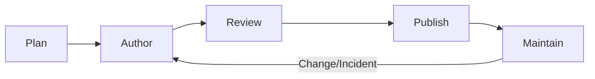
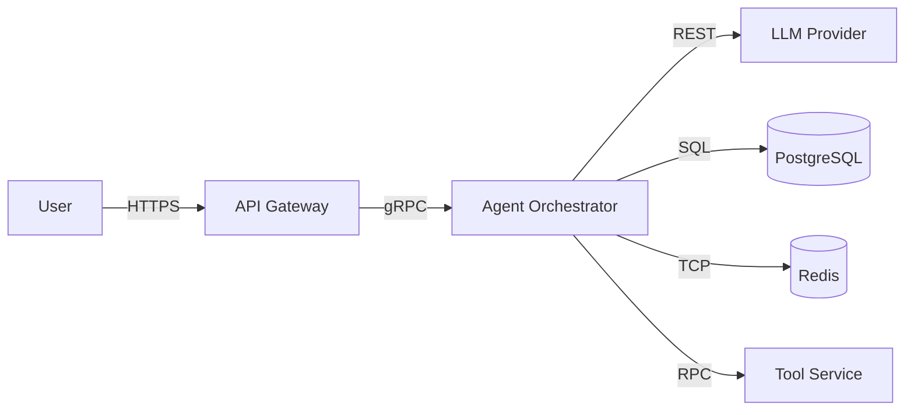
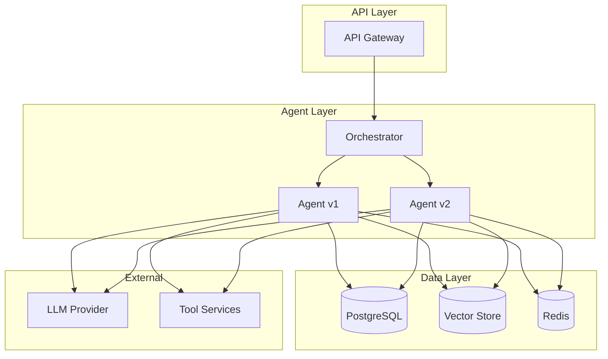
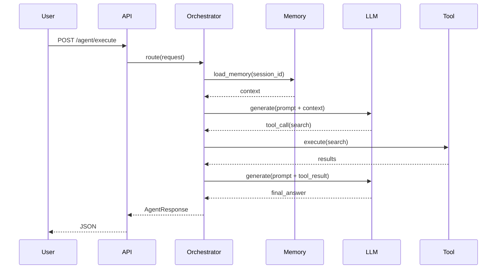
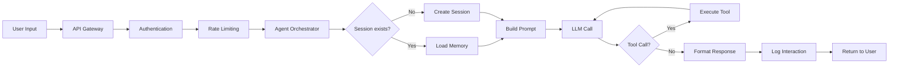
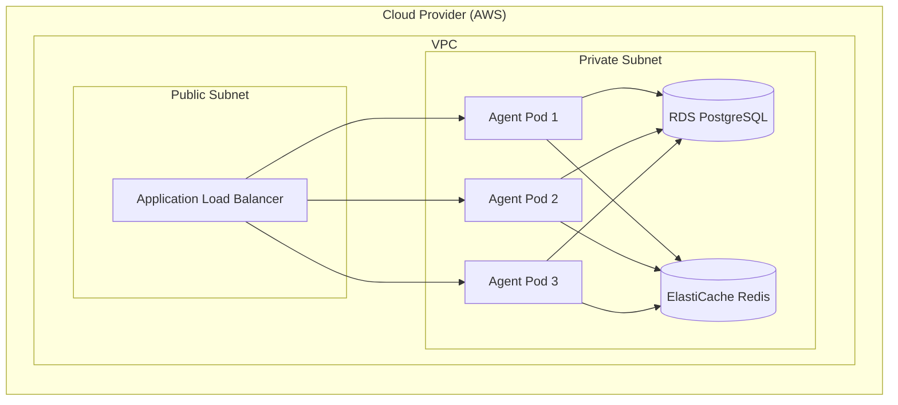
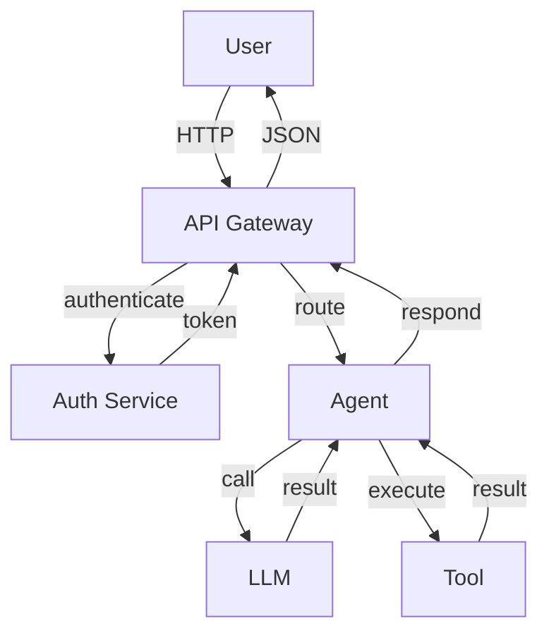
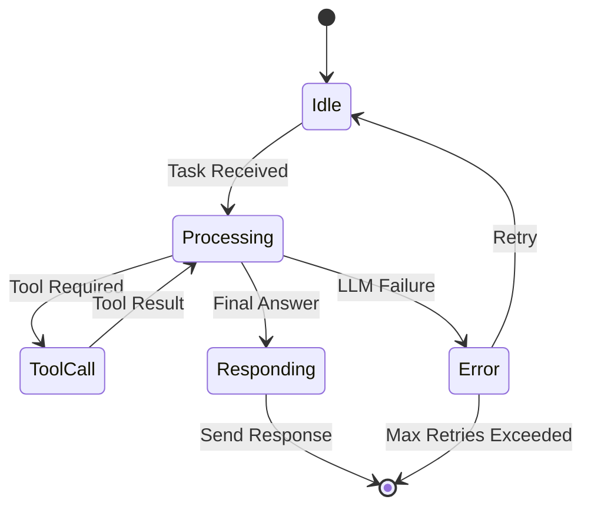
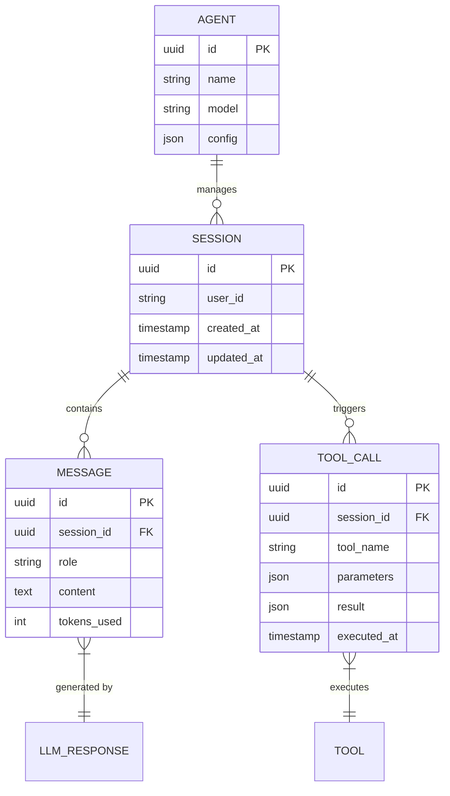
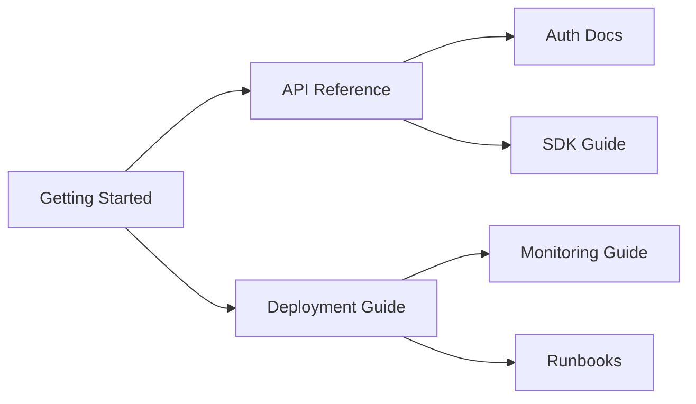

# Documentation Domain - Fundamentals

## Overview

This document covers documentation fundamentals for LLM/agentic systems, including types, structure, tools, processes, accessibility, versioning, style guidance, and governance. It is intended as a comprehensive reference for all documentation produced across the project lifecycle.

---

## Table of Contents

1. [Purpose and Scope](#1-purpose-and-scope)
2. [Types of Documentation](#2-types-of-documentation)
3. [Core Principles](#3-core-principles)
4. [Documentation Lifecycle](#4-documentation-lifecycle)
5. [Audience Analysis](#5-audience-analysis)
6. [Structure and Organization](#6-structure-and-organization)
7. [Tools and Platforms](#7-tools-and-platforms)
8. [Writing Guidelines](#8-writing-guidelines)
9. [Code Documentation](#9-code-documentation)
10. [API Documentation](#10-api-documentation)
11. [Architecture Documentation](#11-architecture-documentation)
12. [Runbook and Operational Docs](#12-runbook-and-operational-docs)
13. [Prompt Documentation](#13-prompt-documentation)
14. [Versioning](#14-versioning)
15. [Accessibility](#15-accessibility)
16. [Maintenance](#16-maintenance)
17. [Governance](#17-governance)
18. [Checklists](#18-checklists)
19. [Diagrams and Visuals](#19-diagrams-and-visuals)
20. [Search and Discovery](#20-search-and-discovery)
21. [Feedback Mechanisms](#21-feedback-mechanisms)
22. [Training and Onboarding](#22-training-and-onboarding)
23. [Compliance](#23-compliance)
24. [Examples and Samples](#24-examples-and-samples)
25. [Glossary](#25-glossary)
26. [Appendices](#26-appendices)

---

## 1. Purpose and Scope

### Why Documentation Matters

Documentation is a first-class product artifact. For LLM/agentic systems, documentation serves multiple critical purposes:

- **Operational Safety**: Runbooks and troubleshooting guides reduce incident time.
- **Developer Velocity**: API docs and examples accelerate integration.
- **User Trust**: Clear guides and limitations set accurate expectations.
- **Compliance**: Audit trails, security controls, and privacy notices satisfy regulators.
- **Knowledge Preservation**: Prevents single points of failure when team members change.

### What This Document Covers

- Documentation types and when to use them.
- Structural templates for common doc artifacts.
- Authoring standards and examples.
- Tooling recommendations.
- Review, versioning, and maintenance workflows.
- Accessibility, search, and governance.

### What Is Out of Scope

- Deep implementation details of a specific agent framework (see framework docs).
- Marketing copy or product positioning.
- Internal only: HR policies, salary bands, confidential product roadmaps.

### Documentation Definition of Done

A documentation artifact is considered complete when:

- Purpose, audience, and prerequisites are stated.
- All parameters, return values, and exceptions are described.
- At least one runnable example is provided.
- Limitations, assumptions, and error conditions are documented.
- Compliance or security notes are included if applicable.
- Review by subject matter expert is recorded.
- Linked from an index or table of contents.

---

## 2. Types of Documentation

### Overview of Documentation Types

| Type | Purpose | Audience | Update Frequency |
|------|---------|----------|------------------|
| README | Project overview, setup, quickstart | Everyone | Per release |
| API Reference | Endpoints, schemas, auth | Developers, Integrators | Per release |
| Runbooks | Operational procedures | On-call Engineers, Ops | Per incident |
| Architecture | System design, ADRs | Engineers, Architects | Per major change |
| Prompt Cards | LLM prompts, model config, examples | ML Engineers, Prompt Authors | Per prompt change |
| Guides | Tutorials, how-tos | Users, Developers | Monthly |
| Changelog | Release notes, breaking changes | Everyone | Per release |
| Troubleshooting | Symptoms, causes, fixes | Operators, Users | Weekly |
| Security | Auth, threat model, policy | Security, Engineering | Quarterly |
| Compliance | Audit, privacy, DPA | Legal, Compliance, DPO | Annually |
| Training | Labs, glossary, onboarding | New hires, Support | Quarterly |
| Style Guide | Terminology, formatting, tone | Authors | As needed |

### When to Use Each Type

Use the following decision matrix to select the appropriate documentation type for a given artifact or update.

- **README**: Always required for new repositories or public-facing packages.
- **API Reference**: Required for every exposed endpoint, SDK method, or CLI command.
- **Runbooks**: Required for every P1/P2 alert, deployment step, and disaster recovery scenario.
- **Architecture**: Required for new services or major architectural changes.
- **Prompt Cards**: Required for every prompt template used in production.
- **Guides**: Recommended for multi-step user or developer workflows.
- **Changelog**: Required for every release with semantic versioning.
- **Troubleshooting**: Required for each documented issue affecting users or operators.
- **Security**: Required before production launch and after each security audit.
- **Compliance**: Required before handling regulated data in production.
- **Training**: Recommended for teams with regular onboarding.
- **Style Guide**: Recommended for any team with multiple documentation authors.

---

## 3. Core Principles

### Clarity

- Use simple, direct language.
- Avoid jargon unless targeting technical experts.
- Define acronyms on first use.

### Accuracy

- Documentation must match implementation.
- Verify examples are runnable and produce expected output.
- Include last-verified dates.

### Completeness

- Cover prerequisites, steps, expected outcomes, and rollback scenarios.
- Document error codes with resolutions.

### Maintainability

- Assign ownership and review cycles.
- Automate where possible (linting, link checking, generating from source).

### Accessibility

- Use semantic HTML and ARIA labels.
- Ensure sufficient color contrast.
- Provide text alternatives for diagrams.

### Convention over Configuration

- Use established formats (OpenAPI, Markdown, ADR).
- Follow team style guide in all docs.

### Traceability

- Link docs to requirements, tickets, and code commits.
- Maintain changelog with references.

---

## 4. Documentation Lifecycle

### Stage 1: Planning

Identify documentation needs based on:

- New feature design documents.
- Architecture decision records.
- Release scope.

Create documentation tasks in the project tracker.

### Stage 2: Authoring

- Draft content using approved templates.
- Include examples, diagrams, and references.
- Use consistent terminology.

### Stage 3: Review

- Peer review by subject matter expert.
- Technical accuracy review.
- Grammar and style review.

### Stage 4: Publication

- Merge documentation changes with code changes.
- Build and deploy documentation site.
- Announce significant updates.

### Stage 5: Maintenance

- Review on scheduled intervals.
- Update after incidents or changes.
- Archive or delete obsolete docs.

### Documentation Lifecycle Diagram



---

## 5. Audience Analysis

### Developer Audience

- Needs precise API signatures.
- Wants runnable code examples.
- Prefers reference material over narrative.
- Values SDK generation and Postman collections.

### Operator Audience

- Needs runbooks and SLIs/SLOs.
- Requires diagnostic commands and clear escalation paths.
- Prefers dashboard links and alert-to-doc links.

### End-User Audience

- Needs simple, plain-language guides.
- Wants task-oriented documentation (how to accomplish X).
- Requires clear error message explanations.

### Compliance Audience

- Needs audit evidence, control descriptions, and data flow diagrams.
- Requires versioned, signed, or timestamped documentation.

### Audience Segmentation Template

```markdown
# Audience Analysis: [Doc Name]

## Primary Audience
Who is this for?

## Secondary Audience
Who else may read this?

## Prerequisites
What must the reader already know?

## Reading Goals
What should they be able to do after reading?

## Tone
Formal, casual, technical, layperson?
```

---

## 6. Structure and Organization

### Documentation Directory Structure

A well-organized directory helps users discover content and authors maintain ownership.

```
docs/
├── README.md
├── CONTRIBUTING.md
├── CODE_OF_CONDUCT.md
├── CHANGELOG.md
├── api/
│   ├── openapi.yaml
│   ├── auth.md
│   ├── agents.md
│   └── tools.md
├── architecture/
│   ├── overview.md
│   ├── data-flow.md
│   ├── adr/
│   │   ├── ADR-001.md
│   │   └── ADR-002.md
│   └── diagrams/
├── guides/
│   ├── getting-started.md
│   ├── deployment.md
│   ├── monitoring.md
│   └── troubleshooting.md
├── operations/
│   ├── runbooks/
│   │   ├── high-error-rate.md
│   │   └── model-failure.md
│   ├── slo.md
│   └── on-call.md
├── prompts/
│   ├── customer-support.md
│   ├── code-assistant.md
│   └── changelog.md
├── compliance/
│   ├── gdpr.md
│   ├── soc2.md
│   └── dpa.md
├── training/
│   ├── onboarding.md
│   ├── glossary.md
│   └── labs/
└── templates/
    ├── adr.md
    ├── runbook.md
    └── prompt-card.md
```

### Navigation Principles

- Group related documents in directories.
- Provide an `index.md` at each major level.
- Use `README.md` at root for orientation.
- Limit depth to three levels when possible.

### Link Conventions

- Use relative paths for internal links.
- Use absolute URLs for external links.
- Avoid bare URLs; use `[link text](url)` format.
- Periodically validate links.

---

## 7. Tools and Platforms

### Static Site Generators

| Tool | Best For | Notes |
|------|----------|-------|
| MkDocs | Python-centric docs, fast setup | Material theme popular |
| Docusaurus | JS/React docs, versioning | Supported by Meta |
| Sphinx | Python library API refs | autodoc support |
| Hugo | High-performance, Go ecosystem | Complex config |
| VitePress | Vue-centric docs | Fast, MDX support |
| GitBook | Collaborative docs | SaaS, less customizable |

### Documentation-as-Code

- Store docs in the same repository as code (or a dedicated docs repo).
- Run CI/CD pipelines for linting, testing, and deployment.
- Review documentation changes via pull requests.

### API Documentation Tools

- **OpenAPI/Swagger**: Standard for RESTful APIs.
- **Postman**: Interactive testing and collection sharing.
- **Stoplight**: API design and portal.
- **Redoc**: Clean OpenAPI HTML rendering.

### Diagram Tools

- **Mermaid**: Markdown-native diagrams (sequence, flowchart, Gantt, C4).
- **PlantUML**: Component, deployment, C4 models.
- **Graphviz**: DOT language for dependency graphs.
- **Diagrams.net**: General-purpose diagramming.
- **Excalidraw**: Whiteboard-style diagrams.

### Linting and Style

- **markdownlint**: Markdown style enforcement.
- **Vale**: Prose linting with custom style rules.
- **pydocstyle**: Python docstring style.
- **pre-commit**: Automate checks on commit.

---

## 8. Writing Guidelines

### Active Voice

- Passive: "The endpoint is called by the client."
- Active: "Call the endpoint from the client."

### Present Tense

- Passive: "The agent would then call the tool."
- Present: "The agent calls the tool."

### Plain Language

- Use short sentences (15-20 words average).
- Define technical terms on first use.
- Use bullet points for lists of 3+ items.

### Numbering and Lists

- Use numbered lists for sequential steps.
- Use bullet points for unordered items.
- Keep list items parallel in structure.

### Consistent Terminology

Choose a term and stick with it.

```markdown
# Bad - Inconsistent
Agent.run()
Agent.execute()
Agent.invoke()

# Good - Consistent
Agent.execute_task()
Agent.execute_task()
```

### Persona and Tone

- **Developer docs**: Neutral, technical, concise.
- **End-user docs**: Friendly, encouraging, plain language.
- **Runbooks**: Directive, no ambiguity, terse.
- **Compliance docs**: Formal, precise, legally reviewed.

### Acronyms and Abbreviations

Define on first use in each document:

```markdown
LLM (Large Language Model) powers the agent.
The agent uses the LLM to generate responses.
```

### Units and Numbers

- Use SI units (seconds, bytes, meters).
- Use commas in large numbers (1,000; 10,000).
- Use two decimal places for percentages (2.5%).

### Internationalization Considerations

- Avoid locale-specific idioms.
- Use ISO dates (YYYY-MM-DD).
- Use UTF-8 encoding.
- Provide translation mechanism for user-facing content.

---

## 9. Code Documentation

### Google-Style Docstrings

```python
def execute_task(
    task: str,
    session_id: str,
    context: Optional[dict] = None
) -> AgentResponse:
    """Execute an agent task and return the response.

    This is the main entry point for running agents.
    It handles memory loading, prompt construction,
    LLM invocation, and tool execution.

    Args:
        task: The task description or question.
        session_id: Unique identifier for this session.
        context: Optional additional runtime context.

    Returns:
        AgentResponse object containing the result text,
        tools used, and metadata.

    Raises:
        ValueError: If task or session_id is empty.
        LLMProviderError: If the LLM call fails.
        ToolExecutionError: If a required tool fails.

    Example:
        >>> agent = Agent(model="gpt-4")
        >>> response = agent.execute_task("Hello", "sess-123")
        >>> print(response.text)
        'Hi! How can I help you?'
    """
```

### NumPy-Style Docstrings

```python
def retrieve_memory(session_id: str, top_k: int = 5) -> list[MemoryEntry]:
    """
    Retrieve relevant memory entries for a session.

    Parameters
    ----------
    session_id : str
        Unique session identifier.
    top_k : int, optional
        Number of entries to retrieve. Default is 5.

    Returns
    -------
    list of MemoryEntry
        List of memory entries sorted by relevance.

    Raises
    ------
    SessionNotFoundError
        If the session does not exist.
    VectorStoreError
        If similarity search fails.

    Examples
    --------
    >>> entries = retrieve_memory("sess-123", top_k=3)
    >>> for entry in entries:
    ...     print(entry.content)
    """
```

### Module-Level Documentation

```python
"""Agent orchestration package.

This package provides classes and utilities for building
LLM-powered agents with tool use, memory, and streaming.

Key classes:
    Agent: Main agent orchestrator.
    ToolRegistry: Registry of available tools.
    MemoryStore: Conversation memory interface.

Example usage:

    from agent import Agent
    agent = Agent(model="gpt-4-turbo")
    result = agent.run("What is the capital of France?")
    print(result)

All production prompts are versioned in the `prompts/` directory.
Configuration is environment-driven via `config.py`.
"""

from .agent import Agent
from .memory import MemoryStore

__all__ = ["Agent", "MemoryStore"]
```

### Inline Comments

Good comments explain why, not what.

```python
# Bad: Redundant
# Increment counter
counter += 1

# Good: Explanation
# Use exponential backoff for model errors to avoid
# hitting rate limits during transient outages.
backoff = min(2 ** attempt, MAX_BACKOFF)
await asyncio.sleep(backoff)
```

### Config and Environment Documentation

```markdown
# Configuration Reference

## Environment Variables

| Variable | Required | Default | Description |
|----------|----------|---------|-------------|
| MODEL_NAME | Yes | gpt-4 | LLM model identifier. |
| API_KEY | Yes | - | API key for model provider. |
| MAX_TOKENS | No | 4096 | Maximum tokens per request. |
| TEMPERATURE | No | 0.7 | Sampling temperature. |
| TOOL_TIMEOUT | No | 30 | Tool execution timeout in seconds. |
| LOG_LEVEL | No | INFO | Logging level. |
| DATABASE_URL | Yes | - | PostgreSQL connection string. |

## Configuration File

The `config.yaml` file should be placed in the working directory.

```yaml
model:
  name: gpt-4-turbo
  temperature: 0.3
  max_tokens: 2048

tools:
  enabled:
    - search
    - database
  timeout: 30
```
```

---

## 10. API Documentation

### OpenAPI Specification

```yaml
openapi: 3.0.3
info:
  title: Agent API
  description: API for executing and managing agent tasks.
  version: 1.0.0
  contact:
    name: API Support
    email: api-support@example.com
    url: https://example.com/support
  license:
    name: MIT
    url: https://opensource.org/licenses/MIT

servers:
  - url: https://api.example.com/v1
    description: Production
  - url: https://api-staging.example.com/v1
    description: Staging

paths:
  /agent/execute:
    post:
      operationId: executeAgent
      tags:
        - agent
      summary: Execute an agent task
      description: |
        Run a task through the agent orchestrator.
        The agent will reason, call tools if needed,
        and return a final response.
      requestBody:
        required: true
        content:
          application/json:
            schema:
              $ref: '#/components/schemas/AgentRequest'
            examples:
              simple:
                summary: Simple query
                value:
                  task: "What is the capital of France?"
                  session_id: "550e8400-e29b-41d4-a716-446655440000"
              complex:
                summary: Query with context
                value:
                  task: "Summarize the latest Q3 report"
                  session_id: "550e8400-e29b-41d4-a716-446655440000"
                  context: {"department": "finance"}
      responses:
        '200':
          description: Successful execution
          content:
            application/json:
              schema:
                $ref: '#/components/schemas/AgentResponse'
              examples:
                simple:
                  summary: Basic response
                  value:
                    response: "The capital of France is Paris."
                    tools_used: []
                    tokens_used: 42
        '400':
          $ref: '#/components/responses/BadRequest'
        '401':
          $ref: '#/components/responses/Unauthorized'
        '429':
          $ref: '#/components/responses/RateLimited'
        '500':
          $ref: '#/components/responses/ServerError'

components:
  schemas:
    AgentRequest:
      type: object
      required:
        - task
        - session_id
      properties:
        task:
          type: string
          minLength: 1
          maxLength: 50000
          description: The task description or user prompt.
        session_id:
          type: string
          format: uuid
          description: Unique identifier for the agent session.
        context:
          type: object
          additionalProperties: true
          description: Optional runtime context (department, user tier).
        parameters:
          type: object
          description: Model parameters (temperature, max_tokens, etc.).
    AgentResponse:
      type: object
      required:
        - response
      properties:
        response:
          type: string
          description: Final response text from the agent.
        tools_used:
          type: array
          items:
            type: string
          description: List of tool names invoked during execution.
        tokens_used:
          type: integer
          description: Total token count consumed.
        metadata:
          type: object
          description: Additional response metadata.
  responses:
    BadRequest:
      description: Invalid request body
      content:
        application/json:
          schema:
            $ref: '#/components/schemas/Error'
    Unauthorized:
      description: Authentication required
    RateLimited:
      description: Too many requests
      headers:
        Retry-After:
          schema:
            type: integer
            description: Seconds until retry is allowed.
    ServerError:
      description: Internal server error
  schemas:
    Error:
      type: object
      required:
        - error
      properties:
        error:
          type: string
          description: Error code.
        details:
          type: string
          description: Human-readable error description.
        request_id:
          type: string
          description: Request ID for support inquiries.
```

### API Implementation with Docstring Sync

```python
from fastapi import FastAPI, HTTPException
from pydantic import BaseModel, Field

app = FastAPI(title="Agent API")

class AgentRequest(BaseModel):
    """Request body for agent execution.

    Attributes:
        task: The task description or prompt.
        session_id: Unique session identifier.
        context: Optional runtime context.
        parameters: Optional model parameters.
    """
    task: str = Field(..., description="Task description")
    session_id: str = Field(..., description="Session ID")
    context: dict = Field(default_factory=dict, description="Runtime context")
    parameters: dict = Field(default_factory=dict, description="Model parameters")

@app.post(
    "/agent/execute",
    summary="Execute agent task",
    tags=["agent"],
    responses={
        400: {"description": "Invalid request"},
        401: {"description": "Unauthorized"},
        429: {"description": "Rate limited"}
    }
)
async def execute_agent(request: AgentRequest):
    """Execute an agent task.

    See the API spec for request/response schemas.
    """
    # Implementation here
    pass
```

---

## 11. Architecture Documentation

### System Context Diagram



### Component Diagram



### Sequence Diagram



### Data Flow Diagram



### Deployment Diagram



### C4 Model - Container

```plantuml
@startuml
!include https://raw.githubusercontent.com/plantuml-stdlib/C4-PlantUML/master/C4_Container.puml

Person(user, "User", "Interacts with the agent system")
Container(spa, "Web App", "React", "Frontend for agent interaction")
Container(api, "API Gateway", "FastAPI", "Routes requests to agent orchestrators")
Container(agent, "Agent Orchestrator", "Python", "Manages LLM calls and tool execution")
ContainerDb(db, "PostgreSQL", "PostgreSQL + pgvector", "Stores sessions, logs, and vector embeddings")
ContainerDb(cache, "Redis", "Redis", "Session cache and rate limiting")
System_Ext(llm, "LLM Provider", "OpenAI / Anthropic API")

Rel(user, spa, "Uses", "HTTPS")
Rel(spa, api, "Calls", "HTTPS/JSON")
Rel(api, agent, "Routes", "gRPC")
Rel(agent, db, "Reads/Writes", "SQL")
Rel(agent, cache, "Caches sessions", "TCP")
Rel(agent, llm, "Generates text", "HTTPS")
@enduml
```

### Infrastructure Diagram (ASCII Alternative)

```text
┌─────────────────────────────────────────────────────────┐
│                        Cloudflare CDN                   │
└──────────────────────────────┬──────────────────────────┘
                               │
┌──────────────────────────────▼──────────────────────────┐
│                     AWS ALB (HTTPS)                     │
└──────────────────────────────┬──────────────────────────┘
                               │
              ┌────────────────┼────────────────┐
              │                │                │
    ┌─────────▼──────┐ ┌──────▼─────────┐ ┌──▼──────────────┐
    │  Agent Pod 1   │ │ Agent Pod 2    │ │ Agent Pod 3     │
    │  (FastAPI)     │ │ (FastAPI)      │ │ (FastAPI)       │
    └────────┬───────┘ └────────┬───────┘ └────────┬───────┘
             │                   │                   │
             └───────────────────┼───────────────────┘
                                 │
                  ┌──────────────▼──────────────┐
                  │     EKS Cluster             │
                  └─────────────────────────────┘
                                 │
              ┌──────────────────┼──────────────────┐
              │                  │                  │
    ┌─────────▼──────┐ ┌───────▼────────┐ ┌──────▼──────────────┐
    │  RDS Postgres  │ │ ElastiCache    │ │ S3 (Logs/Assets)    │
    │  (pgvector)    │ │ Redis          │ │                     │
    └────────────────┘ └────────────────┘ └─────────────────────┘
```

---

## 12. Runbook and Operational Docs

### Standard Runbook Template

```markdown
# Runbook: [Failure Mode Name]

## Description

Brief description of the failure mode and its impact.

## Severity

P1, P2, P3

## Affected Services

- Agent Orchestrator
- Model Provider Connector

## Detection

- Alert: `AlertNameHere`
- Dashboard: [Link to Grafana](https://grafana.example.com/d/agent)
- Threshold: error_rate > 0.05 for 5 minutes

## Roles

- Incident Commander: oncall-engineer
- Communications: oncall-comm
- Technical Lead: engineering-manager

## Diagnosis

1. Check recent deployments:
   ```bash
   kubectl rollout history deployment/agent
   ```
2. Review errors in Datadog:
   ```
   service:agent status:error
   ```
3. Check model provider status: https://status.openai.com

## Remediation

### Option A: Revert Deployment

```bash
kubectl rollout undo deployment/agent
```

### Option B: Enable Fallback Model

```bash
kubectl set env deployment/agent MODEL_FALLBACK=true
```

### Option C: Scale Up

```bash
kubectl scale deployment/agent --replicas=10
```

## Escalation

- After 15 minutes: escalate to @engineering-manager.
- If data loss: notify Security and Legal.

## Post-Incident

- File post-mortem within 24 hours.
- Update this runbook based on findings.
- Schedule follow-up ticket.

## Related

- [Architecture](../architecture/overview.md)
- [Monitoring](../operations/slo.md)
```

### Deployment Runbook

```markdown
# Runbook: Agent Deployment

## Pre-Deployment Checklist

- [ ] Tests pass (unit, integration, eval)
- [ ] Documentation updated for changes
- [ ] Prompt changes reviewed and approved
- [ ] Database migrations ready
- [ ] Feature flag configured

## Deployment Steps

### Step 1: Build and Push Docker Image

```bash
docker build -t agent:v1.2.3 ./src
docker tag agent:v1.2.3 registry.example.com/agent:v1.2.3
docker push registry.example.com/agent:v1.2.3
```

### Step 2: Update Kubernetes Manifests

```bash
kubectl set image deployment/agent agent=registry.example.com/agent:v1.2.3
kubectl rollout status deployment/agent
```

### Step 3: Verify Health Checks

```bash
kubectl get pods -l app=agent
kubectl exec <pod> -- curl -f http://localhost:8000/health
```

### Step 4: Monitor

Watch the following for 15 minutes:

- Error rate dashboard
- Latency p95 and p99
- Queue depth

## Rollback

```bash
kubectl rollout undo deployment/agent
kubectl rollout status deployment/agent
```

## Post-Deployment

- [ ] Production validation passed
- [ ] Release notes published
- [ ] Changelog updated
```

---

## 13. Prompt Documentation

### Prompt Card Template

```markdown
# Prompt Card: Customer Support Agent

## Metadata

| Field | Value |
|-------|-------|
| Version | 2.1.0 |
| Status | Active |
| Author | @jane-doe |
| Created | 2024-01-01 |
| Updated | 2024-01-15 |
| Model | gpt-4-turbo |
| Temperature | 0.3 |
| Max Tokens | 2048 |
| Frequency Penalty | 0.0 |
| Presence Penalty | 0.0 |

## Purpose

Handle incoming customer product inquiries via chat interface.
Route to appropriate tools (search, lookup_order) for factual data.

## System Prompt

```
You are a helpful customer support agent for Acme Corp.
Your goal is to answer product questions accurately using
the provided tools.

Rules:
- Always use the search tool for product availability.
- Never discuss pricing or competitors.
- If unsure, escalate to human support.
- Be polite and concise.
```

## Available Tools

- `search(query: str)`: Search product catalog.
- `lookup_order(order_id: str)`: Retrieve order status.
- `escalate(reason: str)`: Transfer to human agent.

## Few-Shot Examples

### Example 1: Product Availability

**User:** Do you have the Acme Widget in stock?

**Agent:** Let me check our inventory for you.
[tool: search("Acme Widget")]
Yes, the Acme Widget is currently in stock. We have 42 units available.

### Example 2: Order Status

**User:** Where is my order #12345?

**Agent:** Let me look that up.
[tool: lookup_order("12345")]
Your order #12345 shipped yesterday via FedEx. Tracking: 123456789.

### Example 3: Escalation

**User:** I want a refund for order #54321.

**Agent:** I understand you would like a refund.
[tool: escalate("refund request")]
I have escalated this to our refunds team. You will be contacted within 24 hours.

## Constraints

- Do not provide personal account information.
- Do not process refunds directly.
- Do not discuss competitor products or pricing.
- Do not guess if information is unavailable.

## Evaluation Metrics

| Metric | Target | Current |
|--------|--------|---------|
| Accuracy | >= 90% | 94% |
| Tool Call Rate | >= 80% | 87% |
| Escalation Rate | <= 5% | 2.3% |
| User Satisfaction | >= 4.0/5 | 4.3/5 |

## Changelog

| Version | Date | Author | Change |
|---------|------|--------|--------|
| 2.1.0 | 2024-01-15 | @jane | Added `escalate` tool instructions |
| 2.0.0 | 2024-01-01 | @john | Migrated to GPT-4 prompts |
| 1.5.0 | 2023-12-01 | @jane | Added multi-language support |

## Related

- [Prompt Library](../prompts/index.md)
- [Evaluation Guide](../guides/evaluation.md)
```

### Prompt Versioning Strategy

```python
from datetime import datetime
from pathlib import Path
from typing import Optional

class PromptVersionManager:
    """Manage prompt versions with metadata and changelog."""

    def __init__(self, storage_path: str):
        self.storage_path = Path(storage_path)

    def save(
        self,
        name: str,
        prompt: str,
        version: str,
        metadata: dict,
        author: str
    ):
        """Save a new prompt version.

        Args:
            name: Prompt family name (e.g., 'customer-support').
            prompt: The prompt text.
            version: Semantic version string (e.g., '2.1.0').
            metadata: Dict of model, temperature, description, etc.
            author: GitHub username of author.
        """
        entry = {
            "name": name,
            "version": version,
            "prompt": prompt,
            "metadata": metadata,
            "author": author,
            "saved_at": datetime.utcnow().isoformat(),
            "changelog": metadata.get("changelog", "")
        }
        path = self.storage_path / name / f"{version}.json"
        path.parent.mkdir(parents=True, exist_ok=True)
        path.write_text(json.dumps(entry, indent=2))

    def get(self, name: str, version: str = "latest") -> dict:
        """Retrieve a prompt by name and version."""
        if version == "latest":
            versions = sorted(self.storage_path.glob(f"{name}/*.json"))
            if not versions:
                raise FileNotFoundError(f"No prompts found for {name}")
            path = versions[-1]
        else:
            path = self.storage_path / name / f"{version}.json"
        return json.loads(path.read_text())

    def list_versions(self, name: str) -> list:
        """List all versions for a prompt family."""
        versions = sorted(self.storage_path.glob(f"{name}/*.json"))
        return [v.stem for v in versions]
```

---

## 14. Versioning

### Semantic Versioning for Documentation

```
MAJOR.MINOR.PATCH

MAJOR: Breaking changes (endpoint removed, prompt behavior changes)
MINOR: New features (new endpoints, new examples)
PATCH: Corrections (typos, clarifications, bug fixes)
```

### Documentation Changelog

```markdown
# Changelog

All notable changes to the documentation are documented here.

## [Unreleased]

### Added

- Kubernetes deployment guide

### Changed

- Clarified authentication section in API docs

### Fixed

- Corrected incorrect model endpoint URL

## [1.1.0] - 2024-01-15

### Added

- Prompt card template for customer support
- Runbook for model failure

### Changed

- Updated README with new contributors

## [1.0.0] - 2023-12-01

### Added

- Initial documentation release
- API reference
- Getting started guide
```

### Deprecation Policy

```markdown
# Deprecation Policy

## Deprecation Timeline

1. **Announce**: Deprecation notice added to docs and API response headers.
2. **Support Period**: Minimum 90 days.
3. **Sunset**: Endpoint or feature removed.

## Header Format

```
Sunset: Sat, 30 Mar 2024 23:59:59 GMT
Link: <https://example.com/docs/deprecated-endpoint>; rel="deprecation"
Link: <https://example.com/docs/replacement-endpoint>; rel="successor-version"
```
```

---

## 15. Accessibility

### WCAG 2.1 Guidelines

Documentation should meet WCAG 2.1 AA standards.

### Text Alternatives

```markdown

```

### Semantic Structure

```markdown
# Page Title (H1)

## Section (H2)

### Subsection (H3)

#### Sub-subsection (H4)
```

Avoid skipping heading levels.

### Color Contrast

Ensure 4.5:1 contrast ratio for normal text, 3:1 for large text.

```css
/* High contrast */
body {
    color: #1a1a1a;       /* Near black */
    background: #ffffff;   /* White */
}
a {
    color: #0056b3;       /* Dark blue */
}
code {
    background: #f4f4f4;
    color: #d63384;
}
```

### Keyboard Navigation

- All interactive elements must be focusable.
- Logical tab order through navigation and content.
- Skip-to-content links provided:

```html
<a href="#main" class="skip-link">Skip to main content</a>
<main id="main">
  <!-- Content -->
</main>
```

### Screen Reader Support

- Use ARIA landmarks (`role="navigation"`, `role="main"`).
- Provide descriptive link text (`Learn about agents`) vs. `click here`.
- Avoid auto-playing audio or flashing content.

---

## 16. Maintenance

### Documentation Review Policy

- Every doc must have an assigned owner.
- Review cycles based on doc type.
- Stale docs (>90 days) flagged for review.

### Maintenance Schedule

| Document Type | Review Interval | Owner |
|---------------|-----------------|-------|
| API Reference | Every release | @team-api |
| Runbooks | Quarterly | @team-ops |
| Architecture | Semi-annually | @team-arch |
| Prompt Cards | Per change | @team-ml |
| Getting Started | Annually | @team-docs |
| Compliance | Annually | @team-legal |

### Freshness Monitoring

```python
from datetime import datetime, timedelta
from pathlib import Path

class DocFreshnessMonitor:
    def __init__(self, docs_dir: str):
        self.docs_dir = Path(docs_dir)
        self.threshold = timedelta(days=90)

    def check(self) -> dict:
        stale, fresh = [], []
        for md in self.docs_dir.rglob("*.md"):
            mtime = datetime.fromtimestamp(md.stat().st_mtime)
            age = datetime.now() - mtime
            if age > self.threshold:
                stale.append(str(md))
            else:
                fresh.append(str(md))
        return {"stale": stale, "fresh": fresh}
```

### Documentation Debt Tracker

```markdown
# Documentation Debt

| Doc | Issue | Ticket | Priority |
|-----|-------|--------|----------|
| api/tools.md | Missing tool schema | TECH-456 | P1 |
| guides/streaming.md | Outdated code examples | TECH-512 | P2 |
| prompt/customer-support.md | Missing prompt changelog | TECH-489 | P0 |
```

---

## 17. Governance

### Documentation Policy

```markdown
# Documentation Policy

## Scope

All public and internal documentation affecting users, operators,
or compliance posture.

## Requirements

- All API endpoints must have OpenAPI specs.
- All production prompts must have prompt cards.
- All deployment steps must have runbooks.
- Documentation changes require peer review.
- Code examples must be tested and verified.

## Review Process

1. Author creates pull request.
2. Automated checks run (lint, links, tests).
3. Peer review required.
4. Final approver merges.

## Roles

- **Doc Author**: Creates and maintains docs.
- **Reviewer**: Technical accuracy review.
- **Approver**: Engineering manager or tech lead.
```

### Change Control

```python
class DocChangeControl:
    def __init__(self):
        self.review_routes = {
            "api/": ["@team-api", "@tech-writer"],
            "guides/": ["@team-docs"],
            "operations/": ["@team-ops", "@oncall-lead"],
            "compliance/": ["@team-legal", "@dpo"],
            "prompts/": ["@team-ml"]
        }

    def get_required_reviewers(self, doc_path: str) -> list:
        for prefix, reviewers in self.review_routes.items():
            if doc_path.startswith(prefix):
                return reviewers
        return ["@team-owner"]
```

---

## 18. Checklists

### PR Documentation Checklist

```markdown
# Documentation PR Checklist

## Before Submitting

- [ ] Spell-check completed
- [ ] Links tested
- [ ] Code examples run successfully
- [ ] Diagrams render correctly
- [ ] All sections filled out (no placeholders)

## For Code Changes

- [ ] Docstrings added/updated
- [ ] API reference updated
- [ ] New examples included
- [ ] Breaking changes documented in CHANGELOG.md

## For Operational Changes

- [ ] Runbooks updated
- [ ] Alert descriptions include doc links
- [ ] On-call notified of runbook changes

## For Prompt Changes

- [ ] Prompt card version update
- [ ] Evaluation results included
- [ ] Changelog entry added

## Review Gates

- [ ] Technical review approved
- [ ] Grammar/style review approved
- [ ] Accessibility check passed
- [ ] Linting passed
```

### Release Documentation Checklist

```markdown
# Release Documentation Checklist

## Planning Phase

- [ ] Documentation scope identified
- [ ] Authors assigned
- [ ] Due dates set

## Authoring Phase

- [ ] README updated (new features)
- [ ] API reference updated
- [ ] Migration guide drafted (if breaking changes)
- [ ] Release notes drafted

## Review Phase

- [ ] Technical review completed
- [ ] Legal/compliance review (if needed)
- [ ] UX/content review completed

## Publication Phase

- [ ] Docs built and deployed
- [ ] Navigation updated
- [ ] Announcements sent
- [ ] Old versions archived
```

---

## 19. Diagrams and Visuals

### When to Use Diagrams

- System architecture: use C4 or component diagrams.
- Data flows: use flowcharts or sequence diagrams.
- Directory structures: use tree diagrams.
- Comparisons: use tables or Venn diagrams.

### Mermaid Diagram Examples







### Diagram Naming Conventions

- Use PascalCase for entities in C4 diagrams.
- Use verbs for actions in sequence diagrams.
- Include timestamps or version numbers in diagram filenames.
- Store source `.puml` or `.mmd` files in version control.

---

## 20. Search and Discovery

### Full-Text Search Implementation

```python
import re
from pathlib import Path
from collections import defaultdict

class DocSearch:
    def __init__(self, docs_dir: str):
        self.docs_dir = Path(docs_dir)
        self.index = self._build_index()

    def _build_index(self) -> dict:
        index = defaultdict(set)
        for md in self.docs_dir.rglob("*.md"):
            content = md.read_text().lower()
            words = re.findall(r"\b[a-z0-9]+\b", content)
            for word in set(words):
                if len(word) > 2:  # Skip short words
                    index[word].add(str(md))
        return dict(index)

    def search(self, query: str, limit: int = 10) -> list:
        words = set(re.findall(r"\b[a-z0-9]+\b", query.lower()))
        scores = defaultdict(int)
        for word in words:
            for doc in self.index.get(word, []):
                scores[doc] += 1
        return sorted(scores.items(), key=lambda x: x[1], reverse=True)[:limit]
```

### Sitemap Generation

```python
class SitemapGenerator:
    def __init__(self, docs_dir: str, base_url: str):
        self.docs_dir = Path(docs_dir)
        self.base_url = base_url

    def generate(self) -> str:
        urls = []
        for md in sorted(self.docs_dir.rglob("*.md")):
            if md.name in ("404.md", "README.md"):
                continue
            relative = md.relative_to(self.docs_dir).with_suffix("")
            url = f"{self.base_url}/{relative}.html"
            urls.append(f"<url><loc>{url}</loc><changefreq>weekly</changefreq></url>")
        return f"""<?xml version="1.0" encoding="UTF-8"?>
<urlset xmlns="http://www.sitemaps.org/schemas/sitemap/0.9">
{chr(10).join(urls)}
</urlset>"""
```

### Related Content



---

## 21. Feedback Mechanisms

### In-Page Feedback Form

```markdown
---
Was this page helpful?

- Yes
- No
- [Submit feedback](https://forms.example.com/doc-feedback?path=/api/agents)
---

Your feedback goes to #docs-feedback.
```
```

### Feedback Collection API

```python
from fastapi import FastAPI, Request
from datetime import datetime

app = FastAPI()

@app.post("/feedback")
async def submit_feedback(request: Request):
    data = await request.json()
    entry = {
        "path": data.get("path"),
        "rating": data.get("rating"),
        "feedback": data.get("feedback"),
        "user_agent": request.headers.get("user-agent"),
        "timestamp": datetime.utcnow().isoformat()
    }
    # Store in database
    store_feedback(entry)
    return {"status": "ok"}
```

### GitHub Issue Template

```markdown
---
name: Documentation Issue
about: Report documentation problems
title: "[docs] "
labels: documentation
assignees: ''

---

**Page:** [URL or path]
**Issue type:**
- [ ] Broken link
- [ ] Incorrect information
- [ ] Missing example
- [ ] Unclear explanation
- [ ] Accessibility issue

**Details:**
```

---

## 22. Training and Onboarding

### Onboarding Path

```markdown
# New Engineer Onboarding: Agent Platform

## Week 1

### Day 1: Setup

1. Clone repository: `git clone https://github.com/org/agent.git`
2. Install dependencies: `pip install -r requirements.txt`
3. Verify setup: `pytest tests/ --smoke`

### Day 2-3: Reading

- [Architecture Overview](../architecture/overview.md)
- [Getting Started](../guides/getting-started.md)
- [API Reference](../api/overview.md)

### Day 4-5: First Task

- Pick a `good-first-issue` labeled ticket.
- Submit your first documentation PR.

## Week 2

- Shadow on-call engineer.
- Attend architecture review.
- Complete [Security Training](https://training.example.com).

## Month 1

- Own one runbook improvement.
- Write a prompt card for a new feature.
- Present architecture overview in team meeting.

## Resources

- [Team Wiki](https://wiki.example.com/agent-team)
- Slack: #agent-platform
- Meetings: Weekly on Thursdays 10am
```

### Labs

```markdown
# Lab 1: Build a Simple Agent

## Objective

Create an agent that answers questions using a search tool.

## Prerequisites

- Python 3.11+
- Docker installed
- Git access

## Steps

1. **Initialize project**

   ```bash
   agent init my-search-agent
   cd my-search-agent
   ```

2. **Define the tool**

   ```python
   def search(query: str) -> str:
       # Mock search function
       return f"Results for: {query}"
   ```

3. **Create the prompt**

   ```
   You are a research assistant. Use the search tool to answer questions.
   ```

4. **Run the agent**

   ```bash
   agent run
   ```

5. **Evaluate**

   Test with these questions:
   - What is the refund policy?
   - How do I change my password?
   - Where can I find my order history?

## Success Criteria

- Agent uses the search tool for at least 4/5 factual questions.
- Responses contain relevant keywords.
- Response time is under 3 seconds.
```

### Glossary

```markdown
# Glossary of Terms

| Term | Definition |
|------|-----------|
| Agent | Autonomous LLM-powered system that reasons and acts. |
| LLM | Large Language Model (e.g., GPT-4, Claude 3). |
| Tool | External function the agent can call to perform actions. |
| Prompt | Input text provided to the LLM. |
| Context Window | Maximum tokens the model can process in one call. |
| Token | Sub-word unit of text processed by LLMs. |
| Memory | Storage for conversation history and session context. |
| Streaming | Incremental delivery of model output tokens. |
| Embedding | Dense vector representation of text. |
| RAG | Retrieval-Augmented Generation. |
| Hallucination | LLM generating plausible but incorrect information. |
| Guardrail | Constraint on agent behavior (input/output filters). |
| Orchestrator | Component that coordinates LLM calls, tools, and memory. |
| Few-Shot | Providing examples in the prompt to guide behavior. |
| Temperature | Sampling parameter controlling randomness (0-2). |
| Top-P | Nucleus sampling parameter. |
| Function Calling | LLM feature to request external function execution. |
| ADR | Architecture Decision Record. |
| SLA | Service Level Agreement. |
| SLO | Service Level Objective. |
| Runbook | Operational procedure for incident response. |
| DPA | Data Processing Agreement. |
| BAA | Business Associate Agreement (HIPAA). |
| PII | Personally Identifiable Information. |
| ePHI | Electronic Protected Health Information. |
| SOC 2 | System and Organization Controls 2. |
```

### Cheat Sheet

```markdown
# Agent Platform Cheat Sheet

## Common Commands

| Command | Purpose |
|---------|---------|
| `agent init <name>` | Initialize new agent project |
| `agent run` | Run agent locally |
| `agent eval` | Run evaluation suite |
| `agent test` | Run unit and integration tests |
| `agent deploy` | Deploy to staging |
| `agent logs` | Tail production logs |

## Common Configuration

| Env Variable | Default | Description |
|--------------|---------|-------------|
| MODEL_NAME | gpt-4 | LLM identifier |
| MAX_TOKENS | 4096 | Token limit per request |
| TEMPERATURE | 0.7 | Sampling randomness |
| TOOL_TIMEOUT | 30 | Tool execution timeout (seconds) |
| LOG_LEVEL | INFO | Logging verbosity |

## Common Issues

| Symptom | Cause | Fix |
|---------|-------|-----|
| 429 Too Many Requests | Rate limit | Backoff and retry |
| 401 Unauthorized | Missing/invalid token | Refresh token |
| Tool timeout | Tool service down | Check /health endpoint |
| Empty response | Context too large | Reduce context window |
```

---

## 23. Compliance

### Audit Requirements

```markdown
# Compliance Documentation Requirements

## SOC 2 Type II

- [ ] System description documented
- [ ] Control objectives listed
- [ ] Control activities described
- [ ] Evidence collection automated
- [ ] Quarterly testing results archived

## GDPR

- [ ] Data processing records (Art. 30)
- [ ] Data protection impact assessment
- [ ] Privacy notices for users
- [ ] Data retention policies documented
- [ ] Data subject request procedures

## HIPAA

- [ ] BAA signed with all PHI vendors
- [ ] Access controls for ePHI documented
- [ ] Audit trail for ePHI access available
- [ ] Breach notification procedures defined

## PCI-DSS (if applicable)

- [ ] Cardholder data not logged
- [ ] Network segmentation documented
- [ ] vulnerability scans current
```

### Data Processing Agreement Summary

```markdown
# Data Processing Agreement (DPA) Summary

## Controller and Processor

- **Controller**: Acme Corp (user organization)
- **Processor**: Agent Platform Inc (data processing service)

## Data Categories

- Session identifiers
- Conversation transcripts
- User-provided context data
- Tool call and response data

## Security Measures

- Encryption at rest: AES-256
- Encryption in transit: TLS 1.3
- Access controls: RBAC with least privilege
- Audit logging: immutable logs retained 2 years
- Penetration testing: annual

## Data Retention

- Sessions: 90 days
- Logs: 30 days
- Audit trails: 2 years

## Subprocessors

- OpenAI (LLM provider, US/EU)
- AWS (infrastructure, US/EU)
- Stripe (payments, if applicable)

## User Rights

- Access: Users can export their data.
- Deletion: Users can request session deletion.
- Portability: Data export in JSON format.
```

---

## 24. Examples and Samples

### Example Gallery

```markdown
# Example Gallery

| Example | Description | Complexity | Link |
|---------|-------------|------------|------|
| Basic Chat | Simple text-only agent | Beginner | [basic.md](./basic.md) |
| Tool Use | Agent with search tool | Intermediate | [tools.md](./tools.md) |
| Streaming | Token streaming responses | Intermediate | [streaming.md](./streaming.md) |
| Multi-Tool | Multiple tool coordination | Intermediate | [multi-tool.md](./multi-tool.md) |
| RAG | Retrieval augmented generation | Advanced | [rag.md](./rag.md) |
| Multi-Agent | Agent orchestration | Advanced | [multi-agent.md](./multi-agent.md) |
| Evaluation | Measuring agent quality | Advanced | [evaluation.md](./evaluation.md) |
```

### Example Structure Template

```markdown
# Example: [Name]

## Overview

Brief description of what this example demonstrates.

## Prerequisites

- Python 3.11+
- Agent SDK installed
- API key configured

## Steps

### Step 1: Setup

```python
# Code here
```

### Step 2: Execute

```python
# Code here
```

## Expected Output

```
# Output here
```

## Explanation

Walk through what the code does.

## See Also

- [Related Example](./other.md)
- [API Reference](../api/agents.md)
```

### Runnable Example: Basic Agent

```python
"""
Example: Basic Agent Execution

Run with: python examples/basic_execution.py

Prerequisites:
- pip install agent-framework
- Set OPENAI_API_KEY
"""
import asyncio
from agent import Agent

async def main():
    # Initialize agent
    agent = Agent(
        name="demo-agent",
        model="gpt-4-turbo"
    )

    # Execute a task
    response = await agent.execute(
        task="What is 2+2? Answer concisely."
    )

    print(f"Response: {response.text}")
    print(f"Tokens used: {response.tokens_used}")

if __name__ == "__main__":
    asyncio.run(main())
```

### Runnable Example: Multi-Tool Agent

```python
"""
Example: Multi-Tool Agent

Demonstrates an agent that uses multiple tools.
"""
import asyncio
from agent import Agent, Tool

def search(query: str) -> str:
    """Search a knowledge base."""
    return f"Results for: {query}"

def calculate(expression: str) -> str:
    """Evaluate a math expression."""
    try:
        result = eval(expression)
        return f"Result: {result}"
    except Exception as e:
        return f"Error: {e}"

async def main():
    tools = [Tool(name="search", func=search), Tool(name="calculate", func=calculate)]
    agent = Agent(name="multi-tool-agent", tools=tools)

    response = await agent.execute(
        task="What is 15% of 240? Search for tax rate."
    )
    print(response.text)

if __name__ == "__main__":
    asyncio.run(main())
```

---

## 25. README Structure

### Standard README Template

```markdown
# [Project Name]

Brief description (one sentence).

[](https://github.com/org/agent/actions)
[](./LICENSE)
[](https://www.python.org)

## Features

- Feature 1
- Feature 2
- Feature 3

## Installation

```bash
pip install agent-framework
```

## Quick Start

```python
from agent import Agent

agent = Agent()
response = agent.run("Hello")
print(response)
```

## Documentation

- [API Reference](./docs/api/overview.md)
- [Getting Started Guide](./docs/guides/getting-started.md)
- [Runbooks](./docs/operations/runbooks/)

## Examples

See the [examples directory](./examples/) for runnable scripts.

## Contributing

See [CONTRIBUTING.md](./CONTRIBUTING.md).

## License

[MIT](./LICENSE)
```

---

## 26. Appendices

### Reference Links

- [OpenAPI Specification](https://spec.openapis.org/oas/v3.0.3)
- [Markdown Guide](https://www.markdownguide.org/)
- [Mermaid Documentation](https://mermaid.js.org/)
- [C4 Model](https://c4model.com/)
- [WCAG 2.1 Guidelines](https://www.w3.org/WAI/WCAG21/quickref/)
- [Keep a Changelog](https://keepachangelog.com/)
- [Semantic Versioning](https://semver.org/)
- [ADR GitHub Template](https://adr.github.io/)

### Style Checklist

- [x] All headings follow hierarchy (H1 -> H2 -> H3)
- [x] All code blocks have language annotation
- [x] All links have descriptive text
- [x] All images have alt text
- [x] No trailing whitespace
- [x] Line length under 120 characters
- [x] Consistent terminology throughout

### Writing Resources

- *On Writing Well* by William Zinsser
- *The Elements of Style* by Strunk & White
- *Docs for Developers* by Jared Bhatti

---

## Related Files

- [Best Practices](./best-practices.md)
- [Anti-Patterns](./anti-patterns.md)
- [Examples](./examples.md)
- [Advanced](./advanced.md)
- [Checklist](./checklist.md)
- [Troubleshooting](./troubleshooting.md)
