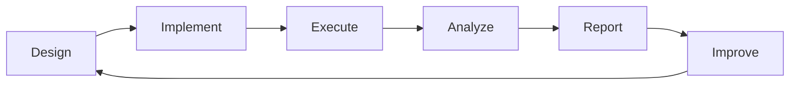

# Evaluation Domain

## Overview

The Evaluation domain provides comprehensive guidance for evaluating LLM and agentic systems across safety, quality, performance, and compliance dimensions.

## Architecture

```mermaid
flowchart TD
    A[Evaluation Domain] --> B[Fundamentals]
    A --> C[Best Practices]
    A --> D[Anti-Patterns]
    A --> E[Checklist]
    A --> F[Examples]
    A --> G[Troubleshooting]
    A --> H[Advanced]
    
    B --> B1[Core Concepts]
    B --> B2[Evaluation Types]
    B --> B3[Evaluation Framework]
    
    C --> C1[Layered Evaluation]
    C --> C2[Data Management]
    C --> C3[Automation]
    
    D --> D1[Common Mistakes]
    D --> D2[Prevention]
    
    E --> E1[P0 Critical Checks]
    E --> E2[P1 High Priority]
    E --> E3[P2 Medium Priority]
    
    F --> F1[Safety Evaluation]
    F --> F2[Quality Evaluation]
    F --> F3[Performance Evaluation]
    
    G --> G1[Issue Diagnosis]
    G --> G2[Solutions]
    
    H --> H1[Continuous Evaluation]
    H --> H2[Adversarial Testing]
    H --> H3[Compliance]
```

## Evaluation Flow

## Files

| File | Purpose | Lines |
|------|---------|-------|
| evaluation-fundamentals.md | Core evaluation concepts | 549 |
| evaluation-best-practices.md | Recommended patterns | 587 |
| evaluation-anti-patterns.md | Common mistakes | 569 |
| evaluation-checklist.md | Verification steps | 314 |
| evaluation-examples.md | Practical examples | 774 |
| evaluation-troubleshooting.md | Issue solutions | 797 |
| evaluation-advanced.md | Advanced techniques | 707 |

## Quick Start

1. Read `evaluation-fundamentals.md` for core concepts
2. Review `evaluation-best-practices.md` for recommended patterns
3. Use `evaluation-checklist.md` for verification steps
4. Reference `evaluation-examples.md` for implementation guidance
