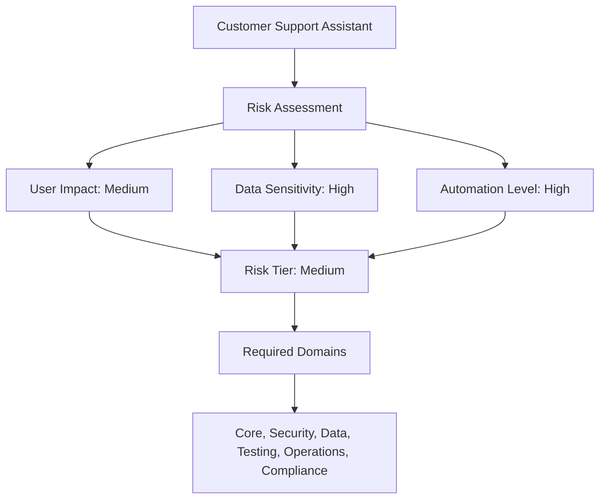
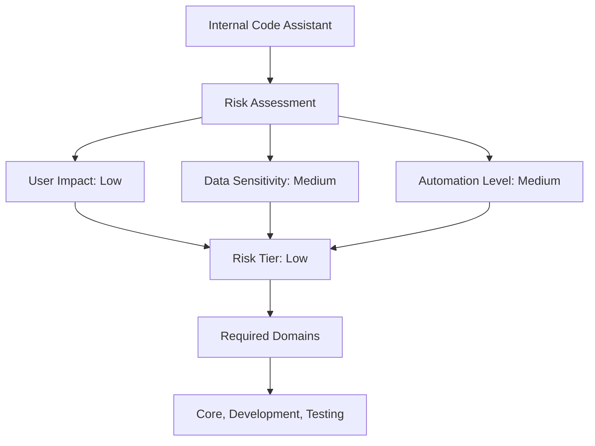
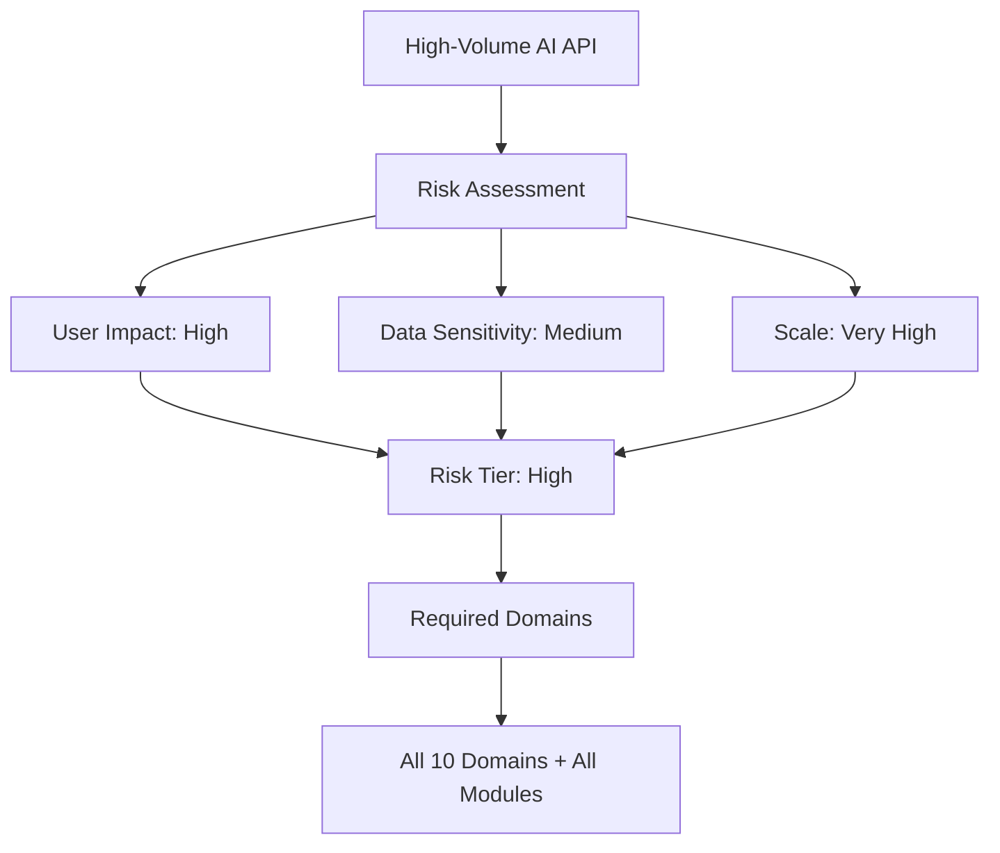
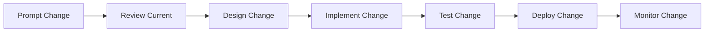
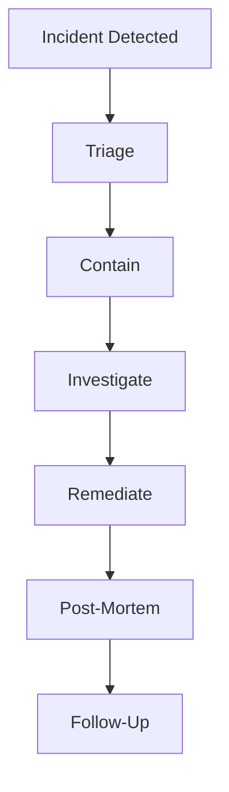
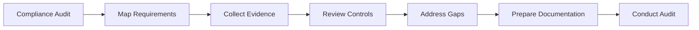
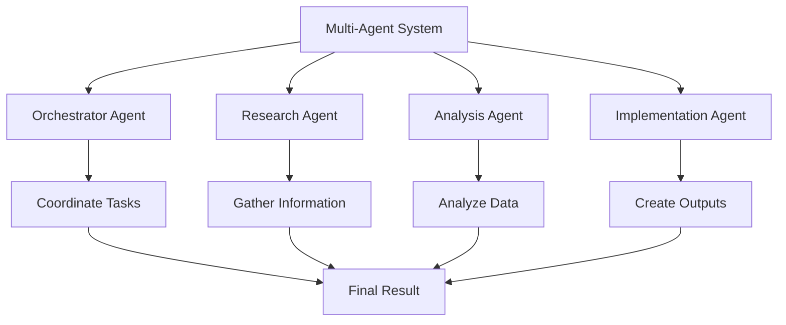
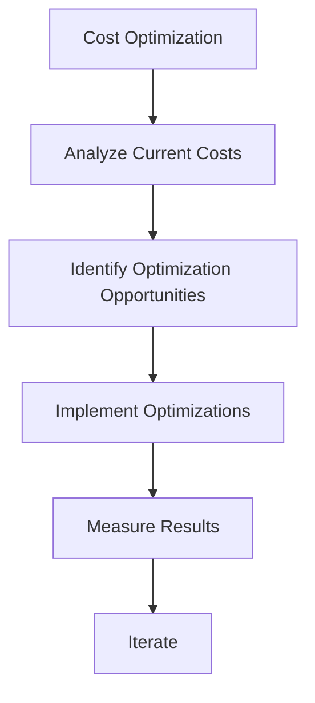

# Examples - LLM & Agentic Rules Framework

## Overview

This document provides practical examples of using the LLM & Agentic Rules Framework.

## Example 1: Customer Support Assistant

### System Description

A customer support chatbot that handles product inquiries, troubleshooting, and account management.

### Risk Assessment



### Domain Selection

| Domain | Why Required |
|--------|--------------|
| Core | System architecture and design |
| Security | User data protection |
| Data | Customer PII handling |
| Testing | Quality assurance |
| Operations | Production reliability |
| Compliance | Customer data regulations |

### Implementation

```bash
# Step 1: Read core fundamentals
less domains/01-core/fundamentals.md

# Step 2: Read security fundamentals
less domains/02-security/fundamentals.md

# Step 3: Read data fundamentals
less domains/04-data/fundamentals.md

# Step 4: Apply checklists
less domains/01-core/checklist.md
less domains/02-security/checklist.md
less domains/04-data/checklist.md
```

### Key Controls

| Control | Priority | Implementation |
|---------|----------|----------------|
| Human review for refunds | P0 | Review queue for transactions > $100 |
| Input validation | P0 | Sanitize all user inputs |
| Data encryption | P0 | AES-256 for customer data |
| Evaluation suite | P1 | Safety and quality tests |
| Monitoring | P1 | Performance and error tracking |

### Evidence Package

```yaml
evidence:
  system_register:
    owner: "Customer Support Team"
    risk_tier: "medium"
    domains: ["core", "security", "data", "testing", "operations", "compliance"]
  
  security:
    threat_model: "docs/threat-model.md"
    input_validation: "src/validation.py"
    access_control: "config/access-control.yaml"
  
  data:
    inventory: "docs/data-inventory.md"
    retention_policy: "docs/retention-policy.md"
    encryption: "config/encryption.yaml"
  
  testing:
    evaluation_report: "reports/evaluation-2026-06-04.md"
    safety_tests: "tests/safety/"
    performance_benchmarks: "reports/performance.md"
```

## Example 2: Internal Code Assistant

### System Description

An internal AI assistant that helps developers with code completion, documentation, and debugging.

### Risk Assessment



### Implementation

```bash
# Step 1: Read core fundamentals
less domains/01-core/fundamentals.md

# Step 2: Read development best practices
less domains/03-development/best-practices.md

# Step 3: Read testing fundamentals
less domains/07-testing/fundamentals.md
```

### Key Controls

| Control | Priority | Implementation |
|---------|----------|----------------|
| Code review | P0 | All generated code reviewed |
| Evaluation suite | P1 | Quality and performance tests |
| Documentation | P1 | Usage guidelines and examples |

## Example 3: High-Volume AI API

### System Description

A high-volume API service providing AI capabilities to multiple applications.

### Risk Assessment



### Implementation

```bash
# Step 1: Read all domain fundamentals
for domain in domains/*/fundamentals.md; do less $domain; done

# Step 2: Read all module fundamentals
for module in evaluation loop tools; do less $module/$module-fundamentals.md; done

# Step 3: Apply all checklists
python scripts/cli.py export --output api-checklists.md
```

### Key Controls

| Control | Priority | Implementation |
|---------|----------|----------------|
| Rate limiting | P0 | Per-user and global limits |
| Authentication | P0 | OAuth2 with MFA |
| Monitoring | P0 | Real-time metrics and alerting |
| Incident response | P0 | Runbooks and escalation |
| Cost management | P1 | Budget tracking and optimization |

## Example 4: Prompt Engineering Workflow

### Scenario

Updating a prompt template for better quality.

### Workflow



### Steps

```bash
# Step 1: Review current prompt
less domains/01-core/best-practices.md

# Step 2: Design change with architect
less agents/rules-architect.md

# Step 3: Implement change
less domains/03-development/best-practices.md

# Step 4: Test change
less evaluation/evaluation-fundamentals.md

# Step 5: Deploy change
less deployment/deployment-fundamentals.md

# Step 6: Monitor change
less monitoring/monitoring-fundamentals.md
```

### Checklist

- [ ] Current prompt documented
- [ ] Change rationale documented
- [ ] Impact assessment completed
- [ ] Evaluation suite run
- [ ] Safety tests passed
- [ ] Performance benchmarks met
- [ ] Rollback plan tested
- [ ] Monitoring configured
- [ ] Change logged

## Example 5: Incident Response Workflow

### Scenario

Production system experiencing elevated error rates.

### Workflow



### Steps

```bash
# Step 1: Detect and triage
less incident-response/incident-response-fundamentals.md

# Step 2: Contain incident
less incident-response/incident-response-best-practices.md

# Step 3: Investigate root cause
less incident-response/incident-response-troubleshooting.md

# Step 4: Remediate issue
less deployment/deployment-fundamentals.md

# Step 5: Conduct post-mortem
less incident-response/incident-response-advanced.md

# Step 6: Follow-up improvements
less governance/governance-fundamentals.md
```

### Incident Report

```yaml
incident:
  id: "INC-2026-06-04-001"
  title: "Elevated error rate in API service"
  severity: "high"
  detected_at: "2026-06-04T14:00:00Z"
  resolved_at: "2026-06-04T16:30:00Z"
  
  impact:
    affected_users: 500
    duration: "2.5 hours"
    error_rate: "5%"
  
  root_cause: "Database connection pool exhaustion"
  
  remediation:
    - "Increased connection pool size"
    - "Added connection monitoring"
    - "Implemented connection recycling"
  
  follow_up:
    - "Add connection pool monitoring"
    - "Implement connection pool alerting"
    - "Update runbook with new procedures"
```

## Example 6: Compliance Audit Preparation

### Scenario

Preparing for SOC 2 audit.

### Workflow



### Steps

```bash
# Step 1: Map requirements
less domains/10-compliance/fundamentals.md

# Step 2: Collect evidence
less governance/governance-fundamentals.md

# Step 3: Review controls
less governance/governance-checklist.md

# Step 4: Address gaps
less governance/governance-troubleshooting.md

# Step 5: Prepare documentation
less assets/templates/compliance-evidence-pack.md
```

### Evidence Package

```yaml
compliance_evidence:
  audit_id: "SOC2-2026-Q2"
  system_id: "ai-support-assistant"
  
  controls:
    - control: "Access Control"
      status: "implemented"
      evidence: "RBAC configuration, access logs"
    
    - control: "Encryption"
      status: "implemented"
      evidence: "AES-256 configuration, key management"
    
    - control: "Monitoring"
      status: "implemented"
      evidence: "Grafana dashboards, alert configs"
    
    - control: "Incident Response"
      status: "implemented"
      evidence: "Runbooks, post-mortem reports"
  
  documentation:
    - "System architecture diagram"
    - "Data flow diagram"
    - "Security assessment"
    - "Risk assessment"
    - "Exception register"
```

## Example 7: Multi-Agent System

### Scenario

Building a system with multiple AI agents working together.

### Architecture



### Implementation

```bash
# Step 1: Read core fundamentals
less domains/01-core/fundamentals.md

# Step 2: Read loop patterns
less loop/loop-fundamentals.md

# Step 3: Read tool integration
less tools/tools-fundamentals.md

# Step 4: Design agent architecture
less agents/rules-architect.md

# Step 5: Implement agents
less agents/rules-implementer.md
```

### Key Controls

| Control | Priority | Implementation |
|---------|----------|----------------|
| Agent permissions | P0 | Scoped tool access |
| Inter-agent communication | P1 | Structured messaging |
| Task coordination | P1 | Orchestrator pattern |
| Error handling | P1 | Graceful degradation |
| Monitoring | P1 | Agent health tracking |

## Example 8: Cost Optimization

### Scenario

Reducing AI system costs while maintaining quality.

### Analysis



### Steps

```bash
# Step 1: Analyze current costs
less cost-management/cost-management-fundamentals.md

# Step 2: Identify opportunities
less cost-management/cost-management-best-practices.md

# Step 3: Implement optimizations
less cost-management/cost-management-examples.md

# Step 4: Monitor results
less monitoring/monitoring-fundamentals.md
```

### Optimization Strategies

| Strategy | Expected Savings | Implementation |
|----------|------------------|----------------|
| Response caching | 30-50% | Cache frequent queries |
| Model selection | 20-40% | Use smaller models for simple tasks |
| Batch processing | 15-25% | Group similar requests |
| Resource right-sizing | 10-20% | Match resources to usage |

## Conclusion

These examples demonstrate practical applications of the LLM & Agentic Rules Framework across different scenarios. Adapt the patterns to your specific context and needs.
