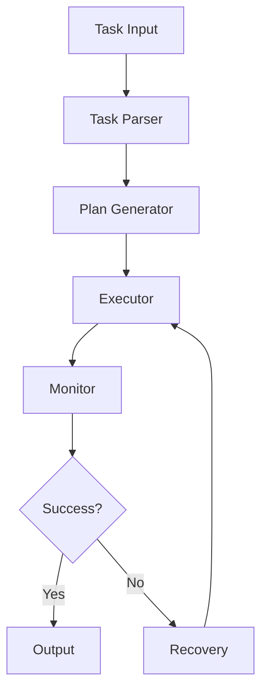

# Autonomous Task Execution Example

## Overview

This example demonstrates how agents can autonomously execute tasks with minimal human intervention.

## Execution Architecture



## Implementation

### Task Definition

```yaml
task:
  id: "task_001"
  description: "Generate weekly sales report"
  priority: "high"
  deadline: "2026-06-05T09:00:00Z"
  
  requirements:
    - "Pull data from sales database"
    - "Calculate key metrics"
    - "Generate visualizations"
    - "Create executive summary"
    - "Email to stakeholders"
  
  constraints:
    max_duration: "2 hours"
    max_retries: 3
    requires_approval: false
```

### Execution Plan

```yaml
execution_plan:
  steps:
    - step: "data_extraction"
      action: "Query sales database"
      tool: "database_query"
      timeout: "10 minutes"
      retry: true
    
    - step: "calculation"
      action: "Calculate metrics"
      tool: "data_processor"
      timeout: "5 minutes"
      retry: true
    
    - step: "visualization"
      action: "Generate charts"
      tool: "chart_generator"
      timeout: "10 minutes"
      retry: true
    
    - step: "summary"
      action: "Create executive summary"
      tool: "text_generator"
      timeout: "15 minutes"
      retry: true
    
    - step: "distribution"
      action: "Email stakeholders"
      tool: "email_sender"
      timeout: "5 minutes"
      retry: false
```

### Autonomous Executor

```python
from autonomous import TaskExecutor

# Initialize executor
executor = TaskExecutor()

# Define task
task = {
    "id": "task_001",
    "description": "Generate weekly sales report",
    "plan": execution_plan,
    "constraints": {
        "max_duration": "2 hours",
        "max_retries": 3
    }
}

# Execute autonomously
result = executor.execute(task)

# Monitor progress
for update in executor.get_updates():
    print(f"[{update.timestamp}] {update.step}: {update.status}")
```

## Key Controls

| Control | Priority | Implementation |
|---------|----------|----------------|
| Execution boundaries | P0 | Maximum scope limits |
| Retry limits | P0 | Maximum retry attempts |
| Time limits | P0 | Maximum execution time |
| Approval gates | P1 | Human approval for high-risk |
| Progress monitoring | P1 | Real-time status updates |

## Metrics

| Metric | Target | Measurement |
|--------|--------|-------------|
| Task completion rate | > 95% | Successful / total tasks |
| Average execution time | < target | Actual vs planned duration |
| Retry rate | < 10% | Retries / total attempts |
| Human intervention rate | < 5% | Interventions / total tasks |

## Conclusion

Autonomous task execution enables efficient operations while maintaining safety through defined boundaries and monitoring.
