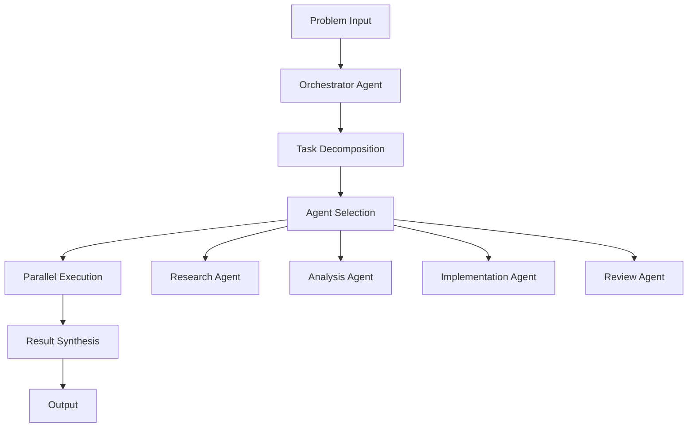

# Multi-Agent Collaboration Example

## Overview

This example demonstrates how multiple agents can collaborate to solve complex problems.

## Collaboration Architecture



## Implementation

### Agent Roles

```yaml
agent_roles:
  orchestrator:
    responsibility: "Coordinate all agents"
    capabilities:
      - "Task decomposition"
      - "Agent selection"
      - "Conflict resolution"
      - "Result synthesis"
  
  researcher:
    responsibility: "Gather information"
    capabilities:
      - "Web search"
      - "Document analysis"
      - "Source verification"
    tools:
      - "search_api"
      - "document_reader"
  
  analyst:
    responsibility: "Analyze and synthesize"
    capabilities:
      - "Pattern recognition"
      - "Data analysis"
      - "Insight generation"
    tools:
      - "data_analyzer"
      - "visualization"
  
  implementer:
    responsibility: "Create deliverables"
    capabilities:
      - "Code generation"
      - "Document creation"
      - "Configuration"
    tools:
      - "code_generator"
      - "template_engine"
  
  reviewer:
    responsibility: "Quality assurance"
    capabilities:
      - "Code review"
      - "Content review"
      - "Compliance check"
    tools:
      - "linter"
      - "validator"
```

### Collaboration Protocol

```yaml
collaboration_protocol:
  communication:
    method: "message_passing"
    format: "structured_json"
    validation: "schema_based"
  
  task_management:
    assignment: "orchestrator"
    tracking: "shared_state"
    completion: "all_subtasks_done"
  
  conflict_resolution:
    strategy: "priority_based"
    fallback: "escalate_to_orchestrator"
  
  result_aggregation:
    method: "merge_results"
    conflict_handling: "latest_writer_wins"
```

### Execution Example

```python
from multi_agent import CollaborativeSystem

# Initialize system
system = CollaborativeSystem()

# Define problem
problem = {
    "description": "Analyze market trends and create report",
    "requirements": [
        "Research current market data",
        "Identify key trends",
        "Create executive summary",
        "Generate visualizations"
    ]
}

# Execute collaboration
result = system.solve(problem)

# Access results
for agent, output in result.agent_outputs.items():
    print(f"{agent}: {output.summary}")
```

## Key Controls

| Control | Priority | Implementation |
|---------|----------|----------------|
| Agent isolation | P0 | Separate execution contexts |
| Communication security | P0 | Encrypted message passing |
| Task validation | P1 | Input/output verification |
| Conflict resolution | P1 | Priority-based arbitration |
| Audit trail | P1 | Complete execution history |

## Metrics

| Metric | Target | Measurement |
|--------|--------|-------------|
| Collaboration success rate | > 90% | Successful collaborations / total |
| Average completion time | < 1 hour | Problem input to output |
| Agent utilization | 70-90% | Active time / total time |
| Conflict resolution rate | > 95% | Resolved / total conflicts |

## Conclusion

Multi-agent collaboration enables solving complex problems that require diverse expertise and parallel execution.
