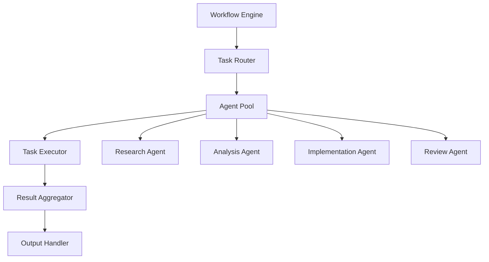

# Workflow Automation Example

## Overview

This example demonstrates how to build an automated workflow system using the LLM & Agentic Rules Framework.

## System Architecture



## Implementation

### Step 1: Define Workflow

```yaml
workflow:
  name: "content_creation_workflow"
  description: "Automated content creation pipeline"
  
  steps:
    - step: "research"
      agent: "research_agent"
      timeout: "30 minutes"
      inputs:
        - "topic"
        - "target_audience"
      outputs:
        - "research_findings"
        - "source_references"
    
    - step: "outline"
      agent: "analysis_agent"
      timeout: "15 minutes"
      inputs:
        - "research_findings"
      outputs:
        - "content_outline"
        - "key_points"
    
    - step: "draft"
      agent: "implementation_agent"
      timeout: "60 minutes"
      inputs:
        - "content_outline"
        - "key_points"
      outputs:
        - "draft_content"
    
    - step: "review"
      agent: "review_agent"
      timeout: "30 minutes"
      inputs:
        - "draft_content"
      outputs:
        - "review_feedback"
        - "approved_content"
```

### Step 2: Configure Agents

```yaml
agents:
  research_agent:
    role: "Gather information on topics"
    tools:
      - "web_search"
      - "document_analysis"
    constraints:
      - "Only use authoritative sources"
      - "Cite all sources"
  
  analysis_agent:
    role: "Analyze and organize information"
    tools:
      - "text_analysis"
      - "summarization"
    constraints:
      - "Maintain factual accuracy"
      - "Identify key themes"
  
  implementation_agent:
    role: "Create content based on outline"
    tools:
      - "text_generation"
      - "formatting"
    constraints:
      - "Follow brand guidelines"
      - "Maintain consistent tone"
  
  review_agent:
    role: "Review and approve content"
    tools:
      - "quality_check"
      - "plagiarism_check"
    constraints:
      - "Ensure accuracy"
      - "Verify citations"
```

### Step 3: Execute Workflow

```python
from workflow_engine import WorkflowEngine

# Initialize workflow
engine = WorkflowEngine()

# Define workflow
workflow = {
    "name": "content_creation",
    "steps": [...],
    "agents": [...]
}

# Execute workflow
result = engine.execute(workflow, inputs={
    "topic": "AI Safety Best Practices",
    "target_audience": "Technical leaders"
})

# Get results
print(f"Status: {result.status}")
print(f"Duration: {result.duration}")
print(f"Output: {result.output}")
```

## Key Controls

| Control | Priority | Implementation |
|---------|----------|----------------|
| Agent permissions | P0 | Scoped tool access |
| Task timeout | P0 | Maximum execution time |
| Error handling | P1 | Graceful degradation |
| Result validation | P1 | Quality checks |
| Audit logging | P1 | Execution history |

## Metrics

| Metric | Target | Measurement |
|--------|--------|-------------|
| Workflow completion rate | > 95% | Successful runs / total runs |
| Average duration | < 2 hours | Time from start to finish |
| Error rate | < 5% | Failed workflows / total |
| Quality score | > 85% | Review pass rate |

## Conclusion

Workflow automation with the framework provides reliable, auditable, and scalable content creation capabilities.
