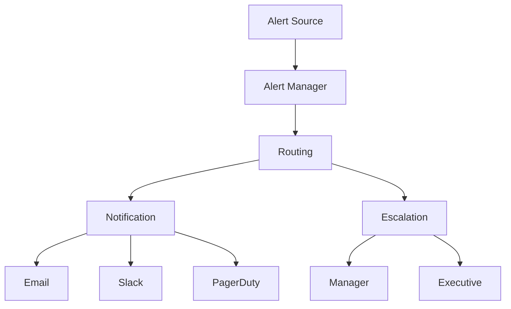

# Alerting Configuration

## Overview

Configuring effective alerting for AI systems.

## Alerting Architecture



## Alert Configuration

### Alert Rules

```yaml
alert_rules:
  - name: "high_error_rate"
    description: "Alert when error rate exceeds threshold"
    condition: "rate(http_requests_total{status=~'5..'}[5m]) / rate(http_requests_total[5m]) > 0.05"
    severity: "critical"
    for: "5m"
    labels:
      team: "engineering"
      service: "ai-service"
    annotations:
      summary: "High error rate detected"
      description: "Error rate is {{ $value | humanizePercentage }}"
  
  - name: "high_latency"
    description: "Alert when latency exceeds threshold"
    condition: "histogram_quantile(0.95, rate(http_request_duration_seconds_bucket[5m])) > 1"
    severity: "warning"
    for: "10m"
    labels:
      team: "engineering"
      service: "ai-service"
    annotations:
      summary: "High latency detected"
      description: "P95 latency is {{ $value }}s"
  
  - name: "low_availability"
    description: "Alert when availability drops"
    condition: "avg_over_time(up[5m]) < 0.99"
    severity: "critical"
    for: "5m"
    labels:
      team: "operations"
      service: "ai-service"
    annotations:
      summary: "Low availability detected"
      description: "Availability is {{ $value | humanizePercentage }}"
  
  - name: "model_safety_score"
    description: "Alert when safety score drops"
    condition: "model_safety_score < 0.95"
    severity: "critical"
    for: "0m"
    labels:
      team: "security"
      service: "ai-service"
    annotations:
      summary: "Model safety score dropped"
      description: "Safety score is {{ $value }}"
```

### Alert Routing

```yaml
alert_routing:
  routes:
    - match:
        severity: "critical"
      receiver: "pagerduty-critical"
      group_by: ["alertname", "service"]
      group_wait: "10s"
      group_interval: "10s"
      repeat_interval: "1h"
    
    - match:
        severity: "warning"
      receiver: "slack-warning"
      group_by: ["alertname", "service"]
      group_wait: "30s"
      group_interval: "5m"
      repeat_interval: "4h"
    
    - match:
        severity: "info"
      receiver: "email-info"
      group_by: ["alertname"]
      group_wait: "1h"
      group_interval: "12h"
      repeat_interval: "24h"
  
  receivers:
    - name: "pagerduty-critical"
      pagerduty_configs:
        - service_key: "YOUR_KEY"
          severity: "critical"
    
    - name: "slack-warning"
      slack_configs:
        - channel: "#alerts-warning"
          send_resolved: true
    
    - name: "email-info"
      email_configs:
        - to: "team@company.com"
          send_resolved: true
```

### Escalation Policies

```yaml
escalation_policies:
  - name: "critical_escalation"
    levels:
      - level: 1
        delay: "0m"
        contacts:
          - "on-call-engineer"
      
      - level: 2
        delay: "15m"
        contacts:
          - "engineering-manager"
      
      - level: 3
        delay: "30m"
        contacts:
          - "director-engineering"
      
      - level: 4
        delay: "1h"
        contacts:
          - "vp-engineering"
  
  - name: "warning_escalation"
    levels:
      - level: 1
        delay: "0m"
        contacts:
          - "team-channel"
      
      - level: 2
        delay: "1h"
        contacts:
          - "team-lead"
      
      - level: 3
        delay: "4h"
        contacts:
          - "engineering-manager"
```

## Alert Fatigue Prevention

### Alert Tuning

```yaml
alert_tuning:
  strategies:
    - strategy: "threshold_adjustment"
      description: "Adjust thresholds based on baseline"
      frequency: "monthly"
    
    - strategy: "alert_correlation"
      description: "Correlate related alerts"
      window: "5m"
    
    - strategy: "suppression_rules"
      description: "Suppress non-actionable alerts"
      rules:
        - "suppress during maintenance"
        - "suppress during known issues"
    
    - strategy: "priority_filtering"
      description: "Filter by priority"
      rules:
        - "critical: immediate"
        - "warning: batch"
        - "info: daily digest"
```

### Alert Quality Metrics

```yaml
alert_quality:
  metrics:
    - metric: "signal_to_noise_ratio"
      target: "> 10"
      description: "True alerts / false alerts"
    
    - metric: "mean_time_to_acknowledge"
      target: "< 5 minutes"
      description: "Time to acknowledge alert"
    
    - metric: "alert_resolution_rate"
      target: "> 90%"
      description: "Alerts resolved / total"
    
    - metric: "escalation_rate"
      target: "< 20%"
      description: "Alerts escalated / total"
```

## Implementation Example

```python
from monitoring import AlertManager

# Initialize alert manager
alert_manager = AlertManager(
    routing_rules=routing_rules,
    escalation_policies=escalation_policies
)

# Create alert
alert = alert_manager.create_alert(
    name="high_error_rate",
    severity="critical",
    message="Error rate exceeded 5%",
    labels={"service": "ai-service"}
)

# Send alert
alert_manager.send_alert(alert)

# Acknowledge alert
alert_manager.acknowledge_alert(alert.id, ack_by="on-call-engineer")
```

## Key Controls

| Control | Priority | Implementation |
|---------|----------|----------------|
| Alert rules | P0 | Prometheus alerting |
| Alert routing | P0 | AlertManager |
| Escalation | P0 | PagerDuty |
| Alert fatigue prevention | P1 | Tuning and correlation |

## Metrics

| Metric | Target | Measurement |
|--------|--------|-------------|
| Alert accuracy | > 95% | True alerts / total |
| Mean time to acknowledge | < 5 minutes | Time to acknowledge |
| Escalation rate | < 20% | Escalations / total |
| Alert resolution rate | > 90% | Resolved / total |
