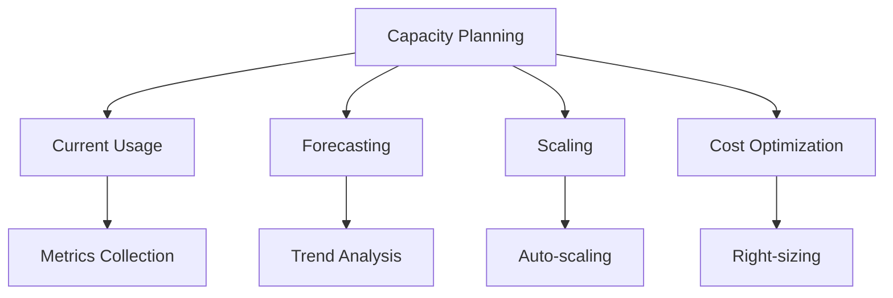

# Capacity Planning

## Overview

Planning and managing capacity for AI systems.

## Capacity Planning Architecture



## Capacity Metrics

### Resource Metrics

```yaml
resource_metrics:
  compute:
    - metric: "cpu_utilization"
      target: "< 70%"
      alert_threshold: "80%"
    
    - metric: "memory_utilization"
      target: "< 80%"
      alert_threshold: "90%"
    
    - metric: "gpu_utilization"
      target: "< 80%"
      alert_threshold: "90%"
  
  storage:
    - metric: "disk_usage"
      target: "< 75%"
      alert_threshold: "85%"
    
    - metric: "database_size"
      target: "Growing trend"
      alert_threshold: "80% of capacity"
  
  network:
    - metric: "bandwidth_utilization"
      target: "< 60%"
      alert_threshold: "80%"
    
    - metric: "connection_count"
      target: "< 80% of max"
      alert_threshold: "90%"
```

### Performance Metrics

```yaml
performance_metrics:
  latency:
    - metric: "p50_latency"
      target: "< 200ms"
    
    - metric: "p95_latency"
      target: "< 500ms"
    
    - metric: "p99_latency"
      target: "< 1000ms"
  
  throughput:
    - metric: "requests_per_second"
      target: "Per capacity plan"
    
    - metric: "tokens_per_second"
      target: "Per capacity plan"
  
  reliability:
    - metric: "availability"
      target: "> 99.9%"
    
    - metric: "error_rate"
      target: "< 0.1%"
```

## Forecasting Methods

### Trend Analysis

```yaml
trend_analysis:
  method: "linear_regression"
  data_points: 30
  forecast_horizon: "90_days"
  
  metrics:
    - "request_volume"
    - "storage_growth"
    - "cost_trend"
  
  confidence_interval: 0.95
```

### Seasonal Analysis

```yaml
seasonal_analysis:
  method: "seasonal_decomposition"
 周期: "weekly"
  
  patterns:
    - name: "weekday_peak"
      description: "Higher usage on weekdays"
      factor: 1.5
    
    - name: "month_end"
      description: "Higher usage at month end"
      factor: 1.3
  
  adjustments:
    - "scale_up_before_peak"
    - "scale_down_after_peak"
```

### Capacity Modeling

```yaml
capacity_model:
  inputs:
    - "current_usage"
    - "growth_rate"
    - "seasonal_patterns"
    - "business_events"
  
  outputs:
    - "predicted_usage"
    - "capacity_gaps"
    - "scaling_recommendations"
    - "cost_projections"
  
  review_frequency: "monthly"
```

## Scaling Strategies

### Horizontal Scaling

```yaml
horizontal_scaling:
  strategy: "auto_scaling"
  
  metrics:
    - metric: "cpu_utilization"
      target: 70
      scale_up_threshold: 80
      scale_down_threshold: 30
    
    - metric: "request_queue"
      target: 100
      scale_up_threshold: 200
      scale_down_threshold: 50
  
  limits:
    min_instances: 2
    max_instances: 20
    scale_up_cooldown: "5m"
    scale_down_cooldown: "10m"
```

### Vertical Scaling

```yaml
vertical_scaling:
  strategy: "right_sizing"
  
  review:
    frequency: "monthly"
    metrics:
      - "resource_utilization"
      - "performance_metrics"
      - "cost_metrics"
  
  actions:
    - condition: "utilization < 30%"
      action: "downsize"
    
    - condition: "utilization > 80%"
      action: "upsize"
    
    - condition: "performance_degraded"
      action: "upsize"
```

### Capacity Reservations

```yaml
capacity_reservations:
  strategy: "reserved_instances"
  
  reservations:
    - instance_type: "m5.xlarge"
      count: 5
      term: "1_year"
      discount: "30%"
    
    - instance_type: "p3.2xlarge"
      count: 2
      term: "1_year"
      discount: "25%"
  
  review:
    frequency: "quarterly"
    criteria:
      - "utilization > 70%"
      - "stable_workload"
      - "long_term_projection"
```

## Cost Optimization

### Cost Tracking

```yaml
cost_tracking:
  dimensions:
    - "service"
    - "team"
    - "environment"
    - "instance_type"
  
  metrics:
    - metric: "total_cost"
      target: "within_budget"
    
    - metric: "cost_per_request"
      target: "decreasing_trend"
    
    - metric: "cost_efficiency"
      target: "improving_trend"
  
  reporting:
    frequency: "weekly"
    distribution: ["finance", "engineering"]
```

### Optimization Strategies

```yaml
optimization_strategies:
  - strategy: "right_sizing"
    description: "Match instance type to workload"
    savings: "20-40%"
    implementation: "monthly_review"
  
  - strategy: "reserved_instances"
    description: "Purchase reserved capacity"
    savings: "30-50%"
    implementation: "quarterly_review"
  
  - strategy: "spot_instances"
    description: "Use spot for fault-tolerant workloads"
    savings: "60-80%"
    implementation: "workload_analysis"
  
  - strategy: "auto_scaling"
    description: "Scale based on demand"
    savings: "20-40%"
    implementation: "metric_based"
  
  - strategy: "caching"
    description: "Cache frequent requests"
    savings: "30-50%"
    implementation: "analysis_based"
```

## Implementation Example

```python
from operations import CapacityPlanner

# Initialize capacity planner
planner = CapacityPlanner(
    metrics_source="prometheus",
    cost_source="aws_cost_explorer"
)

# Analyze current capacity
current = planner.analyze_current()
print(f"CPU utilization: {current.cpu_utilization}%")
print(f"Memory utilization: {current.memory_utilization}%")

# Forecast future needs
forecast = planner.forecast(days=90)
print(f"Predicted CPU in 90 days: {forecast.cpu_utilization}%")

# Get scaling recommendations
recommendations = planner.get_recommendations()
for rec in recommendations:
    print(f"Recommendation: {rec.description}")
    print(f"Expected savings: {rec.savings}")
```

## Key Controls

| Control | Priority | Implementation |
|---------|----------|----------------|
| Resource monitoring | P0 | Prometheus/Grafana |
| Auto-scaling | P0 | Cloud auto-scaling |
| Cost tracking | P1 | Cost allocation tags |
| Capacity forecasting | P1 | Trend analysis |

## Metrics

| Metric | Target | Measurement |
|--------|--------|-------------|
| Resource utilization | 60-80% | Average utilization |
| Scaling accuracy | > 90% | Correct scaling decisions |
| Cost efficiency | Improving | Cost per request trend |
| Capacity gaps | 0 | Unforeseen capacity issues |
