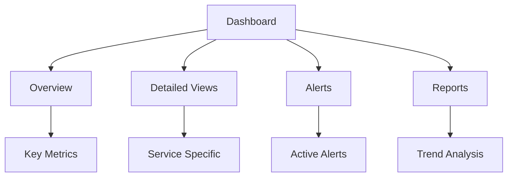

# Dashboard Design

## Overview

Designing effective dashboards for AI system monitoring.

## Dashboard Architecture



## Dashboard Types

### 1. Executive Dashboard

```yaml
executive_dashboard:
  purpose: "High-level system health for leadership"
  refresh: "5 minutes"
  
  panels:
    - name: "System Health"
      type: "stat"
      metrics:
        - "availability"
        - "error_rate"
        - "latency_p95"
      thresholds:
        green: "> 99.9%"
        yellow: "99-99.9%"
        red: "< 99%"
    
    - name: "Business Metrics"
      type: "stat"
      metrics:
        - "requests_per_minute"
        - "active_users"
        - "cost_per_hour"
    
    - name: "Trend"
      type: "graph"
      metrics:
        - "requests_over_time"
        - "error_rate_over_time"
      time_range: "24h"
    
    - name: "Alert Summary"
      type: "table"
      metrics:
        - "active_alerts"
        - "recent_incidents"
```

### 2. Operations Dashboard

```yaml
operations_dashboard:
  purpose: "Detailed operational metrics for SRE team"
  refresh: "1 minute"
  
  panels:
    - name: "Request Rate"
      type: "graph"
      metrics:
        - "rate(http_requests_total[5m])"
      time_range: "1h"
    
    - name: "Latency Distribution"
      type: "heatmap"
      metrics:
        - "http_request_duration_seconds_bucket"
      time_range: "1h"
    
    - name: "Error Breakdown"
      type: "piechart"
      metrics:
        - "http_requests_total{status=~'5..'}"
      group_by: "status"
    
    - name: "Resource Utilization"
      type: "graph"
      metrics:
        - "cpu_usage"
        - "memory_usage"
        - "disk_usage"
      time_range: "1h"
    
    - name: "Service Map"
      type: "service-map"
      metrics:
        - "service_dependencies"
```

### 3. AI Performance Dashboard

```yaml
ai_performance_dashboard:
  purpose: "AI-specific metrics for ML team"
  refresh: "5 minutes"
  
  panels:
    - name: "Model Performance"
      type: "graph"
      metrics:
        - "model_inference_latency"
        - "model_throughput"
        - "model_error_rate"
      time_range: "24h"
    
    - name: "Evaluation Scores"
      type: "stat"
      metrics:
        - "safety_score"
        - "quality_score"
        - "evaluation_pass_rate"
      thresholds:
        green: "> 0.95"
        yellow: "0.90-0.95"
        red: "< 0.90"
    
    - name: "Token Usage"
      type: "graph"
      metrics:
        - "tokens_used_total"
        - "cost_per_token"
      time_range: "24h"
    
    - name: "Evaluation Trends"
      type: "graph"
      metrics:
        - "evaluation_score_trend"
      time_range: "30d"
```

### 4. Security Dashboard

```yaml
security_dashboard:
  purpose: "Security metrics for security team"
  refresh: "1 minute"
  
  panels:
    - name: "Security Events"
      type: "table"
      metrics:
        - "security_events_total"
      group_by: "severity"
    
    - name: "Authentication"
      type: "graph"
      metrics:
        - "auth_success_rate"
        - "auth_failure_rate"
      time_range: "1h"
    
    - name: "Access Patterns"
      type: "heatmap"
      metrics:
        - "access_patterns"
      time_range: "24h"
    
    - name: "Threat Detection"
      type: "stat"
      metrics:
        - "threats_detected"
        - "threats_blocked"
        - "false_positive_rate"
```

## Dashboard Best Practices

### Design Principles

```yaml
design_principles:
  - principle: "Show what matters"
    description: "Focus on actionable metrics"
    implementation: "Prioritize by impact"
  
  - principle: "Provide context"
    description: "Show trends and baselines"
    implementation: "Include historical data"
  
  - principle: "Enable drill-down"
    description: "Allow detailed investigation"
    implementation: "Link to detailed views"
  
  - principle: "Keep it current"
    description: "Real-time or near real-time"
    implementation: "Refresh every minute"
  
  - principle: "Make it accessible"
    description: "Understandable at a glance"
    implementation: "Use clear labels and colors"
```

### Layout Guidelines

```yaml
layout_guidelines:
  - guideline: "Top-left for most important"
    description: "Place key metrics top-left"
  
  - guideline: "Group related metrics"
    description: "Cluster related panels"
  
  - guideline: "Consistent time ranges"
    description: "Use same time range across panels"
  
  - guideline: "Color coding"
    description: "Use consistent color scheme"
  
  - guideline: "Mobile responsive"
    description: "Design for different screen sizes"
```

## Implementation Example

```python
from monitoring import DashboardManager

# Initialize dashboard manager
dashboard_mgr = DashboardManager(
    tool="grafana",
    api_key="YOUR_API_KEY"
)

# Create dashboard
dashboard = dashboard_mgr.create_dashboard(
    name="AI Service Overview",
    panels=[
        {"type": "stat", "title": "Availability", "metric": "up"},
        {"type": "graph", "title": "Request Rate", "metric": "rate(http_requests_total[5m])"},
        {"type": "graph", "title": "Latency", "metric": "histogram_quantile(0.95, rate(http_request_duration_seconds_bucket[5m]))"},
    ]
)

# Share dashboard
dashboard_mgr.share_dashboard(dashboard.id, teams=["engineering", "operations"])
```

## Key Controls

| Control | Priority | Implementation |
|---------|----------|----------------|
| Dashboard availability | P0 | High availability setup |
| Data accuracy | P0 | Validated metrics |
| Access control | P1 | Role-based access |
| Mobile support | P2 | Responsive design |

## Metrics

| Metric | Target | Measurement |
|--------|--------|-------------|
| Dashboard load time | < 3 seconds | Time to render |
| Data freshness | < 1 minute | Time since last update |
| User satisfaction | > 4.0/5.0 | User feedback |
| Dashboard usage | > 80% | Active users / total |
