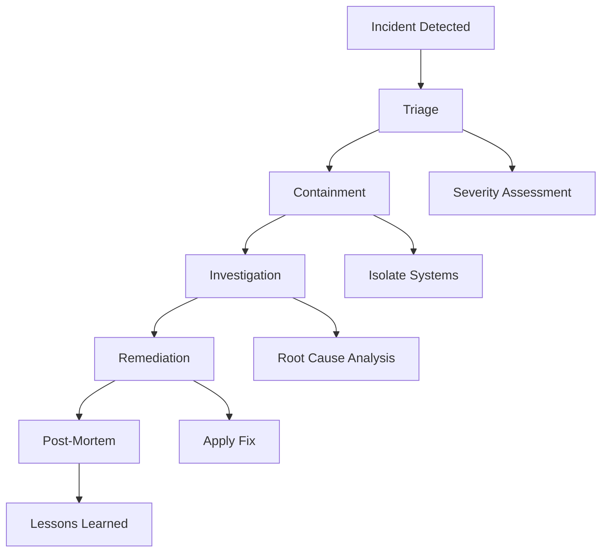

# Incident Response Operations

## Overview

Operational procedures for handling production incidents.

## Incident Response Flow



## Incident Classification

```yaml
incident_classification:
  severity:
    critical:
      description: "Complete system outage or data breach"
      response_time: "15 minutes"
      resolution_target: "1 hour"
      examples:
        - "Production system down"
        - "Data breach confirmed"
        - "Security vulnerability exploited"
    
    high:
      description: "Major feature unavailable or degraded"
      response_time: "30 minutes"
      resolution_target: "4 hours"
      examples:
        - "Primary feature unavailable"
        - "Performance severely degraded"
        - "Security incident detected"
    
    medium:
      description: "Minor feature issues or degradation"
      response_time: "2 hours"
      resolution_target: "24 hours"
      examples:
        - "Minor feature broken"
        - "Performance slightly degraded"
        - "Non-critical error increase"
    
    low:
      description: "Cosmetic issues or minor improvements"
      response_time: "24 hours"
      resolution_target: "1 week"
      examples:
        - "UI glitch"
        - "Minor performance optimization"
        - "Documentation update"
```

## Incident Response Procedures

### Phase 1: Detection and Triage

```yaml
detection_triage:
  steps:
    - step: "alert_received"
      actions:
        - "Acknowledge alert within SLA"
        - "Assess severity"
        - "Identify affected systems"
    
    - step: "initial_assessment"
      actions:
        - "Determine impact scope"
        - "Identify affected users"
        - "Check monitoring dashboards"
        - "Review recent changes"
    
    - step: "classification"
      actions:
        - "Assign severity level"
        - "Assign incident commander"
        - "Open incident ticket"
        - "Notify stakeholders"
```

### Phase 2: Containment

```yaml
containment:
  short_term:
    - "Isolate affected systems"
    - "Block malicious traffic"
    - "Revoke compromised credentials"
    - "Enable enhanced monitoring"
  
  long_term:
    - "Implement temporary fixes"
    - "Deploy fallback systems"
    - "Scale affected services"
    - "Update firewall rules"
```

### Phase 3: Investigation

```yaml
investigation:
  steps:
    - step: "evidence_collection"
      actions:
        - "Collect logs and metrics"
        - "Preserve system state"
        - "Document timeline"
        - "Interview witnesses"
    
    - step: "root_cause_analysis"
      techniques:
        - "5 Whys analysis"
        - "Fishbone diagram"
        - "Timeline analysis"
        - "Change correlation"
    
    - step: "impact_assessment"
      actions:
        - "Determine affected users"
        - "Calculate business impact"
        - "Assess data exposure"
        - "Evaluate compliance implications"
```

### Phase 4: Remediation

```yaml
remediation:
  immediate:
    - "Apply hotfix"
    - "Rollback changes"
    - "Restore from backup"
    - "Scale resources"
  
  follow_up:
    - "Implement permanent fix"
    - "Update monitoring"
    - "Improve detection"
    - "Update documentation"
```

### Phase 5: Post-Mortem

```yaml
post_mortem:
  sections:
    - "Executive summary"
    - "Timeline of events"
    - "Root cause analysis"
    - "What went well"
    - "What could improve"
    - "Action items"
  
  process:
    - "Schedule post-mortem within 48 hours"
    - "Invite all stakeholders"
    - "Focus on systems, not people"
    - "Document action items with owners"
    - "Track action items to completion"
```

## Incident Communication

### Internal Communication

```yaml
internal_communication:
  channels:
    - "slack:#incidents"
    - "incident_bridge_call"
    - "email:incident-updates"
  
  updates:
    frequency: "every_30_minutes"
    content:
      - "Current status"
      - "Impact assessment"
      - "Actions taken"
      - "Next steps"
      - "ETA for resolution"
```

### External Communication

```yaml
external_communication:
  customers:
    channel: "status_page"
    frequency: "as_needed"
    content:
      - "What is happening"
      - "Impact on service"
      - "What we are doing"
      - "When to expect updates"
  
  regulatory:
    channel: "email"
    frequency: "within_72_hours_if_required"
    content:
      - "Incident description"
      - "Data affected"
      - "Remediation steps"
      - "Preventive measures"
```

## Key Controls

| Control | Priority | Implementation |
|---------|----------|----------------|
| Detection | P0 | Monitoring and alerting |
| Response time | P0 | SLA-based response |
| Communication | P0 | Multi-channel updates |
| Post-mortem | P1 | Blameless review |

## Metrics

| Metric | Target | Measurement |
|--------|--------|-------------|
| Mean time to detect | < 5 minutes | Detection time |
| Mean time to acknowledge | < 15 minutes | Acknowledgment time |
| Mean time to resolve | < 1 hour | Resolution time |
| Incident recurrence | < 5% | Recurring incidents |
