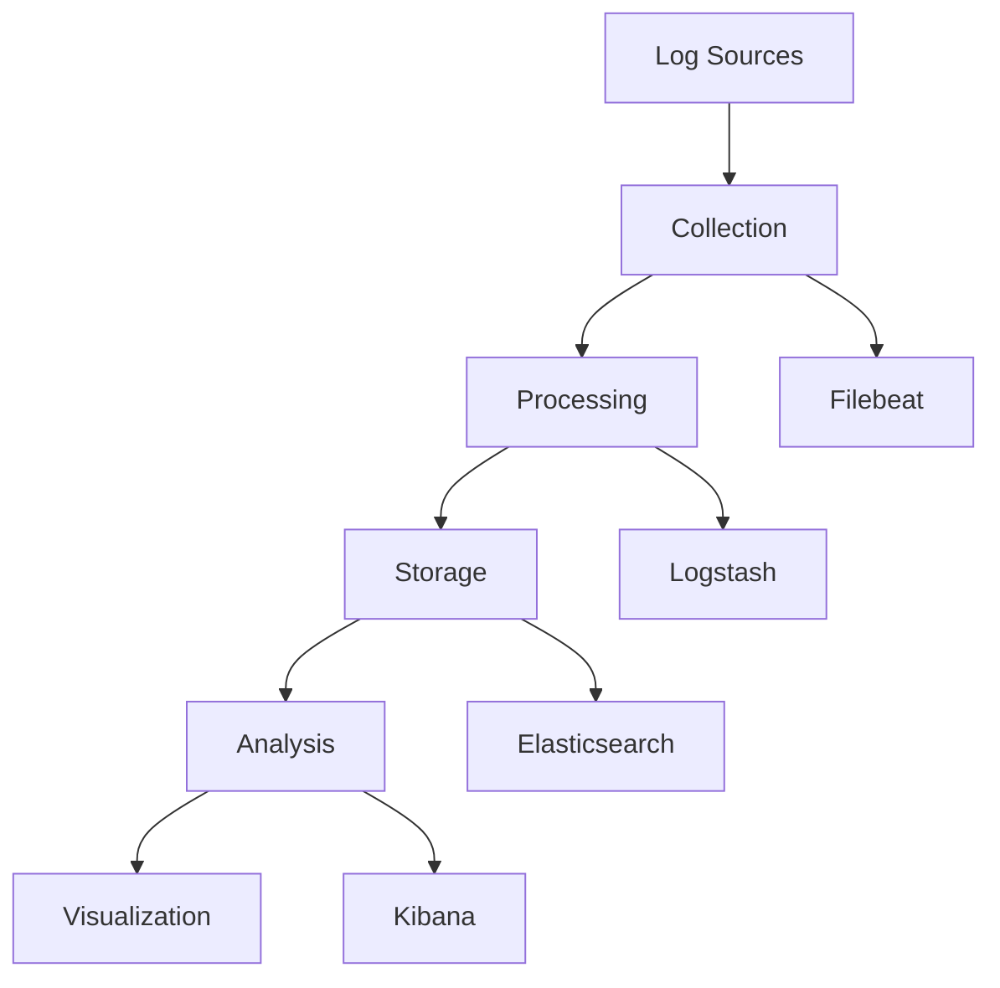

# Log Management

## Overview

Managing logs effectively for AI systems.

## Log Management Architecture



## Log Types

### Application Logs

```yaml
application_logs:
  format: "structured_json"
  fields:
    - "timestamp"
    - "level"
    - "message"
    - "service"
    - "trace_id"
    - "user_id"
    - "request_id"
    - "duration_ms"
  
  levels:
    DEBUG: "Detailed debugging information"
    INFO: "General information about system operation"
    WARNING: "Unexpected but handled situation"
    ERROR: "Error that prevented operation"
    CRITICAL: "System failure requiring immediate attention"
  
  retention:
    DEBUG: "7 days"
    INFO: "30 days"
    WARNING: "90 days"
    ERROR: "1 year"
    CRITICAL: "7 years"
```

### Audit Logs

```yaml
audit_logs:
  format: "structured_json"
  fields:
    - "timestamp"
    - "event_type"
    - "user_id"
    - "action"
    - "resource"
    - "result"
    - "source_ip"
    - "user_agent"
  
  event_types:
    - "authentication"
    - "authorization"
    - "data_access"
    - "configuration_change"
    - "security_event"
  
  retention: "7 years"
  integrity: "hash_chain"
  immutable: true
```

### Security Logs

```yaml
security_logs:
  format: "structured_json"
  fields:
    - "timestamp"
    - "event_type"
    - "severity"
    - "source_ip"
    - "user_id"
    - "description"
    - "evidence"
  
  event_types:
    - "failed_authentication"
    - "unauthorized_access"
    - "injection_attempt"
    - "data_exfiltration"
    - "privilege_escalation"
  
  retention: "1 year"
  alert_on: "critical"
```

## Log Collection

### Collection Configuration

```yaml
collection:
  tool: "filebeat"
  inputs:
    - type: "log"
      paths:
        - "/var/log/ai-service/*.log"
      fields:
        service: "ai-service"
        environment: "production"
    
    - type: "log"
      paths:
        - "/var/log/audit/*.log"
      fields:
        service: "audit"
        environment: "production"
  
  processors:
    - add_fields:
        target: "metadata"
        fields:
          cluster: "production"
          region: "us-east-1"
    
    - decode_json_fields:
        fields: ["message"]
        target: "json"
  
  output:
    elasticsearch:
      hosts: ["elasticsearch:9200"]
      index: "logs-%{+yyyy.MM.dd}"
```

### Log Shipping

```yaml
log_shipping:
  method: "filebeat_to_logstash"
  
  filebeat:
    prospectors:
      - paths: ["/var/log/*.log"]
        fields:
          type: "application"
    
  logstash:
    filters:
      - grok:
          match: {"message": "%{TIMESTAMP_ISO8601:timestamp}"}
      - date:
          match: ["timestamp", "ISO8601"]
      - mutate:
          add_field: {"service": "ai-service"}
    
    outputs:
      - elasticsearch:
          hosts: ["elasticsearch:9200"]
          index: "logs-%{+YYYY.MM.dd}"
```

## Log Storage

### Storage Configuration

```yaml
storage:
  primary:
    tool: "elasticsearch"
    cluster:
      name: "log-cluster"
      nodes: 3
    indices:
      - pattern: "logs-*"
        retention: "30_days"
        shards: 3
        replicas: 1
    
    - pattern: "audit-*"
      retention: "7_years"
      shards: 5
      replicas: 2
  
  archive:
    tool: "s3"
    bucket: "log-archive"
    retention: "7_years"
    format: "parquet"
```

### Index Lifecycle Management

```yaml
index_lifecycle:
  policies:
    - name: "logs_policy"
      phases:
        hot:
          actions:
            rollover:
              max_age: "1d"
              max_size: "10gb"
        warm:
          actions:
            shrink:
              number_of_shards: 1
            forcemerge:
              max_num_segments: 1
        cold:
          actions:
            freeze: {}
        delete:
          actions:
            delete: {}
          min_age: "30d"
    
    - name: "audit_policy"
      phases:
        hot:
          actions:
            rollover:
              max_age: "1d"
              max_size: "5gb"
        warm:
          actions:
            shrink:
              number_of_shards: 1
        delete:
          actions:
            delete: {}
          min_age: "7y"
```

## Log Analysis

### Analysis Queries

```sql
-- Error rate by service
SELECT service, COUNT(*) as error_count
FROM logs
WHERE level = 'ERROR'
AND timestamp > NOW() - INTERVAL '1 hour'
GROUP BY service
ORDER BY error_count DESC;

-- Slow requests
SELECT request_id, duration_ms, user_id
FROM logs
WHERE duration_ms > 1000
AND timestamp > NOW() - INTERVAL '1 hour'
ORDER BY duration_ms DESC;

-- Security events
SELECT event_type, COUNT(*) as count
FROM audit_logs
WHERE event_type LIKE '%security%'
AND timestamp > NOW() - INTERVAL '24 hours'
GROUP BY event_type;
```

### Analysis Dashboards

```yaml
analysis_dashboards:
  - name: "Error Analysis"
    panels:
      - "Error rate by service"
      - "Error trends over time"
      - "Top error messages"
      - "Error correlation"
    
  - name: "Performance Analysis"
    panels:
      - "Latency distribution"
      - "Slow request analysis"
      - "Throughput trends"
      - "Resource utilization"
    
  - name: "Security Analysis"
    panels:
      - "Security events by type"
      - "Failed authentication attempts"
      - "Access pattern anomalies"
      - "Threat detection alerts"
```

## Implementation Example

```python
from monitoring import LogManager

# Initialize log manager
log_mgr = LogManager(
    elasticsearch_host="elasticsearch:9200",
    index_prefix="logs"
)

# Log application event
log_mgr.log(
    level="INFO",
    message="Request processed",
    service="ai-service",
    trace_id="abc123",
    duration_ms=150
)

# Search logs
results = log_mgr.search(
    query="level:ERROR AND service:ai-service",
    time_range="1h",
    limit=100
)

# Analyze errors
errors = log_mgr.analyze_errors(time_range="24h")
```

## Key Controls

| Control | Priority | Implementation |
|---------|----------|----------------|
| Log collection | P0 | Filebeat/Fluentd |
| Log storage | P0 | Elasticsearch |
| Log retention | P0 | Lifecycle management |
| Log security | P1 | Access control, encryption |

## Metrics

| Metric | Target | Measurement |
|--------|--------|-------------|
| Log collection rate | 100% | Logs collected / total |
| Log storage efficiency | > 80% | Compression ratio |
| Query performance | < 5 seconds | Time to results |
| Log availability | > 99.9% | Storage uptime |
