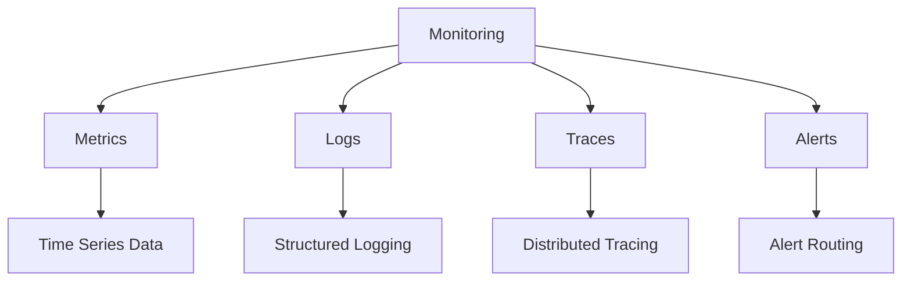

# Monitoring Fundamentals

## Overview

Core concepts for monitoring AI systems in production.

## Monitoring Architecture



## Three Pillars of Observability

### 1. Metrics

```yaml
metrics:
  types:
    - name: "counter"
      description: "Monotonically increasing value"
      example: "total_requests"
    
    - name: "gauge"
      description: "Value that can go up or down"
      example: "cpu_usage"
    
    - name: "histogram"
      description: "Distribution of values"
      example: "request_latency"
  
  collection:
    tool: "prometheus"
    scrape_interval: "15s"
    retention: "30_days"
  
  visualization:
    tool: "grafana"
    dashboards:
      - "system_health"
      - "business_metrics"
      - "cost_metrics"
```

### 2. Logs

```yaml
logging:
  format: "structured_json"
  fields:
    - "timestamp"
    - "level"
    - "message"
    - "service"
    - "trace_id"
    - "user_id"
  
  levels:
    - "DEBUG"
    - "INFO"
    - "WARNING"
    - "ERROR"
    - "CRITICAL"
  
  storage:
    tool: "elasticsearch"
    retention: "30_days"
    index_pattern: "logs-*"
  
  visualization:
    tool: "kibana"
    dashboards:
      - "log_overview"
      - "error_analysis"
      - "user_activity"
```

### 3. Traces

```yaml
tracing:
  tool: "jaeger"
  sampling:
    strategy: "probabilistic"
    rate: 0.1
  
  spans:
    - name: "http_request"
      attributes:
        - "http.method"
        - "http.url"
        - "http.status_code"
        - "http.duration"
    
    - name: "model_inference"
      attributes:
        - "model.name"
        - "input_tokens"
        - "output_tokens"
        - "inference_duration"
    
    - name: "database_query"
      attributes:
        - "db.system"
        - "db.statement"
        - "db.duration"
  
  visualization:
    tool: "jaeger_ui"
    dashboards:
      - "service_map"
      - "trace_analysis"
```

## Key Metrics for AI Systems

### System Health Metrics

| Metric | Description | Target |
|--------|-------------|--------|
| Availability | System uptime | > 99.9% |
| Error rate | Failed requests percentage | < 0.1% |
| Latency p95 | 95th percentile response time | < 500ms |
| Throughput | Requests per second | Per capacity plan |

### AI-Specific Metrics

| Metric | Description | Target |
|--------|-------------|--------|
| Model latency | Inference time | < 200ms |
| Token throughput | Tokens processed per second | Per capacity plan |
| Evaluation score | Quality evaluation score | > 0.85 |
| Safety score | Safety evaluation score | > 0.95 |

### Business Metrics

| Metric | Description | Target |
|--------|-------------|--------|
| User satisfaction | User feedback score | > 4.0/5.0 |
| Resolution rate | Issues resolved without escalation | > 80% |
| Cost per request | Average cost per request | Within budget |

## Implementation Example

```python
from monitoring import MetricsCollector

# Initialize collector
collector = MetricsCollector(
    backend="prometheus",
    namespace="ai_service"
)

# Record metrics
collector.counter("requests_total", labels={"endpoint": "/chat"})
collector.histogram("request_duration_seconds", value=0.5)
collector.gauge("active_users", value=100)

# Query metrics
availability = collector.query("up == 1")
```

## Key Controls

| Control | Priority | Implementation |
|---------|----------|----------------|
| Metric collection | P0 | Prometheus/Grafana |
| Log aggregation | P0 | ELK stack |
| Distributed tracing | P1 | Jaeger |
| Alert routing | P0 | PagerDuty/Slack |

## Metrics

| Metric | Target | Measurement |
|--------|--------|-------------|
| Monitoring coverage | 100% | Monitored services / total |
| Alert accuracy | > 95% | True alerts / total |
| Mean time to detect | < 5 minutes | Time to detection |
| Dashboard availability | > 99.9% | Dashboard uptime |
