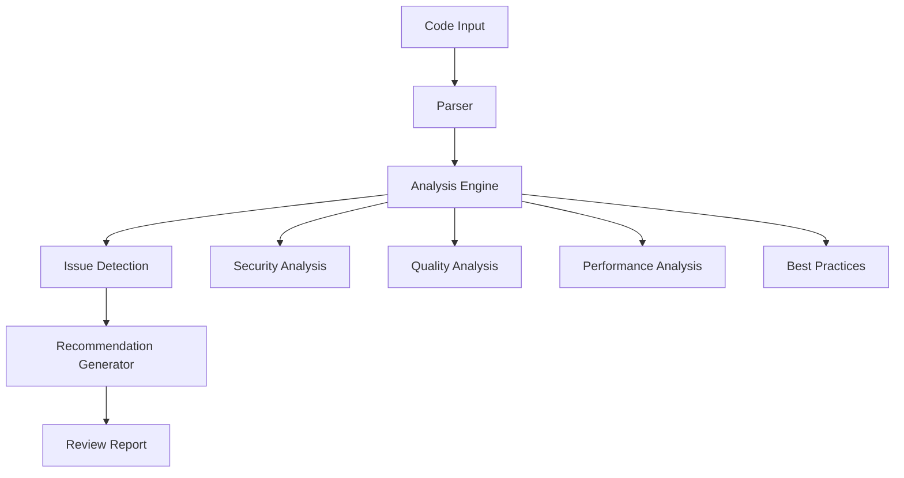

# Code Review Assistant Example

## Overview

This example demonstrates an AI-powered code review assistant using the framework.

## System Architecture



## Implementation

### System Configuration

```yaml
system:
  name: "code_review_assistant"
  version: "1.0.0"
  risk_tier: "medium"
  
  domains:
    - "core"
    - "security"
    - "development"
    - "testing"
  
  capabilities:
    - "Code quality analysis"
    - "Security vulnerability detection"
    - "Performance issue identification"
    - "Best practice recommendations"
```

### Analysis Categories

```yaml
analysis_categories:
  security:
    description: "Security vulnerability detection"
    checks:
      - name: "SQL Injection"
        pattern: "raw SQL queries with user input"
        severity: "critical"
        recommendation: "Use parameterized queries"
      
      - name: "XSS Vulnerability"
        pattern: "unescaped user input in HTML"
        severity: "high"
        recommendation: "Escape output, use CSP"
      
      - name: "Hardcoded Secrets"
        pattern: "API keys, passwords in code"
        severity: "critical"
        recommendation: "Use environment variables"
  
  quality:
    description: "Code quality analysis"
    checks:
      - name: "Complex Functions"
        pattern: "cyclomatic complexity > 10"
        severity: "medium"
        recommendation: "Refactor into smaller functions"
      
      - name: "Code Duplication"
        pattern: "duplicate code blocks"
        severity: "medium"
        recommendation: "Extract common functionality"
      
      - name: "Missing Tests"
        pattern: "function without tests"
        severity: "high"
        recommendation: "Add unit tests"
  
  performance:
    description: "Performance issue detection"
    checks:
      - name: "N+1 Queries"
        pattern: "database queries in loops"
        severity: "high"
        recommendation: "Use batch queries or joins"
      
      - name: "Missing Index"
        pattern: "database query without index"
        severity: "medium"
        recommendation: "Add appropriate index"
      
      - name: "Memory Leak"
        pattern: "unclosed resources"
        severity: "high"
        recommendation: "Use context managers"
```

### Review Process

```yaml
review_process:
  steps:
    - step: "parsing"
      action: "Parse code structure"
      output: "abstract_syntax_tree"
    
    - step: "analysis"
      action: "Run analysis checks"
      output: "raw_findings"
    
    - step: "prioritization"
      action: "Prioritize findings"
      output: "prioritized_findings"
    
    - step: "recommendation"
      action: "Generate recommendations"
      output: "review_report"
  
  output_format:
    sections:
      - "summary"
      - "critical_issues"
      - "improvements"
      - "best_practices"
      - "metrics"
```

### Review Report

```yaml
review_report:
  summary:
    total_issues: 12
    critical: 2
    high: 4
    medium: 5
    low: 1
  
  critical_issues:
    - issue: "SQL Injection vulnerability"
      location: "src/database.py:45"
      severity: "critical"
      recommendation: "Use parameterized queries"
      example: "cursor.execute('SELECT * FROM users WHERE id = ?', (user_id,))"
  
  improvements:
    - issue: "Function complexity"
      location: "src/process.py:23"
      severity: "medium"
      recommendation: "Refactor into smaller functions"
      suggestion: "Extract validation logic into separate function"
  
  metrics:
    code_quality_score: 75
    security_score: 85
    performance_score: 90
    overall_score: 83
```

## Key Controls

| Control | Priority | Implementation |
|---------|----------|----------------|
| False positive handling | P0 | Confidence scoring |
| Critical issue detection | P0 | Pattern matching |
| Context awareness | P1 | Code understanding |
| Recommendation quality | P1 | Best practice database |

## Metrics

| Metric | Target | Measurement |
|--------|--------|-------------|
| Detection accuracy | > 90% | True positives / total |
| False positive rate | < 10% | False positives / total |
| Review completion time | < 5 minutes | Time to generate report |
| Recommendation adoption | > 70% | Adopted / total recommendations |

## Conclusion

An AI code review assistant accelerates the review process while maintaining quality and catching critical issues.
