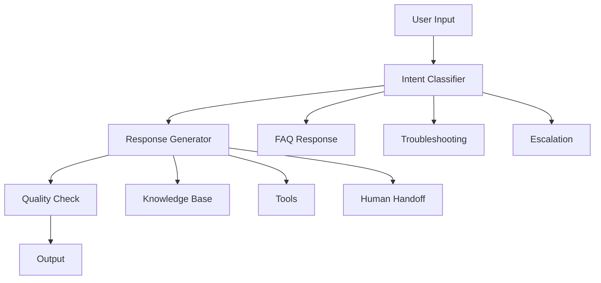

# Customer Support Assistant Example

## Overview

This example demonstrates a production customer support assistant using the framework.

## System Architecture



## Implementation

### System Configuration

```yaml
system:
  name: "customer_support_assistant"
  version: "1.0.0"
  risk_tier: "medium"
  
  domains:
    - "core"
    - "security"
    - "data"
    - "testing"
    - "operations"
    - "compliance"
  
  capabilities:
    - "FAQ answering"
    - "Troubleshooting guidance"
    - "Account information"
    - "Escalation to human agents"
```

### Intent Classification

```yaml
intents:
  - intent: "faq"
    description: "Frequently asked questions"
    examples:
      - "What are your business hours?"
      - "How do I reset my password?"
      - "What is your return policy?"
    response_type: "knowledge_base"
  
  - intent: "troubleshooting"
    description: "Technical issues"
    examples:
      - "My app is not working"
      - "I can't login"
      - "Payment failed"
    response_type: "guided_troubleshooting"
  
  - intent: "account"
    description: "Account-related queries"
    examples:
      - "Show my order history"
      - "Update my email"
      - "Cancel subscription"
    response_type: "tool_execution"
  
  - intent: "escalation"
    description: "Need human assistance"
    examples:
      - "I want to speak to a manager"
      - "This is urgent"
      - "I need help with a complex issue"
    response_type: "human_handoff"
```

### Response Generation

```yaml
response_generation:
  template: "support_response"
  components:
    - "greeting"
    - "acknowledgment"
    - "solution"
    - "next_steps"
    - "follow_up_offer"
  
  constraints:
    - "Be helpful and professional"
    - "Provide accurate information"
    - "Offer clear next steps"
    - "Escalate when appropriate"
  
  safety:
    - "Never share internal systems"
    - "Never make unauthorized promises"
    - "Always verify account before sharing info"
    - "Escalate security issues immediately"
```

### Human Handoff

```yaml
human_handoff:
  triggers:
    - "User requests human agent"
    - "Complex issue not resolvable"
    - "Security or account issue"
    - "Complaint or escalation"
  
  process:
    1. "Acknowledge user request"
    2. "Summarize conversation"
    3. "Transfer to appropriate queue"
    4. "Provide context to human agent"
  
  escalation_levels:
    - level: "tier_1"
      queue: "general_support"
      response_time: "5 minutes"
    
    - level: "tier_2"
      queue: "technical_support"
      response_time: "15 minutes"
    
    - level: "tier_3"
      queue: "specialist"
      response_time: "30 minutes"
```

## Key Controls

| Control | Priority | Implementation |
|---------|----------|----------------|
| Response accuracy | P0 | Knowledge base validation |
| Data privacy | P0 | PII protection |
| Escalation readiness | P0 | Human handoff capability |
| Quality monitoring | P1 | Response quality tracking |
| Audit logging | P1 | Conversation history |

## Metrics

| Metric | Target | Measurement |
|--------|--------|-------------|
| Resolution rate | > 80% | Issues resolved without escalation |
| Response time | < 30 seconds | Time to first response |
| Customer satisfaction | > 4.0/5.0 | Post-interaction survey |
| Escalation rate | < 20% | Escalations / total interactions |

## Conclusion

A well-designed customer support assistant improves efficiency while maintaining quality and customer satisfaction.
