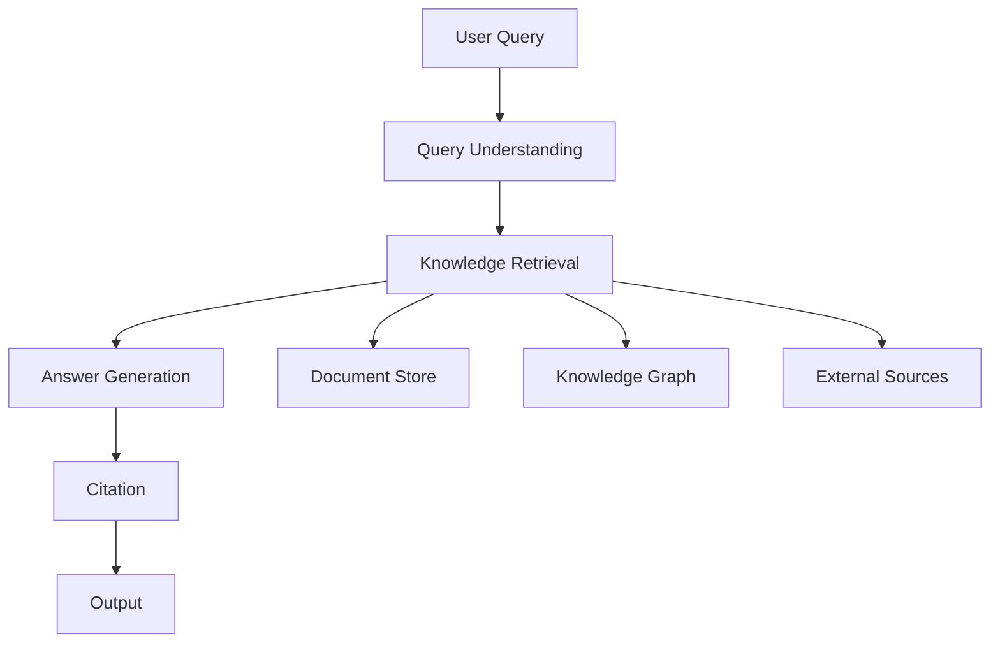

# Knowledge Management Assistant Example

## Overview

This example demonstrates a knowledge management assistant that helps organizations organize and retrieve information.

## System Architecture



## Implementation

### System Configuration

```yaml
system:
  name: "knowledge_management_assistant"
  version: "1.0.0"
  risk_tier: "low"
  
  domains:
    - "core"
    - "data"
    - "integration"
  
  capabilities:
    - "Document search and retrieval"
    - "Knowledge synthesis"
    - "Citation and attribution"
    - "Knowledge gap identification"
```

### Knowledge Sources

```yaml
knowledge_sources:
  - name: "Internal Documentation"
    type: "document_store"
    location: "s3://company-docs/"
    update_frequency: "daily"
    access_level: "internal"
  
  - name: "Knowledge Base"
    type: "knowledge_graph"
    location: "neo4j://kb.internal"
    update_frequency: "real_time"
    access_level: "internal"
  
  - name: "External Research"
    type: "external_api"
    location: "https://api.research.com"
    update_frequency: "weekly"
    access_level: "public"
```

### Query Processing

```yaml
query_processing:
  steps:
    - step: "understanding"
      action: "Parse and understand query"
      techniques:
        - "intent_classification"
        - "entity_extraction"
        - "query_expansion"
    
    - step: "retrieval"
      action: "Retrieve relevant knowledge"
      techniques:
        - "semantic_search"
        - "keyword_search"
        - "graph_traversal"
      parameters:
        max_results: 10
        relevance_threshold: 0.7
    
    - step: "synthesis"
      action: "Synthesize answer"
      techniques:
        - "information_aggregation"
        - "contradiction_resolution"
        - "gap_identification"
    
    - step: "citation"
      action: "Add citations"
      format: "inline"
      required: true
```

### Knowledge Graph Schema

```yaml
knowledge_graph:
  nodes:
    - type: "document"
      properties:
        - "title"
        - "content"
        - "author"
        - "created_at"
        - "updated_at"
        - "tags"
    
    - type: "concept"
      properties:
        - "name"
        - "description"
        - "category"
    
    - type: "person"
      properties:
        - "name"
        - "role"
        - "expertise"
  
  edges:
    - type: "references"
      from: "document"
      to: "document"
    
    - type: "contains"
      from: "document"
      to: "concept"
    
    - type: "authored_by"
      from: "document"
      to: "person"
    
    - type: "related_to"
      from: "concept"
      to: "concept"
```

### Answer Generation

```yaml
answer_generation:
  template: "knowledge_answer"
  components:
    - "direct_answer"
    - "supporting_evidence"
    - "citations"
    - "related_topics"
    - "knowledge_gaps"
  
  constraints:
    - "Always cite sources"
    - "Distinguish facts from opinions"
    - "Identify knowledge gaps"
    - "Suggest additional research"
  
  quality_checks:
    - "Answer accuracy verification"
    - "Citation validity check"
    - "Completeness assessment"
    - "Relevance scoring"
```

## Key Controls

| Control | Priority | Implementation |
|---------|----------|----------------|
| Source verification | P0 | Citation validation |
| Content accuracy | P0 | Fact checking |
| Access control | P1 | Source-level permissions |
| Audit logging | P1 | Query and result logging |

## Metrics

| Metric | Target | Measurement |
|--------|--------|-------------|
| Answer accuracy | > 90% | Verified answers / total |
| Citation completeness | > 95% | Cited answers / total |
| User satisfaction | > 4.0/5.0 | Post-query survey |
| Knowledge coverage | > 85% | Topics covered / total |

## Conclusion

A knowledge management assistant helps organizations leverage their collective knowledge effectively while maintaining accuracy and attribution.
