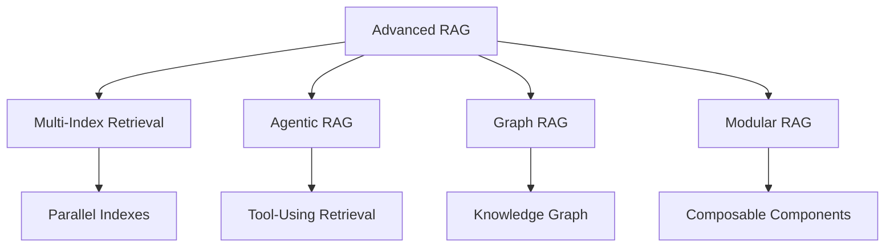

# RAG System Advanced Topics

## Overview

Advanced techniques for building production-grade RAG systems.

## Advanced Architecture



## 1. Multi-Index Retrieval

### Architecture

```yaml
multi_index:
  indexes:
    - name: "technical_docs"
      type: "semantic"
      embedding_model: "text-embedding-ada-002"
      use_case: "Technical documentation"
    
    - name: "knowledge_base"
      type: "hybrid"
      embedding_model: "text-embedding-ada-002"
      use_case: "General knowledge"
    
    - name: "code_repository"
      type: "code"
      embedding_model: "code-embedding"
      use_case: "Code examples"
  
  routing:
    strategy: "query_classification"
    rules:
      - query_type: "technical"
        index: "technical_docs"
      - query_type: "general"
        index: "knowledge_base"
      - query_type: "code"
        index: "code_repository"
```

### Implementation

```python
from rag import MultiIndexRAG

# Initialize multi-index system
rag = MultiIndexRAG(
    indexes=[
        {"name": "technical_docs", "type": "semantic"},
        {"name": "knowledge_base", "type": "hybrid"},
        {"name": "code_repository", "type": "code"}
    ],
    routing_strategy="query_classification"
)

# Query with automatic routing
result = rag.query("How to implement authentication in Python?")
# Automatically routes to code_repository index
```

## 2. Agentic RAG

### Architecture

```yaml
agentic_rag:
  agent_capabilities:
    - "Query analysis"
    - "Index selection"
    - "Result synthesis"
    - "Follow-up generation"
  
  tools:
    - name: "search_documents"
      description: "Search document index"
    
    - name: "search_code"
      description: "Search code repository"
    
    - name: "execute_code"
      description: "Run code examples"
    
    - name: "web_search"
      description: "Search external sources"
  
  workflow:
    - step: "analyze_query"
      agent: "orchestrator"
    
    - step: "select_tool"
      agent: "orchestrator"
    
    - step: "execute_search"
      agent: "tool_executor"
    
    - step: "synthesize_results"
      agent: "orchestrator"
    
    - step: "generate_response"
      agent: "orchestrator"
```

### Implementation

```python
from rag import AgenticRAG

# Initialize agentic RAG
rag = AgenticRAG(
    tools=["search_documents", "search_code", "execute_code"],
    agent_model="gpt-4"
)

# Complex query with tool use
result = rag.query(
    "Find Python authentication examples and explain how they work"
)
# Agent will search code, retrieve examples, and explain
```

## 3. Graph RAG

### Architecture

```yaml
graph_rag:
  knowledge_graph:
    nodes:
      - type: "document"
        properties: ["title", "content", "metadata"]
      
      - type: "concept"
        properties: ["name", "description", "category"]
      
      - type: "entity"
        properties: ["name", "type", "attributes"]
    
    edges:
      - type: "references"
        properties: ["relevance", "context"]
      
      - type: "related_to"
        properties: ["relationship_type"]
      
      - type: "contains"
        properties: ["position"]
  
  traversal:
    strategy: "graph_neighborhood"
    max_depth: 2
    min_relevance: 0.5
```

### Implementation

```python
from rag import GraphRAG

# Initialize graph RAG
rag = GraphRAG(
    graph_database="neo4j",
    embedding_model="text-embedding-ada-002"
)

# Query with graph traversal
result = rag.query(
    "What concepts are related to RAG and how do they connect?"
)
# Uses graph relationships for comprehensive answers
```

## 4. Modular RAG

### Architecture

```yaml
modular_rag:
  components:
    retrieval:
      - "semantic_search"
      - "keyword_search"
      - "hybrid_search"
      - "graph_traversal"
    
    processing:
      - "chunking"
      - "embedding"
      - "indexing"
      - "compression"
    
    generation:
      - "prompt_engineering"
      - "context_assembly"
      - "response_generation"
      - "citation_tracking"
    
    evaluation:
      - "relevance_scoring"
      - "accuracy_checking"
      - "safety_validation"
  
  composition:
    strategy: "pipeline"
    steps:
      - "retrieve"
      - "process"
      - "generate"
      - "evaluate"
```

### Implementation

```python
from rag import ModularRAG

# Initialize modular RAG
rag = ModularRAG(
    retrieval=["semantic_search", "hybrid_search"],
    processing=["chunking", "compression"],
    generation=["prompt_engineering", "citation_tracking"],
    evaluation=["relevance_scoring", "safety_validation"]
)

# Customize pipeline
rag.configure(
    retrieval_strategy="hybrid",
    chunk_size=256,
    top_k=10
)
```

## Advanced Techniques

### 1. HyDE (Hypothetical Document Embeddings)

```python
def hyde_retrieval(query, llm, vector_store):
    """Use HyDE for improved retrieval."""
    # Generate hypothetical answer
    hypothetical = llm.generate(
        f"Write a detailed answer to: {query}"
    )
    
    # Use hypothetical as query
    results = vector_store.similarity_search(
        hypothetical, k=10
    )
    
    return results
```

### 2. Contextual Retrieval

```python
def contextual_retrieval(document, context):
    """Add context to retrieved chunks."""
    contextualized = f"""
    Context: {context}
    
    Document: {document.page_content}
    
    This document is about: [auto-generated summary]
    """
    return contextualized
```

### 3. Self-RAG

```python
def self_rag(query, rag_system):
    """Implement self-reflective RAG."""
    # Initial retrieval
    results = rag_system.retrieve(query)
    
    # Self-evaluation
    relevance = rag_system.evaluate_relevance(query, results)
    
    if relevance < 0.7:
        # Re-retrieve with expanded query
        expanded_query = rag_system.expand_query(query)
        results = rag_system.retrieve(expanded_query)
    
    # Generate with reflection
    response = rag_system.generate_with_reflection(query, results)
    
    return response
```

## Key Controls

| Control | Priority | Implementation |
|---------|----------|----------------|
| Multi-index consistency | P0 | Synchronization |
| Agent security | P0 | Tool permission |
| Graph integrity | P1 | Relationship validation |
| Modular testing | P1 | Component testing |

## Metrics

| Metric | Target | Measurement |
|--------|--------|-------------|
| Multi-index latency | < 3 seconds | Query to response |
| Agent accuracy | > 85% | Correct tool selection |
| Graph traversal quality | > 0.8 | Relevance score |
| Modular flexibility | 100% | Component interchangeability |

## Conclusion

Advanced RAG techniques enable building sophisticated retrieval systems that handle complex queries, multiple data sources, and dynamic knowledge.
