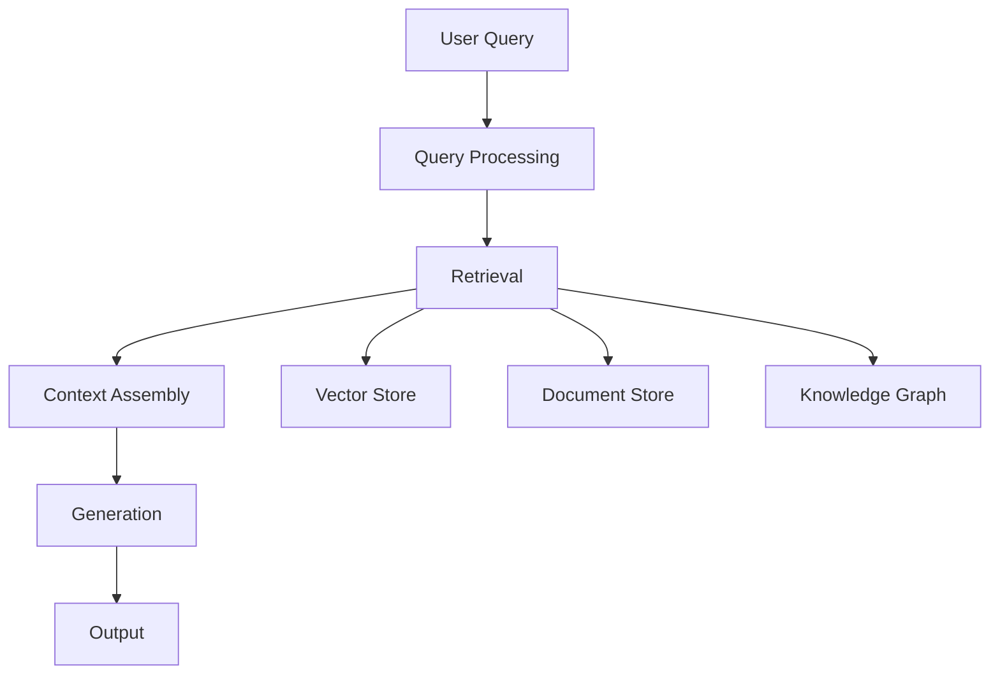

# RAG System Fundamentals

## Overview

Retrieval-Augmented Generation (RAG) combines retrieval with generation to provide accurate, up-to-date responses.

## RAG Architecture



## Key Components

### 1. Document Processing

```yaml
document_processing:
  stages:
    - stage: "ingestion"
      description: "Load documents from sources"
      formats: ["pdf", "docx", "html", "markdown"]
    
    - stage: "chunking"
      description: "Split documents into chunks"
      strategies:
        - "fixed_size"
        - "semantic"
        - "recursive"
      chunk_size: 512
      chunk_overlap: 50
    
    - stage: "embedding"
      description: "Generate embeddings for chunks"
      model: "text-embedding-ada-002"
      dimensions: 1536
    
    - stage: "indexing"
      description: "Store embeddings in vector database"
      database: "pinecone"
      metric: "cosine"
```

### 2. Retrieval Process

```yaml
retrieval_process:
  query_processing:
    - "query_expansion"
    - "hyde_generation"
    - "query_rewrite"
  
  retrieval_strategies:
    - strategy: "semantic_search"
      description: "Vector similarity search"
      top_k: 10
      threshold: 0.7
    
    - strategy: "keyword_search"
      description: "BM25 keyword matching"
      top_k: 10
    
    - strategy: "hybrid_search"
      description: "Combine semantic and keyword"
      weights:
        semantic: 0.7
        keyword: 0.3
  
  reranking:
    model: "cross-encoder"
    top_k: 5
```

### 3. Generation Process

```yaml
generation_process:
  context_assembly:
    max_tokens: 4000
    strategy: "relevance_based"
    include_citations: true
  
  prompt_template: |
    Context: {context}
    
    Question: {question}
    
    Answer based on the context above. If the context doesn't contain
    enough information, say so. Always cite your sources.
  
  model: "gpt-4"
  temperature: 0.3
  max_tokens: 1000
```

## Implementation Example

```python
from rag import RAGSystem

# Initialize RAG system
rag = RAGSystem(
    vector_store="pinecone",
    embedding_model="text-embedding-ada-002",
    llm_model="gpt-4"
)

# Ingest documents
rag.ingest_documents("./documents/")

# Query
result = rag.query("What are the best practices for AI safety?")

print(f"Answer: {result.answer}")
print(f"Sources: {result.sources}")
print(f"Confidence: {result.confidence}")
```

## Key Controls

| Control | Priority | Implementation |
|---------|----------|----------------|
| Source verification | P0 | Citation tracking |
| Content accuracy | P0 | Fact checking |
| Retrieval quality | P1 | Relevance scoring |
| Context limits | P1 | Token management |

## Metrics

| Metric | Target | Measurement |
|--------|--------|-------------|
| Retrieval precision | > 0.8 | Relevant results / total |
| Retrieval recall | > 0.9 | Relevant results / all relevant |
| Answer accuracy | > 0.85 | Correct answers / total |
| Citation completeness | > 0.95 | Cited answers / total |
