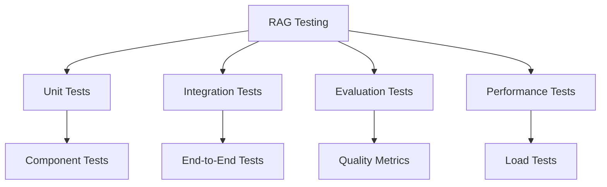

# RAG System Testing

## Overview

Comprehensive testing strategies for RAG systems to ensure quality and reliability.

## Testing Framework



## Test Categories

### 1. Unit Tests

```yaml
unit_tests:
  document_processing:
    - test: "Document loading"
      input: "sample.pdf"
      expected: "Document object with content"
    
    - test: "Text chunking"
      input: "Long document"
      expected: "Chunks of correct size"
    
    - test: "Embedding generation"
      input: "Text chunk"
      expected: "Vector of correct dimensions"
  
  retrieval:
    - test: "Similarity search"
      input: "Query and vector store"
      expected: "Relevant documents"
    
    - test: "Filter application"
      input: "Query with filters"
      expected: "Filtered results"
  
  generation:
    - test: "Prompt formatting"
      input: "Context and query"
      expected: "Formatted prompt"
    
    - test: "Response parsing"
      input: "LLM response"
      expected: "Parsed answer"
```

### 2. Integration Tests

```yaml
integration_tests:
  end_to_end:
    - test: "Full RAG pipeline"
      input: "Document and query"
      expected: "Accurate answer with citations"
    
    - test: "Multi-document query"
      input: "Query spanning multiple docs"
      expected: "Comprehensive answer"
  
  component_integration:
    - test: "Vector store integration"
      components: ["embeddings", "vector_store"]
      expected: "Successful indexing and retrieval"
    
    - test: "LLM integration"
      components: ["retrieval", "generation"]
      expected: "Coherent response generation"
```

### 3. Evaluation Tests

```yaml
evaluation_tests:
  quality_metrics:
    - metric: "Answer Accuracy"
      method: "human_evaluation"
      threshold: 0.85
      samples: 100
    
    - metric: "Citation Accuracy"
      method: "automated_check"
      threshold: 0.95
    
    - metric: "Relevance Score"
      method: "automated_evaluation"
      threshold: 0.80
  
  safety_metrics:
    - metric: "Hallucination Rate"
      method: "fact_checking"
      threshold: 0.10
    
    - metric: "Toxicity Score"
      method: "safety_classifier"
      threshold: 0.05
  
  robustness_metrics:
    - metric: "Query Variation Handling"
      method: "paraphrase_testing"
      threshold: 0.80
    
    - metric: "Edge Case Handling"
      method: "boundary_testing"
      threshold: 0.75
```

### 4. Performance Tests

```yaml
performance_tests:
  latency:
    - test: "Query latency"
      target: "< 2 seconds"
      percentile: 95
    
    - test: "Ingestion throughput"
      target: "> 100 docs/minute"
  
  throughput:
    - test: "Concurrent queries"
      target: "100 queries/second"
      duration: "5 minutes"
  
  scalability:
    - test: "Large document set"
      documents: 100000
      expected: "No performance degradation"
  
  cost:
    - test: "Token usage"
      target: "< 1000 tokens/query"
      measurement: "average"
```

## Test Implementation

```python
import pytest
from rag import RAGSystem

@pytest.fixture
def rag_system():
    return RAGSystem(
        vector_store="test_store",
        embedding_model="test_model",
        llm_model="test_llm"
    )

class TestRAGSystem:
    def test_document_ingestion(self, rag_system):
        """Test document ingestion pipeline."""
        result = rag_system.ingest("./test_docs/")
        assert result.documents_loaded > 0
        assert result.chunks_created > 0
    
    def test_query_response(self, rag_system):
        """Test query and response generation."""
        result = rag_system.query("What is RAG?")
        assert result.answer is not None
        assert len(result.sources) > 0
        assert result.confidence > 0.7
    
    def test_citation_accuracy(self, rag_system):
        """Test citation accuracy."""
        result = rag_system.query("What are best practices?")
        for source in result.sources:
            assert source.document_id is not None
            assert source.chunk_id is not None
    
    def test_retrieval_relevance(self, rag_system):
        """Test retrieval relevance."""
        results = rag_system.retrieve("AI safety")
        assert len(results) > 0
        for result in results:
            assert result.score > 0.7
```

## Test Automation

```yaml
test_automation:
  ci_integration:
    trigger: "pull_request"
    tests:
      - "unit_tests"
      - "integration_tests"
      - "evaluation_tests"
    timeout: "30 minutes"
  
  nightly_build:
    trigger: "schedule"
    tests:
      - "all_tests"
      - "performance_tests"
    timeout: "2 hours"
  
  release_validation:
    trigger: "release_tag"
    tests:
      - "full_test_suite"
      - "performance_benchmark"
    timeout: "4 hours"
```

## Key Controls

| Control | Priority | Implementation |
|---------|----------|----------------|
| Test coverage | P0 | Minimum 80% coverage |
| Evaluation metrics | P0 | Automated scoring |
| Performance benchmarks | P1 | Latency and throughput |
| Safety testing | P1 | Toxicity and hallucination checks |

## Metrics

| Metric | Target | Measurement |
|--------|--------|-------------|
| Test coverage | > 80% | Code coverage |
| Evaluation pass rate | > 90% | Tests passing / total |
| Performance targets met | 100% | All benchmarks passed |
| Safety score | > 0.95 | Safety evaluation |
