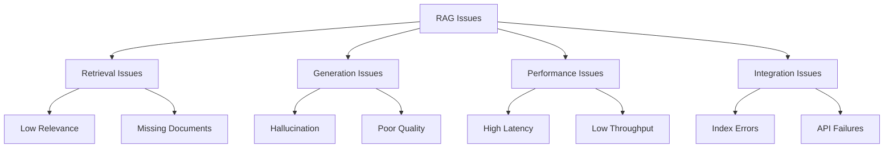

# RAG System Troubleshooting

## Overview

Common issues and solutions for RAG systems.

## Issue Categories



## Issue 1: Low Retrieval Relevance

### Symptoms
- Retrieved documents not relevant to query
- Answer quality poor due to bad context
- Low relevance scores

### Root Cause
- Poor chunking strategy
- Inadequate embedding model
- Missing query expansion

### Solution

```yaml
solution:
  steps:
    - step: "Analyze chunking"
      action: "Review chunk size and overlap"
      fix: "Adjust chunk_size and chunk_overlap"
    
    - step: "Evaluate embeddings"
      action: "Test different embedding models"
      fix: "Use better embedding model"
    
    - step: "Implement query expansion"
      action: "Add HyDE or query rewriting"
      fix: "Use contextual retrieval"
```

## Issue 2: Hallucination

### Symptoms
- Generated answers contain false information
- Citations don't support claims
- Inconsistent responses

### Root Cause
- Insufficient context
- Model hallucination
- Poor citation tracking

### Solution

```yaml
solution:
  steps:
    - step: "Improve context"
      action: "Increase retrieved documents"
      fix: "Adjust top_k parameter"
    
    - step: "Add fact checking"
      action: "Implement verification step"
      fix: "Use fact-checking model"
    
    - step: "Enforce citations"
      action: "Require citation for all claims"
      fix: "Update prompt template"
```

## Issue 3: High Latency

### Symptoms
- Slow query responses
- Timeouts on complex queries
- Poor user experience

### Root Cause
- Slow retrieval
- Large context windows
- Inefficient generation

### Solution

```yaml
solution:
  steps:
    - step: "Optimize retrieval"
      action: "Use faster vector store"
      fix: "Implement caching"
    
    - step: "Reduce context"
      action: "Limit context window"
      fix: "Use compression"
    
    - step: "Optimize generation"
      action: "Use faster model"
      fix: "Implement streaming"
```

## Issue 4: Poor Citation Quality

### Symptoms
- Citations don't match claims
- Missing citations
- Incorrect source attribution

### Root Cause
- Weak citation tracking
- Poor source metadata
- Inadequate prompt instructions

### Solution

```yaml
solution:
  steps:
    - step: "Improve metadata"
      action: "Add source tracking"
      fix: "Include document IDs"
    
    - step: "Update prompt"
      action: "Require explicit citations"
      fix: "Add citation instructions"
    
    - step: "Validate citations"
      action: "Post-process citation check"
      fix: "Implement citation validator"
```

## Diagnostic Commands

```bash
# Check retrieval quality
python scripts/cli.py validate --verbose

# Test query performance
python -c "from rag import RAGSystem; r = RAGSystem(); print(r.benchmark())"

# Check index status
python -c "import pinecone; print(pinecone.list_indexes())"

# View logs
tail -f logs/rag.log | grep -E "retrieval|generation|error"
```

## Prevention Strategies

| Strategy | Description | Implementation |
|----------|-------------|----------------|
| Regular evaluation | Test quality metrics | Automated evaluation suite |
| Monitoring | Track performance | Dashboards and alerts |
| A/B testing | Compare approaches | Experiment framework |
| User feedback | Collect user input | Feedback collection |

## Key Controls

| Control | Priority | Implementation |
|---------|----------|----------------|
| Error handling | P0 | Graceful degradation |
| Logging | P1 | Comprehensive logging |
| Monitoring | P1 | Performance tracking |
| Alerting | P1 | Threshold-based alerts |

## Metrics

| Metric | Target | Measurement |
|--------|--------|-------------|
| Issue resolution time | < 4 hours | Time to fix |
| Recurrence rate | < 5% | Issues that return |
| User satisfaction | > 4.0/5.0 | Post-issue survey |
| System availability | > 99.9% | Uptime monitoring |
