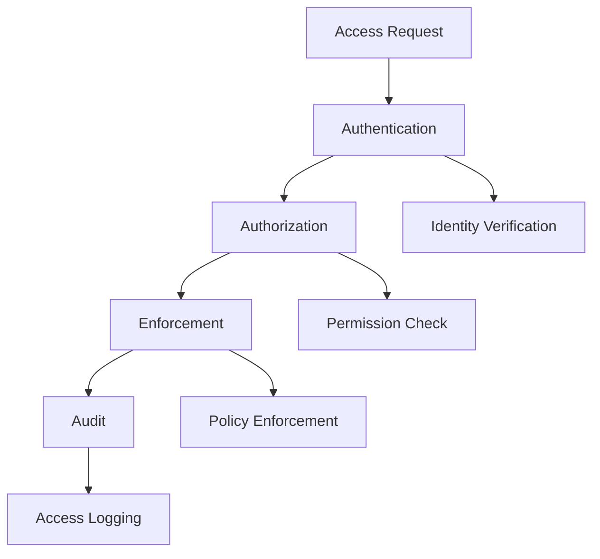

# Access Control Implementation

## Overview

Implementing robust access control for AI systems.

## Access Control Architecture



## Access Control Models

### 1. Role-Based Access Control (RBAC)

```yaml
rbac_model:
  roles:
    - name: "admin"
      description: "Full system access"
      permissions: ["*"]
    
    - name: "developer"
      description: "Development access"
      permissions:
        - "read:code"
        - "write:code"
        - "read:documentation"
        - "execute:tests"
    
    - name: "analyst"
      description: "Data analysis access"
      permissions:
        - "read:data"
        - "read:reports"
        - "execute:queries"
    
    - name: "viewer"
      description: "Read-only access"
      permissions:
        - "read:*"
  
  assignment:
    method: "role_based"
    inheritance: true
    max_roles_per_user: 5
```

### 2. Attribute-Based Access Control (ABAC)

```yaml
abac_model:
  attributes:
    user:
      - "role"
      - "department"
      - "clearance_level"
      - "location"
    
    resource:
      - "type"
      - "classification"
      - "owner"
      - "environment"
    
    action:
      - "read"
      - "write"
      - "delete"
      - "execute"
    
    context:
      - "time_of_day"
      - "ip_address"
      - "device_type"
  
  policies:
    - name: "data_access"
      rule: "user.clearance >= resource.classification"
    
    - name: "time_restriction"
      rule: "time_of_day >= 09:00 AND time_of_day <= 17:00"
```

### 3. Policy-Based Access Control (PBAC)

```yaml
pbac_model:
  policies:
    - name: "api_access"
      description: "Control API access"
      rules:
        - "user.authenticated == true"
        - "user.role in ['admin', 'developer']"
        - "resource.type == 'api'"
        - "action == 'read'"
      effect: "allow"
    
    - name: "data_export"
      description: "Control data export"
      rules:
        - "user.role == 'admin'"
        - "resource.classification <= 'confidential'"
        - "approval_required == true"
      effect: "allow"
```

## Implementation

### Access Control Middleware

```python
from functools import wraps
from security import AccessControl

ac = AccessControl()

def require_permission(permission):
    """Decorator to enforce permission."""
    def decorator(func):
        @wraps(func)
        def wrapper(*args, **kwargs):
            user = get_current_user()
            resource = kwargs.get('resource', 'default')
            
            if not ac.check_permission(user, permission, resource):
                raise PermissionDenied(f"Missing permission: {permission}")
            
            return func(*args, **kwargs)
        return wrapper
    return decorator

# Usage
@require_permission("read")
def get_document(document_id):
    return document_store.get(document_id)

@require_permission("write")
def update_document(document_id, data):
    return document_store.update(document_id, data)
```

### Access Control Configuration

```yaml
access_control_config:
  authentication:
    provider: "oauth2"
    session_timeout: "30 minutes"
    max_sessions: 5
  
  authorization:
    model: "rbac"
    default_role: "viewer"
    admin_role: "admin"
  
  enforcement:
    mode: "enforce"
    log_level: "info"
    alert_on_violation: true
  
  audit:
    enabled: true
    events: ["access_granted", "access_denied", "permission_change"]
    retention: "1 year"
```

## Key Controls

| Control | Priority | Implementation |
|---------|----------|----------------|
| Authentication | P0 | Multi-factor authentication |
| Authorization | P0 | RBAC/ABAC/PBAC |
| Session management | P0 | Secure session handling |
| Audit logging | P1 | Access event logging |

## Metrics

| Metric | Target | Measurement |
|--------|--------|-------------|
| Access control coverage | 100% | Protected resources |
| Authentication success rate | > 99% | Successful auth / total |
| Authorization accuracy | > 99% | Correct decisions / total |
| Audit completeness | 100% | Logged events / total |
