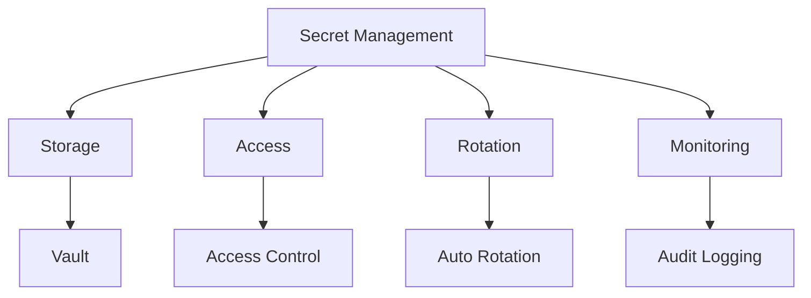

# Secret Management Implementation

## Overview

Managing secrets securely in AI systems.

## Secret Management Architecture



## Secret Types

```yaml
secret_types:
  api_keys:
    description: "External API credentials"
    examples: ["OpenAI API key", "AWS access key"]
    rotation: "quarterly"
    storage: "vault"
  
  database_credentials:
    description: "Database connection credentials"
    examples: ["PostgreSQL password", "MongoDB connection string"]
    rotation: "monthly"
    storage: "vault"
  
  encryption_keys:
    description: "Data encryption keys"
    examples: ["AES-256 key", "RSA private key"]
    rotation: "annually"
    storage: "HSM"
  
  service_tokens:
    description: "Service authentication tokens"
    examples: ["JWT signing key", "OAuth client secret"]
    rotation: "quarterly"
    storage: "vault"
```

## Implementation

### Secret Storage

```yaml
secret_storage:
  provider: "hashicorp_vault"
  configuration:
    address: "https://vault.internal:8200"
    auth_method: "approle"
    namespace: "ai-platform"
  
  secret_engines:
    - engine: "kv_v2"
      path: "secret/ai-platform"
      description: "Application secrets"
    
    - engine: "transit"
      path: "transit/ai-platform"
      description: "Encryption as a service"
  
  access_policies:
    - name: "application_policy"
      paths:
        - "secret/ai-platform/application/*"
        - "transit/ai-platform/encrypt/*"
        - "transit/ai-platform/decrypt/*"
      capabilities: ["read", "encrypt", "decrypt"]
```

### Secret Rotation

```yaml
secret_rotation:
  schedule: "cron: 0 2 1 */3 *"  # 1st of every 3rd month at 2am
  
  process:
    - step: "generate_new_secret"
      method: "vault_write"
      path: "secret/ai-platform/{{secret_name}}"
    
    - step: "update_service_config"
      method: "config_update"
      service: "{{affected_service}}"
    
    - step: "verify_new_secret"
      method: "health_check"
      endpoint: "/health"
    
    - step: "revoke_old_secret"
      method: "vault_delete"
      path: "secret/ai-platform/{{secret_name}}/previous"
      delay: "24_hours"
  
  notification:
    enabled: true
    channels:
      - "slack:#security-ops"
      - "email:security-team@company.com"
    timing: "7_days_before_rotation"
```

### Secret Access Control

```yaml
secret_access:
  policies:
    - name: "application_access"
      description: "Application access to secrets"
      paths:
        - "secret/ai-platform/application/*"
      capabilities: ["read"]
      constraints:
        - "ip: 10.0.0.0/8"
    
    - name: "ops_access"
      description: "Operations access to secrets"
      paths:
        - "secret/ai-platform/*"
      capabilities: ["read", "list"]
      constraints:
        - "mfa: required"
    
    - name: "security_access"
      description: "Security team full access"
      paths:
        - "secret/*"
        - "transit/*"
      capabilities: ["read", "write", "delete", "list"]
      constraints:
        - "mfa: required"
        - "approval_required_for_delete"
  
  audit:
    enabled: true
    events: ["read", "write", "rotate", "delete"]
    retention: "1_year"
    alert_rules:
      - condition: "unauthorized_access_attempt"
        action: "alert_security_team"
```

## Implementation Example

```python
from security import SecretManager

# Initialize secret manager
secrets = SecretManager(
    provider="vault",
    address="https://vault.internal:8200"
)

# Get secret
api_key = secrets.get_secret("api_keys/openai")

# Rotate secret
secrets.rotate_secret("database/password")

# Revoke secret
secrets.revoke_secret("compromised/key")
```

## Key Controls

| Control | Priority | Implementation |
|---------|----------|----------------|
| Secure storage | P0 | Vault or HSM |
| Access control | P0 | Least privilege |
| Rotation | P0 | Automated rotation |
| Audit logging | P1 | All access logged |

## Metrics

| Metric | Target | Measurement |
|--------|--------|-------------|
| Secret rotation compliance | 100% | Rotated on time / total |
| Unauthorized access attempts | 0 | Failed access / total |
| Secret exposure incidents | 0 | Incidents per quarter |
| Audit coverage | 100% | Logged events / total |
