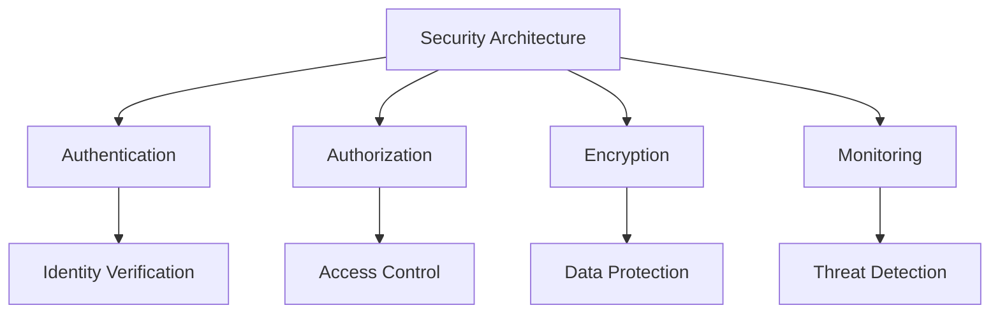

# Security Implementation Fundamentals

## Overview

Core security concepts and implementation patterns for AI systems.

## Security Architecture



## Security Controls

### 1. Authentication

```yaml
authentication:
  mechanisms:
    - name: "API Key"
      use_case: "Service-to-service"
      implementation: "Header-based"
    
    - name: "OAuth 2.0"
      use_case: "User authentication"
      implementation: "Token-based"
    
    - name: "JWT"
      use_case: "Stateless authentication"
      implementation: "Token-based"
  
  requirements:
    - "Multi-factor authentication for admin access"
    - "Token expiration and refresh"
    - "Secure credential storage"
    - "Audit logging for all auth events"
```

### 2. Authorization

```yaml
authorization:
  model: "RBAC"
  roles:
    - name: "admin"
      permissions: ["*"]
    
    - name: "user"
      permissions: ["read", "write"]
    
    - name: "viewer"
      permissions: ["read"]
  
  enforcement:
    - "Check permissions before each action"
    - "Log all access attempts"
    - "Implement least privilege"
    - "Regular access reviews"
```

### 3. Encryption

```yaml
encryption:
  at_rest:
    algorithm: "AES-256"
    key_management: "AWS KMS"
    scope: "all_sensitive_data"
  
  in_transit:
    protocol: "TLS 1.3"
    certificate_management: "Let's Encrypt"
    scope: "all_communications"
  
  key_management:
    rotation: "quarterly"
    access: "restricted"
    audit: "enabled"
```

### 4. Monitoring

```yaml
security_monitoring:
  logging:
    events:
      - "authentication"
      - "authorization"
      - "data_access"
      - "configuration_changes"
    retention: "1_year"
    integrity: "hash_chain"
  
  alerting:
    rules:
      - condition: "failed_auth > 5"
        severity: "high"
        action: "alert_security"
      
      - condition: "unusual_data_access"
        severity: "medium"
        action: "log_and_alert"
    
    channels:
      - "email"
      - "slack"
      - "pagerduty"
```

## Implementation Example

```python
from security import SecurityManager

# Initialize security
security = SecurityManager(
    auth_provider="oauth2",
    encryption="aes256",
    monitoring=True
)

# Authenticate user
token = security.authenticate(
    username="user@example.com",
    password="secure_password"
)

# Check authorization
if security.authorize(token, "read", "resource_123"):
    # Process request
    pass
else:
    # Deny access
    pass
```

## Key Controls

| Control | Priority | Implementation |
|---------|----------|----------------|
| Authentication | P0 | Multi-factor authentication |
| Authorization | P0 | Role-based access control |
| Encryption | P0 | AES-256 and TLS 1.3 |
| Monitoring | P1 | Security event logging |

## Metrics

| Metric | Target | Measurement |
|--------|--------|-------------|
| Authentication success rate | > 99% | Successful auth / total |
| Authorization coverage | 100% | Protected endpoints / total |
| Encryption coverage | 100% | Encrypted data / total |
| Security incidents | 0 | Critical incidents per month |
