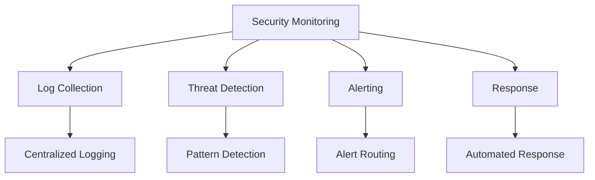

# Security Monitoring Implementation

## Overview

Implementing comprehensive security monitoring for AI systems.

## Monitoring Architecture



## Monitoring Components

### 1. Log Collection

```yaml
log_collection:
  sources:
    - name: "application_logs"
      type: "structured"
      fields: ["timestamp", "level", "message", "user_id", "action"]
    
    - name: "audit_logs"
      type: "immutable"
      fields: ["event_type", "user_id", "resource", "action", "result"]
    
    - name: "security_logs"
      type: "security"
      fields: ["event_type", "severity", "source_ip", "user_id"]
  
  storage:
    primary: "elasticsearch"
    retention: "90_days"
    archive: "s3"
    archive_retention: "1_year"
  
  pipeline:
    - step: "collection"
      method: "filebeat"
    
    - step: "processing"
      method: "logstash"
    
    - step: "indexing"
      method: "elasticsearch"
    
    - step: "visualization"
      method: "kibana"
```

### 2. Threat Detection

```yaml
threat_detection:
  rules:
    - name: "brute_force"
      description: "Detect brute force attacks"
      condition: "failed_auth > 5 in 5 minutes"
      severity: "high"
      action: "block_and_alert"
    
    - name: "privilege_escalation"
      description: "Detect privilege escalation"
      condition: "unauthorized_permission_change"
      severity: "critical"
      action: "alert_and_investigate"
    
    - name: "data_exfiltration"
      description: "Detect data exfiltration"
      condition: "large_data_download OR unusual_data_access"
      severity: "critical"
      action: "alert_and_block"
    
    - name: "injection_attempt"
      description: "Detect injection attacks"
      condition: "injection_pattern_detected"
      severity: "critical"
      action: "block_and_alert"
  
  machine_learning:
    enabled: true
    models:
      - name: "anomaly_detection"
        type: "isolation_forest"
        features: ["access_patterns", "data_volume", "timing"]
      
      - name: "behavior_analysis"
        type: "lstm"
        features: ["user_behavior", "system_behavior"]
```

### 3. Alerting

```yaml
alerting:
  routing:
    - severity: "critical"
      channels:
        - "pagerduty:security-team"
        - "slack:#security-critical"
        - "email:security-lead@company.com"
      response_time: "15_minutes"
    
    - severity: "high"
      channels:
        - "slack:#security-alerts"
        - "email:security-team@company.com"
      response_time: "1_hour"
    
    - severity: "medium"
      channels:
        - "slack:#security-monitoring"
      response_time: "4_hours"
    
    - severity: "low"
      channels:
        - "slack:#security-info"
      response_time: "24_hours"
  
  escalation:
    policies:
      - name: "unacknowledged_alert"
        trigger: "alert not acknowledged in response_time"
        action: "escalate_to_next_level"
      
      - name: "repeated_alerts"
        trigger: "same_alert > 3 times in 1 hour"
        action: "escalate_to_management"
```

### 4. Response

```yaml
automated_response:
  actions:
    - action: "block_ip"
      trigger: "brute_force_detected"
      method: "firewall_api"
      duration: "24_hours"
    
    - action: "revoke_session"
      trigger: "suspicious_activity"
      method: "session_api"
    
    - action: "enable_enhanced_monitoring"
      trigger: "security_incident"
      method: "monitoring_api"
      duration: "7_days"
  
  runbooks:
    - name: "brute_force_response"
      steps:
        - "Block attacking IP"
        - "Notify security team"
        - "Review affected accounts"
        - "Update firewall rules"
    
    - name: "data_exfiltration_response"
      steps:
        - "Isolate affected system"
        - "Preserve evidence"
        - "Notify incident response team"
        - "Begin investigation"
```

## Implementation Example

```python
from security import SecurityMonitor

# Initialize monitor
monitor = SecurityMonitor(
    log_sources=["application", "audit", "security"],
    detection_rules=["brute_force", "injection"],
    alert_channels=["slack", "email"]
)

# Start monitoring
monitor.start()

# Process security event
event = {
    "type": "failed_auth",
    "user_id": "user123",
    "source_ip": "192.168.1.100",
    "timestamp": "2026-06-04T10:00:00Z"
}

monitor.process_event(event)
```

## Key Controls

| Control | Priority | Implementation |
|---------|----------|----------------|
| Log collection | P0 | Centralized logging |
| Threat detection | P0 | Rule-based and ML detection |
| Alert routing | P0 | Multi-channel alerting |
| Automated response | P1 | Predefined actions |

## Metrics

| Metric | Target | Measurement |
|--------|--------|-------------|
| Detection rate | > 95% | Detected threats / total |
| Mean time to detect | < 5 minutes | Time to detection |
| Mean time to respond | < 30 minutes | Time to response |
| False positive rate | < 5% | False alerts / total |
