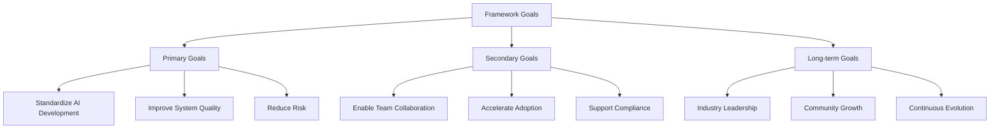
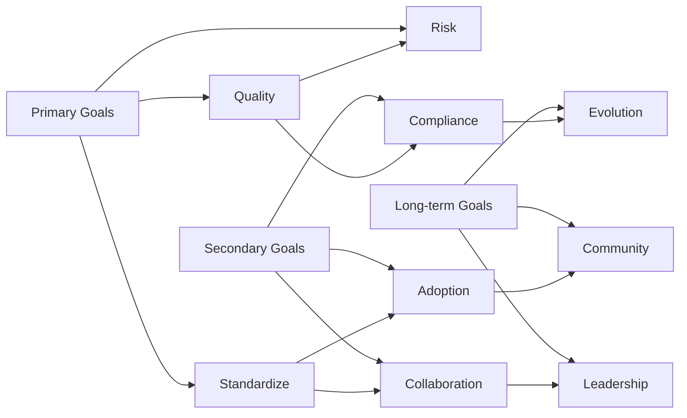
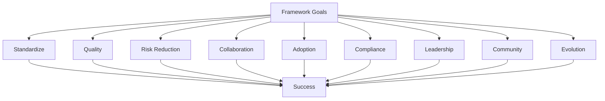

# Goal - LLM & Agentic Rules Framework

## Overview

This document defines the goals, objectives, and success criteria for the LLM & Agentic Rules Framework.

## Framework Goals

## Primary Goals

### 1. Standardize AI Development

**Goal**: Provide consistent, repeatable standards for building LLM and agentic systems.

**Success Criteria**:
- 100% of new AI projects use framework standards
- Consistent code quality across teams
- Reduced onboarding time for new developers
- Clear expectations for all roles

**Metrics**:
- Framework adoption rate: > 90%
- Code review consistency: > 95%
- Onboarding time reduction: > 50%
- Standards compliance rate: > 85%

### 2. Improve System Quality

**Goal**: Ensure AI systems are reliable, performant, and maintainable.

**Success Criteria**:
- Production incidents reduced by 50%
- System availability > 99.9%
- Performance meets SLOs consistently
- Technical debt reduced quarterly

**Metrics**:
- Incident rate: < 2 per month
- Availability: > 99.9%
- Performance SLO compliance: > 95%
- Technical debt ratio: < 10%

### 3. Reduce Risk

**Goal**: Minimize security, compliance, and operational risks.

**Success Criteria**:
- Zero critical security incidents
- 100% compliance with regulations
- All systems assessed for risk
- Exception rate < 5%

**Metrics**:
- Security incidents: 0 critical
- Compliance score: > 95%
- Risk assessment coverage: 100%
- Exception rate: < 5%

## Secondary Goals

### 4. Enable Team Collaboration

**Goal**: Facilitate effective collaboration across teams and roles.

**Success Criteria**:
- Clear role definitions and responsibilities
- Consistent communication protocols
- Shared understanding of requirements
- Cross-functional review processes

**Metrics**:
- Role clarity score: > 90%
- Communication effectiveness: > 85%
- Cross-team collaboration rate: > 80%
- Review participation: 100%

### 5. Accelerate Adoption

**Goal**: Make the framework easy to adopt and use.

**Success Criteria**:
- Quick start guide available
- Training materials complete
- Tooling support provided
- Community support active

**Metrics**:
- Time to first value: < 1 week
- Training completion rate: > 90%
- Tool adoption rate: > 80%
- Community engagement: > 50 contributors

### 6. Support Compliance

**Goal**: Help teams meet regulatory and compliance requirements.

**Success Criteria**:
- All regulations mapped to controls
- Evidence collection automated
- Audit preparation simplified
- Exception management structured

**Metrics**:
- Regulation coverage: 100%
- Evidence collection automation: > 80%
- Audit preparation time: < 1 week
- Exception resolution time: < 30 days

## Long-term Goals

### 7. Industry Leadership

**Goal**: Establish the framework as an industry standard.

**Success Criteria**:
- Industry recognition and adoption
- Conference presentations and publications
- Partner integrations
- Academic collaboration

**Metrics**:
- Industry adoption: > 100 organizations
- Conference presentations: > 10 per year
- Partner integrations: > 20
- Academic citations: > 50

### 8. Community Growth

**Goal**: Build a thriving community around the framework.

**Success Criteria**:
- Active contributor community
- Regular contributions and improvements
- Community-driven enhancements
- Mentorship and support programs

**Metrics**:
- Contributors: > 100
- Pull requests per month: > 20
- Issues resolved within 7 days: > 90%
- Community satisfaction: > 4.5/5

### 9. Continuous Evolution

**Goal**: Keep the framework current with evolving technology and practices.

**Success Criteria**:
- Regular updates and releases
- Technology trend integration
- Best practice evolution
- Feedback-driven improvements

**Metrics**:
- Release frequency: quarterly
- Technology coverage: > 95%
- Best practice currency: > 90%
- Feedback incorporation: > 80%

## Goal Alignment

## Goal Tracking

### Quarterly Review

| Goal | Target | Current | Status |
|------|--------|---------|--------|
| Framework adoption | > 90% | - | Pending |
| Incident reduction | > 50% | - | Pending |
| Compliance score | > 95% | - | Pending |
| Community contributors | > 100 | - | Pending |

### Annual Review

| Goal | Target | Current | Status |
|------|--------|---------|--------|
| Industry adoption | > 100 orgs | - | Pending |
| Conference presentations | > 10 | - | Pending |
| Partner integrations | > 20 | - | Pending |
| Release frequency | Quarterly | - | Pending |

## Success Factors

### Critical Success Factors

1. **Leadership Support**: Executive sponsorship and resource commitment
2. **Team Engagement**: Active participation from all roles
3. **Tool Support**: Adequate tooling for adoption and compliance
4. **Training**: Comprehensive training and onboarding
5. **Communication**: Clear and consistent communication

### Risk Factors

1. **Resistance to Change**: Teams may resist adopting new standards
2. **Resource Constraints**: Limited time and budget for adoption
3. **Complexity**: Framework may be perceived as too complex
4. **Keeping Current**: Technology evolves rapidly
5. **Community Engagement**: Maintaining active community participation

## Conclusion

The LLM & Agentic Rules Framework aims to standardize AI development, improve system quality, and reduce risk while enabling collaboration, accelerating adoption, and supporting compliance. Long-term goals include industry leadership, community growth, and continuous evolution.

