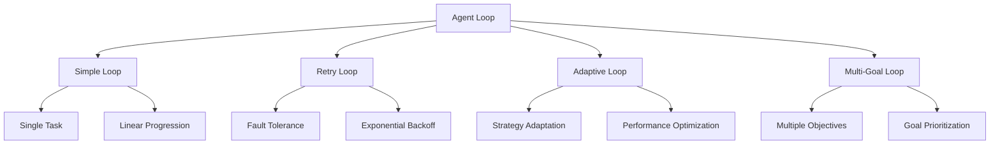
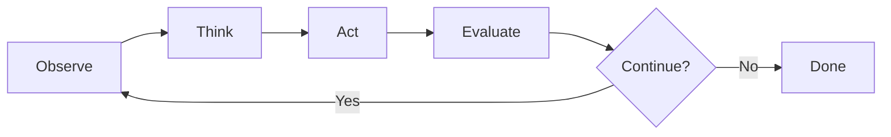

# Loop Domain

## Overview

The Loop domain provides comprehensive guidance for implementing agent loops in LLM and agentic systems.

## Architecture

```mermaid
flowchart TD
    A[Loop Domain] --> B[Fundamentals]
    A --> C[Best Practices]
    A --> D[Anti-Patterns]
    A --> E[Checklist]
    A --> F[Examples]
    A --> G[Troubleshooting]
    A --> H[Advanced]
    
    B --> B1[Loop Concepts]
    B --> B2[Loop Types]
    B --> B3[Loop Components]
    
    C --> C1[Stopping Conditions]
    C --> C2[Error Handling]
    C --> C3[State Management]
    
    D --> D1[Infinite Loops]
    D --> D2[No Error Handling]
    D --> D3[Unbounded Growth]
    
    E --> E1[P0 Critical Checks]
    E --> E2[P1 High Priority]
    E --> E3[P2 Medium Priority]
    
    F --> F1[Simple Loop]
    F --> F2[Retry Loop]
    F --> F3[Adaptive Loop]
    
    G --> G1[Issue Diagnosis]
    G --> G2[Solutions]
    
    H --> H1[Multi-Agent]
    H --> H2[Self-Healing]
    H --> H3[Optimization]
```

## Loop Types

## Loop Lifecycle

## Files

| File | Purpose | Lines |
|------|---------|-------|
| loop-fundamentals.md | Core loop concepts | 495 |
| loop-best-practices.md | Recommended patterns | 453 |
| loop-anti-patterns.md | Common mistakes | 476 |
| loop-checklist.md | Verification steps | 264 |
| loop-examples.md | Practical examples | 471 |
| loop-troubleshooting.md | Issue solutions | 541 |
| loop-advanced.md | Advanced techniques | 561 |

## Quick Start

1. Read `loop-fundamentals.md` for core concepts
2. Review `loop-best-practices.md` for recommended patterns
3. Use `loop-checklist.md` for verification steps
4. Reference `loop-examples.md` for implementation guidance
