# Memory Domain

## Overview

The Memory domain contains framework context, agent catalogs, domain references, and decision matrices for the LLM & Agentic Rules Framework.

## Architecture

```mermaid
flowchart TD
    A[Memory] --> B[Framework Context]
    A --> C[Agent Catalog]
    A --> D[Domain Reference]
    A --> E[Integration Patterns]
    A --> F[Decision Matrix]
    A --> G[Rules Summaries]
    
    B --> B1[Project Structure]
    B --> B2[Quality Standards]
    B --> B3[Governance Model]
    
    C --> C1[Agent Roles]
    C --> C2[Agent Workflows]
    C --> C3[Agent Interactions]
    
    D --> D1[Domain Selection]
    D --> D2[Control Mapping]
    D --> D3[Metrics]
    
    E --> E1[Agent Workflows]
    E --> E2[API Patterns]
    E --> E3[Data Flows]
    
    F --> F1[Risk Assessment]
    F --> F2[Selection Matrices]
    F --> F3[Prioritization]
    
    G --> G1[Core Rules]
    G --> G2[Security Rules]
    G --> G3[Data Rules]
    G --> G4[Testing Rules]
    G --> G5[Compliance Rules]
```

## Files

| File | Purpose | Lines |
|------|---------|-------|
| framework-context.md | Project structure and standards | 781 |
| agent-catalog.md | Agent roles and workflows | 711 |
| domain-reference.md | Domain selection and controls | 747 |
| integration-patterns.md | Integration workflows | 1209 |
| decision-matrix.md | Decision support matrices | 722 |
| core-rules-summary.md | Core domain rules | 348 |
| security-rules-summary.md | Security domain rules | 383 |
| data-rules-summary.md | Data domain rules | 362 |
| testing-rules-summary.md | Testing domain rules | 356 |
| compliance-rules-summary.md | Compliance domain rules | 410 |

## Quick Start

1. Read `framework-context.md` for project overview
2. Reference `agent-catalog.md` for agent roles
3. Use `domain-reference.md` for domain selection
4. Consult `decision-matrix.md` for decision support
