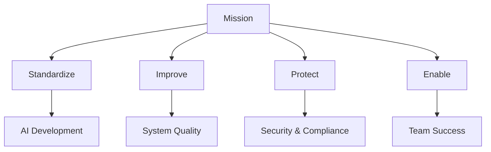
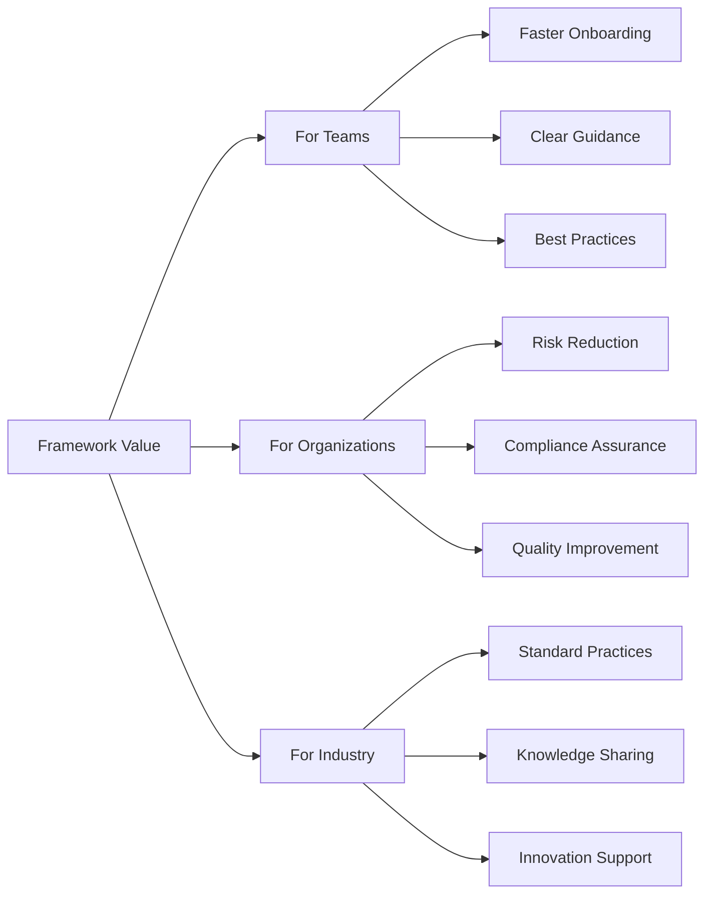
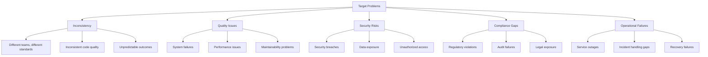
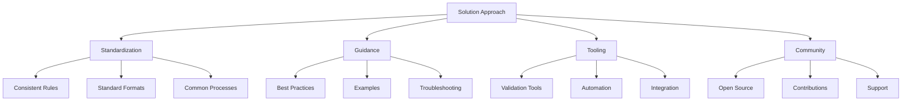
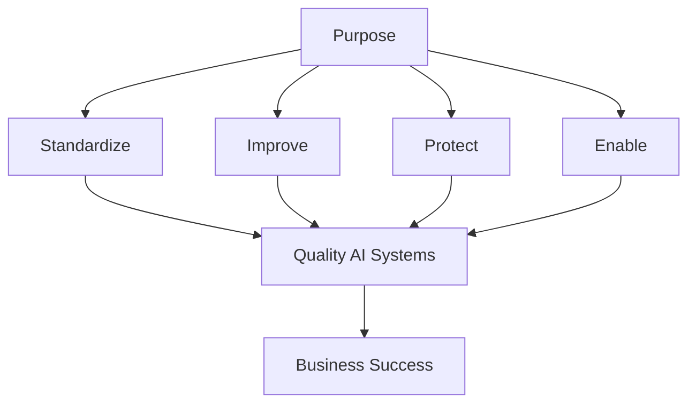

# Purpose - LLM & Agentic Rules Framework

## Overview

This document defines the purpose, mission, and value proposition of the LLM & Agentic Rules Framework.

## Mission Statement

**Mission**: To provide a comprehensive, production-grade rules framework that enables teams to build robust, secure, maintainable, and auditable AI systems with confidence.

## Purpose Statement

The LLM & Agentic Rules Framework exists to:

1. **Standardize** AI development practices across teams and organizations
2. **Improve** the quality, reliability, and performance of AI systems
3. **Protect** against security threats, compliance risks, and operational failures
4. **Enable** teams to deliver AI systems that meet business and regulatory requirements

## Value Proposition

### For Teams

| Benefit | Description | Impact |
|---------|-------------|--------|
| Faster Onboarding | Clear standards and examples | 50% faster ramp-up |
| Clear Guidance | Step-by-step instructions | Reduced confusion |
| Best Practices | Industry-proven patterns | Higher quality output |
| Consistent Quality | Standardized processes | Predictable results |
| Risk Awareness | Identified risks and mitigations | Fewer surprises |

### For Organizations

| Benefit | Description | Impact |
|---------|-------------|--------|
| Risk Reduction | Comprehensive security and compliance | Fewer incidents |
| Quality Improvement | Consistent standards and testing | Better products |
| Cost Efficiency | Optimized processes and resources | Lower costs |
| Compliance Assurance | Regulatory requirement mapping | Audit readiness |
| Knowledge Retention | Documented practices and decisions | Institutional knowledge |

### For Industry

| Benefit | Description | Impact |
|---------|-------------|--------|
| Standard Practices | Common framework for AI development | Industry alignment |
| Knowledge Sharing | Open-source contribution model | Collective improvement |
| Innovation Support | Foundation for new approaches | Faster innovation |
| Quality Benchmarks | Measurable quality standards | Industry benchmarks |
| Regulatory Alignment | Compliance framework mapping | Regulatory readiness |

## Core Values

```mermaid
flowchart TD
    A[Core Values] --> B[Quality]
    A --> C[Security]
    A --> D[Compliance]
    A --> E[Collaboration]
    A --> F[Transparency]
    A --> G[Continuous Improvement]
    
    B --> B1[High Standards]
    B --> B2[Best Practices]
    B --> B3[Continuous Testing]
    
    C --> C1[Security First]
    C --> C2[Threat Awareness]
    C --> C3[Defense in Depth]
    
    D --> D1[Regulatory Compliance]
    D --> D2[Evidence-Based]
    D --> D3[Audit Ready]
    
    E --> E1[Team Collaboration]
    E --> E2[Knowledge Sharing]
    E --> E3[Community Support]
    
    F --> F1[Open Standards]
    F --> F2[Transparent Processes]
    F --> F3[Clear Documentation]
    
    G --> G1[Feedback Driven]
    G --> G2[Continuous Learning]
    G --> G3[Adaptive Evolution]
```

### Quality

- **High Standards**: Expect excellence in all AI system components
- **Best Practices**: Apply industry-proven patterns and approaches
- **Continuous Testing**: Validate quality through comprehensive evaluation

### Security

- **Security First**: Consider security in every decision
- **Threat Awareness**: Understand and prepare for threats
- **Defense in Depth**: Implement multiple layers of protection

### Compliance

- **Regulatory Compliance**: Meet all applicable requirements
- **Evidence-Based**: Demonstrate compliance through evidence
- **Audit Ready**: Maintain audit readiness at all times

### Collaboration

- **Team Collaboration**: Work together effectively across roles
- **Knowledge Sharing**: Share learnings and best practices
- **Community Support**: Support the broader AI community

### Transparency

- **Open Standards**: Use open and interoperable standards
- **Transparent Processes**: Make processes clear and visible
- **Clear Documentation**: Document everything thoroughly

### Continuous Improvement

- **Feedback Driven**: Improve based on feedback
- **Continuous Learning**: Keep learning and adapting
- **Adaptive Evolution**: Evolve with technology and requirements

## Target Problems

### Inconsistency

- Different teams developing AI systems with different standards
- Inconsistent code quality across projects
- Unpredictable outcomes from similar systems

### Quality Issues

- System failures in production
- Performance issues affecting users
- Maintainability problems slowing development

### Security Risks

- Security breaches exposing data
- Unauthorized access to systems
- Vulnerable AI systems

### Compliance Gaps

- Regulatory violations leading to fines
- Audit failures damaging reputation
- Legal exposure from non-compliance

### Operational Failures

- Service outages affecting users
- Incident handling gaps
- Recovery failures extending downtime

## Solution Approach

### Standardization

- **Consistent Rules**: Same rules for all teams and projects
- **Standard Formats**: Consistent documentation and code formats
- **Common Processes**: Shared workflows and procedures

### Guidance

- **Best Practices**: Industry-proven approaches
- **Examples**: Practical implementation examples
- **Troubleshooting**: Solutions for common issues

### Tooling

- **Validation Tools**: Automated rule checking
- **Automation**: Streamlined processes
- **Integration**: Easy integration with existing tools

### Community

- **Open Source**: Free and open to all
- **Contributions**: Community-driven improvements
- **Support**: Active community support

## Success Metrics

| Metric | Target | Measurement |
|--------|--------|-------------|
| Framework adoption | > 90% | Project surveys |
| Quality improvement | > 50% fewer defects | Bug tracking |
| Security incidents | 0 critical | Incident reports |
| Compliance score | > 95% | Audit results |
| Team satisfaction | > 4.5/5 | Surveys |
| Onboarding time | 50% reduction | Time tracking |

## Conclusion

The LLM & Agentic Rules Framework provides comprehensive guidance for building robust, secure, maintainable, and auditable AI systems, enabling teams to deliver quality AI solutions with confidence.

