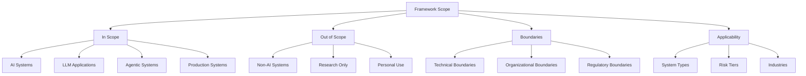
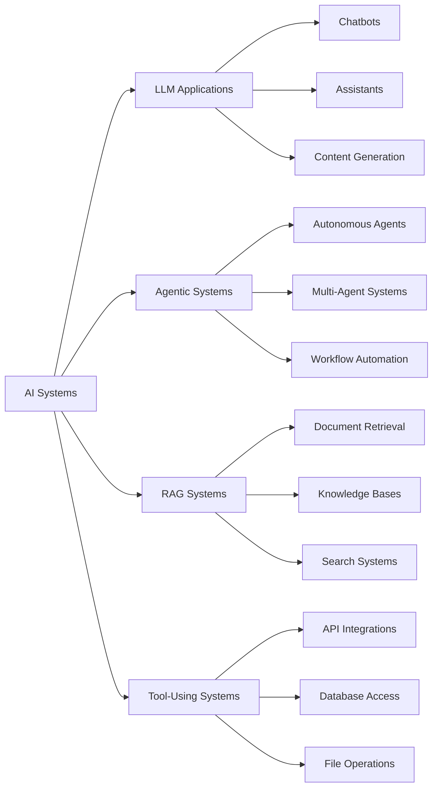
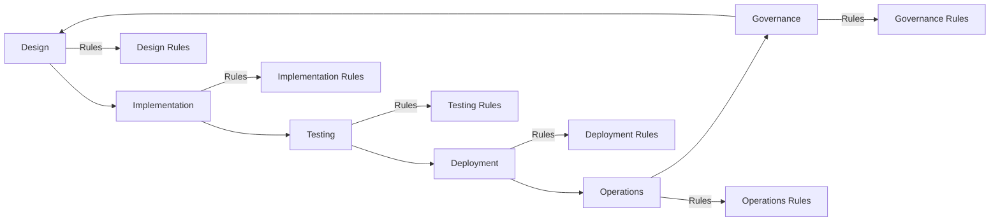
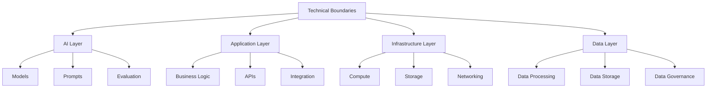
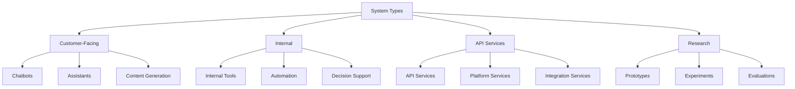
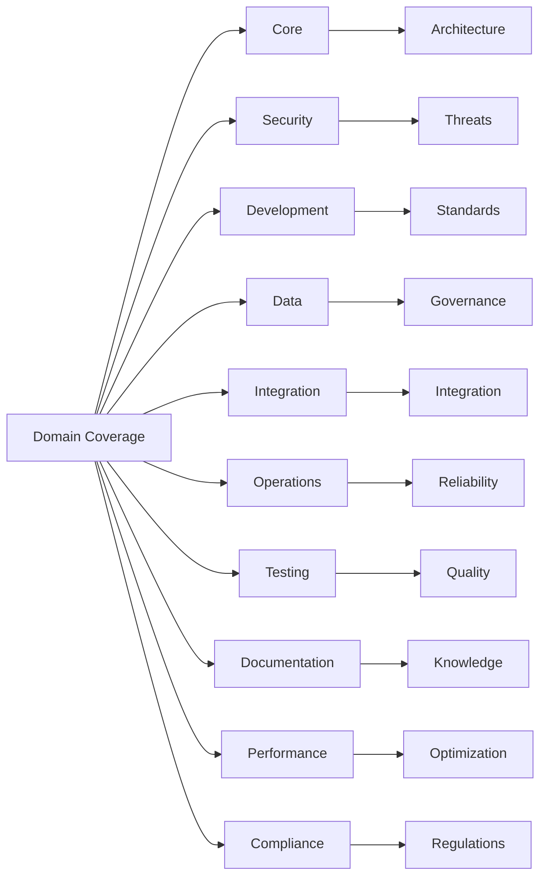
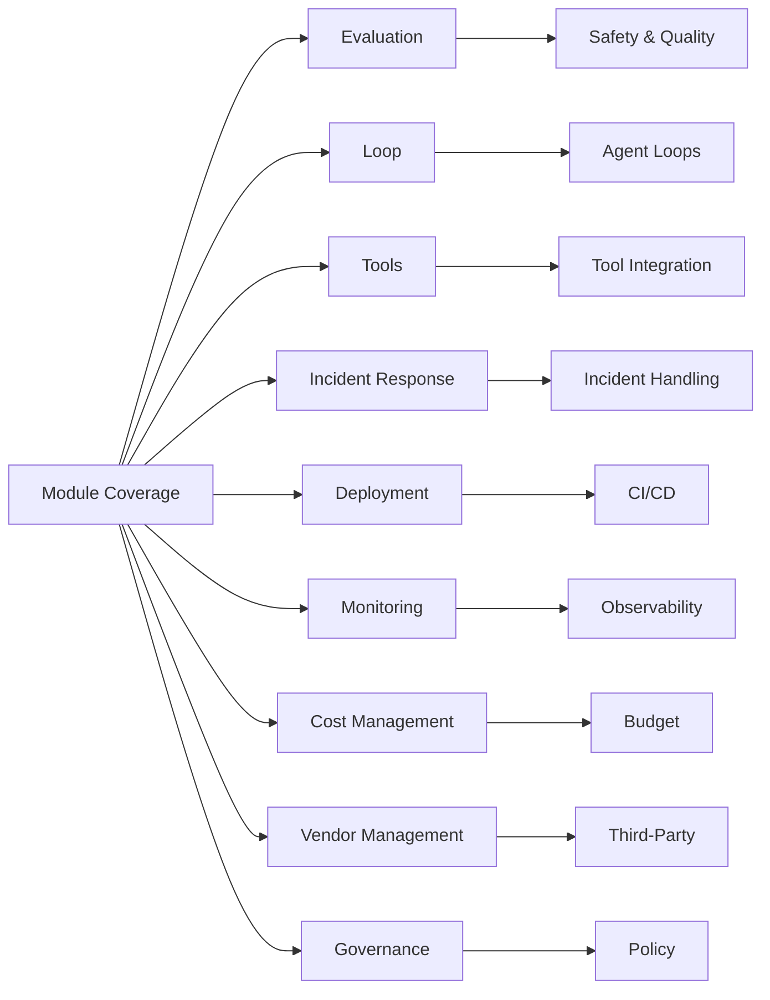
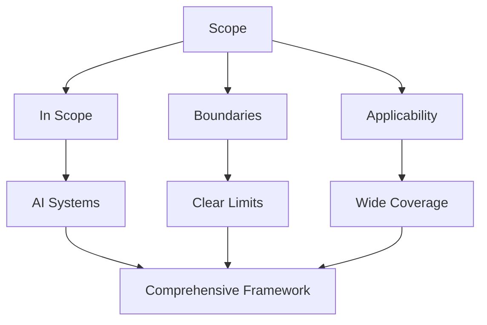

# Scope - LLM & Agentic Rules Framework

## Overview

This document defines the scope, boundaries, and applicability of the LLM & Agentic Rules Framework.

## Framework Scope

## In Scope

### AI Systems

| Category | In Scope | Examples |
|----------|----------|----------|
| LLM Applications | Systems using large language models | Chatbots, assistants, content generators |
| Agentic Systems | Systems that take autonomous actions | Autonomous agents, workflow automation |
| RAG Systems | Retrieval-augmented generation | Knowledge bases, document retrieval |
| Tool-Using Systems | Systems that invoke external tools | API integrations, database access |
| Multi-Modal Systems | Systems processing multiple data types | Image understanding, voice assistants |
| Evaluation Systems | Systems that evaluate other systems | Quality assurance, red-teaming |

### System Components

| Component | In Scope | Description |
|-----------|----------|-------------|
| Prompts | Yes | System prompts, user prompts, prompt templates |
| Models | Yes | LLM selection, fine-tuning, deployment |
| Tools | Yes | Tool integration, permissions, auditing |
| Data | Yes | Training data, user data, retrieval data |
| APIs | Yes | External APIs, internal APIs, MCP |
| Infrastructure | Yes | Deployment, scaling, monitoring |
| Security | Yes | Authentication, authorization, encryption |
| Compliance | Yes | Regulatory requirements, audit readiness |

### Lifecycle Phases

| Phase | In Scope | Description |
|-------|----------|-------------|
| Design | Yes | Architecture, planning, risk assessment |
| Implementation | Yes | Coding, configuration, integration |
| Testing | Yes | Evaluation, validation, verification |
| Deployment | Yes | Release, rollback, monitoring |
| Operations | Yes | Monitoring, incident response, optimization |
| Governance | Yes | Compliance, audit, policy management |

## Out of Scope

### Non-AI Systems

| Category | Out of Scope | Reason |
|----------|--------------|--------|
| Traditional software | Not AI-focused | Different concerns |
| Hardware systems | Physical systems | Different domain |
| Network infrastructure | Networking only | Different expertise |
| Database administration | Data storage only | Different concerns |

### Research-Only Systems

| Category | Out of Scope | Reason |
|----------|--------------|--------|
| Academic research | Not production | Different requirements |
| Prototype experiments | Not deployed | Different risk profile |
| Personal projects | Not organizational | Different scale |

### Specific Exclusions

| Exclusion | Reason | Alternative |
|-----------|--------|-------------|
| Model training from scratch | Specialized domain | ML engineering resources |
| Hardware optimization | Physical layer | Hardware engineering |
| Network security | Infrastructure | Network security frameworks |
| Financial trading systems | Regulatory specific | Financial regulations |

## Boundaries

### Technical Boundaries

| Layer | In Scope | Out of Scope |
|-------|----------|--------------|
| AI Layer | Model selection, prompts, evaluation | Model training from scratch |
| Application Layer | Business logic, APIs, integration | UI/UX design |
| Infrastructure Layer | Deployment, scaling, monitoring | Hardware optimization |
| Data Layer | Data processing, storage, governance | Database administration |

### Organizational Boundaries

| Boundary | In Scope | Out of Scope |
|----------|----------|--------------|
| Development teams | AI engineers, developers | Other engineering teams |
| Operations teams | DevOps, SRE | Pure infrastructure |
| Security teams | AI security | General security |
| Compliance teams | AI compliance | General compliance |

### Regulatory Boundaries

| Regulation | In Scope | Out of Scope |
|------------|----------|--------------|
| GDPR | AI data processing | General data protection |
| HIPAA | AI in healthcare | General healthcare |
| EU AI Act | AI system governance | General product safety |
| SOC 2 | AI service controls | General IT controls |

## Applicability

### System Types

| System Type | Applicability | Key Domains |
|-------------|---------------|-------------|
| Customer-facing assistant | Full | Core, Security, Data, Testing, Operations, Compliance |
| Internal agent automation | Full | Core, Development, Integration, Operations, Testing |
| High-volume AI API | Full | Core, Integration, Performance, Operations, Testing |
| Research prototype | Partial | Core, Testing |
| Personal project | Optional | Core |

### Risk Tiers

| Risk Tier | Applicability | Required Controls |
|-----------|---------------|-------------------|
| Low | Basic | Core, Testing |
| Medium | Standard | Core, Security, Data, Testing, Operations |
| High | Enhanced | All domains |
| Critical | Maximum | All domains + governance |

### Industries

| Industry | Applicability | Special Requirements |
|----------|---------------|---------------------|
| Healthcare | Full | HIPAA, FDA regulations |
| Finance | Full | PCI DSS, SOX, GLBA |
| Government | Full | FedRAMP, FISMA |
| Education | Full | FERPA, COPPA |
| Retail | Full | CCPA, PCI DSS |
| Manufacturing | Standard | General compliance |

## Framework Coverage

### Domain Coverage

### Module Coverage

## Limitations

### Known Limitations

| Limitation | Description | Mitigation |
|------------|-------------|------------|
| Technology specific | Focused on LLM and agentic systems | Extend as needed |
| Not exhaustive | Cannot cover every scenario | Community contributions |
| Rapidly evolving | Technology changes quickly | Regular updates |
| Context dependent | Rules may need adaptation | Judgment required |

### Assumptions

| Assumption | Description | Validation |
|------------|-------------|------------|
| Technical capability | Teams have technical skills | Training provided |
| Organizational support | Management supports adoption | Executive sponsorship |
| Resource availability | Teams have time for compliance | Prioritization |
| Tool availability | Required tools are accessible | Tool provisioning |

## Conclusion

The LLM & Agentic Rules Framework applies to AI systems, LLM applications, and agentic systems across industries and risk tiers, providing comprehensive guidance for design, implementation, testing, deployment, operations, and governance.

