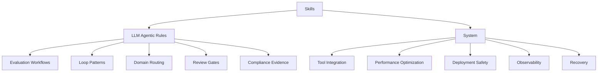
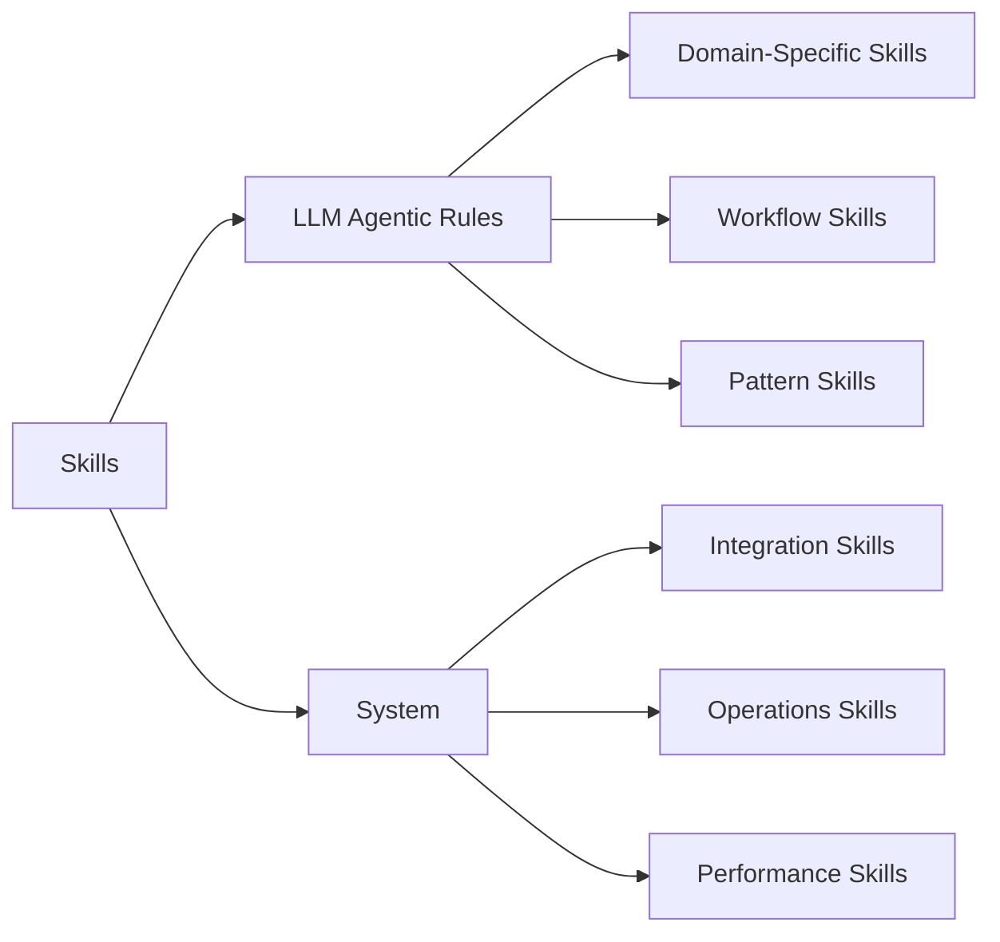

# Skills Domain

## Overview

The Skills domain contains specialized skills for implementing LLM and agentic system patterns.

## Architecture

## Skills Overview

## Folders

| Folder | Purpose |
|--------|---------|
| llm-agentic-rules/ | Domain-specific skills for LLM and agentic systems |
| system/ | System-level skills for operations and performance |

## Quick Start

1. Browse `llm-agentic-rules/` for domain-specific guidance
2. Browse `system/` for operational guidance
3. Reference individual skill files for detailed patterns
