# LLM Agentic Rules Skills

## Overview

This folder contains domain-specific skills for implementing LLM and agentic system patterns.

## Skills

```mermaid
flowchart TD
    A[LLM Agentic Rules Skills] --> B[Evaluation Workflows]
    A --> C[Loop Patterns]
    A --> D[Domain Routing]
    A --> E[Review Gates]
    A --> F[Compliance Evidence]
    
    B --> B1[Pre-Release Evaluation]
    B --> B2[Continuous Monitoring]
    B --> B3[Incident Response]
    B --> B4[Model Update]
    B --> B5[Compliance]
    
    C --> C1[Simple Loop]
    C --> C2[Retry Loop]
    C --> C3[Adaptive Loop]
    C --> C4[Multi-Goal Loop]
    C --> C5[Pipeline Loop]
    
    D --> D1[System Type Selection]
    D --> D2[Risk Tier Mapping]
    D --> D3[Domain Dependencies]
    
    E --> E1[Design Review]
    E --> E2[Implementation Review]
    E --> E3[Release Review]
    
    F --> F1[Evidence Collection]
    F --> F2[Evidence Validation]
    F --> F3[Evidence Archival]
```

## Files

| File | Purpose |
|------|---------|
| evaluation-workflows.md | Evaluation workflow patterns |
| loop-patterns.md | Agent loop implementation patterns |
| domain-routing-guide.md | Domain selection guidance |
| review-gates-criteria.md | Review gate criteria |
| compliance-evidence-standards.md | Compliance evidence standards |
| domain-checklist-reference.md | Domain checklist reference |
| SKILL.md | Main skill definition |

## Quick Start

1. Read `SKILL.md` for overall skill guidance
2. Use `evaluation-workflows.md` for evaluation patterns
3. Reference `loop-patterns.md` for loop implementation
4. Use `domain-routing-guide.md` for domain selection
