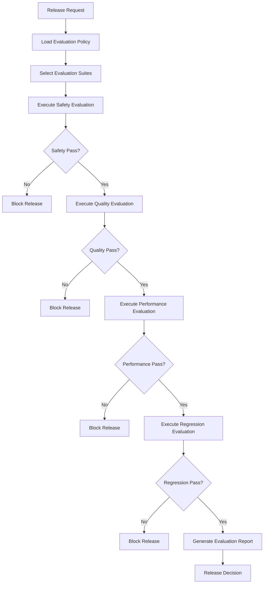
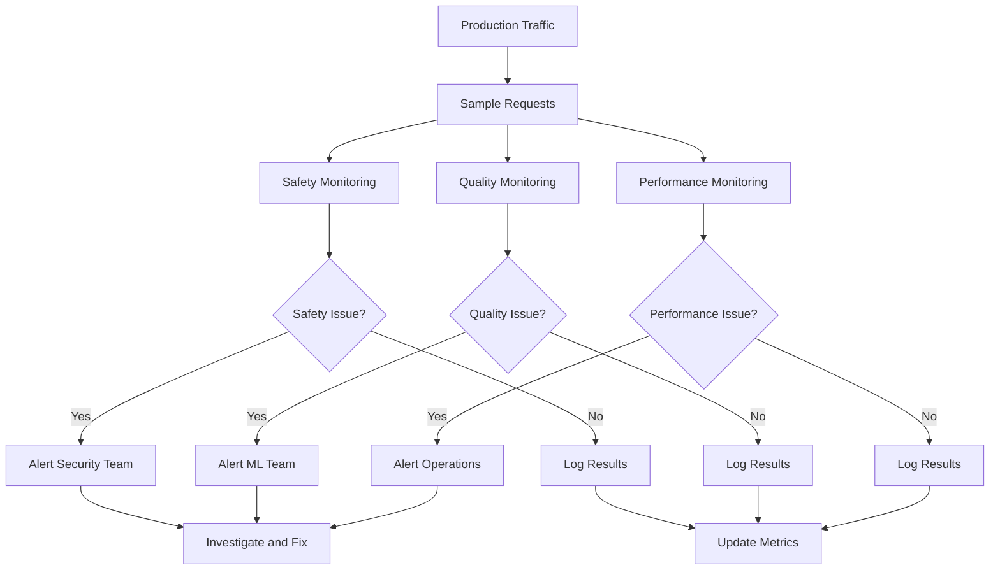
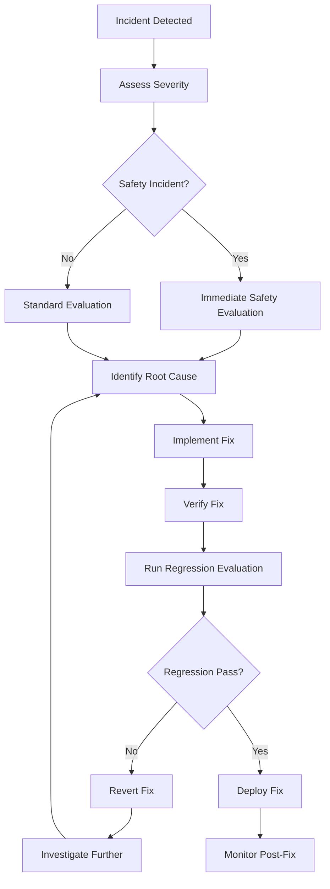
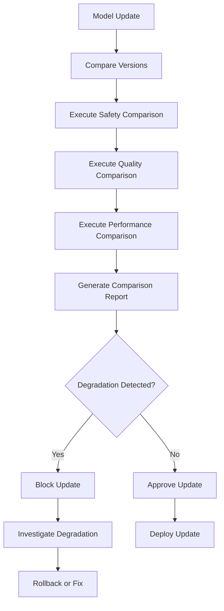
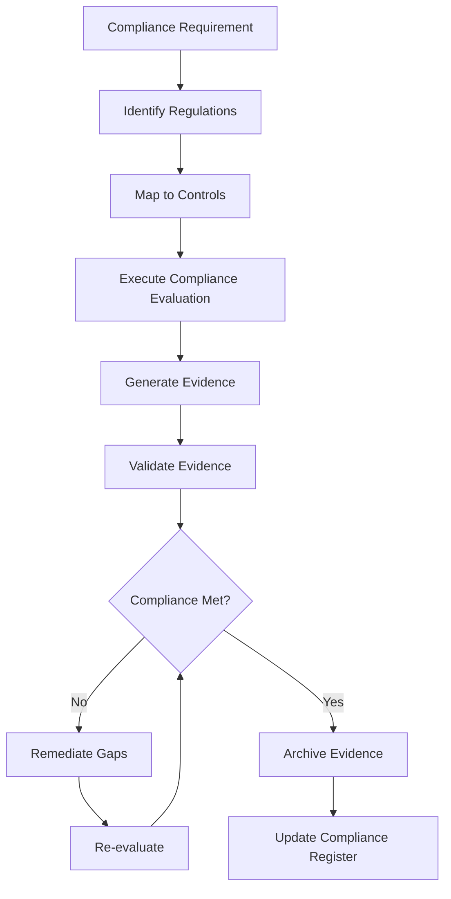

# Evaluation Workflows Skill

## Purpose

This skill provides standardized workflows for evaluating LLM and agentic systems across safety, quality, performance, and compliance dimensions.

## Workflow 1: Pre-Release Evaluation

### Trigger

System is ready for production release.

### Steps

### Checklist

- [ ] Evaluation policy loaded
- [ ] Evaluation suites selected
- [ ] Safety evaluation executed
- [ ] Quality evaluation executed
- [ ] Performance evaluation executed
- [ ] Regression evaluation executed
- [ ] Report generated
- [ ] Release decision made

## Workflow 2: Continuous Monitoring

### Trigger

System is in production.

### Steps

### Checklist

- [ ] Sampling configured
- [ ] Safety monitoring active
- [ ] Quality monitoring active
- [ ] Performance monitoring active
- [ ] Alerting configured
- [ ] Metrics collection active
- [ ] Reporting configured

## Workflow 3: Incident Response Evaluation

### Trigger

Production incident detected.

### Steps

### Checklist

- [ ] Incident severity assessed
- [ ] Evaluation type selected
- [ ] Root cause identified
- [ ] Fix implemented
- [ ] Fix verified
- [ ] Regression evaluated
- [ ] Fix deployed
- [ ] Post-fix monitoring active

## Workflow 4: Model Update Evaluation

### Trigger

Model version updated.

### Steps

### Checklist

- [ ] Model versions documented
- [ ] Comparison baseline established
- [ ] Safety comparison executed
- [ ] Quality comparison executed
- [ ] Performance comparison executed
- [ ] Comparison report generated
- [ ] Update decision made

## Workflow 5: Compliance Evaluation

### Trigger

Compliance audit or regulatory requirement.

### Steps

### Checklist

- [ ] Regulations identified
- [ ] Controls mapped
- [ ] Evaluation executed
- [ ] Evidence generated
- [ ] Evidence validated
- [ ] Compliance status determined
- [ ] Gaps remediated
- [ ] Evidence archived
