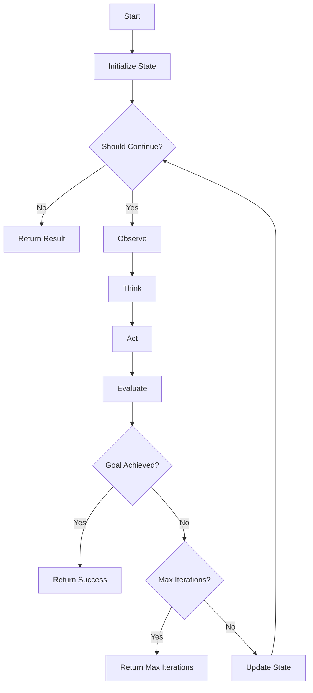
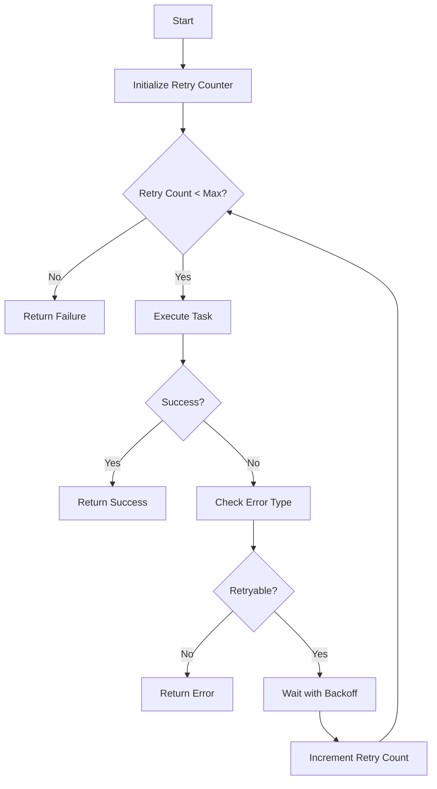
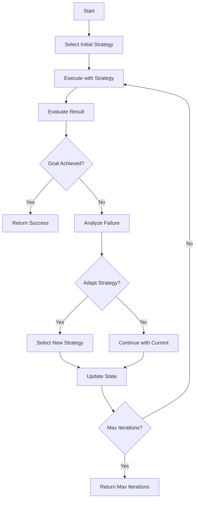
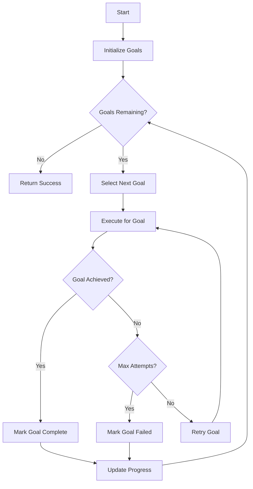
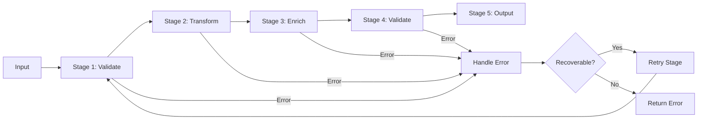

# Loop Patterns Skill

## Purpose

This skill provides standardized patterns for implementing agent loops in LLM and agentic systems.

## Pattern 1: Simple Task Loop

### Use Case

Completing a single task with clear success criteria.

### Diagram



### Configuration

```yaml
simple_loop:
  max_iterations: 10
  timeout: "5 minutes"
  stopping_conditions:
    - "goal_achieved"
    - "max_iterations_reached"
    - "timeout_reached"
```

## Pattern 2: Retry Loop

### Use Case

Tasks that may fail initially but can succeed with retries.

### Diagram



### Configuration

```yaml
retry_loop:
  max_retries: 3
  backoff:
    initial_delay: "100ms"
    max_delay: "30 seconds"
    multiplier: 2
    jitter: true
  retryable_errors:
    - "timeout"
    - "rate_limit"
    - "temporary_server_error"
```

## Pattern 3: Adaptive Loop

### Use Case

Tasks requiring strategy adjustment based on results.

### Diagram



### Configuration

```yaml
adaptive_loop:
  strategies:
    - "direct_approach"
    - "alternative_approach"
    - "simplified_approach"
    - "escalation"
  adaptation_threshold: 3
  max_iterations: 10
```

## Pattern 4: Multi-Goal Loop

### Use Case

Tasks with multiple objectives to complete.

### Diagram



### Configuration

```yaml
multi_goal_loop:
  goals:
    - name: "gather_information"
      priority: 1
      max_attempts: 3
    - name: "analyze_data"
      priority: 2
      max_attempts: 3
    - name: "generate_report"
      priority: 3
      max_attempts: 3
  completion_strategy: "all_goals"
```

## Pattern 5: Pipeline Loop

### Use Case

Sequential processing through multiple stages.

### Diagram



### Configuration

```yaml
pipeline_loop:
  stages:
    - name: "validate"
      tool: "input_validator"
      timeout: "5 seconds"
    - name: "transform"
      tool: "data_transformer"
      timeout: "10 seconds"
    - name: "enrich"
      tool: "data_enricher"
      timeout: "15 seconds"
    - name: "validate_output"
      tool: "output_validator"
      timeout: "5 seconds"
    - name: "output"
      tool: "result_generator"
      timeout: "10 seconds"
  error_handling: "stage_retry"
  max_retries_per_stage: 3
```

## Pattern Selection Guide

| Pattern | Use Case | Complexity | When to Use |
|---------|----------|------------|-------------|
| Simple | Single task | Low | Clear success criteria |
| Retry | Fault-tolerant tasks | Low | Transient failures expected |
| Adaptive | Complex tasks | Medium | Strategy adjustment needed |
| Multi-goal | Multiple objectives | Medium | Multiple outcomes required |
| Pipeline | Sequential processing | Medium | Multi-stage workflows |

## Implementation Checklist

- [ ] Pattern selected based on requirements
- [ ] Stopping conditions defined
- [ ] Error handling implemented
- [ ] State management implemented
- [ ] Progress tracking implemented
- [ ] Monitoring configured
- [ ] Testing completed
- [ ] Documentation updated
