# System Skills

## Overview

This folder contains system-level skills for operations, performance, and reliability.

## Skills

```mermaid
flowchart TD
    A[System Skills] --> B[Tool Integration]
    A --> C[Performance Optimization]
    A --> D[Deployment Safety]
    A --> E[Observability]
    A --> F[Recovery]
    A --> G[Reliability]
    A --> H[Retry Policy]
    A --> I[Timeout Strategy]
    
    B --> B1[Direct Tool Call]
    B --> B2[Tool Chain]
    B --> B3[Parallel Execution]
    B --> B4[Conditional Selection]
    B --> B5[Tool with Fallback]
    
    C --> C1[Latency Optimization]
    C --> C2[Throughput Optimization]
    C --> C3[Cost Optimization]
    C --> C4[Resource Optimization]
    
    D --> D1[Pre-Deployment Checks]
    D --> D2[Deployment Process]
    D --> D3[Post-Deployment Verification]
    
    E --> E1[Metrics Collection]
    E --> E2[Logging]
    E --> E3[Alerting]
    E --> E4[Dashboards]
    
    F --> F1[Incident Response]
    F --> F2[Disaster Recovery]
    F --> F3[Business Continuity]
```

## Files

| File | Purpose |
|------|---------|
| tool-integration.md | Tool integration patterns |
| performance-optimization.md | Performance optimization strategies |
| deployment-safety.md | Deployment safety procedures |
| observability-standards.md | Observability standards |
| recovery-playbook.md | Recovery procedures |
| reliability-checklist.md | Reliability verification |
| retry-policy.md | Retry policy configuration |
| timeout-strategy.md | Timeout strategy configuration |
| SKILL.md | Main skill definition |

## Quick Start

1. Read `SKILL.md` for overall skill guidance
2. Use `tool-integration.md` for tool patterns
3. Reference `performance-optimization.md` for optimization
4. Use `deployment-safety.md` for deployment guidance
