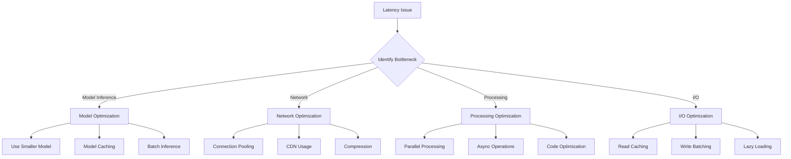
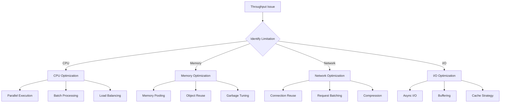
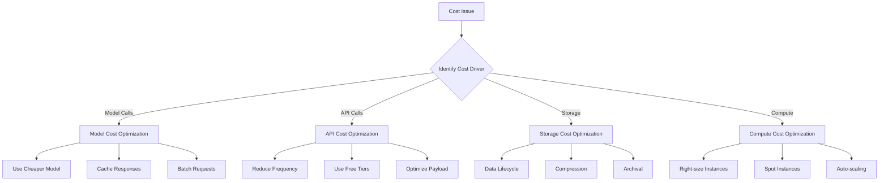
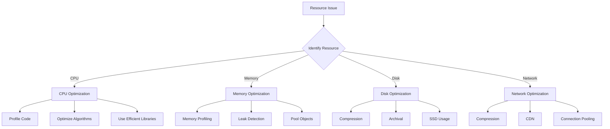

# Performance Optimization Skill

## Purpose

This skill provides standardized patterns for optimizing performance in LLM and agentic systems.

## Optimization Area 1: Latency Optimization

### Strategies



### Configuration

```yaml
latency_optimization:
  model:
    - strategy: "model_caching"
      implementation: "cache_model_outputs"
      ttl: "5 minutes"
    - strategy: "batch_inference"
      implementation: "batch_requests"
      batch_size: 10
  network:
    - strategy: "connection_pooling"
      implementation: "pool_connections"
      pool_size: 10
    - strategy: "compression"
      implementation: "enable_gzip"
  processing:
    - strategy: "parallel_processing"
      implementation: "thread_pool"
      workers: 4
```

## Optimization Area 2: Throughput Optimization

### Strategies



### Configuration

```yaml
throughput_optimization:
  cpu:
    - strategy: "parallel_execution"
      implementation: "process_pool"
      workers: 8
    - strategy: "batch_processing"
      implementation: "batch_requests"
      batch_size: 50
  memory:
    - strategy: "memory_pooling"
      implementation: "object_pool"
      pool_size: 100
  network:
    - strategy: "connection_reuse"
      implementation: "keep_alive"
      timeout: "60 seconds"
```

## Optimization Area 3: Cost Optimization

### Strategies



### Configuration

```yaml
cost_optimization:
  model:
    - strategy: "response_caching"
      implementation: "cache_responses"
      ttl: "1 hour"
      estimated_savings: "30-50%"
    - strategy: "model_selection"
      implementation: "select_model_by_task"
      rules:
        - "simple_tasks: small_model"
        - "complex_tasks: large_model"
  api:
    - strategy: "request_batching"
      implementation: "batch_requests"
      batch_size: 10
      estimated_savings: "20-40%"
  storage:
    - strategy: "data_lifecycle"
      implementation: "archive_old_data"
      retention: "90 days"
      estimated_savings: "40-60%"
```

## Optimization Area 4: Resource Optimization

### Strategies



### Configuration

```yaml
resource_optimization:
  cpu:
    - strategy: "profiling"
      implementation: "continuous_profiling"
      frequency: "daily"
    - strategy: "algorithm_optimization"
      implementation: "review_and_optimize"
      frequency: "weekly"
  memory:
    - strategy: "leak_detection"
      implementation: "memory_monitoring"
      alert_threshold: "80%"
    - strategy: "object_pooling"
      implementation: "pool_objects"
      pool_size: 100
  disk:
    - strategy: "compression"
      implementation: "compress_logs"
      algorithm: "gzip"
    - strategy: "archival"
      implementation: "archive_old_data"
      retention: "30 days"
```

## Monitoring Dashboard

```yaml
performance_dashboard:
  panels:
    - name: "Latency"
      metrics:
        - "p50_latency"
        - "p95_latency"
        - "p99_latency"
      refresh: "real_time"
    
    - name: "Throughput"
      metrics:
        - "requests_per_second"
        - "concurrent_requests"
        - "queue_depth"
      refresh: "real_time"
    
    - name: "Resources"
      metrics:
        - "cpu_utilization"
        - "memory_utilization"
        - "disk_utilization"
      refresh: "real_time"
    
    - name: "Cost"
      metrics:
        - "cost_per_request"
        - "total_cost"
        - "cost_by_component"
      refresh: "hourly"
```

## Optimization Checklist

- [ ] Baseline metrics established
- [ ] Bottlenecks identified
- [ ] Optimization strategies selected
- [ ] Optimizations implemented
- [ ] Performance tested
- [ ] Cost impact assessed
- [ ] Monitoring configured
- [ ] Documentation updated
