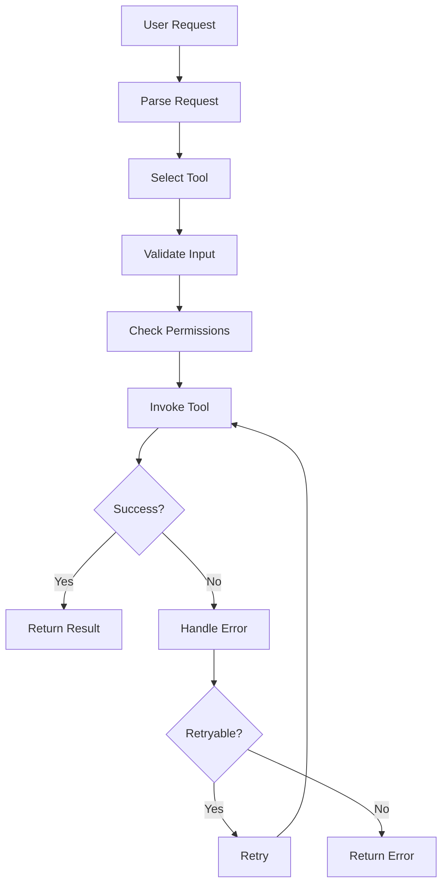
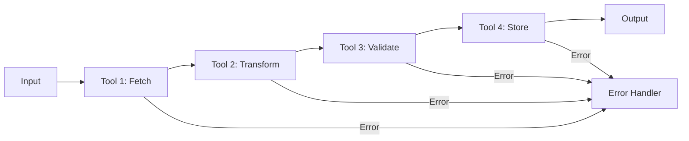
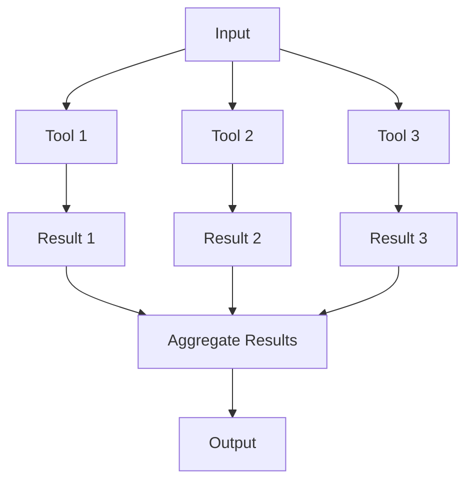
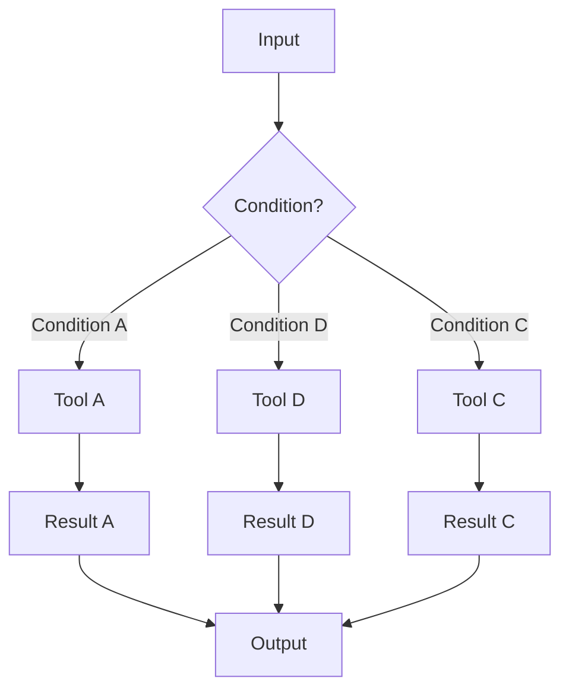
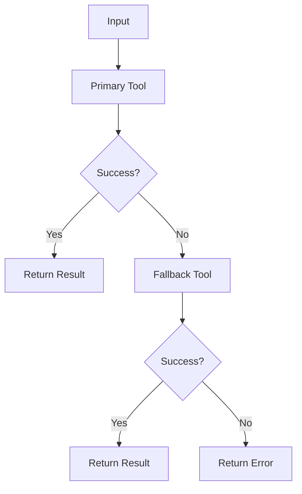

# Tool Integration Skill

## Purpose

This skill provides standardized patterns for integrating tools in LLM and agentic systems.

## Integration Pattern 1: Direct Tool Call

### Use Case

Simple tool invocation with direct result.

### Diagram



### Configuration

```yaml
direct_tool_call:
  tool: "database_query"
  timeout: "10 seconds"
  retry:
    max_retries: 3
    backoff: "exponential"
  permissions:
    - "read:data"
```

## Integration Pattern 2: Tool Chain

### Use Case

Multiple tools executed in sequence.

### Diagram



### Configuration

```yaml
tool_chain:
  tools:
    - name: "fetch"
      tool: "api_call"
      input: "request_data"
      output: "raw_data"
    - name: "transform"
      tool: "data_transformer"
      input: "raw_data"
      output: "transformed_data"
    - name: "validate"
      tool: "data_validator"
      input: "transformed_data"
      output: "validated_data"
    - name: "store"
      tool: "database_write"
      input: "validated_data"
      output: "result"
  error_handling: "chain_rollback"
```

## Integration Pattern 3: Parallel Tool Execution

### Use Case

Independent tools executed concurrently.

### Diagram



### Configuration

```yaml
parallel_tools:
  tools:
    - name: "search_web"
      tool: "web_search"
      timeout: "10 seconds"
    - name: "search_db"
      tool: "database_query"
      timeout: "5 seconds"
    - name: "search_docs"
      tool: "document_search"
      timeout: "5 seconds"
  aggregation: "merge_results"
  timeout: "15 seconds"
```

## Integration Pattern 4: Conditional Tool Selection

### Use Case

Different tools based on conditions.

### Diagram



### Configuration

```yaml
conditional_tools:
  conditions:
    - condition: "input_type == 'email'"
      tool: "email_validator"
    - condition: "input_type == 'phone'"
      tool: "phone_validator"
    - condition: "input_type == 'address'"
      tool: "address_validator"
  default_tool: "generic_validator"
```

## Integration Pattern 5: Tool with Fallback

### Use Case

Primary tool with fallback option.

### Diagram



### Configuration

```yaml
tool_with_fallback:
  primary:
    tool: "api_call"
    timeout: "10 seconds"
  fallback:
    tool: "cached_response"
    cache_ttl: "1 hour"
  error_handling: "fallback_activation"
```

## Security Checklist

- [ ] Tool permissions defined
- [ ] Input validation implemented
- [ ] Rate limiting configured
- [ ] Audit logging enabled
- [ ] Credential management configured
- [ ] Error handling implemented
- [ ] Timeout configured
- [ ] Monitoring configured

## Performance Checklist

- [ ] Connection pooling configured
- [ ] Caching implemented
- [ ] Async processing where appropriate
- [ ] Timeout optimized
- [ ] Resource limits defined
- [ ] Load testing completed
- [ ] Performance benchmarks established
