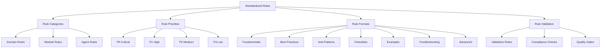
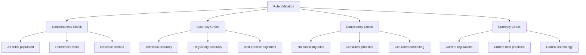
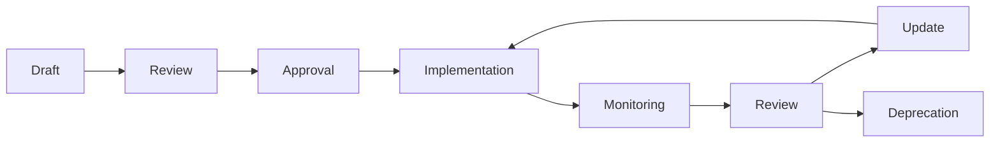
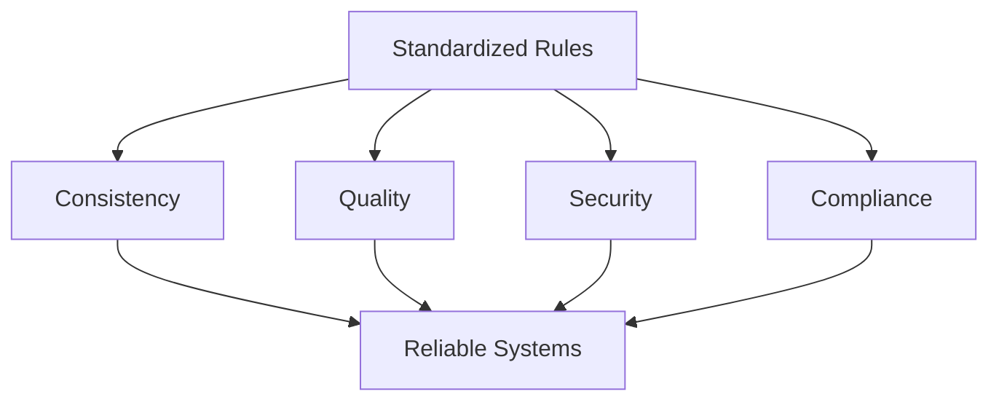

# Standardized Rules - LLM & Agentic Rules Framework

## Overview

This document defines the standardized rules that form the foundation of the LLM & Agentic Rules Framework.

## Rule Structure



## Rule Priority Levels

### P0 Critical

**Definition**: Rules that address security, safety, compliance, or data-loss risk.

**Expected Handling**: Required before production deployment.

**Examples**:
- Threat modeling required for all systems
- Human review for high-impact actions
- Data encryption at rest and in transit
- Access control enforcement
- Incident response procedures

### P1 High

**Definition**: Rules that address reliability, quality, or maintainability risk.

**Expected Handling**: Required unless explicitly accepted with documented exception.

**Examples**:
- Evaluation suite required before release
- Code review for all changes
- Monitoring and alerting configured
- Documentation maintained
- Performance testing completed

### P2 Medium

**Definition**: Rules that provide meaningful quality improvement.

**Expected Handling**: Adopt when practical.

**Examples**:
- Automated testing in CI/CD
- Cost optimization reviews
- Knowledge base maintenance
- Training program updates
- Process improvement tracking

### P3 Low

**Definition**: Rules that provide helpful refinement.

**Expected Handling**: Backlog or opportunistic improvement.

**Examples**:
- Advanced optimization techniques
- Documentation enhancements
- Tool integration improvements
- Process automation
- Community contributions

## Domain Rules

### Core Domain Rules

| Rule ID | Rule | Priority | Status |
|---------|------|----------|--------|
| CORE-001 | System ownership documented | P0 | Active |
| CORE-002 | Risk tier assigned | P0 | Active |
| CORE-003 | Human review for high-impact | P0 | Active |
| CORE-004 | Fallback and rollback tested | P0 | Active |
| CORE-005 | Evaluation suite defined | P1 | Active |
| CORE-006 | Prompt version control | P1 | Active |
| CORE-007 | Tool permissions defined | P1 | Active |
| CORE-008 | Audit logging implemented | P1 | Active |

### Security Domain Rules

| Rule ID | Rule | Priority | Status |
|---------|------|----------|--------|
| SEC-001 | Threat modeling completed | P0 | Active |
| SEC-002 | Input validation implemented | P0 | Active |
| SEC-003 | Output filtering configured | P0 | Active |
| SEC-004 | Secret management implemented | P0 | Active |
| SEC-005 | Access control enforced | P0 | Active |
| SEC-006 | Security monitoring active | P1 | Active |
| SEC-007 | Penetration testing conducted | P1 | Active |
| SEC-008 | Security review gates | P1 | Active |

### Data Domain Rules

| Rule ID | Rule | Priority | Status |
|---------|------|----------|--------|
| DATA-001 | Data inventory maintained | P0 | Active |
| DATA-002 | Classification labels applied | P0 | Active |
| DATA-003 | Retention policies enforced | P0 | Active |
| DATA-004 | Consent management implemented | P0 | Active |
| DATA-005 | Data minimization applied | P1 | Active |
| DATA-006 | Encryption configured | P1 | Active |
| DATA-007 | Access logging enabled | P1 | Active |
| DATA-008 | Quality validation implemented | P2 | Active |

### Testing Domain Rules

| Rule ID | Rule | Priority | Status |
|---------|------|----------|--------|
| TEST-001 | Evaluation coverage thresholds | P0 | Active |
| TEST-002 | Regression suite maintained | P0 | Active |
| TEST-003 | Safety tests included | P0 | Active |
| TEST-004 | Performance benchmarks defined | P1 | Active |
| TEST-005 | Test environment parity | P1 | Active |
| TEST-006 | Test data managed | P2 | Active |
| TEST-007 | Test reporting configured | P2 | Active |
| TEST-008 | Test automation CI/CD | P2 | Active |

## Module Rules

### Evaluation Module Rules

| Rule ID | Rule | Priority | Status |
|---------|------|----------|--------|
| EVAL-001 | Evaluation policy defined | P0 | Active |
| EVAL-002 | Safety evaluation required | P0 | Active |
| EVAL-003 | Quality evaluation required | P1 | Active |
| EVAL-004 | Performance evaluation required | P1 | Active |
| EVAL-005 | Regression evaluation required | P0 | Active |
| EVAL-006 | Evaluation results documented | P1 | Active |
| EVAL-007 | Evaluation thresholds defined | P1 | Active |
| EVAL-008 | Evaluation automation configured | P2 | Active |

### Incident Response Module Rules

| Rule ID | Rule | Priority | Status |
|---------|------|----------|--------|
| IR-001 | Incident response plan documented | P0 | Active |
| IR-002 | Escalation paths defined | P0 | Active |
| IR-003 | Runbooks created | P1 | Active |
| IR-004 | Communication templates ready | P1 | Active |
| IR-005 | Post-mortem process defined | P1 | Active |
| IR-006 | Evidence preservation configured | P1 | Active |
| IR-007 | Training completed | P2 | Active |
| IR-008 | Metrics tracked | P2 | Active |

### Deployment Module Rules

| Rule ID | Rule | Priority | Status |
|---------|------|----------|--------|
| DEP-001 | Deployment strategy defined | P0 | Active |
| DEP-002 | Rollback plan tested | P0 | Active |
| DEP-003 | CI/CD pipeline configured | P1 | Active |
| DEP-004 | Environment management implemented | P1 | Active |
| DEP-005 | Configuration management implemented | P1 | Active |
| DEP-006 | Feature flags configured | P2 | Active |
| DEP-007 | Smoke testing implemented | P2 | Active |
| DEP-008 | Health checks configured | P1 | Active |

## Rule Format

### Rule Structure

```yaml
rule:
  id: string
  domain: string
  title: string
  description: string
  priority: P0 | P1 | P2 | P3
  status: active | deprecated | draft
  owner: string
  effective_date: string
  review_date: string
  
  requirements:
    - requirement: string
      description: string
      verification: string
  
  evidence:
    - type: automated | manual | hybrid
      description: string
      location: string
  
  exceptions:
    - condition: string
      approval_required: boolean
      approver: string
  
  references:
    - type: regulation | standard | best_practice
      name: string
      url: string
```

### Rule Metadata

| Field | Description | Required |
|-------|-------------|----------|
| id | Unique identifier | Yes |
| domain | Framework domain | Yes |
| title | Short description | Yes |
| description | Detailed description | Yes |
| priority | P0/P1/P2/P3 | Yes |
| status | Current status | Yes |
| owner | Responsible party | Yes |
| effective_date | When rule becomes active | Yes |
| review_date | When rule needs review | Yes |

## Rule Validation

### Validation Process



### Validation Criteria

| Criterion | Description | Threshold |
|-----------|-------------|-----------|
| Completeness | All required fields present | 100% |
| Accuracy | Technical and regulatory accuracy | > 98% |
| Consistency | No conflicts with other rules | 100% |
| Currency | Aligned with current standards | > 90% |
| Clarity | Clear and unambiguous language | > 95% |
| Actionability | Specific implementation guidance | > 90% |

## Rule Governance

### Rule Lifecycle



### Rule Review Process

1. **Annual Review**: All rules reviewed annually
2. **Incident-Triggered Review**: Rules reviewed after incidents
3. **Regulation-Triggered Review**: Rules reviewed after regulatory changes
4. **Technology-Triggered Review**: Rules reviewed after technology changes

## Rule Metrics

### Rule Coverage

| Domain | Total Rules | P0 | P1 | P2 | P3 |
|--------|-------------|-----|-----|-----|-----|
| Core | 8 | 4 | 4 | 0 | 0 |
| Security | 8 | 5 | 3 | 0 | 0 |
| Data | 8 | 4 | 3 | 1 | 0 |
| Testing | 8 | 3 | 2 | 3 | 0 |
| **Total** | **32** | **16** | **13** | **3** | **0** |

### Rule Effectiveness

| Metric | Target | Current |
|--------|--------|---------|
| Rule compliance rate | > 90% | - |
| Rule exception rate | < 5% | - |
| Rule incident correlation | < 10% | - |
| Rule update frequency | Quarterly | - |

## Conclusion

Standardized rules provide consistent, repeatable standards for building LLM and agentic systems, ensuring quality, security, and compliance.


